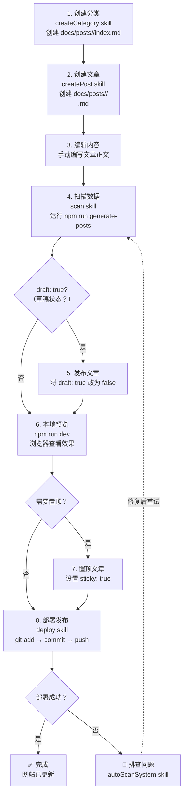

<!-- [AGC:FILE] tool=Cc author=fangkun date=2026-08-27 -->
<!-- [AGC:START] tool=Cc author=fangkun -->

# Kunge2013's Blog

基于 VitePress 的个人技术博客，支持中英文双语，**新增分类和文章零代码改动**。

## 核心特性

- **自动扫描**：新建分类目录或文章文件后，自动出现在导航、首页、分类页、搜索结果中
- **双语支持**：中文（根路径 `/`）+ 英文（`/en/`）
- **全文搜索**：按 `Ctrl/⌘ + K` 弹出搜索框，按标题、描述、标签、分类模糊匹配
- **CI/CD**：推送到 `main` 分支自动构建并部署到 GitHub Pages

## 快速开始

```bash
# 安装依赖
npm install

# 启动开发服务器（自动扫描文章并生成数据）
npm run dev

# 构建生产版本
npm run build

# 预览构建结果
npm run preview

# 仅重新生成文章数据
npm run generate-posts
```

## 目录结构

```
.
├── docs/
│   ├── .vitepress/
│   │   ├── config.ts              # VitePress 配置（导航/侧边栏/i18n）
│   │   ├── data/
│   │   │   ├── posts.ts            # 数据导出（自动读取 JSON）
│   │   │   └── posts-data.json    # 自动生成，请勿手动编辑
│   │   └── theme/                  # 自定义主题、组件、样式
│   ├── posts/                      # 中文文章（根路径）
│   │   ├── javascript/
│   │   │   ├── index.md            # 分类首页（决定分类显示名）
│   │   │   ├── es-modules.md
│   │   │   └── promise-async-await.md
│   │   ├── testing/
│   │   │   ├── index.md
│   │   │   └── test-article.md
│   │   └── ...
│   ├── en/                         # 英文文章
│   │   └── posts/
│   │       └── javascript/
│   │           └── sample-article.md
│   ├── archives.md                 # 归档页
│   ├── tags.md                     # 标签页
│   └── about.md                    # 关于页
├── templates/                      # 模板文件
│   ├── category-index.md           # 新增分类首页模板
│   └── new-post.md                 # 新增文章模板
└── scripts/
    ├── generate-posts-data.mjs     # 自动扫描数据生成
    ├── new-post.sh                 # 脚手架脚本
    └── validate-frontmatter.sh     # 格式校验脚本
```

## 模板文件

项目根目录 `templates/` 提供两个模板文件，可直接 `cp` 复用：

| 模板 | 用途 | 复制到 |
|------|------|--------|
| `templates/category-index.md` | 新分类的首页 | `docs/posts/<分类名>/index.md` |
| `templates/new-post.md` | 新文章的模板 | `docs/posts/<分类名>/<slug>.md` |

## 如何新增文章

### 方式一：复制模板手动创建（推荐）

```bash
# 1. 复制模板到目标分类目录
cp templates/new-post.md docs/posts/javascript/my-post.md

# 2. 编辑文件，修改 title / description / category / draft 等字段
# 3. 把 draft: true 改为 draft: false 发布
# 4. 运行 npm run dev 即可看到新文章
```

**文章模板内容**（`templates/new-post.md`）：

````markdown
---
title: 文章标题（必填）
date: 2026-08-27
description: 一句话摘要，会显示在搜索结果和列表中（必填）
category: javascript
tags: [标签1, 标签2]
lang: zh
i18n-link: /en/posts/javascript/article-slug
cover: ''
draft: false
sticky: false
---

# 文章标题

<!-- [AGC:START] tool=Cc author=fangkun -->

> 这里写文章导语或摘要，吸引读者继续阅读。

## 一、背景介绍

介绍文章要解决的问题、相关背景...

## 二、核心内容

### 2.1 子标题

正文段落...

### 2.2 子标题

正文段落...

```javascript
// 代码示例
function example() {
  console.log('Hello, World!')
}
```

## 三、实践应用

实际项目中如何应用...

## 四、总结

要点回顾：

1. **要点一**：简短说明
2. **要点二**：简短说明
3. **要点三**：简短说明

## 参考资料

- [文档名称](链接)
- [文档名称](链接)

<!-- [AGC:END] -->
````

### 方式二：使用脚手架脚本

```bash
# 中文文章（不存在分类时会自动创建分类目录和首页）
npm run new-post -- javascript my-first-post

# 英文文章
npm run new-post -- react hooks-basics --en
```

> 脚本会基于模板创建带 frontmatter 的文件，默认 `draft: true`（草稿），发布前改为 `false`。

## 如何新增分类

**完全零代码改动**，只需 2 步：

### 步骤 1：复制分类模板创建目录和首页

```bash
# 1. 创建分类目录
mkdir docs/posts/my-category

# 2. 复制分类首页模板
cp templates/category-index.md docs/posts/my-category/index.md

# 3. 编辑 index.md，修改 title / description
```

**分类模板内容**（`templates/category-index.md`）：

````markdown
---
title: 分类名称
description: 一句话描述这个分类涵盖的内容
---

# 分类名称

<!-- [AGC:START] tool=Cc author=fangkun -->

这个分类涵盖以下内容：

- 主题一
- 主题二
- 主题三

## 学习路径

按照以下顺序学习...

<!-- [AGC:END] -->
````

> **关键**：`title` 字段会自动用作导航菜单、首页卡片、分类页的显示名。
> 如果不写 `title`，则回退使用目录名（如 `my-category`）。

### 步骤 2：添加文章

在该目录下新建任意 `.md` 文章文件即可（参考上文「新增文章」）。

```bash
cp templates/new-post.md docs/posts/my-category/first-post.md
```

### 完成验证

运行 `npm run dev`，新分类会自动出现在：

- ✅ 顶部导航「分类」下拉菜单
- ✅ 首页技术分类卡片网格
- ✅ 分类页面 `/categories`
- ✅ 全文搜索结果

如果想让首页卡片显示自定义颜色和图标，编辑 `package.json` 中的 `categoryStyles` 字段，**这一步是可选的**，不配置也会用默认灰色样式显示。

### 删除分类

直接删除 `docs/posts/<分类名>/` 整个目录，运行 `npm run dev` 后该分类会自动从所有页面消失。

## 文章格式要求

### Frontmatter 字段说明

| 字段 | 必填 | 类型 | 说明 |
|------|------|------|------|
| `title` | ✅ | string | 文章标题 |
| `date` | ✅ | string (`YYYY-MM-DD`) | 发布日期，用于排序 |
| `description` | ✅ | string | 一句话摘要，显示在搜索结果和列表 |
| `category` | ✅ | string | 分类 ID（必须与所在目录名一致） |
| `tags` | ❌ | array | 标签数组，如 `[JavaScript, 异步]` |
| `lang` | ❌ | string | 语言代码：`zh` / `en`，默认 `zh` |
| `i18n-link` | ❌ | string | 对应的另一语言版本路径，用于切换语言 |
| `cover` | ❌ | string | 封面图 URL |
| `draft` | ❌ | boolean | `true` 时为草稿，不会被扫描；默认 `false` |
| `sticky` | ❌ | boolean | `true` 时在列表置顶 |

### 格式约束

1. **文件命名**：使用 kebab-case，如 `my-post.md`，不要用空格或中文
2. **frontmatter 必须在文件最顶部**：以 `---` 开始，以 `---` 结束，中间是 YAML
3. **`category` 必须与目录名一致**：在 `docs/posts/javascript/` 下，`category` 必须是 `javascript`
4. **`index.md` 不会被当作文章**：分类目录下的 `index.md` 是分类首页，不会被扫描为文章
5. **`draft: true` 的文章会被跳过**：草稿状态的文章不会出现在任何页面
6. **文件编码必须是 UTF-8**：用 VS Code 等编辑器保存时确认编码为 UTF-8（不带 BOM）

### 最小可用 frontmatter

```yaml
---
title: 我的文章
date: 2026-08-27
description: 简要描述
category: javascript
---
```

## 如何打包发布

### 自动发布（推荐）

推送到 `main` 分支即自动构建并部署到 GitHub Pages：

```bash
git add .
git commit -m "feat: add new post"
git push
```

GitHub Actions 工作流 `.github/workflows/deploy.yml` 会：

1. 校验所有文章的 frontmatter 格式
2. 安装依赖并构建站点
3. 部署到 GitHub Pages

> 部署前请在 GitHub 仓库 **Settings -> Pages -> Source** 选择 **GitHub Actions**。

### 手动构建与本地预览

```bash
# 构建生产版本到 docs/.vitepress/dist/
npm run build

# 本地预览构建结果
npm run preview
```

构建产物位于 `docs/.vitepress/dist/`，可手动上传到任意静态托管服务。

### frontmatter 格式校验

```bash
npm run validate
```

CI 会在部署前运行此脚本，本地先跑可以提前发现问题。

## AI 辅助写作（Claude Code Skills）

本项目配置了 6 个 Claude Code Skills，用于加速内容创建和管理流程。

### Skill 列表

| Skill | 触发词 | 功能 |
|-------|--------|------|
| `createCategory` | "新增分类"、"创建分类"、"添加分类" | 创建分类目录和首页 |
| `createPost` | "写文章"、"新建文章"、"发布文章" | 在指定分类下创建文章 |
| `archive` | "归档"、"置顶文章"、"查看文章列表" | 管理归档页面和文章置顶 |
| `scan` | "扫描"、"刷新数据"、"重新生成" | 手动触发文章扫描和数据更新 |
| `deploy` | "部署"、"发布"、"打包" | 构建并部署到 GitHub Pages |
| `autoScanSystem` | "文章不显示"、"扫描问题"、"调试" | 诊断扫描系统问题 |

### 使用流程

#### 场景 1：创建新分类

```bash
# 在 Claude Code 中输入：
帮我创建一个"系统设计"分类，描述是"分布式系统、高可用架构等设计话题"

# Claude 会自动：
# 1. 创建 docs/posts/system-design/ 目录
# 2. 生成 index.md 分类首页
# 3. 填入 title 和 description
```

#### 场景 2：创建新文章

```bash
# 在 Claude Code 中输入：
在 javascript 分类下写一篇关于 Promise 的文章，标题是"JavaScript 异步编程详解"

# Claude 会自动：
# 1. 检查分类是否存在
# 2. 生成文章文件 docs/posts/javascript/javascript-async-await.md
# 3. 填入 title、description、category、date 等字段
# 4. 默认 draft: true（草稿状态）
```

#### 场景 3：发布文章

```bash
# 1. 编辑文章，将 draft: true 改为 draft: false
# 2. 在 Claude Code 中输入：
帮我部署一下

# Claude 会自动：
# 1. 运行 npm run validate 校验
# 2. 运行 npm run build 构建
# 3. 提示 git 提交和推送命令
```

#### 场景 4：调试问题

```bash
# 如果文章不显示，在 Claude Code 中输入：
我的文章为什么不显示？

# Claude 会自动：
# 1. 检查 draft 状态
# 2. 检查 category 字段
# 3. 运行 npm run generate-posts 重新扫描
# 4. 查看 posts-data.json 确认数据
```

### Skill 文件位置

所有 skill 定义位于 `.claude/skills/` 目录：

```
.claude/skills/
├── createCategory/          # 创建分类
│   ├── SKILL.md
│   └── assets/
│       └── category-index.md
├── createPost/              # 创建文章
│   ├── SKILL.md
│   └── assets/
│       └── new-post.md
├── archive/                 # 归档管理
│   └── SKILL.md
├── scan/                    # 手动扫描
│   └── SKILL.md
├── deploy/                  # 部署发布
│   └── SKILL.md
└── autoScanSystem/          # 扫描系统原理
    ├── SKILL.md
    └── references/
        ├── data-structure.md
        └── troubleshooting.md
```

### 使用前提

1. **安装 Claude Code**：参考 [Claude Code 官方文档](https://docs.anthropic.com/en/docs/claude-code)
2. **进入项目目录**：`cd D:\github.io\kunge2013.github.io`
3. **启动 Claude Code**：在终端输入 `claude`
4. **自然语言交互**：直接说出需求，Claude 会自动触发相应 skill

### 完整使用流程（端到端）

下面演示从创建分类到最终部署的完整流程：

#### 场景：从零开始创建新分类并发布第一篇文章

```bash
# ========== 步骤 1：创建分类 ==========
用户：帮我创建一个"Go 语言"分类

Claude：好的，我来帮你创建 Go 语言分类。请提供：
- 分类显示名（中文）：？
- 分类目录名（英文 slug）：？（默认：go）
- 分类描述：？

用户：显示名"Go 语言"，slug 用 go，描述是"Go 语言开发相关技术"

Claude：✅ 已创建分类 `go`
- 目录：docs/posts/go/
- 首页：docs/posts/go/index.md
- 标题：Go 语言
- 描述：Go 语言开发相关技术

# ========== 步骤 2：创建文章 ==========
用户：在这个分类下写一篇关于 Go 并发的文章

Claude：好的，请提供文章信息：
- 标题：？
- 描述（一句话摘要）：？
- 分类：go
- 标签：（可选）
- 草稿状态：（默认 true）

用户：标题"Go 并发编程详解"，描述"深入理解 goroutine 和 channel"，标签 [Go, 并发, goroutine]

Claude：✅ 已创建文章
- 文件：docs/posts/go/go-concurrency.md
- 标题：Go 并发编程详解
- 分类：go
- 状态：草稿（draft: true）

# ========== 步骤 3：编辑文章内容 ==========
用户用编辑器打开文章，编写正文内容：
- docs/posts/go/go-concurrency.md
- 保留 frontmatter，修改正文

# ========== 步骤 4：扫描数据 ==========
用户：重新扫描一下数据

Claude：好的，正在扫描...
✅ 扫描完成
- 中文分类：go, javascript, react...
- 中文文章：18 篇
- 英文文章：3 篇

注意：文章 `go-concurrency.md` 是草稿状态，不会显示在网站上。

# ========== 步骤 5：发布文章 ==========
用户将文章的 draft: true 改为 draft: false

用户：扫描一下，确认文章已发布

Claude：✅ 扫描完成
- 文章 "Go 并发编程详解" 已出现在数据中
- 可在 http://localhost:5173/posts/go/go-concurrency 查看

# ========== 步骤 6：本地预览 ==========
用户：启动开发服务器

Claude：
bash
npm run dev

# VitePress 开发服务器启动
# Local: http://localhost:5173/

用户在浏览器中预览：
- 首页分类卡片：看到"Go 语言"
- 分类页面：看到"Go 语言"分类
- 文章页面：看到新文章
- 归档页面：文章出现在 2026 年

# ========== 步骤 7：置顶文章（可选）==========
用户：把这篇文章置顶

Claude：好的，正在设置置顶...
✅ 已将 `sticky: true` 添加到文章 frontmatter

效果：
- 归档页面：文章显示 📌 图标，排在同年份最前
- 分类页面：文章在分类内置顶

# ========== 步骤 8：部署发布 ==========
用户：帮我部署一下

Claude：好的，开始部署流程：

1. 校验 frontmatter...
bash
npm run validate
✅ 校验通过

2. 构建网站...
bash
npm run build
✅ 构建完成，输出目录：docs/.vitepress/dist

3. Git 提交和推送...
bash
git add .
git commit -m "feat: add Go language category and concurrency article"
git push origin main

✅ 已推送到 main 分支
GitHub Actions 将自动构建并部署到 GitHub Pages
预计 2-3 分钟后网站更新：https://<username>.github.io/<repo>/

# ========== 步骤 9：验证部署 ==========
用户：部署成功了吗？

Claude：检查 GitHub Actions 状态...
✅ 部署成功！
- 工作流：Deploy to GitHub Pages
- 状态：Success
- 访问地址：https://<username>.github.io/<repo>/

# ========== 完成 ==========
```

#### 流程图



#### 常用命令速查

```bash
# 开发流程
npm run dev              # 启动开发服务器
npm run build            # 构建生产版本
npm run preview          # 预览构建结果

# 数据管理
npm run generate-posts   # 重新扫描文章数据
npm run validate         # 校验 frontmatter 格式

# Git 流程
git add .
git commit -m "feat: add new article"
git push origin main     # 触发自动部署
```

#### 故障排查

```bash
# 问题：文章不显示
用户：我的文章为什么不显示？

Claude：让我帮你排查...
1. 检查 draft 状态：draft: true 的文章不会显示
2. 检查 category 字段：必须与目录名一致
3. 运行 npm run generate-posts 重新扫描
4. 查看 posts-data.json 确认数据

# 问题：构建失败
用户：构建失败了

Claude：检查错误信息...
1. 运行 npm run validate 校验 frontmatter
2. 检查 Markdown 语法
3. 查看构建日志定位问题
```

### 示例对话

**用户**：帮我创建一个 React 分类

**Claude**：好的，我来帮你创建 React 分类。请提供：
- 分类显示名（中文）：？
- 分类目录名（英文 slug）：？（默认：react）
- 分类描述：？

**用户**：显示名"React"，slug 用 react，描述是"React 框架相关技术"

**Claude**：好的，正在创建...
✅ 已创建目录 `docs/posts/react/`
✅ 已生成分类首页 `docs/posts/react/index.md`

现在你可以使用 `createPost` skill 在该分类下创建文章了。

## 自动扫描原理

- **数据生成脚本**：`scripts/generate-posts-data.mjs`
- **生成产物**：`docs/.vitepress/data/posts-data.json`（已加入 `.gitignore`，每次 `dev`/`build` 前自动重新生成）
- **数据结构**：
  ```json
  {
    "zhPosts": { "<分类>": [{ title, date, description, url, tags, ... }] },
    "enPosts": { ... },
    "categoryLabels": { "<分类ID>": "<中文名>" },
    "enCategoryLabels": { "<分类ID>": "<英文名>" }
  }
  ```
- **消费方**：
  - `config.ts` 从 JSON 派生导航菜单
  - `theme/components/CategoryGrid.vue` 从 JSON 派生首页分类卡片
  - `theme/components/CategoryPage.vue` 从 JSON 派生分类列表
  - `theme/components/ArchiveList.vue` 从 JSON 派生归档页（按年份分组）
  - `theme/components/TagCloud.vue` 从 JSON 派生标签云和过滤列表
  - `theme/components/SearchModal.vue` 从 JSON 派生搜索结果

## 归档页与标签页

### 归档页（`/archives`）

**作用**：按时间倒序展示所有文章，按年份自动分组。

**使用方法**：访问 `https://kunge2013.github.io/archives` 即可，**无需任何配置**。组件 `ArchiveList.vue` 会自动从 `posts-data.json` 读取所有文章，按年份分组展示：

- 顶部统计：总文章数
- 按年份倒序分组（2026 → 2025 → ...）
- 每年标题旁显示该年文章数
- 每条文章：标题 + 分类标签 + 日期，hover 显示描述和标签
- `sticky: true` 的文章自动置顶（同年内）

**置顶效果**：

```yaml
---
sticky: true
---
```

### 标签页（`/tags`）

**作用**：以标签云形式展示所有标签，点击标签过滤文章。

**使用方法**：访问 `https://kunge2013.github.io/tags` 即可，**无需任何配置**。组件 `TagCloud.vue` 会自动从所有文章的 `tags` 字段聚合标签：

- 顶部统计：总标签数
- 标签云区域：每个标签显示名称 + 文章数，按出现次数倒序
- 点击标签过滤：下方列表只显示带该标签的文章
- 再次点击同一标签或点「全部」取消过滤
- 「全部」chip 始终在第一位

**新增标签的流程**：

直接在文章 frontmatter 的 `tags` 数组里写新标签，下次 `npm run dev` 自动出现在标签页：

```yaml
tags: [JavaScript, 异步, Promise, async]   # 任意标签都行，不需要预先注册
```

### 组件引用方式（自定义页面）

如果想在其他 markdown 页面里引用这两个组件：

```markdown
---
title: 我的自定义页面
layout: page
---

# 我的自定义页面

<ArchiveList />
```

或在 Vue 组件里：

```vue
<script setup>
import ArchiveList from './theme/components/ArchiveList.vue'
import TagCloud from './theme/components/TagCloud.vue'
</script>

<template>
  <ArchiveList />
  <TagCloud />
</template>
```

### 已注册的全局组件列表

在 `docs/.vitepress/theme/index.ts` 的 `enhanceApp` 里全局注册，**markdown 直接用**无需 import：

| 组件                 | 用途          | 用法              |
| ------------------ | ----------- | --------------- |
| `<ArchiveList />`  | 归档列表（按年份分组） | 任意 markdown 页面  |
| `<TagCloud />`     | 标签云 + 过滤列表  | 任意 markdown 页面  |
| `<PostList />`     | 当前分类下的文章列表  | 分类首页 `index.md` |
| `<CategoryGrid />` | 首页分类卡片网格    | 首页或自定义页         |
| `<CategoryPage />` | 分类列表页       | 分类列表页           |
| `<Comments />`     | 评论区（Giscus） | 文章页底部           |

## 参考上文「新增文章」）。
-[minifog]( https://a.minifog.org.cn)
## 2026-08-28 更新记录

### 新增分类：PI Agent

本次新增了 `pi-agent` 分类，并修复了分类首页模板。

#### 修改内容

| 文件 | 修改类型 | 说明 |
|------|----------|------|
| `docs/posts/pi-agent/index.md` | 新增 | 分类首页 |
| `docs/posts/pi-agent/what-is-pi.md` | 新增 | 文章：1.什么是PI |
| `docs/posts/pi-agent/pi-quickstart.md` | 新增 | 文章：开始入门 |
| `package.json` | 修改 | 添加分类样式配置（categoryStyles） |
| `scripts/generate-posts-data.mjs` | 修改 | 读取 package.json 中的样式配置 |
| `.claude/skills/createCategory/assets/category-index.md` | 修改 | 修复模板（添加 layout 和 PostList 组件） |

#### 分类样式配置重构

将样式配置从 `CategoryGrid.vue` 抽取到 `package.json` 中的 `categoryStyles` 字段，打包时自动合并到 `posts-data.json`：

```json
{
  "categoryStyles": {
    "pi-agent": {
      "tag": "AI 技术",
      "desc": "PI Agent 架构设计、开发实践与应用案例",
      "color": "#0066cc",
      "icon": "🧠"
    }
  }
}
```

#### 分类首页配置要点

分类首页 `index.md` **必须包含**以下配置才能正确显示文章列表：

```yaml
---
title: 分类名称
description: 分类描述
lang: zh
layout: page    # 必须！让 VitePress 使用页面布局
---

# 分类名称

<PostList />    <!-- 必须！文章列表组件 -->
```

> **注意**：`layout: page` 和 `<PostList />` 缺一不可，否则分类页面不会显示文章列表。

### 如何为新分类配置样式

1. 打开 `package.json`
2. 在 `categoryStyles` 对象中添加新分类的样式配置：

```json
{
  "categoryStyles": {
    "your-category": {
      "tag": "分类标签",
      "desc": "分类描述",
      "color": "#0066cc",
      "icon": "🧠"
    }
  }
}
```

| 字段 | 说明 |
|------|------|
| `tag` | 卡片上显示的小标签（如：编程语言、前端框架、AI 技术） |
| `desc` | 卡片下方显示的描述 |
| `color` | 主题色（十六进制颜色值） |
| `icon` | 图标（emoji） |

3. 保存文件，运行 `npm run dev` 或 `npm run build` 即可看到效果

> 如果不配置样式，分类卡片会使用默认灰色样式显示。

## License

MIT
<!-- [AGC:END] -->
