<!-- [AGC:FILE] tool=Cc author=fangkun date=2026-09-13 -->

# 大白话版：PREP 法则

> 这是关于 **PREP 法则** 的通俗解读版
> 核心理念：用大白话把"结构化表达观点"讲明白
>
> 💡 PREP = Point（观点）→ Reason（理由）→ Example（例子）→ Point（重申观点）

---

## 一、一句话说明白：PREP 法则是什么？

**PREP 法则就是一个"说服别人"的框架——先亮观点，再给理由，举个例子，最后再强调一遍观点，让对方听得懂、记得住、被说服。**

### 类比理解

**🎨 类比图**：PREP 法则就像"律师辩护"

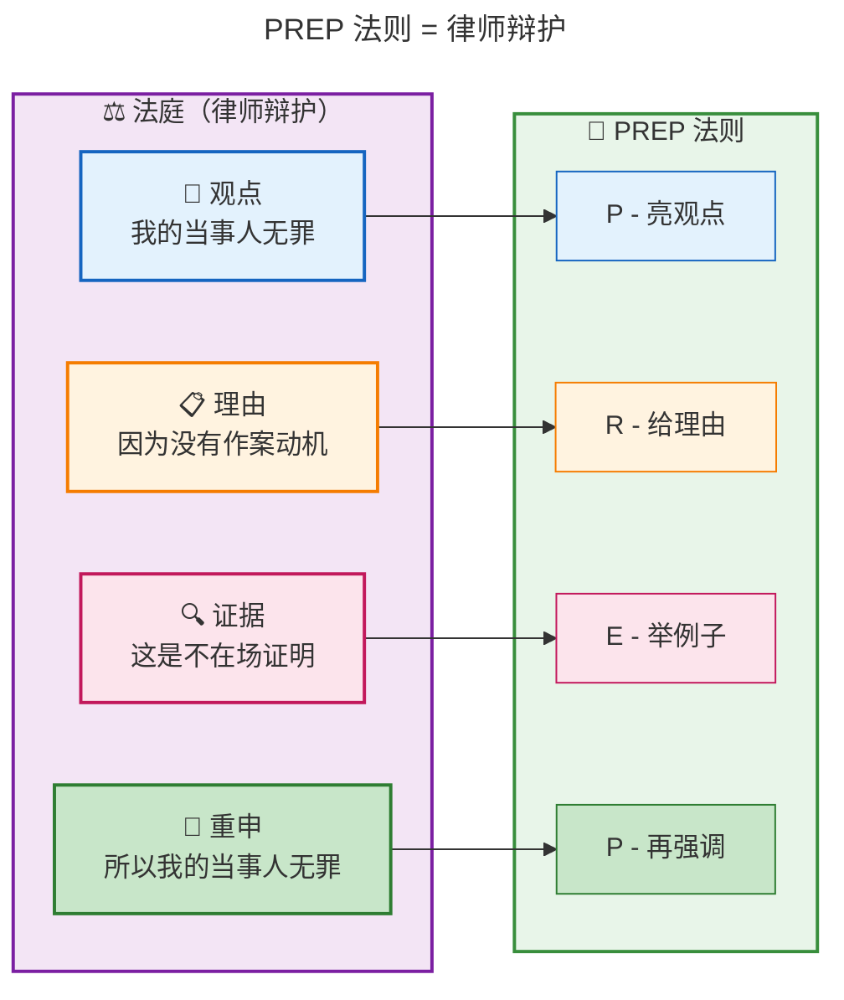

| PREP 要素 | 像什么 | 大白话解释 |
|-----------|--------|-----------|
| **P - Point** | 📢 亮观点 | "我认为应该这样做" |
| **R - Reason** | 📋 给理由 | "为什么？因为有这些原因" |
| **E - Example** | 🔍 举例子 | "不信你看这个例子" |
| **P - Point** | 📢 再强调 | "所以，应该这样做" |

**为什么这个类比贴切？**
- 律师不会只说"我当事人无罪"就完事，他会先说观点→给理由→举证据→再强调
- 你表达观点也一样，只说"我觉得应该用微服务"没人信，按 PREP 讲才有说服力

---

## 二、思维导图：PREP 法则全景

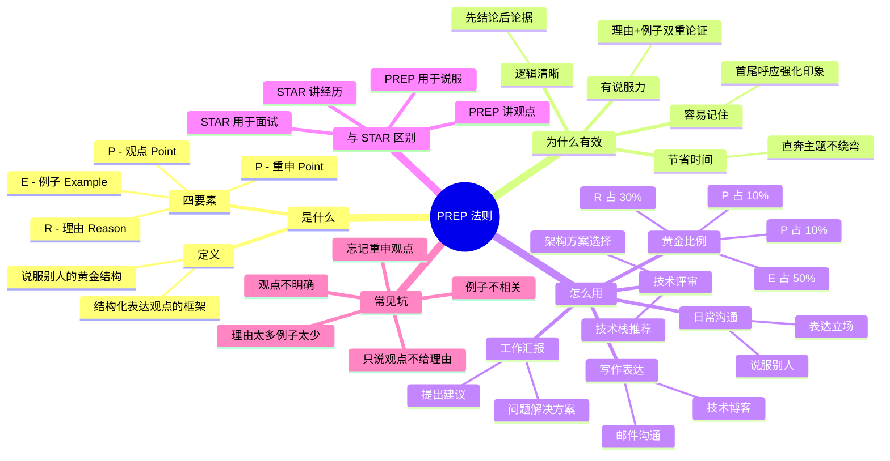

---

## 三、核心概念详解

### 3.1 P — Point（观点）

**大白话**：就是你想要表达的**核心观点或结论**。一句话告诉别人"我认为应该怎样"。

**关键要素**：
- 观点要明确、具体
- 开门见山，不绕弯子
- 让对方第一时间知道你的立场

**类比**：就像新闻标题——"央行宣布降息"，一句话告诉你发生了什么。

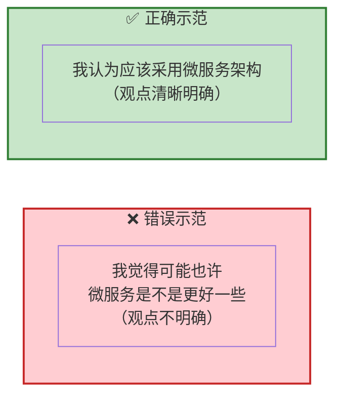

### 3.2 R — Reason（理由）

**大白话**：就是你为什么有这个观点的**原因和依据**。告诉别人"为什么这样认为"。

**关键要素**：
- 理由要有逻辑、有依据
- 可以列 2-3 个核心理由
- 用数据或事实支撑

**类比**：就像律师的辩护词——"因为 A、B、C 三个原因，所以..."

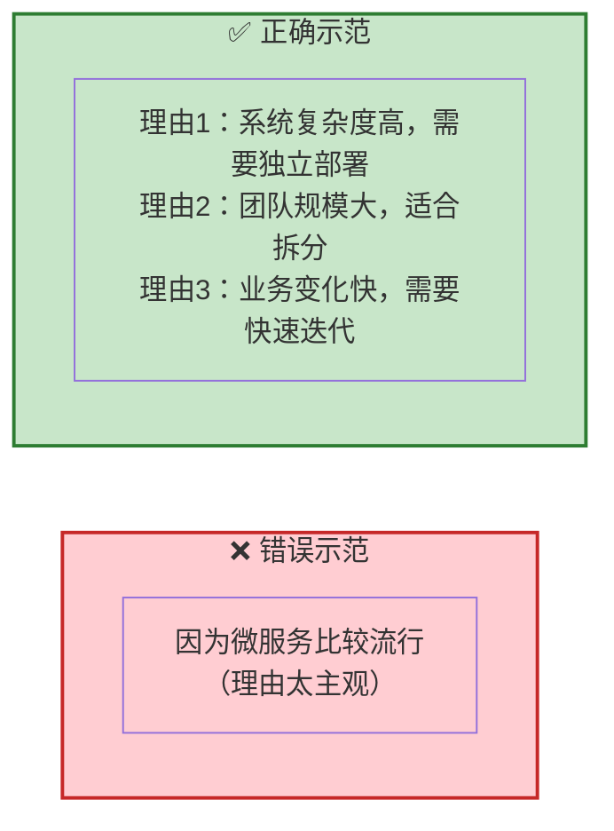

### 3.3 E — Example（例子）

**大白话**：就是用**具体的案例或数据**来证明你的理由。让抽象的理由变得具体可感。

**关键要素**：
- 例子要真实、相关
- 最好有数据支撑
- 让对方"眼见为实"

**类比**：就像律师出示证据——"这是监控录像、这是证人证词"

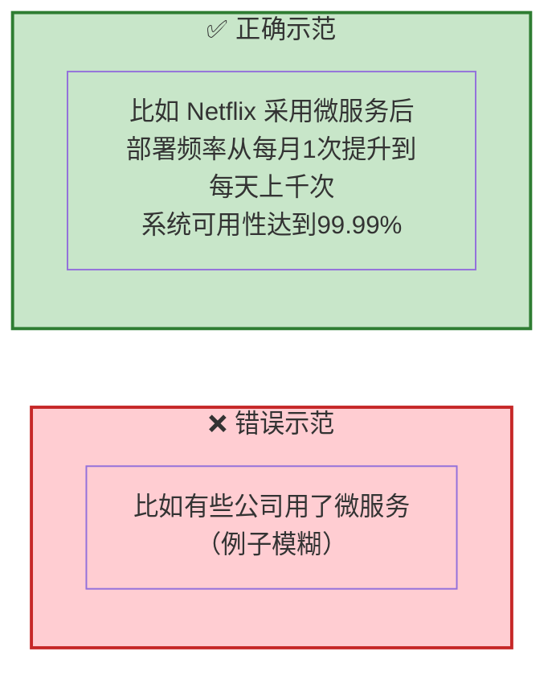

### 3.4 P — Point（重申观点）

**大白话**：就是最后**再强调一遍你的观点**。首尾呼应，加深印象。

**关键要素**：
- 简洁有力，不要重复理由
- 可以加上行动呼吁
- 让对方记住你的核心观点

**类比**：就像演讲结尾——"所以，让我们一起行动起来！"

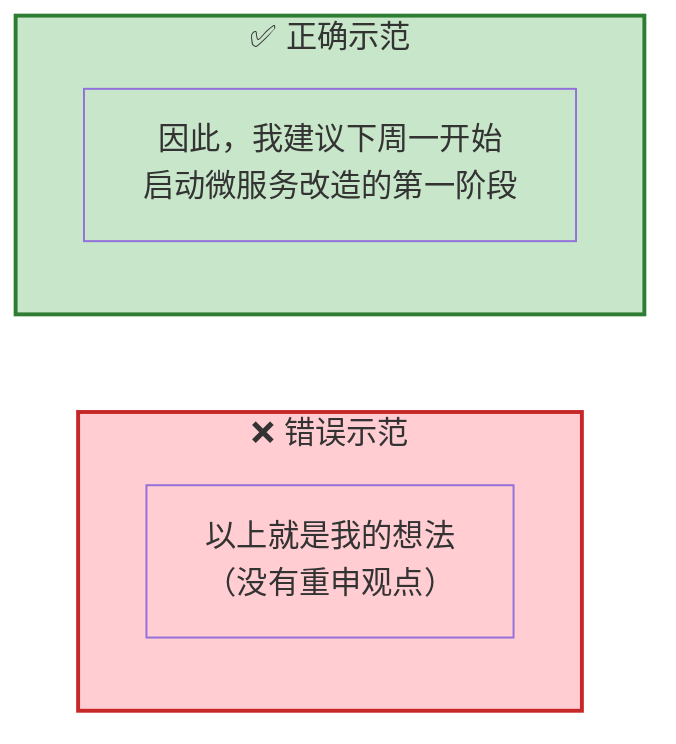

---

## 四、PREP 法则的流程图

### 4.1 完整使用流程

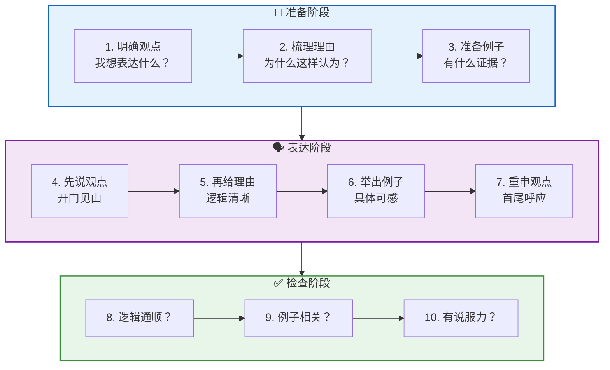

### 4.2 技术评审中的决策流程

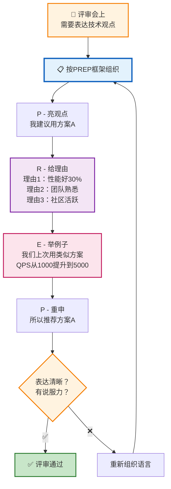

---

## 五、黄金比例

### 5.1 时间分配

```
┌────────────────────────────────────────────────────────────┐
│  📊 PREP 法则黄金比例（技术评审，总计 2-3 分钟）            │
├────────────────────────────────────────────────────────────┤
│                                                            │
│  ████ P - 观点   10%  （1句话，约15秒）                     │
│  ████████████ R - 理由   30% （2-3个理由，约45秒）           │
│  ██████████████████████████████████████ E - 例子  50%       │
│  （核心证据，约75秒）                                        │
│  ████ P - 重申   10%  （1句话，约15秒）                     │
│                                                            │
│  ⚠️ 最常见的错误：观点说太多，例子不够具体                   │
└────────────────────────────────────────────────────────────┘
```

### 5.2 黄金比例可视化

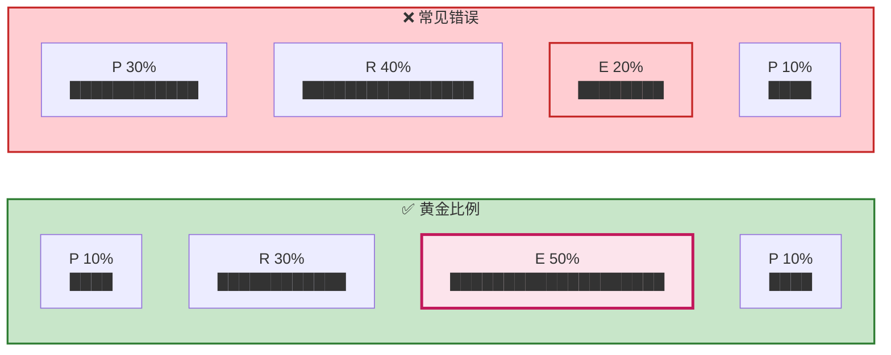

---

## 六、实战案例

### 案例1：技术评审 — "应该用微服务还是单体？"

```
╔══════════════════════════════════════════════════════════╗
║  🎤 评审会："新系统应该采用什么架构？"                     ║
╠══════════════════════════════════════════════════════════╣
║                                                          ║
║  📢 P（观点）- 10%                                       ║
║  "我建议采用微服务架构。"                                  ║
║                                                          ║
║  📋 R（理由）- 30%                                       ║
║  "理由有三点：                                             ║
║   1. 业务复杂度高：系统涉及订单、支付、库存等多个领域        ║
║   2. 团队规模大：有30个开发人员，适合拆分协作               ║
║   3. 迭代速度快：业务要求每周发版，需要独立部署能力"         ║
║                                                          ║
║  🔍 E（例子）- 50%                                       ║
║  "举个例子，我们上个月在老系统上加了一个促销功能，           ║
║   因为代码耦合严重，改了订单模块导致支付模块出问题，         ║
║   排查了整整2天。                                          ║
║                                                          ║
║   反观我们试点的微服务项目A，上周改了3次需求，              ║
║   每次都能独立上线，没有影响其他服务，效率提升了60%。"       ║
║                                                          ║
║  📢 P（重申）- 10%                                       ║
║  "所以，为了支撑业务的快速迭代，建议采用微服务架构。"       ║
║                                                          ║
╚══════════════════════════════════════════════════════════╝
```

### 案例2：工作汇报 — "建议增加服务器预算"

```
╔══════════════════════════════════════════════════════════╗
║  📋 向CTO汇报："Q4的服务器预算申请"                        ║
╠══════════════════════════════════════════════════════════╣
║                                                          ║
║  📢 P（观点）：                                            ║
║  "建议Q4增加50%的服务器预算。"                             ║
║                                                          ║
║  📋 R（理由）：                                            ║
║  "原因有三：                                                ║
║   1. Q4有大促活动，流量预计增长3倍                          ║
║   2. 现有服务器CPU利用率已达75%，接近瓶颈                   ║
║   3. 竞品上个月因宕机损失了千万级订单"                      ║
║                                                          ║
║  🔍 E（例子）：                                            ║
║  "以去年双11为例，当时服务器不够用，                        ║
║   高峰期接口响应时间从200ms飙升到5秒，                      ║
║   用户投诉量是平时的10倍。                                 ║
║                                                          ║
║   今年Q3的预演测试也显示，当前配置最多支撑1.5倍流量，       ║
║   无法应对3倍的增长预期。"                                  ║
║                                                          ║
║  📢 P（重申）：                                            ║
║  "因此，为确保大促稳定，建议批准增加50%的服务器预算。"       ║
║                                                          ║
╚══════════════════════════════════════════════════════════╝
```

### 案例3：日常沟通 — "推荐用 TypeScript"

```
╔══════════════════════════════════════════════════════════╗
║  💬 团队讨论："新项目用 JS 还是 TS？"                      ║
╠══════════════════════════════════════════════════════════╣
║                                                          ║
║  📢 P（观点）：                                            ║
║  "我建议用 TypeScript。"                                   ║
║                                                          ║
║  📋 R（理由）：                                            ║
║  "理由：                                                    ║
║   1. 类型检查能在编译期发现80%的低级错误                    ║
║   2. IDE 智能提示更强，开发效率更高                         ║
║   3. 代码可读性好，新人上手快"                              ║
║                                                          ║
║  🔍 E（例子）：                                            ║
║  "比如上个项目，我们用 JS 写，上线后发现一个 bug：           ║
║   把 user.id 传成了 user.ID（大小写问题），                 ║
║   排查了2小时才发现。                                      ║
║                                                          ║
║   如果是 TS，这种错误在写代码时就会报错，根本不会上线。      ║
║   我们团队用 TS 的项目，线上 bug 率比 JS 项目低了40%。"     ║
║                                                          ║
║  📢 P（重申）：                                            ║
║  "所以，为了提升代码质量和开发效率，推荐用 TypeScript。"     ║
║                                                          ║
╚══════════════════════════════════════════════════════════╝
```

### 案例4：邮件沟通 — "申请延期交付"

```
╔══════════════════════════════════════════════════════════╗
║  📧 邮件："关于项目延期的申请"                              ║
╠══════════════════════════════════════════════════════════╣
║                                                          ║
║  📢 P（观点）：                                            ║
║  "申请将项目交付时间从9月15日延期到9月30日。"               ║
║                                                          ║
║  📋 R（理由）：                                            ║
║  "原因：                                                    ║
║   1. 第三方接口文档有重大变更，需要重新对接                  ║
║   2. 测试发现一个性能问题，需要优化数据库查询                ║
║   3. 核心开发人员生病请假1周，进度受影响"                   ║
║                                                          ║
║  🔍 E（例子）：                                            ║
║  "具体来说：                                                ║
║   - 第三方支付的 v3 接口与 v2 完全不兼容，需要重写2000行代码 ║
║   - 压测发现订单查询接口在10万数据时响应超过5秒，            ║
║     需要添加索引和优化SQL                                   ║
║   - 后端主力小张从8月20日请假到8月27日"                     ║
║                                                          ║
║  📢 P（重申）：                                            ║
║  "为确保交付质量，申请延期至9月30日，我们会每天同步进度。"   ║
║                                                          ║
╚══════════════════════════════════════════════════════════╝
```

---

## 七、PREP 法则 vs STAR 法则 vs SCQA 模型

### 7.1 三大框架对比表

| 维度 | PREP 法则 | STAR 法则 | SCQA 模型 |
|------|-----------|-----------|-----------|
| **全称** | Point-Reason-Example-Point | Situation-Task-Action-Result | Situation-Complication-Question-Answer |
| **核心用途** | 表达观点、说服别人 | 讲经历、面试、汇报 | 讲故事、写文章 |
| **适合场景** | "你怎么看？" | "你做过什么？" | "怎么回事？" |
| **结构** | 观点→理由→例子→观点 | 背景→任务→行动→结果 | 情景→冲突→问题→答案 |
| **类比** | ⚖️ 律师辩护 | 📖 讲故事 | 🎬 悬疑片 |
| **程序员常用** | 技术评审、建议 | 面试、工作汇报 | 技术博客、分享 |
| **目的** | 说服对方接受你的观点 | 证明你有某项能力 | 吸引读者看下去 |

### 7.2 选择决策图

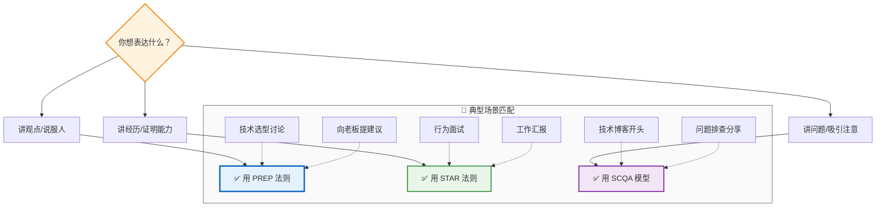

### 7.3 组合使用示例

实际工作中，PREP 和 STAR 经常组合使用：

```
╔══════════════════════════════════════════════════════════╗
║  🎯 场景：面试官问 "你觉得团队协作重要吗？"               ║
╠══════════════════════════════════════════════════════════╣
║                                                          ║
║  📢 P（PREP-观点）：                                      ║
║  "我认为团队协作非常重要。"                                ║
║                                                          ║
║  📋 R（PREP-理由）：                                      ║
║  "因为好的协作能让1+1>2，减少重复工作，提升整体效率。"     ║
║                                                          ║
║  📖 S（STAR-情境）：                                      ║
║  "比如上个项目，我们6个人要在1个月内完成一个复杂的支付系统" ║
║                                                          ║
║  🎯 T（STAR-任务）：                                      ║
║  "我负责整体架构设计和核心模块开发"                        ║
║                                                          ║
║  🔪 A（STAR-行动）：                                      ║
║  "我建立了每日站会制度，用Jira跟踪任务，每周组织代码评审"   ║
║                                                          ║
║  📊 R（STAR-结果）：                                      ║
║  "最终项目提前3天交付，团队满意度调查4.8分（满分5分）"      ║
║                                                          ║
║  📢 P（PREP-重申）：                                      ║
║  "所以，良好的团队协作是项目成功的关键。"                  ║
║                                                          ║
╚══════════════════════════════════════════════════════════╝
```

---

## 八、常见误区与避坑指南

### 8.1 六大常见坑

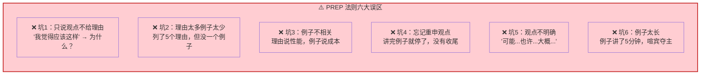

### 8.2 避坑对照表

| 误区 | 表现 | 正确做法 |
|------|------|----------|
| **只说观点** | "我觉得应该用微服务" | 必须给2-3个理由支撑 |
| **理由堆砌** | 列了5个理由，没例子 | 精选2-3个理由 + 1个具体例子 |
| **例子跑题** | 理由说性能，例子说成本 | 例子必须直接支撑理由 |
| **没有收尾** | 讲完例子就停了 | 一定要用 P 重申观点 |
| **观点模糊** | "可能、也许、大概" | 用"我认为、我建议、应该" |
| **例子太长** | 例子讲了5分钟 | 例子控制在1-2分钟内 |

---

## 九、程序员 PREP 素材库模板

### 9.1 常见观点场景

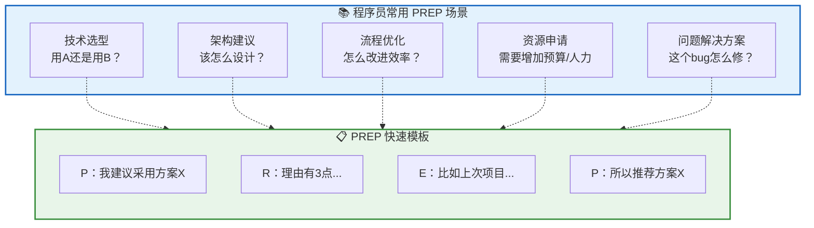

### 9.2 素材卡片模板

```
╔══════════════════════════════════════════════════════════╗
║  📇 PREP 素材卡片 #1                                     ║
╠══════════════════════════════════════════════════════════╣
║  场景：技术选型讨论                                       ║
║  观点：推荐用 Redis 做缓存                                ║
║                                                          ║
║  P：我建议用 Redis 作为缓存方案                            ║
║                                                          ║
║  R：理由：                                                 ║
║    1. 读写性能极高（10万QPS）                              ║
║    2. 支持丰富的数据结构                                   ║
║    3. 社区活跃，文档完善                                   ║
║                                                          ║
║  E：例子：                                                 ║
║    我们项目A用 Redis 缓存热点数据后，                      ║
║    数据库压力降低70%，接口响应从500ms降到50ms               ║
║                                                          ║
║  P：所以，Redis 是最适合的缓存方案                          ║
║                                                          ║
║  ⏱️ 讲述时间：约1分30秒                                   ║
╚══════════════════════════════════════════════════════════╝
```

---

## 十、关键数字速记

```
┌────────────────────────────────────────────────────────┐
│  📊 PREP 法则关键数字（吹牛用）                          │
├────────────────────────────────────────────────────────┤
│  • 黄金比例：P 10% / R 30% / E 50% / P 10%            │
│  • 表达时间：每个 PREP 回答 1-2 分钟                     │
│  • 理由数量：2-3 个核心理由最佳                          │
│  • 例子长度：1-2 分钟内讲完                              │
│  • 说服力提升：有例子的观点说服力提升 6 倍               │
│  • 记忆留存：首尾呼应的表达记忆留存率提升 40%            │
│  • 适用场景：技术评审、建议、汇报、写作                  │
└────────────────────────────────────────────────────────┘
```

---

## 十一、类比速记卡

| 概念 | 类比 | 一句话记忆 |
|------|------|-----------|
| **PREP 整体** | ⚖️ 律师辩护 | 先说观点，再给理由，举证据，再强调 |
| **P - 观点** | 📢 新闻标题 | 一句话告诉你核心结论 |
| **R - 理由** | 📋 辩护词 | 为什么这样认为？因为 A、B、C |
| **E - 例子** | 🔍 证据 | 不信你看这个案例/数据 |
| **P - 重申** | 🎯 结案陈词 | 所以，应该这样做 |
| **黄金比例** | 🍰 蛋糕分配 | 例子占一半，理由占三成，观点各一成 |
| **vs STAR** | 律师 vs  storyteller | PREP 说服人，STAR 讲经历 |

---

## 十二、一句话总结（费曼技巧版）

**PREP 法则是什么？**
> 一个"说服别人"的结构化框架：观点→理由→例子→重申观点。

**为什么重要？**
> 工作中 80% 的沟通都是在表达观点、说服别人。PREP 让你的表达逻辑清晰、有说服力，首尾呼应让人印象深刻。

**适合谁？**
> 所有需要"表达观点、说服别人"的人：技术评审、向老板提建议、写邮件、日常沟通。尤其是程序员，技术选型、架构建议都需要 PREP。

**怎么用？**
> ① 先亮观点（开门见山）→ ② 给2-3个理由 → ③ 举1个具体例子（用数据说话）→ ④ 重申观点（首尾呼应）。

---

> 📝 **学习笔记**
> - 学习日期：2026-09-13
> - 学习方式：费曼学习法（大白话版）
> - 知识点：PREP 法则
> - 下一步：在下次技术评审中练习使用 PREP 框架（Step 3）
