<!-- [AGC:FILE] tool=Cc author=fangkun date=2026-09-13 -->

# 大白话版：STAR/STAT 法则

> 这是关于 **STAR 法则**（也叫 STAT 法则）的通俗解读版
> 核心理念：用大白话把"结构化表达"讲明白，让自己和别人都能听懂
>
> 💡 STAR = Situation（情境）→ Task（任务）→ Action（行动）→ Result（结果）

---

## 一、一句话说明白：STAR 法则是什么？

**STAR 法则就是一个"讲故事的框架"——告诉别人"我做了什么事"的时候，按照 背景→目标→做法→成果 的顺序讲，让对方一听就懂、一听就信。**

### 类比理解

**🎨 类比图**：STAR 法则就像"做菜上菜"

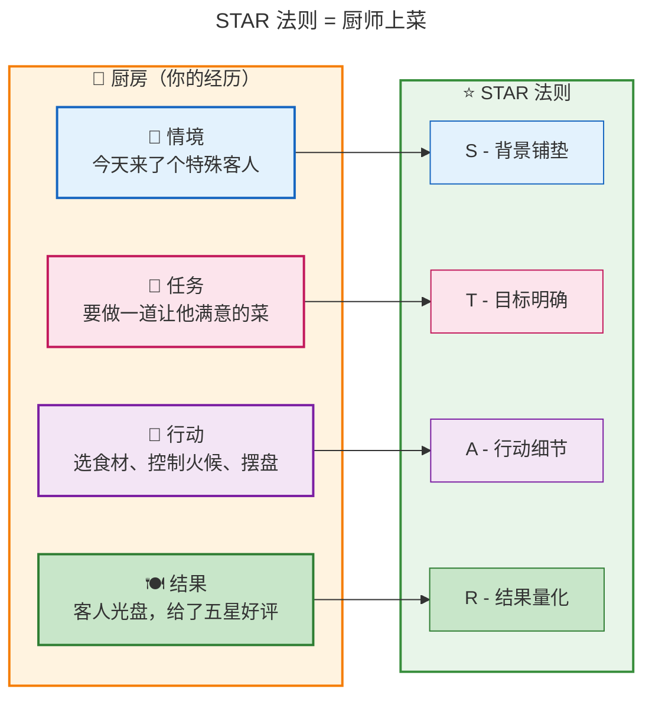

| STAR 要素 | 像什么 | 大白话解释 |
|-----------|--------|-----------|
| **S - Situation** | 📖 故事的开头 | "当时是什么情况？" |
| **T - Task** | 🎯 你的目标 | "你需要完成什么？" |
| **A - Action** | 🔪 你的操作 | "你具体做了什么？" |
| **R - Result** | 🍽️ 最终效果 | "做完之后怎么样？" |

**为什么这个类比贴切？**
- 厨师不会直接说"我做了一道好菜"，他会先说背景（什么客人）、目标（做什么菜）、过程（怎么做的）、结果（客人评价）
- 你讲经历也一样，直接说"我很厉害"没人信，按 STAR 讲才有说服力

---

## 二、思维导图：STAR 法则全景

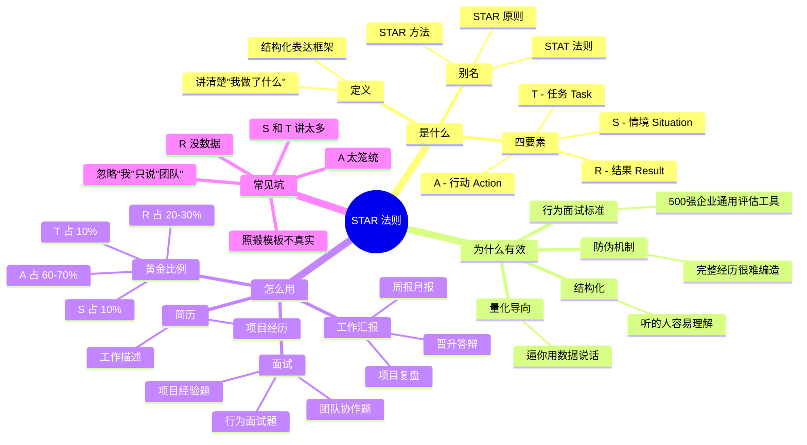

---

## 三、核心概念详解

### 3.1 S — Situation（情境）

**大白话**：就是你做这件事的**背景**。告诉别人"当时是什么情况"，让对方有代入感。

**关键要素**：
- 在哪里？什么项目？什么时间？
- 面临什么挑战或困难？
- 为什么这件事不容易？

**类比**：就像电影开头——"在 XX 年代，一个 XX 的小镇..." 给观众交代背景。

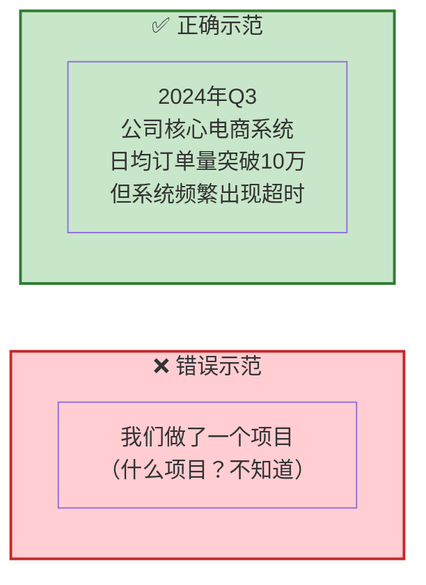

### 3.2 T — Task（任务）

**大白话**：就是你在上述背景下的**具体目标或职责**。告诉别人"你需要完成什么"。

**关键要素**：
- 你的角色是什么？
- 你的具体目标是什么？
- 有什么约束条件？

**类比**：就像任务书——"你的任务是攻下这个山头"

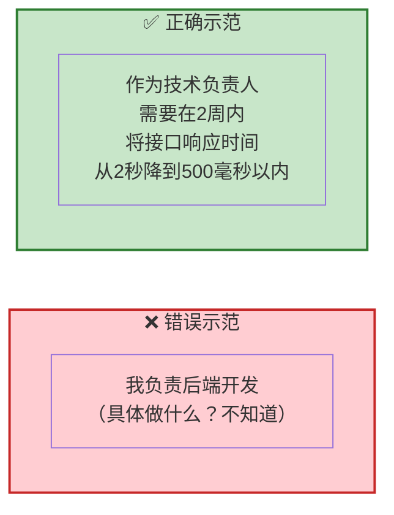

### 3.3 A — Action（行动）

**大白话**：就是你**具体做了什么**。这是 STAR 法则的**核心**，应该占你 60-70% 的篇幅。

**关键要素**：
- 你采取了哪些具体步骤？
- 为什么选择这个方案？
- 遇到什么困难，怎么解决的？
- **强调"我"做了什么**（不是"团队"做了什么）

**类比**：就像菜谱——第一步热锅、第二步放油、第三步...每一步都要清楚。

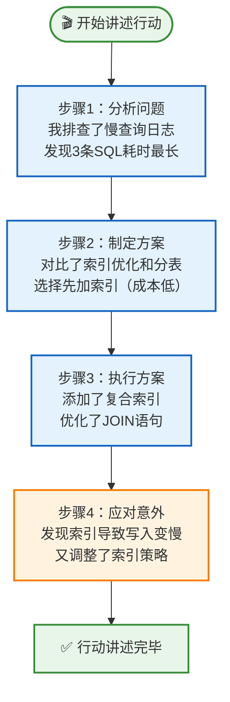

### 3.4 R — Result（结果）

**大白话**：就是你做完之后的**成果**。要用**数据**说话，不要只说"效果很好"。

**关键要素**：
- 具体数字（提升了多少？降低了多少？）
- 业务影响（给公司带来了什么？）
- 学到了什么？

**类比**：就像体检报告——不能只说"身体变好了"，要给出具体的指标数值。

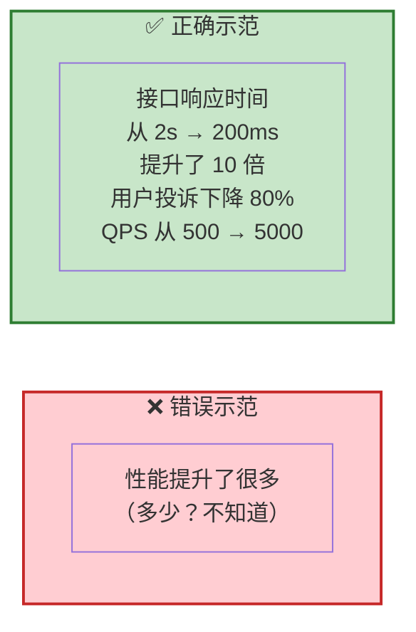

---

## 四、STAR 法则的流程图

### 4.1 完整使用流程

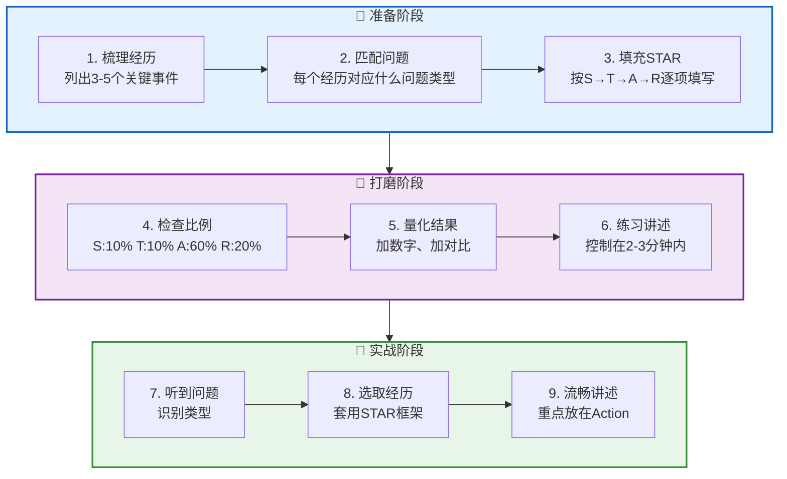

### 4.2 面试中的决策流程

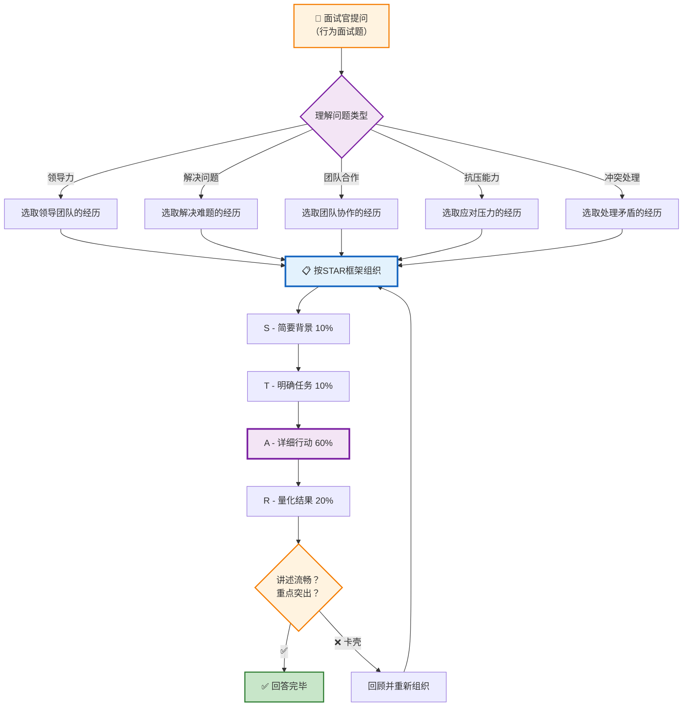

---

## 五、黄金比例

### 5.1 时间分配饼图

```
┌────────────────────────────────────────────────────────────┐
│  📊 STAR 法则黄金比例（面试口述版，总计 2-3 分钟）          │
├────────────────────────────────────────────────────────────┤
│                                                            │
│  ████ S - 情境   10%  （1-2句话，约15秒）                   │
│  ████ T - 任务   10%  （1-2句话，约15秒）                   │
│  ████████████████████████ A - 行动  60% （核心，约90秒）     │
│  ████████████ R - 结果  20%  （量化成果，约30秒）            │
│                                                            │
│  ⚠️ 最常见的错误：S和T讲太多，A草草带过                      │
└────────────────────────────────────────────────────────────┘
```

### 5.2 黄金比例可视化

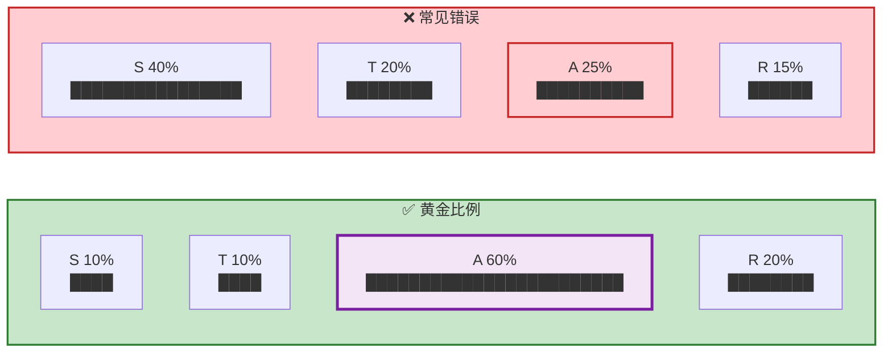

---

## 六、实战案例

### 案例1：程序员面试 — "请说一个你解决过的技术难题"

```
╔══════════════════════════════════════════════════════════╗
║  🎤 面试官："请描述一个你解决过的最复杂的技术问题"         ║
╠══════════════════════════════════════════════════════════╣
║                                                          ║
║  📖 S（情境）- 10%                                       ║
║  "去年Q3，我们的电商系统在促销高峰期频繁出现接口超时，      ║
║   日均订单量从5万突增到15万，系统可用性降到了92%。"         ║
║                                                          ║
║  🎯 T（任务）- 10%                                       ║
║  "作为后端技术负责人，我需要在1周内定位瓶颈并将核心         ║
║   接口响应时间从2秒降到500毫秒以内。"                      ║
║                                                          ║
║  🔪 A（行动）- 60%                                       ║
║  "首先，我用 Arthas + 慢查询日志做了全链路分析，            ║
║   发现3条SQL占用了70%的数据库时间。                        ║
║                                                          ║
║   然后，我对比了加索引和分表两种方案，考虑到时间紧迫，       ║
║   选择了先加复合索引（成本最低、见效最快）。                ║
║                                                          ║
║   执行时发现索引导致写入性能下降20%，我又调整了索引字段      ║
║   顺序，用覆盖索引避免了回表查询。                         ║
║                                                          ║
║   最后，我还加了Redis缓存热点数据，并优化了N+1查询问题。"   ║
║                                                          ║
║  📊 R（结果）- 20%                                       ║
║  "最终接口响应时间从2s降到180ms（提升11倍），              ║
║   系统可用性恢复到99.9%，成功扛住了双十一峰值，             ║
║   这个优化方案后来被推广到其他3个服务。"                   ║
║                                                          ║
╚══════════════════════════════════════════════════════════╝
```

### 案例2：简历写法 — 工作经历条目

**❌ 普通写法（没有 STAR）**：
```
负责后端系统开发和性能优化工作
```

**✅ STAR 写法**：
```
【电商系统性能优化】面对促销高峰期系统频繁超时的问题（S），
作为技术负责人主导核心接口优化（T），通过慢查询分析+复合索引优化
+Redis缓存+消除N+1查询等组合手段（A），将接口响应时间从2s降至
180ms，系统可用性从92%提升至99.9%（R）。
```

**简历版 STAR 压缩公式**：`面对[情境]，通过[行动]，实现了[量化结果]`

### 案例3：工作汇报 — 月度工作总结

```
╔══════════════════════════════════════════════════════════╗
║  📋 月度工作汇报（STAR 结构）                             ║
╠══════════════════════════════════════════════════════════╣
║                                                          ║
║  📖 S："本月系统日均流量环比增长200%，达到历史峰值"         ║
║                                                          ║
║  🎯 T："目标是保障系统稳定性，SLA不低于99.9%"              ║
║                                                          ║
║  🔪 A：                                                  ║
║  "① 完成了3个核心服务的限流降级改造                        ║
║   ② 新增了数据库读写分离和缓存预热机制                     ║
║   ③ 建立了自动化巡检和告警体系"                            ║
║                                                          ║
║  📊 R：                                                  ║
║  "本月系统可用性99.95%（超额达标），                       ║
║   0次P0级故障，大促期间平稳度过，                           ║
║   获得CTO在全体会上的点名表扬"                             ║
║                                                          ║
╚══════════════════════════════════════════════════════════╝
```

### 案例4：团队协作类面试题

```
╔══════════════════════════════════════════════════════════╗
║  🎤 "请描述一次你处理团队冲突的经历"                      ║
╠══════════════════════════════════════════════════════════╣
║                                                          ║
║  📖 S："在开发支付系统时，我和另一位资深同事在技术选型      ║
║   上产生了分歧——我主张用消息队列异步处理，他认为同步调用     ║
║   更简单可靠。"                                           ║
║                                                          ║
║  🎯 T："作为项目负责人，我需要在3天内达成共识，             ║
║   不能影响项目进度。"                                     ║
║                                                          ║
║  🔪 A："我没有直接争论，而是做了两件事：                    ║
║   ① 整理了两种方案的对比文档（性能、可靠性、维护成本）       ║
║   ② 邀请他一起做了一次小规模压测，用数据说话               ║
║   结果显示异步方案在峰值场景下吞吐量高出5倍                ║
║   最终他认同了数据，我们达成了一致"                        ║
║                                                          ║
║  📊 R："项目按期交付，系统在后续大促中零故障，              ║
║   我和这位同事也建立了更好的技术信任关系"                  ║
║                                                          ║
╚══════════════════════════════════════════════════════════╝
```

---

## 七、STAR 法则 vs 其他表达框架

### 7.1 对比表

| 维度 | STAR 法则 | PREP 法则 | SCQA 模型 |
|------|-----------|-----------|-----------|
| **全称** | Situation-Task-Action-Result | Point-Reason-Example-Point | Situation-Complication-Question-Answer |
| **核心用途** | 讲经历、面试、汇报 | 表达观点、说服别人 | 讲故事、写文章 |
| **适合场景** | "你做过什么" | "你怎么看" | "怎么回事" |
| **结构** | 背景→任务→行动→结果 | 观点→理由→例子→观点 | 情景→冲突→问题→答案 |
| **类比** | 📖 讲一个故事 | 🎯 说服一个人 | 🎬 拍一部悬疑片 |
| **程序员常用** | ✅ 面试必备 | ✅ 技术评审 | ✅ 技术博客 |

### 7.2 选择决策图

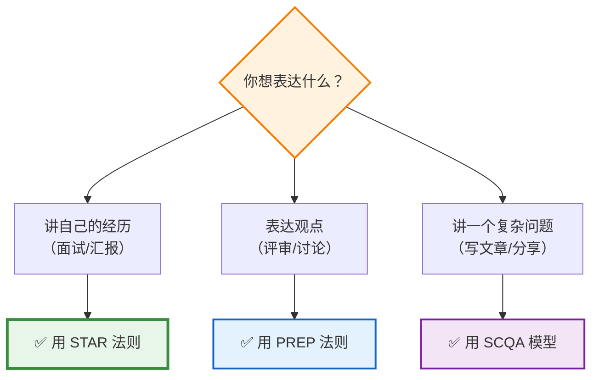

---

## 八、常见误区与避坑指南

### 8.1 六大常见坑

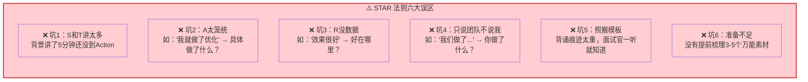

### 8.2 避坑对照表

| 误区 | 表现 | 正确做法 |
|------|------|----------|
| **S/T 过长** | 背景讲了2分钟 | S 控制在 15秒内，1-2句话 |
| **A 太模糊** | "我做了优化" | 分步骤讲：先做了什么→然后→最后 |
| **R 没数据** | "效果很好" | 给出具体数字：提升了X%，降低了Y% |
| **只说团队** | "我们一起完成了" | 强调"我"：我负责、我决定、我推动 |
| **背诵感** | 语气机械、不自然 | 理解框架后用自己的话讲，允许有思考停顿 |
| **素材不足** | 临时编造 | 提前准备 3-5 个"万能故事"覆盖常见题型 |

---

## 九、程序员 STAR 素材库模板

### 9.1 准备你的故事库

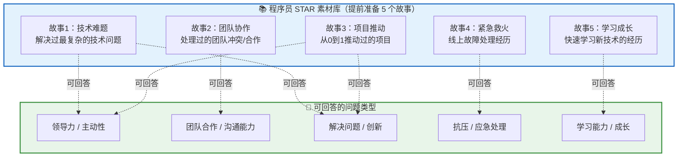

### 9.2 素材卡片模板

```
╔══════════════════════════════════════════════════════════╗
║  📇 STAR 素材卡片 #1                                     ║
╠══════════════════════════════════════════════════════════╣
║  标题：电商系统性能优化                                    ║
║  适用问题：技术难题 / 解决问题 / 抗压                      ║
║                                                          ║
║  S：促销高峰期，日均订单从5万突增到15万，                   ║
║     系统可用性降到92%，接口响应超2秒                       ║
║                                                          ║
║  T：作为后端负责人，1周内将核心接口                        ║
║     响应时间降到500ms以内                                 ║
║                                                          ║
║  A：① Arthas+慢查询日志做全链路分析                       ║
║     ② 对比加索引vs分表，选加索引（快）                     ║
║     ③ 发现索引导致写入变慢，调整字段顺序                   ║
║     ④ 加Redis缓存+消除N+1查询                            ║
║                                                          ║
║  R：响应时间 2s→180ms（提升11倍），                        ║
║     可用性 92%→99.9%，方案推广到3个服务                    ║
║                                                          ║
║  ⏱️ 讲述时间：约2分30秒                                   ║
╚══════════════════════════════════════════════════════════╝
```

---

## 十、关键数字速记

```
┌────────────────────────────────────────────────────────┐
│  📊 STAR 法则关键数字（吹牛用）                          │
├────────────────────────────────────────────────────────┤
│  • 黄金比例：S 10% / T 10% / A 60% / R 20%            │
│  • 面试讲述时间：每个 STAR 回答 2-3 分钟                 │
│  • 简历 STAR 条目：100-180 字/条                        │
│  • 提前准备素材：3-5 个万能故事覆盖 80% 面试题           │
│  • STAR 法则通过率提升：简历通过率提升 3 倍              │
│  • 500强企业：行为面试的标准评估框架                      │
│  • 防伪原理：完整经历难以编造，细节越丰富越可信            │
└────────────────────────────────────────────────────────┘
```

---

## 十一、类比速记卡

| 概念 | 类比 | 一句话记忆 |
|------|------|-----------|
| **STAR 整体** | 🍳 厨师上菜 | 先说背景，再说做了什么，最后上结果 |
| **S - 情境** | 📖 电影开头 | 给观众交代故事背景 |
| **T - 任务** | 🎯 任务书 | 你要攻下哪个山头 |
| **A - 行动** | 🔪 菜谱步骤 | 第一步干什么，第二步干什么 |
| **R - 结果** | 📊 体检报告 | 用数据证明效果 |
| **黄金比例** | 🎵 歌曲结构 | 前奏短、副歌长、结尾干脆 |
| **素材库** | 🃏 扑克牌 | 提前准备好牌，什么场景出什么牌 |
| **防伪机制** | 🔒 指纹 | 真实经历的细节无法编造 |

---

## 十二、一句话总结（费曼技巧版）

**STAR 法则是什么？**
> 一个"讲清楚自己做了什么"的结构化框架：背景→目标→行动→结果。

**为什么重要？**
> 面试中 80% 的行为面试题都可以用 STAR 法则回答；简历中使用 STAR 可将通过率提升 3 倍。它不只是模板，更是一个防伪机制——真实的完整经历难以编造。

**适合谁？**
> 所有需要"展示自己"的人：求职者、职场人、创业者。尤其是程序员面试，行为面试（软技能面）越来越重要，STAR 法则是通关必备。

**怎么用？**
> ① 提前准备 3-5 个万能故事 → ② 每个故事按 S-T-A-R 填充 → ③ 注意黄金比例（A 占 60%）→ ④ 结果一定要量化。

---

> 📝 **学习笔记**
> - 学习日期：2026-09-13
> - 学习方式：费曼学习法（大白话版）
> - 知识点：STAR/STAT 法则
> - 下一步：准备自己的 3-5 个 STAR 素材卡片，用面试模拟练习（Step 3）
