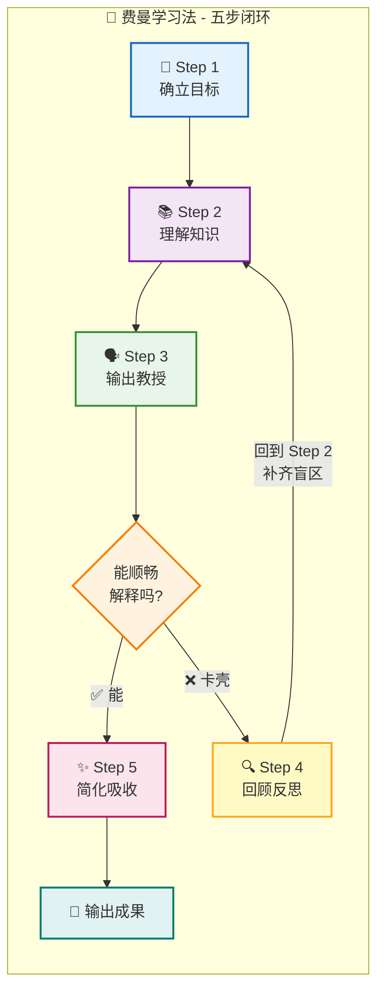
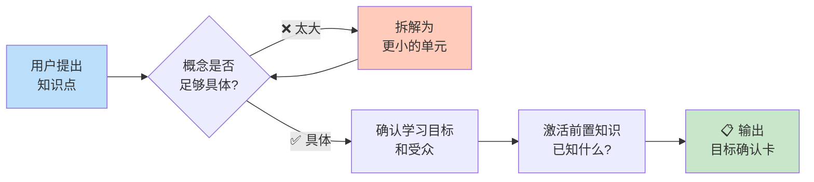
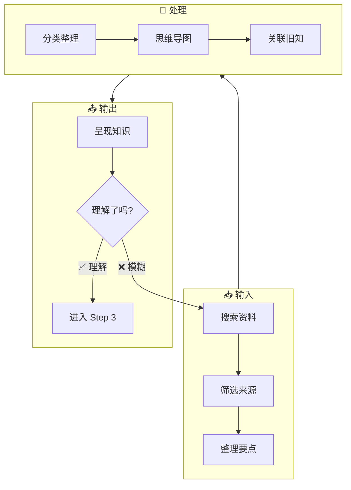
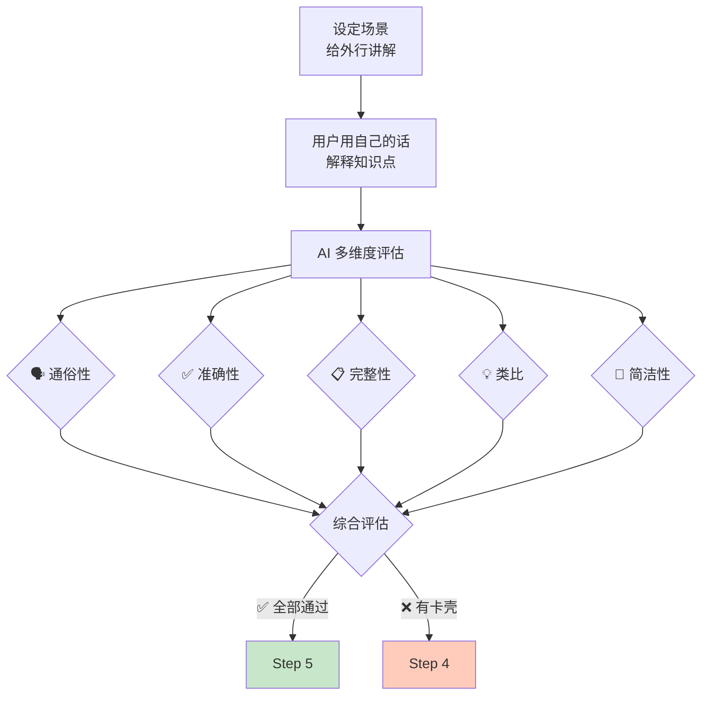
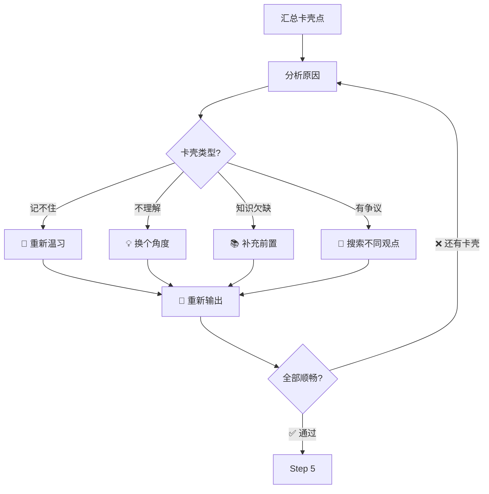
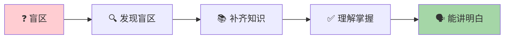
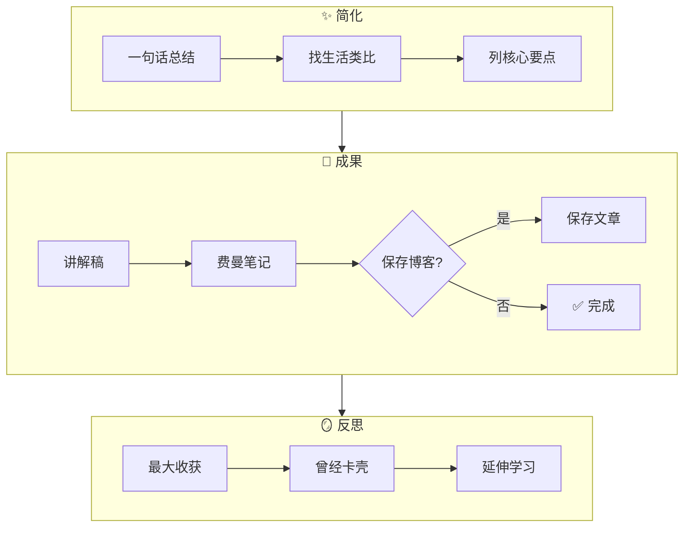
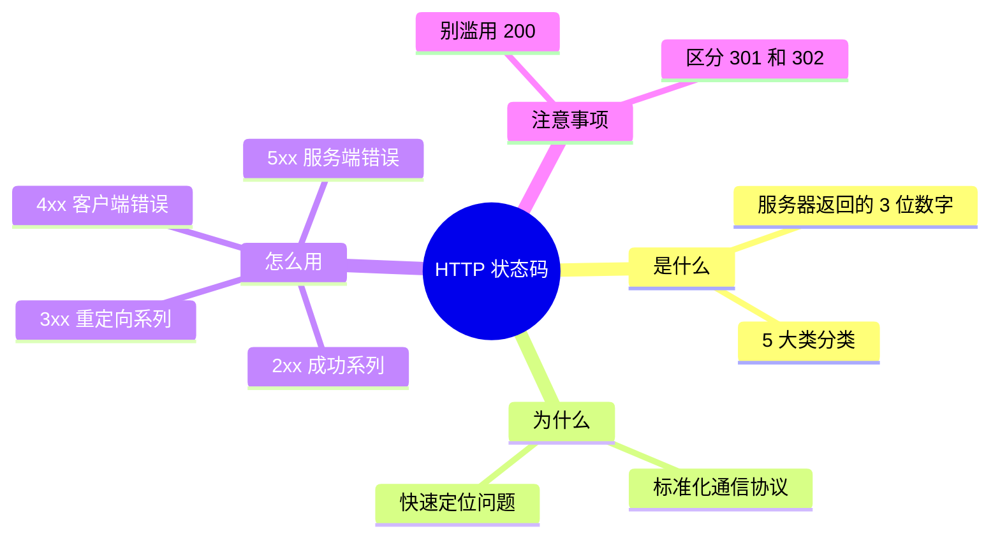
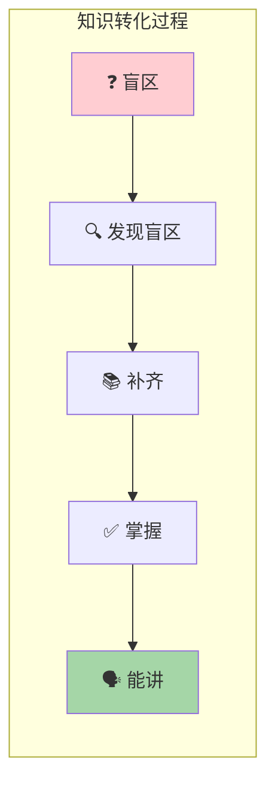
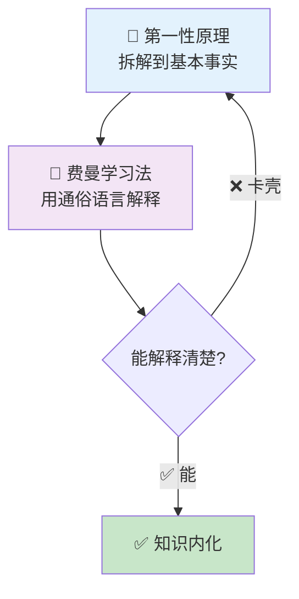

# 费曼学习法 AI 教练：使用 Skill 指南

<!-- [AGC:FILE] tool=Cc author=fangkun date=2026-08-31 -->
<!-- [AGC:START] tool=Cc author=fangkun -->

## 什么是 feynman-learning Skill？

`feynman-learning` 是一个 Claude Code 的 Skill（技能插件），它让 AI 成为你的**费曼学习法教练**。

它不是直接给你答案，而是像一位经验丰富的老师，**通过图文引导**，带你走完费曼学习法的完整五步流程，帮你真正理解一个知识点，并能用通俗易懂的语言讲给别人听。

> 核心理念：**"学 = 教。教不出来 = 没学会。"**

---

## 总览：学习流程图



---

## 触发方式

### 直接触发

```
/feynman-learning
```

### 自然语言触发（推荐）

| 场景 | 触发语句示例 |
|------|-------------|
| 学习新知识 | "用费曼学习法学习 Docker 容器" |
| 理解概念 | "帮我理解什么是微服务" |
| 通俗讲解 | "用简单话解释 HTTP 和 HTTPS 的区别" |
| 面试准备 | "用费曼技巧帮我准备 Redis 的面试题" |
| 团队分享 | "帮我搞懂 Kubernetes，我要给团队做分享" |
| 英文触发 | "learn with feynman: what is blockchain" |

---

## 使用流程

### 第一步：提出知识点

告诉 AI 你想学什么，越具体越好：

✅ **好的提问**：
- "用费曼学习法学习 TCP 三次握手"
- "帮我理解 Git 的 rebase 和 merge 的区别"
- "用简单话解释什么是区块链"

❌ **太模糊的提问**：
- "帮我学习计算机科学"（太大）
- "我想懂编程"（太泛）

### 第二步：跟着图文引导走

AI 教练会一步步引导你，每一步都有**可视化流程图**和**进度指示**：

```
学习进度：🎯 → 📚 → 🗣️ → 🔍 → ✨
          ✅    ✅    🔄    ⏳    ⏳
          
当前位置：🗣️ Step 3 - 输出教授
```

### 第三步：完成学习，获得成果

最终你会得到：
1. 📝 **通俗讲解稿**
2. 📓 **费曼笔记**
3. 📄 **可选：保存为博客文章**

---

## 五步详解

### Step 1 🎯：确立目标



**AI 会问你**：
1. 你为什么要学这个？
2. 你之前了解多少？
3. 最终讲给谁听？

### Step 2 📚：理解知识



**AI 会帮你**：
- 搜索权威资料
- 画思维导图
- 整理知识结构
- 关联你已知的内容

### Step 3 🗣️：输出教授（最关键！）



**评估维度**：

| 维度 | 检查要点 |
|------|----------|
| 🗣️ 通俗性 | 外行能听懂吗？ |
| ✅ 准确性 | 核心概念对吗？ |
| 📋 完整性 | 有遗漏关键吗？ |
| 💡 类比质量 | 类比恰当吗？ |
| 📝 简洁性 | 表达精炼吗？ |

### Step 4 🔍：回顾反思



**知识转化过程**：



### Step 5 ✨：简化吸收



---

## 完整示例

下面以学习 **"HTTP 状态码"** 为例，展示完整的学习过程。

### 🚀 启动 Skill

输入 `/feynman-learning` 后，你会看到：

```
╔══════════════════════════════════════════╗
║     🧠 费曼学习法 AI 教练 已启动         ║
╠══════════════════════════════════════════╣
║                                          ║
║  📋 学习流程：                           ║
║  🎯 Step 1: 确立目标         ⏳          ║
║  📚 Step 2: 理解知识         ⏳          ║
║  🗣️ Step 3: 输出教授         ⏳          ║
║  🔍 Step 4: 回顾反思         ⏳          ║
║  ✨ Step 5: 简化吸收         ⏳          ║
║                                          ║
║  核心理念：学 = 教。教不出来 = 没学会    ║
╚══════════════════════════════════════════╝
```

同时会展示五步闭环的 **Mermaid 流程图**，让你一目了然整个学习路径。

---

### 🎯 Step 1：确立目标

教练会问你 4 个问题：

> 1. **你想学什么知识点？**
> 2. **你为什么要学这个？**
> 3. **你之前了解多少？**
> 4. **最终讲给谁听？**

你回答后，教练输出 **目标确认卡**：

```
╔══════════════════════════════════════════╗
║          🎯 学习目标确认                  ║
╠══════════════════════════════════════════╣
║  知识点：HTTP 状态码                      ║
║  学习目标：日常开发调试                   ║
║  受众水平：刚入门的前端同事               ║
║  你已知的：200 成功，404 找不到，500 报错 ║
╚══════════════════════════════════════════╝
```

---

### 📚 Step 2：理解知识

教练会输出 **知识结构框架** + **思维导图**：

```
┌─────────────────────────────────────────────────────────────┐
│              📚 HTTP 状态码 知识结构                          │
├─────────────────────────────────────────────────────────────┤
│                                                             │
│  📌 是什么（What）                                          │
│  ├─ 定义：服务器返回给客户端的 3 位数字响应码                 │
│  └─ 核心要素：5 大类（1xx/2xx/3xx/4xx/5xx）                 │
│                                                             │
│  💡 为什么（Why）                                           │
│  ├─ 原理：标准化的通信协议，让客户端知道请求结果             │
│  └─ 价值：快速定位问题、统一前后端沟通语言                   │
│                                                             │
│  🔧 怎么用（How）                                           │
│  ├─ 常见码：200/301/302/304/400/401/403/404/500/502/503     │
│  └─ 应用场景：接口调试、错误监控、SEO                        │
│                                                             │
│  ⚠️ 注意事项                                                │
│  ├─ 常见坑：混淆 301 和 302；滥用 200 返回错误              │
│  └─ 边界条件：自定义状态码不在 HTTP 标准内                   │
│                                                             │
└─────────────────────────────────────────────────────────────┘
```



---

### 🗣️ Step 3：输出教授（最关键！）

教练设定场景，让你用自己的话解释：

> 🎬 **场景**：你的前端同事问"HTTP 状态码有哪些？分别什么意思？"
> 
> 请用通俗的话解释，假设对方只知道 200 和 404。

你尝试输出后，教练进行 **五维度评估**：

| 维度 | 评分 | 说明 |
|------|------|------|
| 🗣️ 通俗性 | ✅ | 用"快递签收"类比很恰当 |
| ✅ 准确性 | ⚠️ | 把 302 说成了永久重定向 |
| 📋 完整性 | ❌ | 漏掉了 4xx 和 5xx 的细分 |
| 💡 类比质量 | ✅ | "快递单号"的类比能帮助理解 |
| 📝 简洁性 | ⚠️ | 列举太多，不够精炼 |

出现卡壳时，教练输出 **卡壳检测卡**：

```
╔══════════════════════════════════════════════════════════╗
║          ⚠️ 卡壳点检测                                    ║
╠══════════════════════════════════════════════════════════╣
║  卡壳 1：302 说成永久重定向（应为临时）                   ║
║  卡壳 2：4xx/5xx 没有细分常见状态码                       ║
║                                                          ║
║  原因分析：                                               ║
║    ☑ 记忆有误 → 301 vs 302 容易混淆                      ║
║    ☑ 知识欠缺 → 4xx 系列掌握不全                          ║
║                                                          ║
║  建议动作：补充 301/302 的区别 + 4xx 常见码               ║
╚══════════════════════════════════════════════════════════╝
```

---

### 🔍 Step 4：回顾反思

教练带你回到 Step 2 补齐盲区，然后让你重新输出：

```
学习进度：🎯 → 📚 → 🗣️ → 🔍 → ✨
          ✅    ✅    ❌    🔄    ⏳

知识流转：❓盲区 → 🔍发现盲区 → 📚补齐 → ✅掌握 → 🗣️能讲
                    ↑ 你在这里
```

你补充学习后重新解释，教练再次评估：

| 维度 | 评分 | 说明 |
|------|------|------|
| 🗣️ 通俗性 | ✅ | 类比清晰 |
| ✅ 准确性 | ✅ | 301/302 区分正确 |
| 📋 完整性 | ✅ | 五大类都有覆盖 |
| 💡 类比质量 | ✅ | 快递类比贯穿始终 |
| 📝 简洁性 | ✅ | 重点突出 |

🎉 **全部通过！** 进入 Step 5

---

### ✨ Step 5：简化吸收

教练让你用**一句话总结**，然后输出最终成果：

```
💡 一句话总结
────────────────────────────────────────
HTTP 状态码就像快递签收回执：2xx 签收了，
3xx 转寄了，4xx 你的地址有问题，5xx 快递站出事了。
────────────────────────────────────────
```

**最终讲解稿**：

```markdown
## HTTP 状态码 - 通俗讲解

### 💡 一句话解释
HTTP 状态码就像快递签收回执：2xx 签收了，3xx 转寄了，
4xx 你的地址有问题，5xx 快递站出事了。

### 🎯 类比理解
把 HTTP 请求想象成寄快递：
- 200 = 签收成功
- 301 = 永久搬家（以后寄新地址）
- 302 = 临时不在（过几天再寄原来的）
- 404 = 查无此人
- 500 = 快递站着火了

### 📌 核心要点
1. **1xx**：信息提示（快递已揽收）
2. **2xx**：成功（签收了）
3. **3xx**：重定向（转寄了）
4. **4xx**：客户端错误（你的问题）
5. **5xx**：服务端错误（服务器的问题）

### ❓ 常见疑问
**Q**: 301 和 302 有什么区别？
**A**: 301 是永久搬家，搜索引擎会更新地址；302 是临时不在，
   搜索引擎还是记原来的地址。

### 🔧 实际应用
接口调试看状态码快速定位问题；SEO 用 301 做域名跳转；
前端根据 401/403 做权限处理。
```

---

## Skill 设计亮点

### 1. 图文驱动

每一步都有：
- 📊 **Mermaid 流程图**：展示步骤流转
- 📋 **模板卡片**：展示输出格式
- 📈 **进度指示**：知道走到哪一步了

### 2. 知识流转可视化



### 3. 多维度评估

| 维度 | 图标 | 说明 |
|------|------|------|
| 通俗性 | 🗣️ | 外行能听懂吗？ |
| 准确性 | ✅ | 核心概念对吗？ |
| 完整性 | 📋 | 遗漏关键吗？ |
| 类比质量 | 💡 | 类比恰当吗？ |
| 简洁性 | 📝 | 表达精炼吗？ |

### 4. 卡壳检测

```
╔══════════════════════════════════════════╗
║          ⚠️ 卡壳点检测                    ║
╠══════════════════════════════════════════╣
║  卡壳内容：[解释不清的部分]              ║
║  可能原因：                              ║
║    □ 记忆有误 → 重新温习                 ║
║    □ 理解有误 → 换个角度                 ║
║    □ 知识欠缺 → 补充前置                 ║
║    □ 有争议 → 搜索不同观点               ║
╚══════════════════════════════════════════╝
```

---

## 适用场景

| 场景 | 如何使用 |
|------|----------|
| **面试准备** | 用费曼法准备技术问题，确保能通俗讲解 |
| **团队分享** | 先自己用 Skill 学透，再准备分享材料 |
| **学习新技能** | 让 AI 帮你检验是否真正理解 |
| **写技术文档** | 假设读者是非技术人员 |
| **复习考试** | 用费曼法复习每个知识点 |
| **debugging** | 向"橡皮鸭"解释代码逻辑 |

---

## 与其他工具结合

### 结合 createPost Skill

学完后直接保存为博客：

```
你：帮我保存为博客文章
AI：好的，使用 createPost skill，分类 feynman-technique
```

### 结合第一性原理



---

## 快速上手清单

```
┌─────────────────────────────────────────────────────────────┐
│                feynman-learning Skill 快速上手                │
├─────────────────────────────────────────────────────────────┤
│                                                             │
│  1️⃣  打开 Claude Code                                       │
│                                                             │
│  2️⃣  输入：用费曼学习法学习 [知识点]                         │
│                                                             │
│  3️⃣  跟着图文引导走完五步                                   │
│     🎯 确立目标 → 📚 理解知识 → 🗣️ 输出教授                │
│     → 🔍 回顾反思 → ✨ 简化吸收                             │
│                                                             │
│  4️⃣  获得费曼笔记，可选保存为博客                           │
│                                                             │
│  💡 记住：卡壳是好事！卡壳 = 发现盲区 = 学习机会            │
│                                                             │
└─────────────────────────────────────────────────────────────┘
```

---

## 总结

`feynman-learning` Skill 让 AI 成为你的费曼学习法教练，通过**图文引导**的五步流程，帮你：

1. **真正理解**知识点，而不是停留在"我觉得我懂了"
2. **发现盲区**，针对性查漏补缺
3. **通俗讲解**，用外行也能听懂的语言
4. **内化知识**，形成自己的知识体系

> **"学 = 教。教不出来 = 没学会。"**

现在就去试试吧！

```
/feynman-learning
```

或者直接用自然语言：

> "用费曼学习法学习 [你想学的知识点]"

<!-- [AGC:END] -->
