<!-- [AGC:FILE] tool=Cc author=fangkun date=2026-09-09 -->
# LangChain 结构化输出原理 - 大白话版

> 配套代码：[python/src/structured_output](https://github.com/kunge2013/LangChainBestPractices/tree/main/python/src/structured_output)
>
> 本文按**三套代码循序渐进**，每套代码是一大块章节，同一套原理、三种写法，越往后越接近本质：

| 大块 | 代码版本 | 文件 | 为什么先/后看它 |
|---|---|---|---|
| **大块一** | LangChain 多文件版 | `pipeline.py` / `extractors.py` / `schemas.py` / `observability.py` / `config.py` / `demo.py` | 生产用法，分层最清晰，先看懂每一层负责什么 |
| **大块二** | LangChain 单文件版 | `simple_onefile.py` | 同一套逻辑平铺在一个文件里，去掉了跨文件抽象，方便逐段对照 |
| **大块三** | 原生 Python 版 | `pure_structured_output.py` | 只用标准库 urllib 直连接口，把「发给模型的请求体」逐字节摊开，看本质 |

---

## 一、一句话说明白

**结构化输出 = 让大模型把你说的话，填进一张"规定好的表"里交回来。**

平时的大模型像一个"随口聊天的朋友"，你问什么它自由回答；
开了结构化输出，它像一个"必须按表格填的前台"，说的话被硬塞进固定格式，方便电脑读取。

**三个关键词先记住，全文围绕它们展开：**

| 关键词 | 大白话 | 通俗比喻 |
|---|---|---|
| **提示词（messages / content）** | 你说的话 | 病人的口头描述 |
| **tools** | 规定好的"空表"（表格清单） | 前台桌上印好格子的病历表 |
| **tool_choice** | 命令大模型"必须填这张表"的死命令 | 服务员"就点这道菜，别的不要" |

---

## 二、大白话故事：去诊所看病，要填一张病历表

想象你生病去诊所，整个过程是这样的：

1. **你说话**：告诉前台"我头疼、发烧，两天了"。
2. **前台有一张病历表**：上面印好了格子——姓名、年龄、症状、风险等级（低/中/高）。
3. **前台按规矩填表**：把你的话填进对应格子，不闲聊、不写别的。
4. **填好的表交给你**：一张整整齐齐的病历表。
5. **你检查**：姓名填了吗？年龄是不是数字？有没有填错栏？不对就让她重填。
6. **存进电脑**：这张表以后就能被电脑自动处理。

**"结构化输出"就是这件事**——让大模型（前台）把你说的话，填进一张"规定好的表"里交回来。

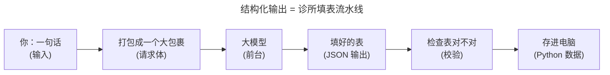

---

## 三、核心原理：请求体 = 三块并列的大包裹

**这一节是整篇文章的"地基"，三套代码都是同一个原理的不同写法。先把它立起来。**

普通聊天时，发给大模型的包裹里**只有你说的一句话**。
结构化输出时，包裹里**多出两块东西**，和你说的话**并排**放在一起：

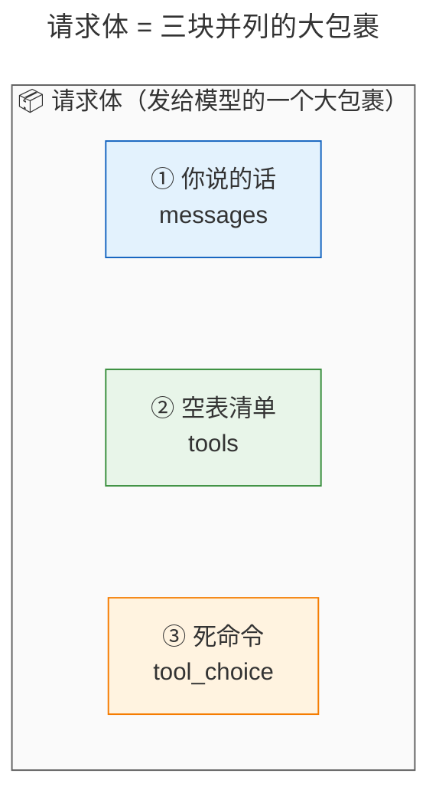

**注意"并排"两个字，这是全文最关键的认知：**

- 三块字段是**平级的**，谁也不在谁里面。
- `tools` 和 `tool_choice` 不塞进你说的话里，而是和你说的话**平行**放在请求体顶层。
- 正因为它们平行，才会出现"提示词一个字没改，模型却也看到了表格"。

真实发给模型的请求体长这样（三块并列，请盯住 `messages` / `tools` / `tool_choice`）：

```json
{
  "model": "glm-5.2",
  "messages": [
    {"role": "user", "content": "患者张三，32岁，因发热咳嗽就诊……"}
  ],
  "temperature": 0.7,
  "max_tokens": 20000,
  "tools": [
    {
      "type": "function",
      "function": {
        "name": "PatientRecord",
        "description": "自由文本 -> 结构化病历抽取的演示 Schema。",
        "parameters": {
          "type": "object",
          "additionalProperties": false,
          "required": ["name", "age", "symptoms", "risk_level"],
          "properties": {
            "name":       {"type": "string"},
            "age":        {"type": "integer"},
            "symptoms":   {"type": "array", "items": {"type": "string"}},
            "risk_level": {"type": "string", "enum": ["low", "medium", "high"]},
            "contact":    {"type": ["object", "null"],
                           "properties": {"email": {"type": ["string", "null"]},
                                          "phone": {"type": ["string", "null"]}}}
          }
        }
      }
    }
  ],
  "tool_choice": {"type": "function", "function": {"name": "PatientRecord"}}
}
```

### 3.1 拆开第一块：messages = 提示词（你说的话）

`messages` 就是你打给大模型的那句话，里面装着你要处理的信息。`content` 是其中每条消息的文本。

```
患者张三，32岁，因发热咳嗽就诊，症状持续三天，评估为高风险，联系电话13800000000。
```

> **关键认知**：在 function_calling 通道下，这句提示词**从头到尾一个字都没被改**。
> 表格（schema）不是拼接在这句话后面的，而是走另一条通道（`tools`）平行送进去的。这就是"提示词零改动"。

### 3.2 拆开第二块：tools = 空表清单

`tools` 里装的，是你要大模型照着填的"空表"。它告诉大模型：**有这些表格可以用**。

```json
{
  "type": "function",
  "function": {
    "name": "PatientRecord",                  // 表的名字：病历表
    "description": "自由文本 -> 结构化病历抽取", // 这表干嘛用的
    "parameters": {                           // 表上印了哪些格子
      "type": "object",
      "required": ["name", "age", "symptoms", "risk_level"],  // 必须填的格子
      "properties": {
        "name":       {"type": "string"},                 // 姓名：填文字
        "age":        {"type": "integer"},                // 年龄：填数字
        "symptoms":   {"type": "array", "items": {"type": "string"}},  // 症状：一串文字
        "risk_level": {"type": "string", "enum": ["low", "medium", "high"]}, // 只能三选一
        "contact":    {"type": ["object", "null"]}        // 可填可不填
      }
    }
  }
}
```

> 注意"风险等级"那一格写着 `enum: low / medium / high`——意思是**只能从这三个里挑一个**，
> 不许自己发明一个 "SEVERE"。这就是表格在管着大模型。

这张表不是手写的，而是**从一个 Python 类（Pydantic `BaseModel`）自动生成的**——大块一会展开。

### 3.3 拆开第三块：tool_choice = 死命令

光给大模型一张表还不够——它可能偷懒，不交填好的表，反而像聊天一样随便说两句。
所以还要下一条**命令**：**你必须用这张表！**

```json
{
  "type": "function",
  "function": {"name": "PatientRecord"}
}
```

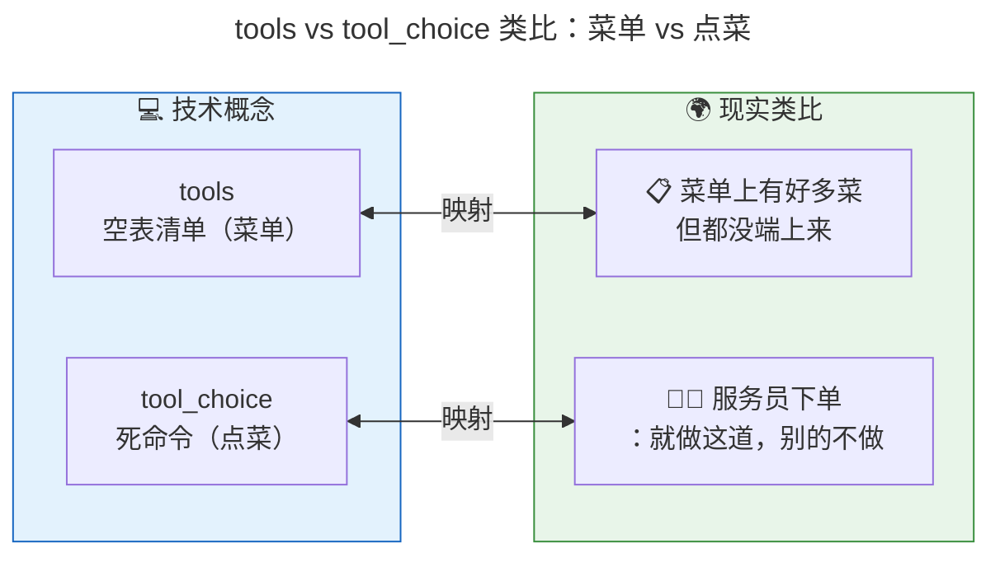

**三块连起来一句话记住：**

| 字段 | 大白话 | 负责什么 |
|---|---|---|
| messages（提示词） | 你说的话 | 提供信息 |
| tools | 空表清单（菜单） | 告诉大模型"要填这张表" |
| tool_choice | 死命令（点菜） | 锁死大模型必须填表，不许闲聊 |

### 3.4 原理一：模型为什么"看到"了表格？（tools 通道）

最常见的疑问：**模型知道需要哪些字段，是提示词里写了什么？还是它继承了 Python 的 BaseModel？**
——**两个答案都不对。** 完整链路是这样：

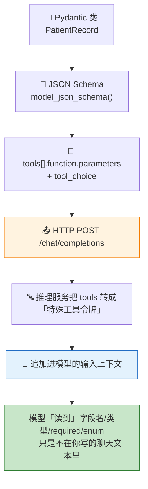

1. **"继承了 BaseModel" 只是客户端侧的 Python 类型安全**。它让 `model_json_schema()` 能产出
   schema、让 `model_validate()` 能校验结果。它**不会**让模型知道任何东西——模型只知道协议层
   送进去的 token。`BaseModel` 在链路两端各用一次：前头产出 schema 喂给 API，后头校验返回结果；
   中间只有纯 JSON 往返，没有 Python 对象。
2. **"提示词层面处理"也不是主因**。function_calling 通道下，你写的 `messages` 文本**一个字都没变**。
   schema 是走 `tools` 通道**平行**送进去的，所以才有"提示词零改动"。
3. 推理服务收到请求后，会把 `tools` 里每个函数的 name/description/parameters **转成特殊工具令牌，
   追加进模型的输入上下文**（和 messages 一起）。所以模型**确实读到了** `PatientRecord` 的全部字段
   ——只是它不在你写的聊天文本里。

> 反过来说：如果你不发 `tools`（比如 json_mode 通道），模型输入上下文里**没有任何字段定义**，
> 模型根本不知道 `PatientRecord` 长什么样，你必须把 schema 文本**自己写进提示词**。

### 3.5 原理二：模型为什么"返回 JSON"？（函数调用协议）

即使模型"看到"了表格，它凭什么输出合法 JSON？答案在**工具调用协议的输出格式**：

1. `tool_choice` 强制模型**必须发起一次对 `PatientRecord` 的工具调用**，不能自由发挥聊天文本。
2. 工具调用协议的输出格式规定：`tool_calls[].function.arguments` **必须是一个符合该函数
   `parameters` schema 的 JSON 字符串**。
3. 模型在训练（指令微调 + 工具调用数据）时**内化了这个契约**。

于是模型返回长这样：

```json
{
  "choices": [{
    "message": {
      "role": "assistant",
      "content": null,
      "tool_calls": [{
        "id": "call_xxx",
        "type": "function",
        "function": {
          "name": "PatientRecord",
          "arguments": "{\"name\":\"张三\",\"age\":32,\"symptoms\":[\"发热\",\"咳嗽\"],\"risk_level\":\"high\"}"
        }
      }]
    }
  }]
}
```

**重点看 `arguments` 这个字段**：它是一整个**字符串**，里面是符合 schema 的 JSON。

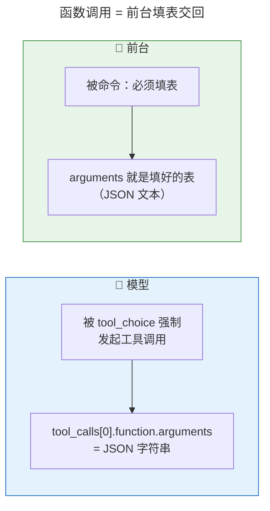

**"返回 JSON"是协议输出格式的必然结果**，不是模型即兴发挥。
但这是**条件概率**：模型仍可能填错枚举（`risk_level: "SEVERE"`）、漏必填字段（`name` 缺失）、
把数字输出成字符串（`age: "32"`）。所以协议只保证"**是** JSON、大体符合 schema"——
**是否符合你的 schema，最终防线永远在你自己的校验层**。

> 这是整篇文章最重要的一句话：
> **模型侧尽力而为（协议只保证"是 JSON"），校验层是硬保证（符不符合你的表由你兜底）。**

### 3.6 两条返回通道：tool_calls 和 content

模型返回 JSON 有两条通道，取决于你用哪种 `method`：

| method | JSON 从哪拿 | 说明 |
|---|---|---|
| `function_calling` | `tool_calls[0].function.arguments` | 强制工具调用，schema 走 tools 通道，提示词零改动 |
| `json_mode` | `content`（文本） | 只要求"输出合法 JSON"，schema 要自己写进 prompt |

所以**客户端取 JSON 的代码**要两个都找：先看 `tool_calls`，没有再退到 `content`。

---

## 四、大块一：LangChain 多文件版（先看最完整的分层）

**这一版是生产用法，按职责拆成几个小文件，每一层只干一件事。** 先看懂每层负责什么，
后面两个版本就是把它"压扁"和"去壳"。

### 4.1 文件地图

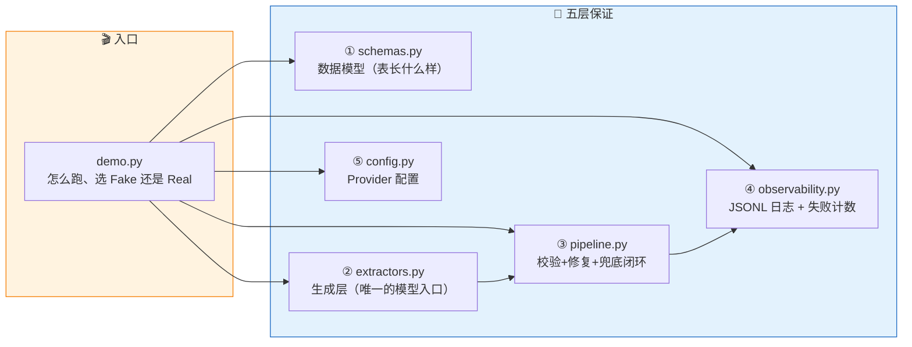

| 文件 | 角色 | 大白话 |
|---|---|---|
| [schemas.py](https://github.com/kunge2013/LangChainBestPractices/blob/main/python/src/structured_output/schemas.py) | 数据模型 | 规定"病历表"长什么样 |
| [config.py](https://github.com/kunge2013/LangChainBestPractices/blob/main/python/src/structured_output/config.py) | 配置 | 告诉程序用哪个模型、走哪个接口 |
| [extractors.py](https://github.com/kunge2013/LangChainBestPractices/blob/main/python/src/structured_output/extractors.py) | 生成层 | 唯一碰模型的地方：把 prompt 变成 JSON 字符串 |
| [pipeline.py](https://github.com/kunge2013/LangChainBestPractices/blob/main/python/src/structured_output/pipeline.py) | 闭环核心 | 生成 → 校验 → 重试 → 兜底 |
| [observability.py](https://github.com/kunge2013/LangChainBestPractices/blob/main/python/src/structured_output/observability.py) | 观测 | 记日志、数失败率 |
| [demo.py](https://github.com/kunge2013/LangChainBestPractices/blob/main/python/src/structured_output/demo.py) | 入口 | 演示怎么跑、选假模型还是真模型 |

### 4.2 ① 数据模型：schemas.py —— 表长什么样

```python
# [AGC:START] tool=Cc author=fangkun
from enum import Enum
from pydantic import BaseModel, ConfigDict, Field

class RiskLevel(str, Enum):
    """枚举字段：模型输出 "SEVERE" 这类非法取值会触发校验失败。"""
    LOW = "low"
    MEDIUM = "medium"
    HIGH = "high"

class ContactInfo(BaseModel):
    """嵌套模型：演示对象嵌套校验。"""
    model_config = ConfigDict(extra="forbid")
    email: str | None = None
    phone: str | None = None

class PatientRecord(BaseModel):
    """自由文本 -> 结构化病历抽取的演示 Schema。"""
    model_config = ConfigDict(extra="forbid")
    name: str = Field(strict=True)
    age: int = Field(strict=True)
    symptoms: list[str]
    risk_level: RiskLevel
    contact: ContactInfo | None = None
# [AGC:END]
```

**逐行翻译成表格**（每个 Python 元素变成发给模型的什么）：

| Pydantic 元素 | JSON Schema 产物 | 是否发给模型 |
|---|---|---|
| `class PatientRecord` | `function.name = "PatientRecord"` | ✓ |
| 类 docstring | `function.description` | ✓ |
| `ConfigDict(extra="forbid")` | `additionalProperties: false`（多输出字段即非法） | ✓ |
| `name: str` / `age: int` | `"type": "string"` / `"integer"` | ✓ |
| `symptoms: list[str]` | `"type":"array","items":{"type":"string"}` | ✓ |
| `risk_level: RiskLevel` | `"enum": ["low","medium","high"]` | ✓ |
| `contact: ContactInfo \| None = None` | `"anyOf":[...,{"type":"null"}]` | ✓ |
| 必填字段 name/age/symptoms/risk_level | `parameters.required` | ✓ |
| `Field(strict=True)` | **无**——strict 只影响客户端校验 | ✗ |

> 两个容易误会的点：
> 1. **`strict=True` 不会发给模型**。它只影响你自己这边用 `model_validate()` 校验时要不要严格转换
>    类型，是"本地执法"，不是"模型约束"。
> 2. **`extra="forbid"` 会发给模型**。它变成 `additionalProperties: false`，意思是"表格上没有的
>    栏不许填"——模型多输出一个字段都算失败。

### 4.3 ② 生成层：extractors.py —— 唯一碰模型的地方

生成层把「模型输出」规范化为「JSON 字符串」，供后面的校验层用。**它假装自己是假的也行**——
`FakeExtractor` 离线模拟四种行为，让整个闭环不需要 API key 就能演示。

```python
# [AGC:START] tool=Cc author=fangkun
from dataclasses import dataclass
from langchain_core.messages import BaseMessage

@dataclass
class RawResult:
    """抽取结果：json_str 为可解析的 JSON 字符串；为空时 note 说明原因。"""
    json_str: str | None
    note: str = ""
    raw_message: dict | None = None

class RealExtractor:
    """用 LangChain 1.x 的 with_structured_output() 产出结构化响应。"""

    def __init__(self, llm: BaseChatModel, schema: type[BaseModel], method: str) -> None:
        self.method = method
        # include_raw=True：保留原始消息，由本包自己负责最终严格校验
        self._runnable = llm.with_structured_output(schema, method=method, include_raw=True)

    def extract(self, text: str) -> RawResult:
        res: dict[str, Any] = self._runnable.invoke(text)
        raw: BaseMessage | None = res.get("raw")
        if raw is None:
            return RawResult(None, "无原始输出", None)
        json_str, note = self._pick_json(raw)
        return RawResult(json_str, note, _serialize_message(raw))

    @staticmethod
    def _pick_json(raw: BaseMessage) -> tuple[str | None, str]:
        """从 AIMessage 里提取 JSON：function_calling 取 tool_calls[0].args，否则取 content。"""
        tool_calls = getattr(raw, "tool_calls", None)
        if tool_calls:
            args = tool_calls[0].get("args") if isinstance(tool_calls[0], dict) else None
            if isinstance(args, dict) and args:
                return json.dumps(args, ensure_ascii=False), ""
        content = getattr(raw, "content", None)
        if isinstance(content, str) and content.strip():
            body = _strip_json(content)
            if body:
                return body, ""
            return None, "content 中未找到 JSON 对象"
        return None, "模型未返回工具调用或文本内容"
# [AGC:END]
```

**大白话翻译 `_pick_json`（对应 §3.6 的两条返回通道）：**

1. 先看模型的输出里有没有 `tool_calls`（走了函数调用通道）→ 有就把 `arguments` 里的 JSON 拿出来。
2. 没有就看看 `content`（走了文本通道）→ 有就抠出 JSON。
3. 两个都没有 → 返回失败说明，交给后面的重试。

**`with_structured_output(schema, method=method, include_raw=True)` 一句话讲透：**

- `with_structured_output` 是 LangChain 1.x 的首选 API：一条调用同时完成「把 Pydantic 类转成 schema 塞进 tools」+「强制 tool_choice」+「解析返回」。
- `include_raw=True`：**保留原始 AIMessage**，让校验权握在自己手里，而不是让框架解析完只给你一个实例。

### 4.4 ③ 闭环核心：pipeline.py —— 生成 → 校验 → 重试 → 兜底

这是"最小可靠闭环"的心脏。**模型是概率机器，会填错，所以必须有一层层的检查与补救。**

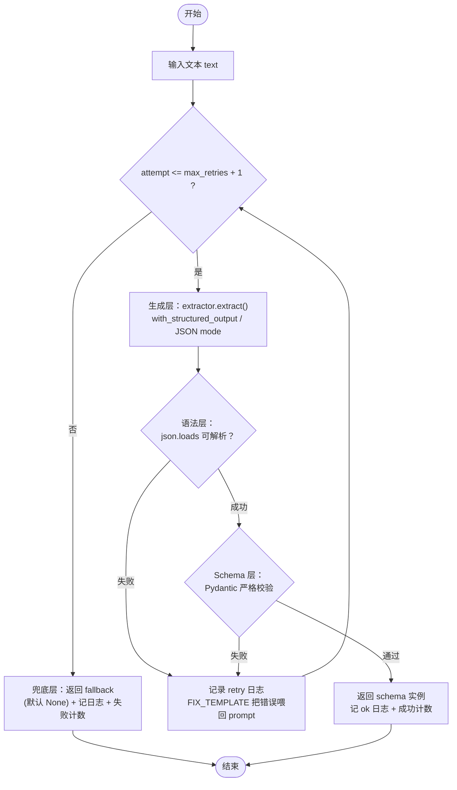

```python
# [AGC:START] tool=Cc author=fangkun
FIX_TEMPLATE = (
    "\n\n【上一次输出未通过校验，请仅修复以下错误并重新输出 JSON】\n{error}"
)

class StructuredOutputPipeline:
    """把任意『文本 -> JSON 字符串』抽取器包装成带保证的闭环。"""

    def __init__(self, extractor, schema, *, max_retries=2, fallback=None,
                 logger=None, counter=None, provider="unknown", model="unknown", method="unknown"):
        self.extractor = extractor
        self.schema = schema
        self.max_retries = max_retries
        self.fallback = fallback               # 兜底实例；默认 None
        self.logger = logger or JsonlLogger()
        self.counter = counter or FailureCounter()
        self._meta = {"provider": provider, "model": model, "method": method}

    def invoke(self, text: str) -> tuple[BaseModel | None, Attempt]:
        request_id = uuid.uuid4().hex[:12]
        started = time.perf_counter()
        errors: list[str] = []
        last_prompt, last_raw = text, RawResult(None, "")

        for attempt in range(1, self.max_retries + 2):
            prompt = text if attempt == 1 else text + FIX_TEMPLATE.format(error=errors[-1])
            last_prompt, last_raw = prompt, self.extractor.extract(prompt)
            try:
                obj = self._validate(last_raw)
            except (json.JSONDecodeError, ValidationError, ValueError) as exc:
                errors.append(f"{type(exc).__name__}: {exc}")
                self._emit(request_id, attempt, "retry", errors[-1], last_prompt, last_raw, None)
                continue
            latency_ms = int((time.perf_counter() - started) * 1000)
            self.counter.record(ok=True, attempts_used=attempt)
            self._emit(request_id, attempt, "ok", "", last_prompt, last_raw, obj.model_dump())
            return obj, Attempt(request_id, "ok", attempt, errors, latency_ms)

        latency_ms = int((time.perf_counter() - started) * 1000)
        self.counter.record(ok=False, attempts_used=self.max_retries + 1)
        last = errors[-1] if errors else "重试耗尽"
        self._emit(request_id, self.max_retries + 1, "fallback", last, last_prompt, last_raw, None)
        return self.fallback, Attempt(request_id, "fallback", self.max_retries + 1, errors, latency_ms)

    def _validate(self, raw: RawResult) -> BaseModel:
        """语法层 + schema 层：缺 JSON / 解析失败 / Pydantic 严格校验失败都抛错。"""
        if not raw.json_str:
            raise ValueError(raw.note or "模型未返回可解析的 JSON")
        data = json.loads(raw.json_str)                       # 语法层
        return self.schema.model_validate(data)               # schema 层
# [AGC:END]
```

**五层保证逐一解释：**

| 层 | 大白话 | 代码位置 | 失败后果 |
|---|---|---|---|
| ① 数据模型 | 规定"表"长什么样 | [schemas.py](https://github.com/kunge2013/LangChainBestPractices/blob/main/python/src/structured_output/schemas.py) | —— |
| ② 生成层 | 唯一碰模型：把 prompt 变成 JSON 字符串 | [extractors.py](https://github.com/kunge2013/LangChainBestPractices/blob/main/python/src/structured_output/extractors.py) | 产出 `RawResult(None, 原因)` |
| ③ 校验层 | `json.loads`（语法层）+ `model_validate`（schema 层） | [pipeline.py:_validate](https://github.com/kunge2013/LangChainBestPractices/blob/main/python/src/structured_output/pipeline.py) | 抛错 → 进入重试 |
| ④ 修复层 | 把校验错误喂回 prompt，让模型自纠正 | `FIX_TEMPLATE` | 重试次数可配 |
| ⑤ 兜底+观测 | 重试耗尽返回 None；JSONL 日志 + 失败计数 | [pipeline.py](https://github.com/kunge2013/LangChainBestPractices/blob/main/python/src/structured_output/pipeline.py) + [observability.py](https://github.com/kunge2013/LangChainBestPractices/blob/main/python/src/structured_output/observability.py) | 宁缺毋滥 |

**为什么重试真能救回失败？** 有一次真实观测：attempt=1 模型回了纯文本澄清（没走 tool call）→
语法层拦截 `ValueError: content 中未找到 JSON 对象`；attempt=2 带上这条错误重发，模型这次乖乖
输出合法 JSON。**重试不是撞运气，而是把失败原因变成了下一轮的有效输入。**

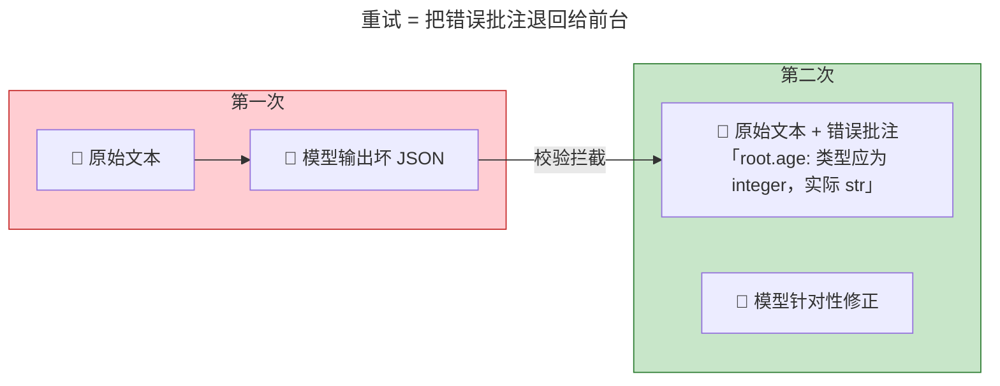

### 4.5 ④ 观测：observability.py —— 让失败可见

纯标准库，不需要任何云端 key 也能常开。每次调用写一条 JSONL + 进程内失败率计数。

```python
# [AGC:START] tool=Cc author=fangkun
from pathlib import Path

DEFAULT_LOG_PATH = Path(__file__).resolve().parent / "logs" / "structured_output.jsonl"

class JsonlLogger:
    """以 append 方式写 JSONL，一次调用写一条，避免多进程互相覆盖。"""
    def __init__(self, path: str | Path | None = None) -> None:
        self.path = Path(path or os.environ.get("STRUCTURED_OUTPUT_LOG", DEFAULT_LOG_PATH))

    def log(self, record: dict[str, Any]) -> None:
        self.path.parent.mkdir(parents=True, exist_ok=True)
        line = json.dumps(record, ensure_ascii=False, default=str)
        with self.path.open("a", encoding="utf-8") as f:
            f.write(line + "\n")

class FailureCounter:
    """进程内指标：总调用 / 成功 / 最终失败 / 重试次数。"""
    def __init__(self) -> None:
        self.total = 0; self.ok = 0; self.failed = 0; self.retries_used = 0

    def record(self, *, ok: bool, attempts_used: int) -> None:
        self.total += 1
        self.retries_used += attempts_used - 1
        if ok: self.ok += 1
        else: self.failed += 1

    def summary(self) -> dict[str, Any]:
        rate = (self.ok / self.total * 100.0) if self.total else 0.0
        return {"total": self.total, "ok": self.ok, "failed": self.failed,
                "retries_used": self.retries_used, "success_rate_%": round(rate, 2)}
# [AGC:END]
```

一条日志长这样（完整轨迹：完整 prompt / 原始 JSON / 错误 / 解析结果）：

```json
{"ts": "2026-09-09T14:01:50+0800", "request_id": "bfc4573d9bc0", "status": "retry",
 "attempt": 1, "max_retries": 2,
 "error": "ValueError: content 中未找到 JSON 对象",
 "prompt": "一个发烧的病人。",
 "raw_json": null,
 "parsed": null,
 "provider": "deepseek", "model": "deepseek-v4-flash", "method": "function_calling"}
```

### 4.6 ⑤ Provider 配置：config.py —— 两个模型的坑都在这里

deepseek 和 qwen 都走 OpenAI 兼容接口，用 `ChatOpenAI` 统一建模。**最大的坑是 qwen 的 thinking 模式**：

- qwen 系列**默认开启 thinking**，thinking 模式下 API 只允许 `tool_choice="auto"`，而结构化输出
  强制指定工具 → 触发 400 错误。
- **解法：显式关闭 thinking** `extra_body={"enable_thinking": False}`。

```python
# [AGC:START] tool=Cc author=fangkun
# [config.py](https://github.com/kunge2013/LangChainBestPractices/blob/main/python/src/structured_output/config.py)
from langchain_openai import ChatOpenAI

PROVIDERS: dict[str, dict[str, Any]] = {
    "qwen": {
        "base_url": "https://coding.dashscope.aliyuncs.com/v1",
        "model": "qwen3.6-plus",
        # qwen 系列默认开启 thinking，会限制 tool_choice 导致结构化输出 400 错误，必须显式关闭
        "extra_body": {"enable_thinking": False},
    },
    "deepseek": {
        "base_url": "https://api.deepseek.com",
        "model": "deepseek-v4-flash",
        "extra_body": None,
    },
}

def build_chat_model(provider: str = "auto") -> ChatOpenAI:
    """构建指向 OpenAI 兼容接口的 ChatOpenAI；env 变量可覆盖 provider 默认值。"""
    name = resolve_provider(provider)
    cfg = PROVIDERS[name]
    max_tokens = os.environ.get("OPENAI_MAX_TOKENS")
    return ChatOpenAI(
        model=os.environ.get("OPENAI_MODEL", cfg["model"]),
        base_url=os.environ.get("OPENAI_BASE_URL", cfg["base_url"]),
        api_key=os.environ.get("OPENAI_API_KEY"),
        temperature=float(os.environ.get("OPENAI_TEMPERATURE", "0")),
        max_tokens=int(max_tokens) if max_tokens else None,
        **(cfg["extra_body"] or {}),
    )
# [AGC:END]
```

> ⚠️ **版本坑**：langchain-openai **1.4+ 的 `with_structured_output` 不传 `method` 时，默认已是
> `json_schema`**（不再是 0.x 的 `function_calling`）。而 `json_schema` 严格模式仅
> OpenAI/Claude/Gemini 支持，deepseek/qwen 收到会直接 400。**deepseek/qwen 必须显式传
> `method="function_calling"`（最稳）或 `"json_mode"`。**

### 4.7 ⑥ 入口：demo.py —— 怎么跑

demo.py 最重要的作用是演示「怎么切换 Fake / Real」：**生产/测试切换 = 换构造函数的实参**，
pipeline 内部零改动。

```python
# [AGC:START] tool=Cc author=fangkun
def run_fake_demo() -> None:
    """四种脚本化行为，完整演示成功 / 自修复 / 兜底 / 无 JSON 四条路径。"""
    for mode in ("good", "retry_once", "hopeless", "nojson"):
        counter = FailureCounter()
        pipeline = StructuredOutputPipeline(
            FakeExtractor(mode), PatientRecord,
            max_retries=2, logger=JsonlLogger(), counter=counter,
            provider="fake", model=f"fake:{mode}", method="fake",
        )
        print(f"\n############ 假模型模式：{mode} ############")
        for label, text in SAMPLE_TEXTS.items():
            _run_case(pipeline, label, text)
        print(f"\n计数: {counter.summary()}")

def run_real_demo(provider: str, method: str) -> None:
    """真实调用：走 with_structured_output + 校验 / 重试 / 兜底闭环。"""
    cfg = PROVIDERS[resolve_provider(provider)]
    llm = build_chat_model(provider)
    pipeline = StructuredOutputPipeline(
        RealExtractor(llm, PatientRecord, method), PatientRecord,
        max_retries=2, logger=JsonlLogger(), counter=FailureCounter(),
        provider=resolve_provider(provider), model=cfg["model"], method=method,
    )
    for label, text in SAMPLE_TEXTS.items():
        _run_case(pipeline, label, text)
# [AGC:END]
```

**运行命令：**

```bash
# 离线演示（无需 API key）：四种假模型剧本
cd python && python -m src.structured_output.demo --fake

# 离线自检（验证真实 extractor 能构造）
python -m src.structured_output.demo --self-check

# 真实调用
python -m src.structured_output.demo --provider qwen --method function_calling
python -m src.structured_output.demo --provider deepseek --method json_mode
```

**四种假模型剧本**（`FakeExtractor` 离线模拟，跑通闭环所有分支）：

| 剧本 | 模拟的失败形态 | 闭环行为 | 结果 |
|---|---|---|---|
| `good` | 模型正常 | 1 次成功 | `ok, attempts=1` |
| `retry_once` | 缺必填 + 类型错 + 枚举非法 | 第 1 次失败 → 错误喂回 → 第 2 次成功 | `ok, attempts=2` |
| `hopeless` | 永远输出坏 JSON | 重试 2 次仍失败 → 兜底 | `fallback, None` |
| `nojson` | 返回纯文本（无 JSON） | 语法层失败 → 重试 → 兜底 | `fallback, None` |

---

## 五、大块二：LangChain 单文件版（同一套逻辑，平铺一个文件）

**这一版把大块一的多文件逻辑压缩到一个文件 `simple_onefile.py`**，去掉跨文件抽象，
五层保证从上到下平铺，注释最细——非常适合对照着读懂"每一层到底干了什么"。

### 5.1 和大块一的关系

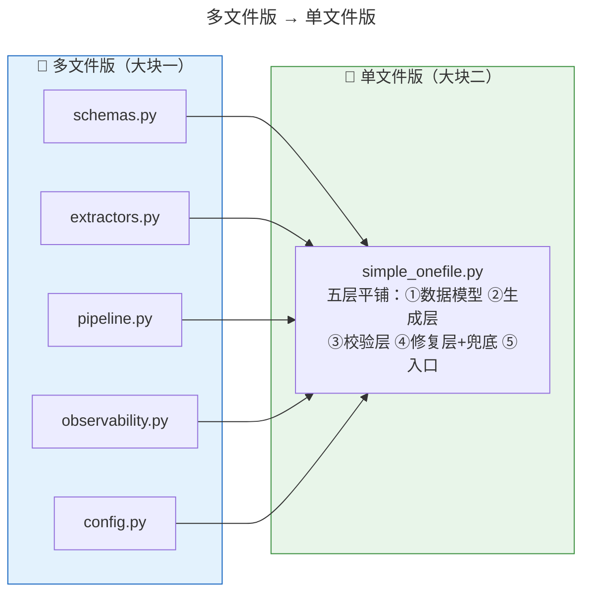

### 5.2 完整代码（逐段讲解）

**① 数据模型：和 `schemas.py` 一模一样** —— 表长什么样，三套代码完全一致。

```python
# [AGC:START] tool=Cc author=fangkun
# ═════════════════════════════════════════════════════════════════
# ① 数据模型：模型要输出的结构。
#    类名 -> function.name；类 docstring -> function.description；
#    字段类型 -> JSON Schema type；枚举 -> enum；| None -> anyOf(..., null)。
#    extra="forbid" -> additionalProperties:false（模型多输出字段即判失败）
#    Field(strict=True) 只影响客户端校验，不会发给模型。
# ═════════════════════════════════════════════════════════════════
class RiskLevel(str, Enum):
    """枚举字段：模型输出 "SEVERE" 这类非法取值会触发校验失败。"""
    LOW = "low"
    MEDIUM = "medium"
    HIGH = "high"

class ContactInfo(BaseModel):
    """嵌套模型：演示对象嵌套校验。"""
    model_config = ConfigDict(extra="forbid")
    email: str | None = None
    phone: str | None = None

class PatientRecord(BaseModel):
    """自由文本 -> 结构化病历抽取的演示 Schema。"""
    model_config = ConfigDict(extra="forbid")
    name: str = Field(strict=True)
    age: int = Field(strict=True)
    symptoms: list[str]
    risk_level: RiskLevel
    contact: ContactInfo | None = None
# [AGC:END]
```

**② 生成层：`extract_real`** —— 和大块一 `RealExtractor._pick_json` 是同一段逻辑，
只是这里平铺成普通函数。关键还是 `with_structured_output(method=..., include_raw=True)`，
取 JSON 依然「先看 `tool_calls`，再退 `content`」。

```python
# [AGC:START] tool=Cc author=fangkun
def _strip_json(content: str) -> str | None:
    """从文本里抠出第一个 JSON 对象，容忍 ```json 围栏和前导文本。"""
    text = content.strip()
    if text.startswith("```"):
        first, last = text.find("\n"), text.rfind("```")
        if first != -1 and last != -1 and last > first:
            text = text[first + 1:last].strip()
    s, e = text.find("{"), text.rfind("}")
    return text[s:e + 1] if s != -1 and e != -1 and e > s else None

def extract_real(text: str, llm: Any) -> RawResult:
    """真实路径：with_structured_output(include_raw=True) 保留原始消息。
    JSON 从 tool_calls[0].args（function_calling）或 content（json_mode）里取。"""
    res = llm.invoke(text)
    raw = res.get("raw")
    if raw is None:
        return RawResult(None, "无原始输出")
    tc = getattr(raw, "tool_calls", None)
    if tc:
        args = tc[0].get("args") if isinstance(tc[0], dict) else None
        if isinstance(args, dict) and args:
            return RawResult(json.dumps(args, ensure_ascii=False))
    content = getattr(raw, "content", None)
    if isinstance(content, str) and content.strip():
        body = _strip_json(content)
        if body:
            return RawResult(body)
        return RawResult(None, "content 中未找到 JSON 对象")
    return RawResult(None, "模型未返回工具调用或文本内容")
# [AGC:END]
```

**③ 校验层：`validate`** —— 语法层 `json.loads` + Schema 层 Pydantic 严格校验，
任何一层失败都抛错交给重试。

```python
# [AGC:START] tool=Cc author=fangkun
def validate(raw: RawResult, schema: type[BaseModel]) -> BaseModel:
    if not raw.json_str:
        raise ValueError(raw.note or "模型未返回可解析的 JSON")
    data = json.loads(raw.json_str)      # 语法层
    return schema.model_validate(data)   # Schema 层（strict 由 Field 控制）
# [AGC:END]
```

**④ 修复层 + ⑤ 兜底层：`run_pipeline`** —— 与 `pipeline.py` 的 `invoke` 完全同构。
注意这里刻意演示了「观测与流程解耦」：流程里只把日志**攒成变量**（纯数据，不碰 IO），
流程结束后才**统一落盘**。

```python
# [AGC:START] tool=Cc author=fangkun
FIX_TEMPLATE = "\n\n【上一次输出未通过校验，请仅修复以下错误并重新输出 JSON】\n{error}"

def run_pipeline(text: str, extract, schema: type[BaseModel], *,
                 max_retries: int = 2, fallback: BaseModel | None = None):
    """返回 (解析结果 | fallback, 实际尝试次数, 错误列表, 日志记录列表)。"""
    errors: list[str] = []
    records: list[dict] = []              # 日志先攒在这，流程跑完再统一写出
    last_prompt, last_raw = text, RawResult(None, "")
    for attempt in range(1, max_retries + 2):
        # attempt=1 用原始文本；重试则追加错误反馈（修复层）
        last_prompt = text if attempt == 1 else text + FIX_TEMPLATE.format(error=errors[-1])
        last_raw = extract(last_prompt)
        try:
            obj = validate(last_raw, schema)
        except (json.JSONDecodeError, ValueError) as exc:   # 语法层 / Schema 层失败
            errors.append(f"{type(exc).__name__}: {exc}")
            records.append(_record(attempt, "retry", last_prompt, last_raw, None, errors[-1]))
            continue
        records.append(_record(attempt, "ok", last_prompt, last_raw, obj.model_dump(), ""))
        write_records(records)            # 流程结束，统一落盘
        return obj, attempt, errors, records
    # 重试耗尽：兜底层（fallback 可配置，默认 None）
    last = errors[-1] if errors else "重试耗尽"
    records.append(_record(max_retries + 1, "fallback", last_prompt, last_raw, None, last))
    write_records(records)                # 流程结束，统一落盘
    return fallback, max_retries + 1, errors, records

def _record(attempt: int, status: str, prompt: str, raw: RawResult,
            parsed: dict | None, error: str) -> dict:
    """单条日志 = 纯数据（不碰 IO）：完整 prompt / 原始 JSON / 解析结果 / 错误。"""
    return {
        "ts": time.strftime("%Y-%m-%dT%H:%M:%S%z"),
        "request_id": uuid.uuid4().hex[:12],
        "status": status, "attempt": attempt, "error": error[:400],
        "prompt": prompt, "raw_json": raw.json_str, "parsed": parsed,
    }

def write_records(records: list[dict]) -> None:
    """把攒好的日志统一写入 JSONL：IO 与流程完全分离。"""
    os.makedirs(os.path.dirname(LOG_FILE), exist_ok=True)
    with open(LOG_FILE, "a", encoding="utf-8") as f:
        for rec in records:
            f.write(json.dumps(rec, ensure_ascii=False) + "\n")
# [AGC:END]
```

**⑥ 入口：`build_llm` + `main`** —— 关键坑在注释里：**必须显式传 `method="function_calling"`**，
因为 langchain-openai 1.4+ 默认已是 `json_schema`（deepseek/qwen 会 400）。

```python
# [AGC:START] tool=Cc author=fangkun
def build_llm() -> ChatOpenAI:
    base_url = os.environ.get("OPENAI_BASE_URL", "https://coding.dashscope.aliyuncs.com/v1")
    model = os.environ.get("OPENAI_MODEL", "qwen3.6-plus")
    # qwen 默认开 thinking，会限制 tool_choice 导致结构化输出 400，必须显式关
    extra = {"enable_thinking": False} if ("dashscope" in base_url or "qwen" in model.lower()) else None
    return ChatOpenAI(model=model, base_url=base_url,
                      api_key=os.environ.get("OPENAI_API_KEY"),
                      temperature=0, **(extra or {}))

def main() -> None:
    load_dotenv(override=True)
    # 必须显式传 method：langchain-openai 1.4+ 默认已是 json_schema（仅 OpenAI/Claude/Gemini
    # 支持），deepseek/qwen 不传会 400。function_calling 对二者最稳。
    llm = build_llm().with_structured_output(PatientRecord, method="function_calling", include_raw=True)
    extract = lambda t: extract_real(t, llm)

    for label, text in SAMPLES.items():
        print(f"\n=== {label} ===")
        obj, attempt, errors, records = run_pipeline(text, extract, PatientRecord, max_retries=2)
        print(f"attempts={attempt}  结果={obj.model_dump() if obj else None}")
        for err in errors:
            print(f"  [err] {err[:160]}")
# [AGC:END]
```

### 5.3 运行命令

```bash
cd python && python -m src.structured_output.simple_onefile
```

> **读懂这一版的价值**：你看到了 `schemas` / `extractors` / `pipeline` / `observability` 之间的
> 调用关系全部摊开在一个文件里。接下来大块三要做的，就是**把 LangChain 这层壳也脱掉**，
> 直接看请求体本身。

---

## 六、大块三：原生 Python 版（摊开请求体，看本质）

**这一版用纯标准库 `urllib` 直连 OpenAI 兼容接口，完全不依赖 LangChain。**
它把「发给模型的请求体」逐字节摊开在眼前——正是 §三 讲的原理原样可见，
让你彻底看清：`tools` / `tool_choice` 到底是怎么被拼进请求体的。

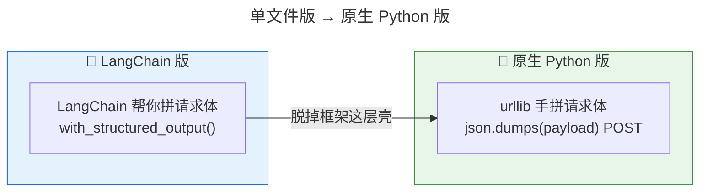

### 6.1 手写 SCHEMA：把 Pydantic 类翻译成纯 dict

这里不写 Pydantic 类，直接手写等价于 `PatientRecord.model_json_schema()` 的 dict：

```python
# [AGC:START] tool=Cc author=fangkun
SCHEMA = {
    "name": "PatientRecord",
    "description": "自由文本 -> 结构化病历抽取的演示 Schema。",
    "type": "object",
    "additionalProperties": False,
    "required": ["name", "age", "symptoms", "risk_level"],
    "properties": {
        "name": {"type": "string"},
        "age": {"type": "integer"},
        "symptoms": {"type": "array", "items": {"type": "string"}},
        "risk_level": {"type": "string", "enum": ["low", "medium", "high"]},
        "contact": {
            "type": ["object", "null"],
            "additionalProperties": False,
            "properties": {
                "email": {"type": ["string", "null"]},
                "phone": {"type": ["string", "null"]},
            },
        },
    },
}
# [AGC:END]
```

**对照 §三 的请求体 JSON**：`SCHEMA` 正是被塞进 `tools[].function.parameters` 的那一坨。

#### SCHEMA 的旅程：什么时候用到、会不会给大模型

先直接回答：**会。每次请求都发给大模型。** 而且 SCHEMA 在整条链路里**用了两次**——
前头当"约束"发给模型，后头当"裁判"校验结果。下面用**时序图**看整个过程，
**每一个箭头旁边都标着该阶段的提示词（prompt）内容**：

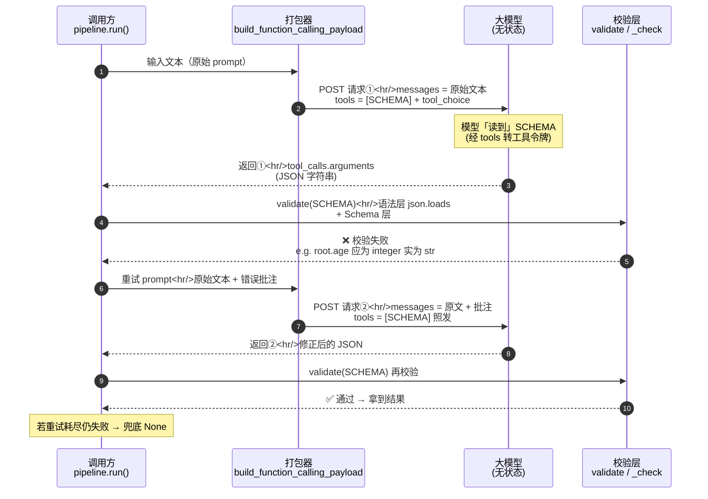

**每个阶段的完整 prompt 内容（对应时序图中的请求①/请求②）：**

| 阶段                 | 发给模型的 prompt（messages 内容）                                                                                                 | SCHEMA 发给模型？ |
| ------------------ | ------------------------------------------------------------------------------------------------------------------------- | ------------ |
| 请求①（时序图第 2~3 行）    | `患者张三，32岁，因发热咳嗽就诊，症状持续三天，评估为高风险，联系电话13800000000。`                                                                         | ✅ 在 tools 通道 |
| 请求②（时序图第 7~8 行，重试） | `患者张三，32岁，因发热咳嗽就诊，症状持续三天，评估为高风险，联系电话13800000000。`<br/>【上一次输出未通过校验，请仅修复以下错误并重新输出 JSON】<br/>`root.age: 类型应为 integer，实际 str` | ✅ 照发         |

**SCHEMA 的两个角色（同一份，两端各用一次）：**

| 时机           | SCHEMA 干什么                                 | 会不会给大模型                      |
| ------------ | ------------------------------------------ | ---------------------------- |
| ② 打包请求体（6.2） | 被塞进 `tools[].function.parameters`，作为"表"的约束 | ✅ **会**                      |
| ③ 发送请求（6.4）  | 随请求体一起发出去                                  | ✅ **就在这一步给**（经 tools → 工具令牌） |
| ④ 校验返回（6.5）  | 被 `_check(SCHEMA)` 当裁判，检查模型返回的 JSON        | ❌ 不再发（此时在本地当校验规则）            |
| 🔁 重试（6.6）   | 错误批注追加到 prompt，SCHEMA **照发**               | ✅ 重试的每次请求都再发一遍               |

> **关键认知**：大模型是无状态的，每次请求都要重新带上 `tools`（含 SCHEMA）。所以"发多少次请求，
> SCHEMA 就跟着进多少次"。模型侧只负责"尽量填对"，**符不符合表**由本地用同一份 SCHEMA 把关。

### 6.2 打包请求体：`tools` / `tool_choice` 怎么拼进去的（核心！）

这是全文最直白的证据——**`tools` 和 `tool_choice` 就是在这里被并排拼进请求体的**：

```python
# [AGC:START] tool=Cc author=fangkun
def _base_payload(text: str) -> dict:
    p = {"model": MODEL, "messages": [{"role": "user", "content": text}], "temperature": TEMPERATURE}
    if MAX_TOKENS:
        p["max_tokens"] = MAX_TOKENS
    if QWEN_THINKING_OFF:
        p["enable_thinking"] = False
    return p

def build_function_calling_payload(text: str) -> dict:
    """主通道：schema 装进 tools[].function.parameters，提示词零改动。"""
    p = _base_payload(text)
    p["tools"] = [{"type": "function", "function": {
        "name": SCHEMA["name"], "description": SCHEMA["description"], "parameters": SCHEMA}}]
    p["tool_choice"] = {"type": "function", "function": {"name": SCHEMA["name"]}}
    return p

def build_json_mode_payload(text: str) -> dict:
    """对照通道：不发 tools，schema 必须写进 prompt（且含 "JSON" 字样）。"""
    p = _base_payload(text)
    p["messages"] = [
        {"role": "system", "content": "你只输出合法 JSON，且必须符合以下 JSON Schema：\n"
                                      + json.dumps(SCHEMA, ensure_ascii=False)},
        {"role": "user", "content": text},
    ]
    p["response_format"] = {"type": "json_object"}
    return p
# [AGC:END]
```

**两个函数对比，一眼看懂两条通道的差异本质：**

| 打包方式 | messages 提示词 | tools | tool_choice | response_format | 模型侧行为 |
|---|---|---|---|---|---|
| `function_calling` | 零改动 | ✓ 装 schema | ✓ 强制 | 无 | 必须工具调用，JSON 在 `tool_calls[0].args` |
| `json_mode` | **必须自己把 schema 写进 system** | ✗ | ✗ | `{"type":"json_object"}` | 只保证合法 JSON，JSON 在 `content` |

> **json_mode 是唯一需要你在提示词里动手的通道**：它不发 `tools`，模型不知道 `PatientRecord`
> 长什么样，所以你必须手动把 schema 文本拼进 system 消息。而 function_calling 通道，你的提示词
> 一个字都不用动。

### 6.3 完整 prompt 长什么样：两种通道对照（理解的关键）

前面讲了打包逻辑，现在把**完整的 prompt** 摊开，亲眼看两种通道对"你说的话"动了什么手脚。
以下面这句输入为例：

```
患者张三，32岁，因发热咳嗽就诊，症状持续三天，评估为高风险，联系电话13800000000。
```

**function_calling 通道：完整请求体 —— messages 一字未动**

```json
{
  "model": "qwen3.6-plus",
  "messages": [
    {"role": "user", "content": "患者张三，32岁，因发热咳嗽就诊，症状持续三天，评估为高风险，联系电话13800000000。"}
  ],
  "temperature": 0,
  "enable_thinking": false,
  "tools": [
    {
      "type": "function",
      "function": {
        "name": "PatientRecord",
        "description": "自由文本 -> 结构化病历抽取的演示 Schema。",
        "parameters": {
          "type": "object",
          "additionalProperties": false,
          "required": ["name", "age", "symptoms", "risk_level"],
          "properties": {
            "name":       {"type": "string"},
            "age":        {"type": "integer"},
            "symptoms":   {"type": "array", "items": {"type": "string"}},
            "risk_level": {"type": "string", "enum": ["low", "medium", "high"]},
            "contact": {
              "type": ["object", "null"],
              "additionalProperties": false,
              "properties": {"email": {"type": ["string", "null"]},
                             "phone": {"type": ["string", "null"]}}
            }
          }
        }
      }
    }
  ],
  "tool_choice": {"type": "function", "function": {"name": "PatientRecord"}}
}
```

**盯住 `messages`**：它只有一条 `user`，`content` 就是你说的原文——**一个字都没改**。
表格 schema 全在平行的 `tools` 通道里，模型是通过「工具令牌」读到它的，这就是"提示词零改动"的完整证据。

**json_mode 通道：完整请求体 —— prompt 被改写了**

```json
{
  "model": "qwen3.6-plus",
  "messages": [
    {
      "role": "system",
      "content": "你只输出合法 JSON，且必须符合以下 JSON Schema：\n{\"name\": \"PatientRecord\", \"description\": \"自由文本 -> 结构化病历抽取的演示 Schema。\", \"type\": \"object\", \"additionalProperties\": false, \"required\": [\"name\", \"age\", \"symptoms\", \"risk_level\"], \"properties\": {\"name\": {\"type\": \"string\"}, \"age\": {\"type\": \"integer\"}, \"symptoms\": {\"type\": \"array\", \"items\": {\"type\": \"string\"}}, \"risk_level\": {\"type\": \"string\", \"enum\": [\"low\", \"medium\", \"high\"]}, \"contact\": {\"type\": [\"object\", \"null\"], \"additionalProperties\": false, \"properties\": {\"email\": {\"type\": [\"string\", \"null\"]}, \"phone\": {\"type\": [\"string\", \"null\"]}}}}}"
    },
    {"role": "user", "content": "患者张三，32岁，因发热咳嗽就诊，症状持续三天，评估为高风险，联系电话13800000000。"}
  ],
  "temperature": 0,
  "enable_thinking": false,
  "response_format": {"type": "json_object"}
}
```

**对比 `messages`**：多了 `system` 一条，它的 `content` 正是代码里那句
`"你只输出合法 JSON，且必须符合以下 JSON Schema：\n" + json.dumps(SCHEMA, ensure_ascii=False)`——
**整张表格被序列化成一长串文本，硬塞进了提示词**。因为 json_mode 不发 `tools`，模型上下文里
没有工具令牌，只能靠你把 schema 写进它"听到的话"里。

> 一句话对照：
> - function_calling：**prompt 零改动**，表格走 `tools` 通道平行送达。
> - json_mode：**prompt 被改写**，表格被序列化后写进 `system` 消息。

**重试时的完整 prompt（修复层）**

无论哪种通道，重试时 prompt 都会**在原文后面追加错误批注**（`FIX_TEMPLATE`）：

```
患者张三，32岁，因发热咳嗽就诊，症状持续三天，评估为高风险，联系电话13800000000。

【上一次输出未通过校验，请仅修复以下错误并重新输出 JSON】
root.age: 类型应为 integer，实际 str
```

模型看到的是**上一次具体的校验错误**，于是针对性修正——这就是 §4.4 讲的"重试 = 模型自纠正"。

#### 完整 prompt（模型视角）：SCHEMA 确实在模型输入里

"prompt"这个词有两个视角，理解它们，上面的困惑就没了：

| 视角 | 指什么 | SCHEMA 在吗？ |
|---|---|---|
| **请求体视角**（你发的） | `messages` 里的聊天文本 | ❌ 不在（SCHEMA 在平行的 `tools` 里） |
| **模型视角**（模型读的） | 模型的整个输入上下文 | ✅ **在**（工具令牌形式） |

function_calling 下，模型的完整输入上下文 = **聊天文本（提示令牌）+ 工具定义（工具令牌，SCHEMA 在这里）**：

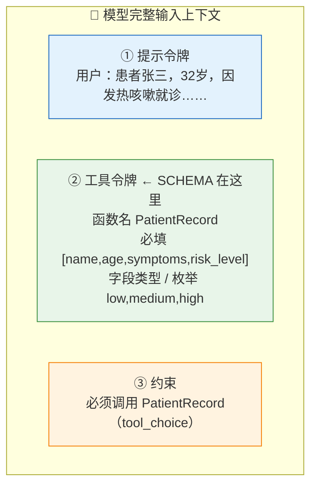

工具令牌具体展开（示意，推理服务内部把 `tools` 转成类似这样的定义喂给模型，各服务令牌格式略有差异）：

```
<工具: PatientRecord>
  描述: 自由文本 -> 结构化病历抽取的演示 Schema。
  参数:
    name:        字符串（必填）
    age:         整数（必填）
    symptoms:    字符串数组（必填）
    risk_level:  字符串，枚举：low / medium / high（必填）
    contact:     对象或 null：
                  email: 字符串或 null
                  phone: 字符串或 null
  额外字段: 禁止（additionalProperties: false）
</工具>

[约束] 你必须发起一次对 PatientRecord 的工具调用。
```

**结论（把两个视角钉在一起）：**

- 你**发**的 prompt（`messages`）**不含** SCHEMA——提示词零改动。
- 但模型**读到的完整输入含 SCHEMA**——经 `tools` 工具令牌送进去。
- 所以"SCHEMA 不在 prompt 里"与"完整 prompt 包含 SCHEMA"都对，只是"prompt"分别指**你发的文本**和**模型读的输入**。

### 6.4 发请求 + 取 JSON：urllib 直连

```python
# [AGC:START] tool=Cc author=fangkun
import urllib.request

def chat_completion(payload: dict) -> dict:
    """POST {BASE_URL}/chat/completions，返回 OpenAI 兼容的完整响应体。"""
    url = BASE_URL.rstrip("/") + "/chat/completions"
    req = urllib.request.Request(
        url,
        data=json.dumps(payload, ensure_ascii=False).encode("utf-8"),
        method="POST",
        headers={"Content-Type": "application/json", "Authorization": f"Bearer {API_KEY}"},
    )
    with urllib.request.urlopen(req, timeout=60) as resp:
        return json.loads(resp.read().decode("utf-8"))

def extract(payload: dict) -> RawResult:
    """发送请求，从响应里取 JSON：function_calling 在 tool_calls[0].args，json_mode 在 content。"""
    data = chat_completion(payload)
    msg = data["choices"][0]["message"]
    tc = msg.get("tool_calls")
    if tc:
        return RawResult(tc[0]["function"]["arguments"])
    content = msg.get("content") or ""
    if content.strip():
        body = _strip_json(content)
        if body:
            return RawResult(body)
        return RawResult(None, "content 中未找到 JSON 对象")
    return RawResult(None, "模型未返回工具调用或文本内容")
# [AGC:END]
```

**对照 §3.6**：`tc[0]["function"]["arguments"]` 正是函数调用协议规定的那段 JSON 字符串；
没有 tool_calls 就退到 `content` 抠 JSON——和大块一、二完全同一套逻辑。

### 6.5 校验层：手写 `_check()` 等价于 Pydantic 校验

没有 Pydantic，就用递归手写校验：必填字段、类型、枚举、禁多余字段。**注意 `type(value) is int`
这个写法——它用 `is` 排除 bool，因为 Python 里 `bool` 是 `int` 的子类。**

```python
# [AGC:START] tool=Cc author=fangkun
def _match_type(value, t: str) -> bool:
    if t == "string":  return isinstance(value, str)
    if t == "integer": return type(value) is int                      # type is 排除 bool
    if t == "number":  return isinstance(value, (int, float)) and not isinstance(value, bool)
    if t == "boolean": return isinstance(value, bool)
    if t == "object":  return isinstance(value, dict)
    if t == "array":   return isinstance(value, list)
    if t == "null":    return value is None
    return True

def _check(data, schema: dict, path: str = "root") -> list[str]:
    """递归校验 data 是否符合 schema，返回错误列表（空列表 = 通过）。"""
    errors: list[str] = []
    types = schema["type"] if isinstance(schema["type"], list) else [schema["type"]]
    if not any(_match_type(data, t) for t in types):
        errors.append(f"{path}: 类型应为 {schema['type']}，实际 {type(data).__name__}")
        return errors
    if "object" in types and isinstance(data, dict):
        props = schema.get("properties", {})
        for key in data:                                # additionalProperties: false
            if key not in props:
                errors.append(f"{path}.{key}: 不属于 schema 的字段")
        for key in schema.get("required", []):          # 必填字段
            if key not in data:
                errors.append(f"{path}.{key}: 缺少必填字段")
        for key, sub in props.items():                  # 递归子字段
            if key in data:
                errors += _check(data[key], sub, f"{path}.{key}")
    if "array" in types and isinstance(data, list):
        for i, item in enumerate(data):
            errors += _check(item, schema.get("items", {}), f"{path}[{i}]")
    if "enum" in schema and data not in schema["enum"]:  # 枚举合法性
        errors.append(f"{path}: 枚举值 {data!r} 不在 {schema['enum']}")
    return errors

def validate(raw: RawResult) -> dict:
    """语法层 + Schema 层；任何一层失败都抛 ValueError，交给 ④ 重试。"""
    if not raw.json_str:
        raise ValueError(raw.note or "模型未返回可解析的 JSON")
    data = json.loads(raw.json_str)                     # 语法层
    errs = _check(data, SCHEMA)                         # Schema 层
    if errs:
        raise ValueError("；".join(errs))
    return data
# [AGC:END]
```

> **对照大块一**：这里的 `_check()` 递归，等价于 `pipeline.py` 里 `schema.model_validate(data)`
> 在这套 schema 上做的全部检查。两层校验语义完全相同：
> **模型输出的 JSON 必须严格等于你的契约，差一点就判失败并进入重试。**

### 6.6 修复层 + 兜底层 + 观测：闭环与前面完全同构

```python
# [AGC:START] tool=Cc author=fangkun
FIX_TEMPLATE = "\n\n【上一次输出未通过校验，请仅修复以下错误并重新输出 JSON】\n{error}"
LOG_FILE = "logs/pure_structured_output.jsonl"

def run(text: str, builder, *, fallback: dict | None = None):
    """返回 (解析结果 | fallback, 实际尝试次数, 错误列表, 日志记录列表)。"""
    errors: list[str] = []
    records: list[dict] = []                            # 日志先攒在这，流程跑完再统一写出
    last_prompt, last_raw = text, RawResult(None, "")
    started = time.perf_counter()
    for attempt in range(1, MAX_RETRIES + 2):
        last_prompt = text if attempt == 1 else text + FIX_TEMPLATE.format(error=errors[-1])
        last_raw = extract(builder(last_prompt))
        try:
            obj = validate(last_raw)
        except (json.JSONDecodeError, ValueError) as exc:   # 语法层 / Schema 层失败
            errors.append(f"{type(exc).__name__}: {exc}")
            records.append(_record(attempt, "retry", last_prompt, last_raw, None, errors[-1], started))
            continue
        records.append(_record(attempt, "ok", last_prompt, last_raw, obj, "", started))
        write_records(records)                          # 流程结束，统一落盘
        return obj, attempt, errors, records
    last = errors[-1] if errors else "重试耗尽"
    records.append(_record(MAX_RETRIES + 1, "fallback", last_prompt, last_raw, None, last, started))
    write_records(records)                              # 流程结束，统一落盘
    return fallback, MAX_RETRIES + 1, errors, records
# [AGC:END]
```

### 6.7 运行命令

```bash
# 真实调用
cd python && python -m src.structured_output.pure_structured_output

# 只看请求体（不发请求，最适合学习）→ 把 §三 那张三块并列的图打出来给你看
python -m src.structured_output.pure_structured_output --dry-run

# 切换 json_mode 对比两条通道
python -m src.structured_output.pure_structured_output --method json_mode
```

> **`--dry-run` 是这一版的精华**：它把 `build_function_calling_payload` 的结果直接
> `json.dumps(..., indent=2)` 打印出来——你在屏幕上看到的，就是 §6.3 那张完整请求体 JSON 本身。

---

## 七、三版本对比总览

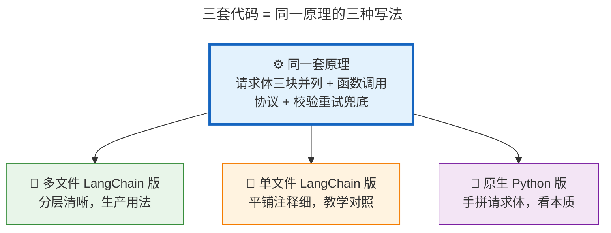

| 维度 | 多文件 LangChain 版 | 单文件 LangChain 版 | 原生 Python 版 |
|---|---|---|---|
| 文件 | `pipeline`/`extractors`/`schemas`/`observability`/`config`/`demo` | `simple_onefile.py` | `pure_structured_output.py` |
| 依赖 | LangChain | LangChain | 纯标准库 urllib |
| 请求体怎么来的 | `with_structured_output()` 帮你拼 | 同上 | 手拼（看得见） |
| 校验 | Pydantic `model_validate` | Pydantic `model_validate` | 手写 `_check()` 递归 |
| 适合 | 生产 / 上线 | 教学 / 读懂分层 | 学原理 / 排障 |
| 重点看清 | 每一层负责什么 | 层与层如何调用 | `tools`/`tool_choice` 怎么拼进请求体 |

**学习路线建议**：多文件版跑通 → 单文件版逐段读懂 → 原生版 `--dry-run` 把请求体摊开亲眼看一遍。

---

## 八、三条通道全景 + 版本坑

### 8.1 全景对照表

| 策略 | 机制 | 保证强度 | 适用模型 | 备注 |
|---|---|---|---|---|
| `with_structured_output(method="function_calling")` | 把 schema 伪装成工具，`tool_choice` 强制调用 | 语法层强 | 支持 tool calling 的模型（deepseek/qwen ✓） | **现代主路径** |
| `with_structured_output(method="json_mode")` | 传 `response_format={"type":"json_object"}` | 语法层中 | 支持 json mode 的模型 | **现代主路径** |
| `with_structured_output(method="json_schema")` | 传 `response_format={"type":"json_schema"}` | 语法层最强（严格 schema） | 仅 OpenAI/Claude/Gemini | deepseek/qwen **不可用** |

### 8.2 版本坑：不传 method 会 400

> ⚠️ **langchain-openai 1.4+ 的 `with_structured_output` 不传 `method` 时，默认已是 `json_schema`**
> （不再是 0.x 的 `function_calling`）。而 `json_schema` 严格模式仅 OpenAI/Claude/Gemini 支持；
> deepseek/qwen 收到 `response_format.type=json_schema` 直接 400。
>
> **deepseek/qwen 必须显式传 `method="function_calling"`（最稳）或 `"json_mode"`。**
> 三套代码里的 `method="function_calling"` 就是这么来的。

### 8.3 两个通用坑

| 坑 | 现象 | 解法 |
|----|------|------|
| prompt 缺 "JSON" 字样 | deepseek 输出空白流；qwen 直接 API 报错 | json_mode 内部指令通常已含；手写 prompt 自查 |
| 设置了过低的 `max_tokens` | 输出被截断 → 坏 JSON | 结构化输出默认不设 max_tokens；确要设则给高值 |

---

## 九、可视化总览：五层保证闭环

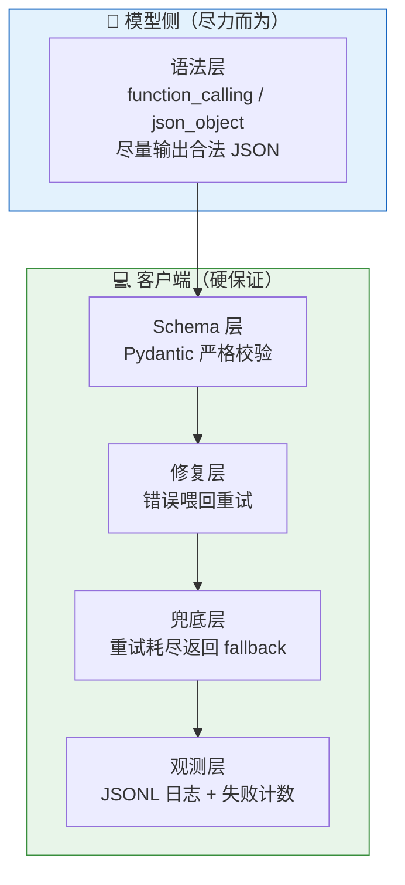

---

## 十、关键数字速记

```
┌────────────────────────────────────────────────────────┐
│  📊 关键数字（记这几个就够）                            │
├────────────────────────────────────────────────────────┤
│  • 3 块平级字段：messages / tools / tool_choice         │
│  • 3 套代码：多文件 → 单文件 → 原生 Python              │
│  • 3 条通道：function_calling / json_mode / json_schema │
│  • 2 层校验：语法层 json.loads + Schema 层 model_validate│
│  • 2 次默认重试：max_retries=2（共 3 次尝试）            │
│  • 1 个兜底：默认 None（宁缺毋滥）                      │
│  • 1 个死命令：tool_choice 锁死必须调用指定工具          │
└────────────────────────────────────────────────────────┘
```

---

## 十一、类比速记卡

| 概念 | 类比 | 一句话 |
|---|---|---|
| 结构化输出 | 去诊所填病历表 | 让大模型把话填进固定格子 |
| messages（提示词） | 你说的话 | 提供信息，function_calling 下零改动 |
| tools | 空表清单/菜单 | 告诉大模型"有这张表要填" |
| tool_choice | 死命令/点菜 | 锁死大模型必须填这张表 |
| tool_calls[].arguments | 前台交回的填好的表 | 里面是一整个 JSON 字符串 |
| content | 模型直接吐的文本 | json_mode 通道下 JSON 在这里 |
| 校验 | 检查表填没填对 | 缺填/类型错/不在选项/多填栏都算失败 |
| 重试 | 退回去重填 | 把错误批注喂回去，模型针对性修正 |
| 兜底 | 宁缺毋滥 | 改不好就返回空，不拿错的硬用 |

---

## 十二、一句话总结（费曼技巧版）

**结构化输出是什么？**
> 在发给模型的请求体里，除了你说的话（messages），平行塞进一张空表（tools）和一条死命令
> （tool_choice）；死命令逼模型必须发起一次工具调用，工具调用协议规定 `arguments` 必须是
> 符合表格的 JSON 字符串——于是模型"被迫"返回 JSON。

**为什么重要？**
> 大模型默认像聊天一样自由发挥，电脑没法直接处理。结构化输出把它变成"填表"，让输出可被
> 校验、可被程序直接用；而真正的可靠性来自你自己的"校验 + 重试 + 兜底"闭环。

**一句话记牢：**
> **模型侧尽力而为（协议只保证"是 JSON"），校验层是硬保证（符不符合你的表由你兜底）。**

---

> 📝 **学习笔记**
> - 学习日期：2026-09-09
> - 学习方式：费曼学习法（大白话版）
> - 配套代码：[python/src/structured_output](https://github.com/kunge2013/LangChainBestPractices/tree/main/python/src/structured_output)
> - 学习路线：大块一（多文件版）→ 大块二（单文件版）→ 大块三（原生 Python 版 `--dry-run`）
> - 运行命令：
>   - 多文件版离线演示：`cd python && python -m src.structured_output.demo --fake`
>   - 多文件版真实调用：`python -m src.structured_output.demo --provider qwen --method function_calling`
>   - 单文件版：`python -m src.structured_output.simple_onefile`
>   - 原生版看请求体：`python -m src.structured_output.pure_structured_output --dry-run`
> - 下一步：理解后，用自己的话讲给同事听
