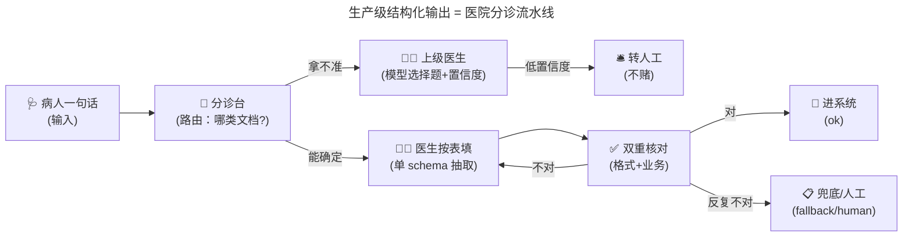
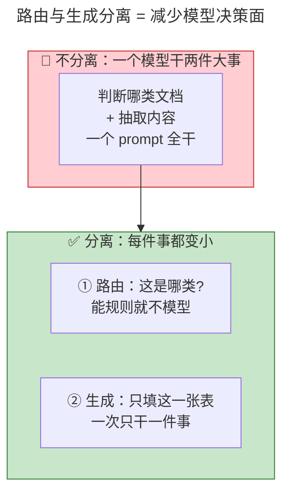
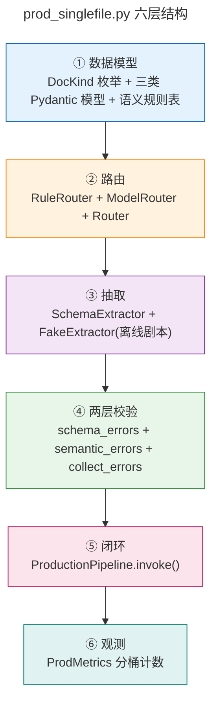
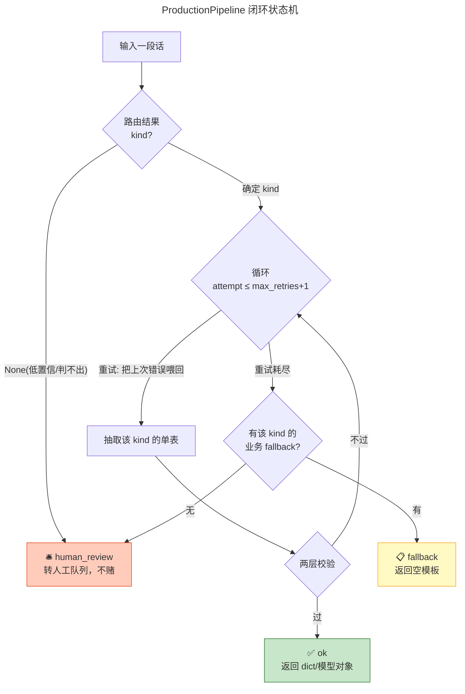
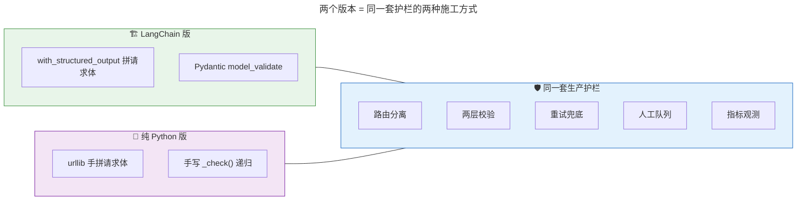
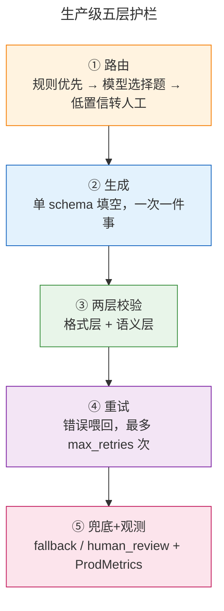

# [AGC:FILE] tool=Cc author=fangkun date=2026-09-09
# LangChain 生产级 JSON 结构化输出 - 大白话版

> 配套代码：[python/src/base_practice/20_prod_structured_output](https://github.com/kunge2013/LangChainBestPractices/tree/main/python/src/base_practice/20_prod_structured_output)
>
> 上一篇《LangChain 结构化输出原理》讲的是「怎么让模型乖乖吐 JSON」；
> 这一篇讲的是「**光能吐 JSON 还不够，怎么才敢上生产**」——同一个原理，生产级怎么加护栏。
>
> 同一套生产流水线给出**两个等价实现**，便于对照「框架版 vs 纯标准库版」：

| 代码 | 版本 | 模型调用层 | 校验层 | 适合 |
|---|---|---|---|---|
| `prod_singlefile.py` | LangChain 版 | `ChatOpenAI` + `with_structured_output` | Pydantic `model_validate` | 上手 / 接 LangChain 生态 |
| `prod_pure.py` | 纯 Python 版 | urllib 直连 + 手拼请求体 | 手写 `_check()` 递归 | 看本质 / 排障 / 轻依赖 |

---

## 一、一句话说明白

**生产级结构化输出 = 让大模型「少做判断题、多做填空题」，并给每一步都配上退路。**

上一篇的"最小可靠闭环"能保证**单条输出**是靠谱的 JSON；
生产级关心的是**一堆五花八门的输入**能不能稳定处理：有的是病历、有的是化验单、有的是处方，
输入啥都不一定，你还得一条条都处理对——这时真正的问题不是"怎么让模型填表"，而是：

> **你怎么知道该让模型填哪张表？填错了怎么办？填不好怎么办？**

**三个关键词先记住，全文围绕它们展开：**

| 关键词 | 大白话 | 通俗比喻 |
|---|---|---|
| **路由（Route）** | 先判断"这是哪类文档"，再决定填哪张表 | 医院分诊台先问你挂哪个科 |
| **两层校验** | 先查"格式对不对"，再查"业务合不合理" | 先看表填没填全，再看填的内容荒不荒谬 |
| **兜底（Fallback）** | 改不好就别硬撑，走人工或返回默认 | 医生拿不准就请上级会诊 |

**核心认知（全文的"地基"）：**
> **模型只该做"填空题"，不该做"判断题"。**
> 让模型同时干"判断是哪类文档 + 抽取内容"两件事，决策面太大容易错；
> 把它拆开——判断交给路由（能规则就不模型），抽取只做单表填空——每件事都变小、变可靠。

---

## 二、大白话故事：医院分诊台

想象一个病人来到医院，他的病历要进电脑系统。跟上一篇"填病历表"不同，这次**不是只有一张表**：
可能是病历表、化验单、处方单……**你得先知道他该填哪张**。

1. **分诊台护士问两句**（路由）："哪不舒服？发烧咳嗽？还是来做化验？还是来开药？"
2. **护士心里有本关键词账**（规则优先）：听到"化验"就指向化验科；听到"剂量""毫克"就指向开药；拿不准就请医生（模型）再判断。
3. **医生也拿不准，且没把握**（低置信度）：**不猜，转上级/人工**——宁可慢，不可错。
4. **确定科室后，医生按该科室的表填**（抽取）：只填一张表，一次只干一件事。
5. **填完双重复核**（两层校验）：先看格式（格子填齐没、年龄是不是数字），再看业务（100 岁？症状是空的？这不合常理）。
6. **不对就退回去重填**（重试）：把批注（哪里错了）一起递回去，医生针对性改。
7. **反复改不好**（兜底）：走业务兜底（给个空模板先顶上）或直接进人工队列，**绝不拿错的硬用**。
8. **每单都记账**（观测）：谁分的诊、几单成功、几单转人工、校验挂了几次——月底一查就知道哪个环节拖后腿。

**"生产级结构化输出"就是这件事**——不只让模型填对一张表，而是：**判断该填哪张、判断不了怎么办、填错了怎么办、填不好怎么办、每单都留痕**。



---

## 三、核心原理：为什么"路由与生成分离"是生产级的第一性原理

### 3.1 问题：让模型"又要判断、又要填表"，决策面太大

如果直接把一段话丢给模型让它输出"结构化病历"，会遇到两种糟心事：

- **选错表**：明明是一张化验单，模型按病历表填了——类型错了，校验也救不了（它填得再规范也不是你要的东西）。
- **不知道是该先判断还是先填**：模型一边猜"这是啥"一边填，两件事互相干扰，错误率上升。

**直觉**：判断"这是什么"比"怎么填"难得多，而且判断错了后面全白干。把最难的判断单独拎出来，就是生产级的第一刀。

### 3.2 解法：判断（路由）与填空（生成）彻底分开



**三个递进的原则**（对应代码里的三个类）：

| 原则 | 大白话 | 代码 |
|---|---|---|
| **能规则就不模型** | 关键词唯一命中就直接判，零成本、100% 可解释 | `RuleRouter` |
| **能选择题就不填空题** | 非上模型不可时，让模型只选一个答案 + 自评置信度 | `ModelRouter` + `RouteChoice` |
| **低置信度不赌** | 模型都没把握（<0.6），宁转人工，不硬猜 | `Router` 阈值拦截 |

---

## 四、大块一：LangChain 版 `prod_singlefile.py`（六层平铺一个文件）

这一版把整个生产流水线按六个环节平铺在一个文件里（对应文档源文件顶部的 `①~⑥` 注释），
照着注释从上往下读就是完整流水线：



### 4.1 ① 数据模型：先定义"有哪几张表"

生产级不是一张表，而是**一摞表**，用枚举管起来：

```python
class DocKind(str, Enum):
    """文档类型，同时也是路由的"选择题答案"。"""
    PATIENT = "patient_record"      # 病历
    LAB = "lab_report"              # 化验单
    PRESCRIPTION = "prescription"   # 处方
```

每一类一个 Pydantic 模型（`PatientRecord` / `LabReport` / `Prescription`），
外加一张**语义规则表** `SEMANTIC_RULES`——它不查格式，查"业务合不合理"：

```python
def _patient_semantic(obj: PatientRecord) -> list[str]:
    errs: list[str] = []
    if not 0 < obj.age < 150:
        errs.append("语义: 年龄必须在 1~149 之间")   # 格式合法，但 200 岁荒谬
    if not obj.symptoms:
        errs.append("语义: 症状不能为空")
    return errs
```

> **为什么"语义"要单独一层**：Pydantic 只保证"字段齐、类型对、枚举合法"，不保证"像个人"。
> 年龄填 200 完全通过格式校验，但它不可能真实——这类错误要靠业务规则在第二层拦。

### 4.2 ② 路由：先判"这是哪张表"，三个类层层递进

**第一棒：规则路由 `RuleRouter`**——关键词映射，**只有唯一命中才下判断**；零命中、多命中都上交模型：

```python
class RuleRouter:
    RULES = [
        ("lab_report",    ["血常规", "白细胞", "体温", "化验"]),
        ("prescription",  ["剂量", "用法", "一日", "毫克", "处方"]),
        ("patient_record",["症状", "咳嗽", "发烧", "门诊"]),
    ]
    def route(self, text: str) -> RouteResult | None:
        hits = [name for name, keywords in self.rules if any(k in text for k in keywords)]
        if len(hits) == 1:                      # 唯一命中才判
            return RouteResult(DocKind(hits[0]), 1.0, "rule", f"关键词命中:{hits[0]}")
        return None                             # 零/多命中 -> 交给模型，不瞎猜
```

**第二棒：模型路由 `ModelRouter`**——让模型做**选择题**，而不是开放式填空：

```python
class RouteChoice(BaseModel):
    """路由"选择题"的 schema：只要一个答案 + 自评置信度。"""
    kind: DocKind
    confidence: int = Field(ge=0, le=100)       # 0~100，模型自评"我多确定"
```

模型的"输出量"被压到最小：一个答案 + 一个分数。答案越少，越不容易错。

**第三棒：组合 `Router`**——把前两棒串起来，并在出口拦一道"低置信度不赌"：

```python
class Router:
    def route(self, text: str) -> RouteResult:
        by_rule = self.rule_router.route(text)
        if by_rule is not None:
            return by_rule                       # 规则赢了，模型根本不登场
        result = self.model_router.route(text)
        if result.kind is not None and result.confidence < self.threshold:  # <0.6
            return RouteResult(None, result.confidence, "model", "低置信度不赌，转人工")
        return result
```

### 4.3 ⑤ 闭环 `ProductionPipeline.invoke()`：整条流水线的"路由图"

把路由、分流、抽取、校验、重试、兜底串成一棵决策树：



**`status` 三种语义**（这是生产流水线和玩具脚本的分水岭）：

| status | 含义 | 返回什么 |
|---|---|---|
| `ok` | 两层校验都过了 | 解析好的对象 |
| `fallback` | 重试耗尽，用业务兜底 | 该 kind 的空模板（可配置） |
| `human_review` | 定不了 / 低置信 / 没兜底 | `None` + 原因，进人工队列 |

### 4.4 ④ 两层校验 + 重试：错误怎么"喂回去"

```python
def collect_errors(kind, model_cls, data) -> list[str]:
    fmt = schema_errors(model_cls, data)   # 第一层：格式（Pydantic）
    if fmt:
        return fmt                          # 格式错就不往下跑语义
    return semantic_errors(kind, model_cls.model_validate(data))  # 第二层：业务
```

重试不是重跑一遍，而是**把这次的错误批注喂回去**：

```python
FIX_TEMPLATE = "\n\n【上一次输出未通过校验，请仅修复以下错误并重新输出 JSON】\n{error}"
prompt = text if attempt == 1 else text + FIX_TEMPLATE.format(error=errors[-1])
```

模型看到"你上次哪错了"，针对性改，往往一次就过（离线剧本 `retry_once` 演示的正是这条：第一次失败、第二次成功）。

### 4.5 ⑥ 观测 `ProdMetrics`：按环节分桶，定位"谁在拖后腿"

```python
summary() -> {
    "total": ..., "ok": ..., "human_review": ..., "fallback": ...,
    "retries_used": ..., "validation_failures": ...,
    "route_source": {"rule": n, "model": n}, "low_confidence": n,
    "success_rate_%": ...,
}
```

`success_rate` 掉下来时，看三个桶就知道病在哪：
- `route_source.rule` 占比低 → 规则太弱，老在麻烦模型；
- `low_confidence` 高 → 模型都没把握，该补规则或换模型；
- `validation_failures` 高 → 抽取环节质量差，该修 prompt。

---

## 五、大块二：纯 Python 版 `prod_pure.py`（把"发给模型的到底是什么"摊开）

这一版和 LangChain 版**逻辑完全等价**，只把模型调用层换成纯标准库 `urllib`：
请求体自己拼、校验自己写，让上一篇《原理》里讲过的机制在这里**原样可见**。



### 5.1 schema 变成纯 dict：等价 Pydantic 的 `model_json_schema()`

```python
SCHEMA_BY_KIND[DocKind.PATIENT] = {
    "name": "PatientRecord",
    "type": "object",
    "additionalProperties": False,          # 对应 extra="forbid"
    "required": ["name", "age", "symptoms", "risk_level"],
    "properties": {
        "name":       {"type": "string"},
        "age":        {"type": "integer"},
        "symptoms":   {"type": "array", "items": {"type": "string"}},
        "risk_level": {"type": "string", "enum": ["low", "medium", "high"]},
        "contact":    {"type": ["object", "null"], ...},
    },
}
```

### 5.2 请求体手拼：顶层 `messages + tools + tool_choice` 三块并列

```python
def build_tool_call_payload(text: str, schema: dict) -> dict:
    p = _base_payload(text)                          # model / messages / temperature / ...
    p["tools"] = [{"type": "function", "function": {
        "name": schema["name"], "description": schema.get("description", ""),
        "parameters": schema}}]                      # ② 空表
    p["tool_choice"] = {"type": "function", "function": {"name": schema["name"]}}  # ③ 死命令
    return p
```

qwen 默认开 thinking 会限制 `tool_choice` 导致 400，必须显式关——这里 `enable_thinking` 是**顶层 JSON key 手写进去**的（原始 HTTP 不经过 SDK，绕开了上一篇讲的 `extra_body` 问题）。

> **纯 Python 版的最大价值**：跑 `--dry-run` 就能把发给模型的请求体逐字节摊开，亲眼看到
> "提示词零改动、schema 走 tools 平行送进去"——上一篇讲的机制在这里一览无余。

### 5.3 校验手写 `_check()`：等价 Pydantic 的严格模式

```python
def _check(data, schema: dict, path: str = "root") -> list[str]:
    # 类型不对 / 多出字段(additionalProperties:false) / 缺必填 / 枚举外值 / 递归子对象
    ...
```

它逐条复刻 Pydantic 在这个 schema 上做的检查，但**不依赖任何第三方库**——
格式层、语义层（`SEMANTIC_RULES`）的组织方式和 LangChain 版一模一样。

### 5.4 关键差异一句话

| 维度 | prod_singlefile.py | prod_pure.py |
|---|---|---|
| 依赖 | langchain + pydantic | **只有标准库**（+dotenv） |
| 请求体 | `with_structured_output` 代拼 | 手拼，`--dry-run` 可见 |
| 格式校验 | Pydantic `model_validate` | 手写 `_check()` |
| 模型路由 | `parsed` 优先、`raw` 兜底 | 解析 tool_calls 字符串 + 异常归一化转人工 |
| 适合 | 生产 / 接 LangChain 生态 | 学原理 / 排障 / 极轻依赖 |

---

## 六、版本与坑（生产级专属）

### 6.1 低置信度阈值：`DEFAULT_CONFIDENCE_THRESHOLD = 0.6`

- 阈值是"敢不敢赌"的开关：调高 → 更多转人工（更稳更慢）；调低 → 更多自动（更快更险）。
- 生产上按"转人工的成本 vs 抽错的成本"来调。

### 6.2 兜底与人工是两回事

- **有业务 fallback**（如空病历）→ `status="fallback"`，系统还能继续跑；
- **没有 fallback 或路由就定不了** → `status="human_review"`，必须有人看。
- 两者都**绝不拿一个格式/业务不过的脏数据硬往下游传**——这是生产底线。

### 6.3 畸形输出不崩溃（纯 Python 版尤其强调）

模型可能返回枚举外值（`"lab"` 而非 `"lab_report"`）、字符串置信度、甚至网络异常——
`ModelRouter` 把这些一律归一化为 `kind=None` 转人工，而不是抛异常把整条请求打挂。

### 6.4 目录名以数字开头，不能 `python -m`

`20_prod_structured_output` 以数字开头，Python 无法 `import`/`-m` 它。
直接跑文件即可：

```
cd python
python src/base_practice/20_prod_structured_output/prod_singlefile.py --fake
python src/base_practice/20_prod_structured_output/prod_pure.py --dry-run
python -m pytest src/base_practice/20_prod_structured_output/tests -q
```

---

## 七、可视化总览：五层护栏闭环



---

## 八、关键数字速记

```
┌────────────────────────────────────────────────────────┐
│  📊 关键数字（记这几个就够）                            │
├────────────────────────────────────────────────────────┤
│  • 1 个判断：先判"哪类文档"再抽取（路由与生成分离）     │
│  • 3 类文档：病历 / 化验单 / 处方（DocKind 枚举）       │
│  • 2 棒路由：规则优先，模型做选择题补位                 │
│  • 1 个阈值：置信度 < 0.6 不赌，转人工                  │
│  • 2 层校验：格式层(结构) + 语义层(合不合理)            │
│  • 2 次默认重试：max_retries=2（共 3 次尝试）           │
│  • 3 种状态：ok / fallback / human_review               │
│  • 2 个实现：LangChain 版 / 纯 Python 版（逻辑等价）    │
└────────────────────────────────────────────────────────┘
```

---

## 九、类比速记卡

| 概念 | 类比 | 一句话 |
|---|---|---|
| 路由与生成分离 | 分诊台先分科，医生再填表 | 判断最难，单独拎出来 |
| RuleRouter | 护士的关键词小本本 | 唯一命中才判，零成本可解释 |
| RouteChoice | 让医生只答"哪科 + 多确定" | 选择题，输出量压到最小 |
| 低置信度不赌 | 医生拿不准就请会诊 | <0.6 转人工，宁可慢不可错 |
| 两层校验 | 先看格子填没填全，再看内容荒不荒谬 | 格式层 + 语义层 |
| 重试 | 退回去重填，附上批注 | 错误喂回 prompt |
| fallback | 先拿空模板顶上 | 业务兜底，系统不崩 |
| human_review | 进人工队列 | 定不了/没兜底，必须有人看 |
| ProdMetrics | 每单记账 | 查哪个环节拖后腿 |
| 纯 Python 版 | 用秤直接称，不信包装 | `--dry-run` 摊开请求体 |

---

## 十、一句话总结（费曼技巧版）

**生产级结构化输出是什么？**
> 不指望模型"一次全对"，而是把流程拆成**路由（判断哪类文档）→ 单表抽取 → 两层校验 →
> 重试 → 兜底/人工**五道护栏；判断交给规则和"选择题"，抽取只做填空题，
> 每道护栏都把错误挡在自己这一关，并全程记账。

**为什么重要？**
> 单条输出可靠 ≠ 生产可靠。生产要面对五花八门的输入、要能解释"为什么这单走了人工"、
> 要知道"哪个环节在拖后腿"——这套护栏把"碰运气"变成"可预期、可观测、可降级"。

**一句话记牢：**
> **模型只做填空题，判断题交给路由；判断不了不赌，填不对有退路，每单都留痕。**

---

> 📝 **学习笔记**
> - 学习日期：2026-09-09
> - 学习方式：费曼学习法（大白话版）
> - 配套代码：[python/src/base_practice/20_prod_structured_output](https://github.com/kunge2013/LangChainBestPractices/tree/main/python/src/base_practice/20_prod_structured_output)
> - 前置阅读：《LangChain 结构化输出原理 - 大白话版》（先懂"怎么让模型吐 JSON"）
> - 运行命令：
>   - LangChain 版离线演示：`cd python && python src/base_practice/20_prod_structured_output/prod_singlefile.py --fake`
>   - 纯 Python 版看请求体：`python src/base_practice/20_prod_structured_output/prod_pure.py --dry-run`
>   - 跑全部测试：`python -m pytest src/base_practice/20_prod_structured_output/tests -q`
> - 下一步：理解后，用自己的话把"分诊台流水线"讲给同事听
