<!-- [AGC:FILE] tool=Cc author=fangkun date=2026-09-13 -->
# RAG 面试指南（LangChain 版）- 从入门到企业级实战

> 🎯 **本文定位**：面试 + 企业级开发双目标，覆盖 RAG 全链路技术栈
>
> 💡 **费曼学习法**：每个核心概念都用「大白话 + 类比图 + 业务场景」讲透
>
> 📖 **阅读建议**：
> - **面试冲刺**：先看第十三（面试题速查），再看一～三（基础），再按弱项补四～十二
> - **系统学习**：按顺序从一到十三，循序渐进
> - **生产救火**：直接跳到八（生产问题诊断）

---

## 一、RAG 基础概念

### 1.1 什么是 RAG？

> 📖 **名词解释 — RAG（Retrieval-Augmented Generation，检索增强生成）**
>
> **Retrieval** = 检索（从知识库中找资料）
> **Augmented** = 增强的（给 LLM 额外加上资料）
> **Generation** = 生成（基于资料生成回答）
>
> 合起来就是：**先检索资料，再用资料增强 LLM 的回答能力**。由 Meta（Facebook）在 2020 年论文中首次提出。

**一句话**：RAG = 给大模型配一个"开卷考试"的能力——回答问题时，先去知识库里翻资料，再基于资料作答。

**类比理解**：

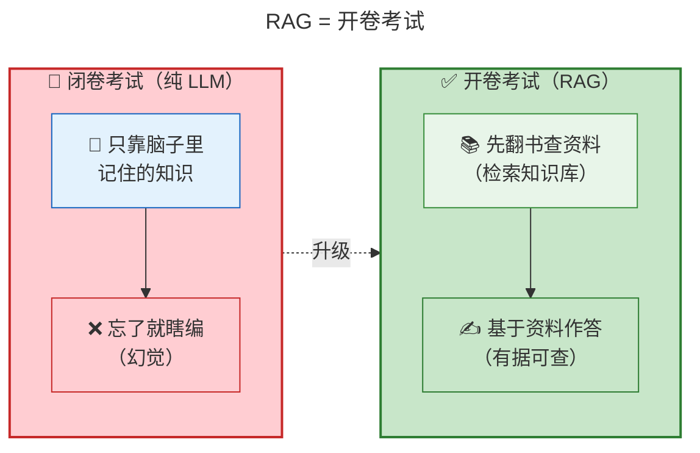

| 对比维度 | 闭卷考试（纯 LLM）  | 开卷考试（RAG）     |
| ---- | ------------ | ------------- |
| 知识来源 | 训练时记住的参数     | 外部知识库 + 参数    |
| 知识更新 | 重新训练（贵、慢）    | 更新知识库即可（快、便宜） |
| 幻觉控制 | 靠模型自觉        | 有资料支撑，可溯源     |
| 领域知识 | 训练数据里有什么就会什么 | 知识库喂什么就会什么    |
| 典型场景 | 通用问答、创作      | 企业知识库、客服、文档问答 |

**业务场景**：你开了一家 2000 人的公司，员工经常问 HR "年假有多少天？""报销流程是什么？"。HR 不可能背住所有制度（闭卷考试），但如果给她一本《员工手册》让她翻着答（开卷考试），回答就又快又准。

### 1.2 RAG Pipeline 三阶段

> 📖 **名词解释 — RAG Pipeline 三大阶段**
>
> | 英文 | 中文 | 一句话解释 |
> |------|------|-----------|
> | **Indexing** | 索引阶段 | 把文档"加工"成向量，存进数据库（像图书馆把书编目上架） |
> | **Retrieval** | 检索阶段 | 根据用户问题，从数据库中找到最相关的文档片段（像图书管理员找书） |
> | **Generation** | 生成阶段 | 把检索到的文档和问题一起交给 LLM，生成最终回答（像管理员写答案） |
> | **Pipeline** | 流水线 | 指这三个阶段串联起来的完整处理流程 |

**类比理解**：RAG 像一个**图书馆服务流程**——

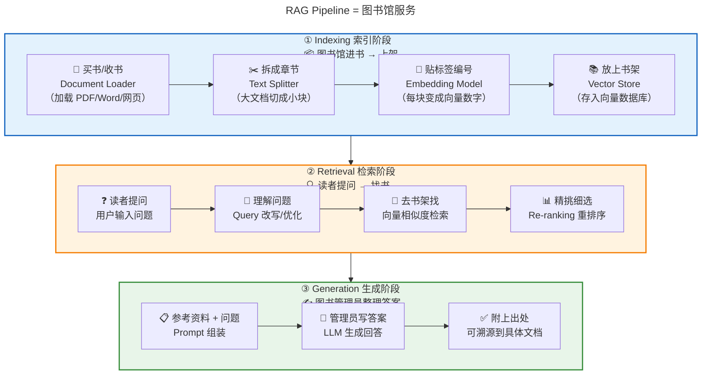

**面试重点** ⭐⭐⭐ [高频 | 中级 | 概念题]：
> Q：请描述 RAG 的完整流程。
>
> A：RAG 分三个阶段：
> 1. **Indexing**：文档经过 Loader 加载 → Splitter 分块 → Embedding Model 向量化 → 存入 Vector Store
> 2. **Retrieval**：用户 Query 经过改写/扩展 → 在 Vector Store 中做相似度检索 → 可选 Re-ranking 重排序 → 取 Top-K 相关文档
> 3. **Generation**：将检索到的文档和原始问题组装成 Prompt → 送入 LLM 生成最终回答

### 1.3 RAG vs Fine-tuning

> 📖 **名词解释 — Fine-tuning（微调）**
>
> **Fine** = 精细的
> **Tuning** = 调节、调优
>
> 合起来就是：**在已有的大模型基础上，用特定数据继续训练，让模型在某个领域/任务上表现更好**。
>
> 类比：RAG 是"给员工一本手册让她查"，Fine-tuning 是"让员工把知识背下来"。

**类比理解**：

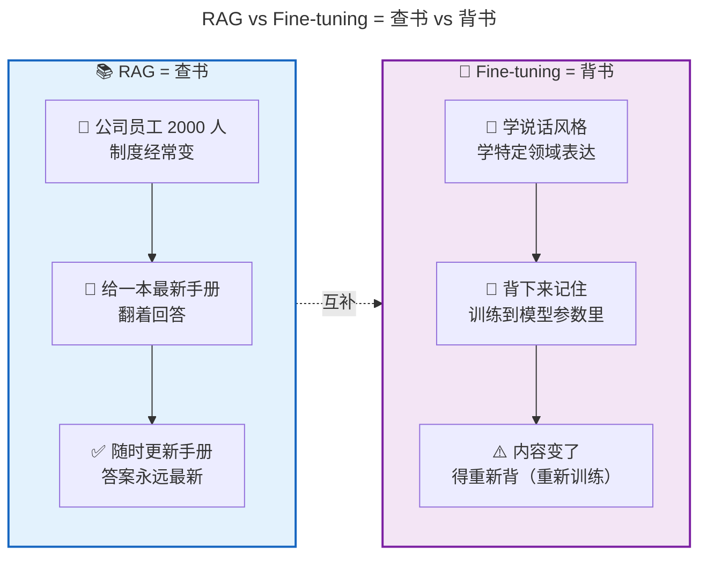

**面试重点** ⭐⭐⭐ [高频 | 初级 | 概念题]：
> Q：RAG 和 Fine-tuning 怎么选？
>
> | 维度 | RAG | Fine-tuning |
> |------|-----|-------------|
> | 知识更新 | 实时更新（改知识库即可） | 需要重新训练 |
> | 成本 | 推理时多一步检索 | 训练成本高 |
> | 可解释性 | 可溯源到具体文档 | 黑盒 |
> | 适用场景 | 知识密集型、需要准确性 | 风格调整、特定任务 |
> | 幻觉控制 | 较强（有据可查） | 较弱 |
>
> **结论**：需要实时知识、准确性高 → RAG；需要调整输出风格、特定任务适配 → Fine-tuning；两者可以结合用。

### 1.4 RAG 演进路线

> 📖 **名词解释 — RAG 三种演进形态**
>
> | 形态 | 英文全称 | 一句话解释 |
> |------|----------|-----------|
> | **Naive RAG** | 朴素 RAG | 最基础的 RAG：简单检索 + 拼接 Prompt，没有优化环节 |
> | **Advanced RAG** | 进阶 RAG | 在 Naive 基础上加入 Query 改写、Re-ranking 等优化手段 |
> | **Modular RAG** | 模块化 RAG | 每个阶段都是可插拔的组件，可以灵活替换和优化 |

**类比理解**：RAG 的进化就像**学生做题的进化**。

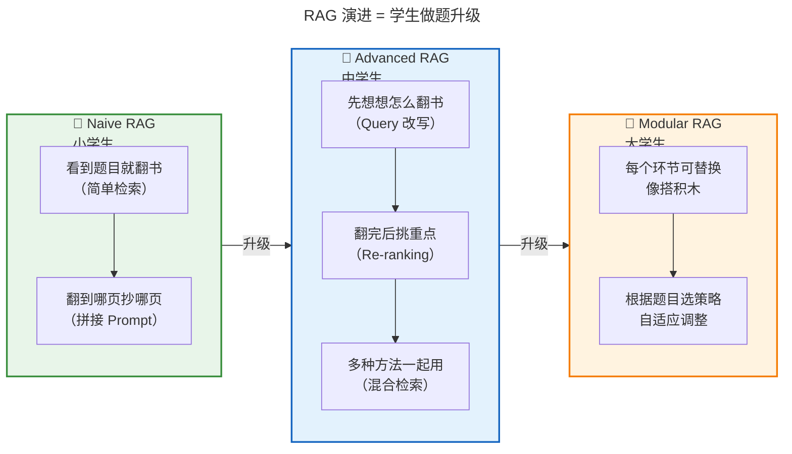

| 阶段 | 特征 | 典型技术 |
|------|------|---------|
| **Naive RAG** | 基础三阶段 | 简单检索 + 拼接 Prompt |
| **Advanced RAG** | 优化检索质量 | Query 改写、Re-ranking、HyDE |
| **Modular RAG** | 可插拔组件 | 各阶段可独立替换和优化 |

---

## 二、LangChain RAG 核心组件

### 2.1 组件全景图

**类比理解**：LangChain 的 RAG 组件像一条**工厂流水线**——

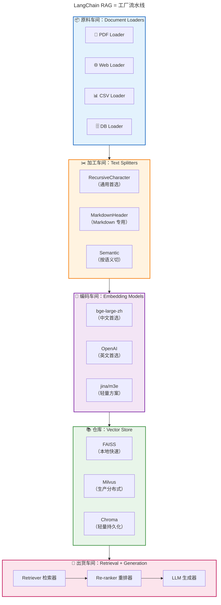

### 2.2 Document Loaders

> 📖 **名词解释 — Document Loader（文档加载器）**
>
> **Document** = 文档
> **Loader** = 加载器
>
> 把各种格式的原始文档（PDF、Word、网页、数据库等）**读取成 LangChain 能处理的统一格式**（Document 对象）。
>
> 类比：图书馆的"采购员"——不管书从哪来（出版社、捐赠、交换），最终都变成统一编目的馆藏。

| Loader | 用途 | 面试重点 |
|--------|------|---------|
| `PyPDFLoader` | PDF 文档 | 逐页加载，可提取元数据 |
| `WebBaseLoader` | 网页爬取 | 配合 BeautifulSoup |
| `CSVLoader` | CSV 表格 | 每行一条记录 |
| `UnstructuredMarkdownLoader` | Markdown | 保留结构信息 |
| `DatabaseLoader` | 数据库查询 | SQL 结果转文档 |
| `GitLoader` | Git 仓库 | 代码库问答 |

**生产踩坑** 💡：
> - PDF 加载后**一定要清洗**：页眉页脚、页码、水印会干扰检索
> - 表格型文档考虑用专门的表格解析库（如 `pdfplumber`），而不是简单按页切分
> - 大批量加载时加**进度条和错误处理**，避免一个坏文件让整个流程挂掉

### 2.3 Text Splitters（分块策略）

> 📖 **名词解释 — Text Splitter / Chunk（文本分块器 / 文档块）**
>
> **Text Splitter** = 文本分割器，把长文档切成多个小段
> **Chunk** = 文档块，切出来的每一小段
> **chunk_size** = 每个块的最大长度（字符数或 token 数）
> **chunk_overlap** = 相邻两个块之间的重叠部分（防止句子在边界被截断）
>
> 为什么要切块？因为 LLM 有输入长度限制，而且小块的检索精度更高。

**类比理解**：分块就像**切面包**——切太厚吃不完（噪声多），切太薄夹不住馅（上下文丢失）。

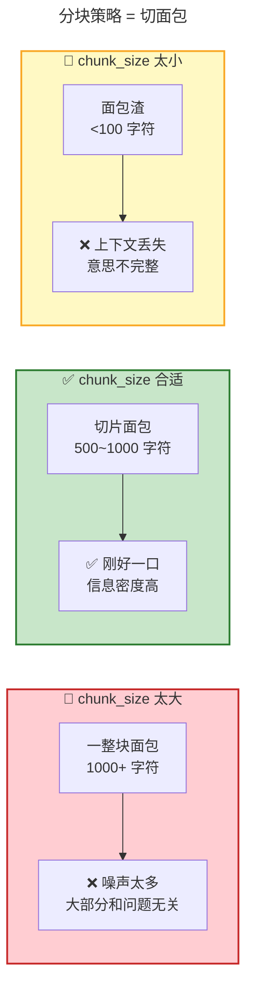

**chunk_overlap（重叠）是什么？** 就像**两页纸的重叠部分**——防止一句话正好被切在边界上。

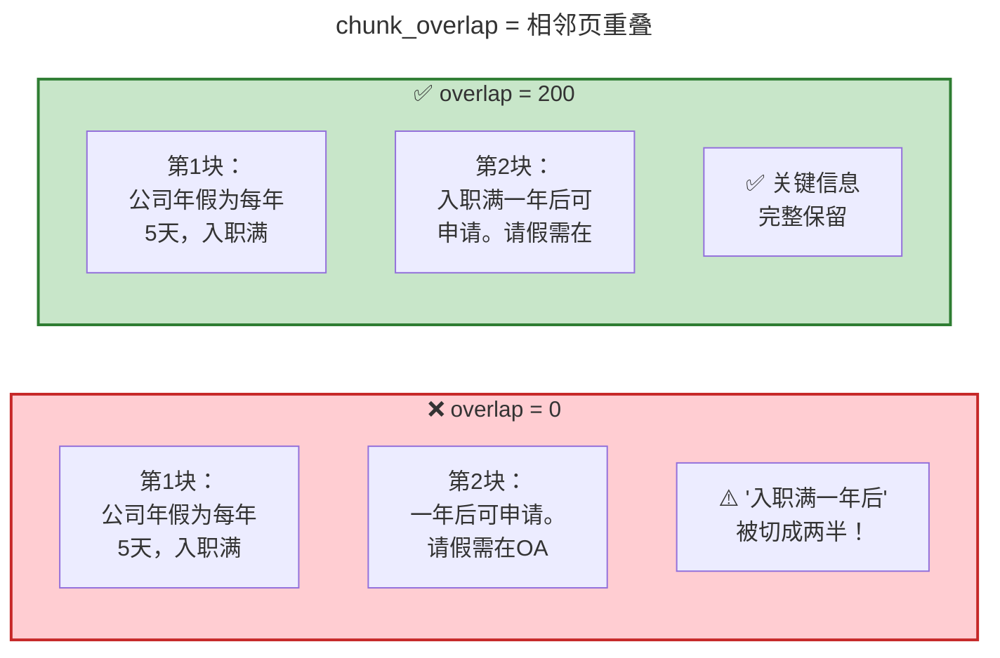

**面试重点** ⭐⭐⭐ [高频 | 中级 | 场景题]：
> Q：如何选择合适的分块策略？

| Splitter | 原理 | 适用场景 | 注意事项 |
|----------|------|---------|---------|
| `RecursiveCharacterTextSplitter` | 按字符递归切分（`\n\n` → `\n` → ` ` → `""`） | **通用首选**，适合大多数文本 | chunk_size 和 chunk_overlap 是核心参数 |
| `CharacterTextSplitter` | 按单一字符切分 | 有明确分隔符的文本 | 不够灵活 |
| `MarkdownHeaderTextSplitter` | 按 Markdown 标题层级切分 | Markdown 文档 | 保留语义结构 |
| `TokenTextSplitter` | 按 Token 数切分 | 需要精确控制 Token 数 | 需要 tokenizer，速度慢 |
| `SemanticChunker` | 按语义相似度切分 | 对语义完整性要求高 | 计算开销大 |

**核心参数**：

<!-- [AGC:START] tool=Cc author=fangkun -->
```python
from langchain.text_splitter import RecursiveCharacterTextSplitter

splitter = RecursiveCharacterTextSplitter(
    chunk_size=1000,       # 每个块的最大字符数
    chunk_overlap=200,     # 相邻块的重叠字符数（保持上下文连续性）
    length_function=len,   # 长度计算函数
    separators=["\n\n", "\n", " ", ""]  # 分隔符优先级
)
```
<!-- [AGC:END] -->

**生产经验** 💡💡💡：
> - `chunk_overlap` 不要设为 0，否则边界处的句子会被截断，严重影响检索质量
> - **chunk_size 不是越小越好**：太小则上下文不完整，太大则噪声太多
> - 经验值：`chunk_size=500~1000`，`chunk_overlap=100~200`
> - 不同文档类型可能需要不同的分块策略，**不要一套参数打天下**

### 2.4 Embedding Models

> 📖 **名词解释 — Embedding（嵌入/向量化）**
>
> **Embedding** = 嵌入，把文字变成一组数字（向量）
> **向量（Vector）** = 一组有序的数字，如 `[0.8, 0.3, 0.9]`，代表文本的"语义坐标"
> **维度（Dimension）** = 向量中数字的个数，如 1024 维 = 1024 个数字
> **语义相似度** = 两个向量的"距离"，距离越近 = 语义越相似
>
> 类比：Embedding 模型是一个"翻译官"，把人类文字翻译成"数字语言"，让计算机能比较两段文字的相似度。

**类比理解**：Embedding 就像**翻译官**——把人类文字翻译成"数字语言"（向量），让计算机能比较两段文字的"距离"。

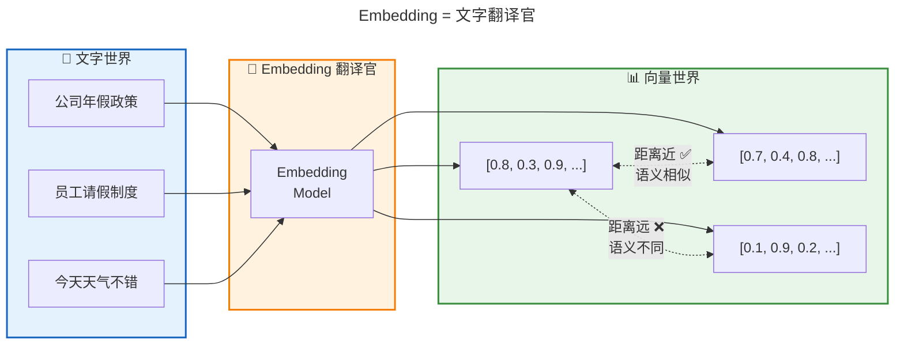

**面试重点** ⭐⭐⭐ [高频 | 中级 | 概念题]：
> Q：Embedding 模型怎么选？

| 模型 | 维度 | 中文能力 | 速度 | 部署 | 推荐场景 |
|------|------|---------|------|------|---------|
| `text-embedding-3-small` (OpenAI) | 1536（可降维） | 中 | 快 | API | 快速原型、英文为主 |
| `text-embedding-3-large` (OpenAI) | 3072（可降维） | 中高 | 中 | API | 英文/多语言 |
| `bge-large-zh-v1.5` (BAAI) | 1024 | **强** | 中 | 本地 | **中文场景首选** |
| `bge-m3` (BAAI) | 1024 | 强 | 中 | 本地 | 多语言 + 多粒度检索 |
| `jina-embeddings-v3` (Jina) | 1024 | 强 | 快 | API/本地 | 长文本（8K tokens） |
| `m3e-base` (Moka AI) | 768 | 强 | 快 | 本地 | 轻量级中文场景 |

**选型原则**：
1. **中文场景优先选国产模型**：bge 系列、m3e 系列，中文语义理解远强于 OpenAI
2. **维度不是越大越好**：高维度 = 高存储成本 + 高计算成本，在准确率够用的前提下选低维度
3. **本地部署 vs API**：数据敏感 + 调用量大 → 本地部署；快速验证 + 量小 → API
4. **一定要用你的实际数据做评估**，不要只看公开 Benchmark

### 2.5 Vector Stores

**面试重点** ⭐⭐⭐⭐ [高频 | 中级 | 场景题]：
> Q：向量数据库怎么选？

详细对比见 [第三节：向量数据库选型](#三向量数据库选型)。

### 2.6 完整 Pipeline 代码（LangChain 1.2）

<!-- [AGC:START] tool=Cc author=fangkun -->
```python
"""完整 RAG Pipeline 示例 - LangChain 1.2"""

from langchain_community.document_loaders import PyPDFLoader
from langchain.text_splitter import RecursiveCharacterTextSplitter
from langchain_community.embeddings import HuggingFaceBgeEmbeddings
from langchain_community.vectorstores import FAISS
from langchain_community.llms import Tongyi
from langchain.chains import RetrievalQA

# ① Indexing 阶段
# 加载文档
loader = PyPDFLoader("company_handbook.pdf")
documents = loader.load()

# 分块
splitter = RecursiveCharacterTextSplitter(
    chunk_size=800,
    chunk_overlap=150,
    separators=["\n\n", "\n", "。", "！", "？", "；", " ", ""]
)
chunks = splitter.split_documents(documents)

# Embedding + 存入向量库
embeddings = HuggingFaceBgeEmbeddings(
    model_name="BAAI/bge-large-zh-v1.5",
    model_kwargs={"device": "cpu"},
    encode_kwargs={"normalize_embeddings": True}
)
vectorstore = FAISS.from_documents(chunks, embeddings)

# ② Retrieval + ③ Generation 阶段
# 创建 Retriever
retriever = vectorstore.as_retriever(
    search_type="similarity_score_threshold",
    search_kwargs={"score_threshold": 0.5, "k": 4}
)

# 创建 LLM
llm = Tongyi(model_name="qwen-plus")

# 组装 RAG Chain
qa_chain = RetrievalQA.from_chain_type(
    llm=llm,
    chain_type="stuff",          # 把所有文档拼在一起
    retriever=retriever,
    return_source_documents=True  # 返回来源文档，便于溯源
)

# 使用
result = qa_chain.invoke({"query": "公司的年假政策是什么？"})
print(result["result"])
print(f"参考了 {len(result['source_documents'])} 个文档片段")
```
<!-- [AGC:END] -->

**生产注意** 💡：
> - `score_threshold` 很关键：太高会丢信息，太低会引入噪声，需要实验调优
> - `return_source_documents=True` 必须开着，回答要能溯源
> - 上面用的是 `chain_type="stuff"`（简单拼接），文档多时要用 `"refine"` 或 `"map_reduce"`

---

## 三、向量数据库选型

### 3.1 主流方案对比

> 📖 **名词解释 — Vector Store（向量数据库）**
>
> **Vector Store** = 向量存储，专门存储和检索向量的数据库
>
> 核心概念：
> | 术语 | 解释 |
> |------|------|
> | **ANN（Approximate Nearest Neighbor）** | 近似最近邻搜索，牺牲一点精度换速度（vs 暴力搜索精确最近邻） |
> | **HNSW** | 一种 ANN 索引算法，速度快、精度高，是最常用的算法之一 |
> | **IVF** | 倒排文件索引，先把向量分组，检索时只搜相关的组 |
> | **PQ（Product Quantization）** | 乘积量化，把高维向量压缩成短编码，节省存储空间 |
> | **Collection** | 向量库中的数据集合，类似关系型数据库的"表" |
> | **Partition** | 集合内的分区，用于隔离不同业务的数据 |
>
> 类比：向量数据库就像一个"语义搜索引擎"——你输入一句话，它找到语义最接近的文档。

**类比理解**：向量数据库就像**不同规模的仓库**——你的货（数据）有多少，就选多大的仓库。

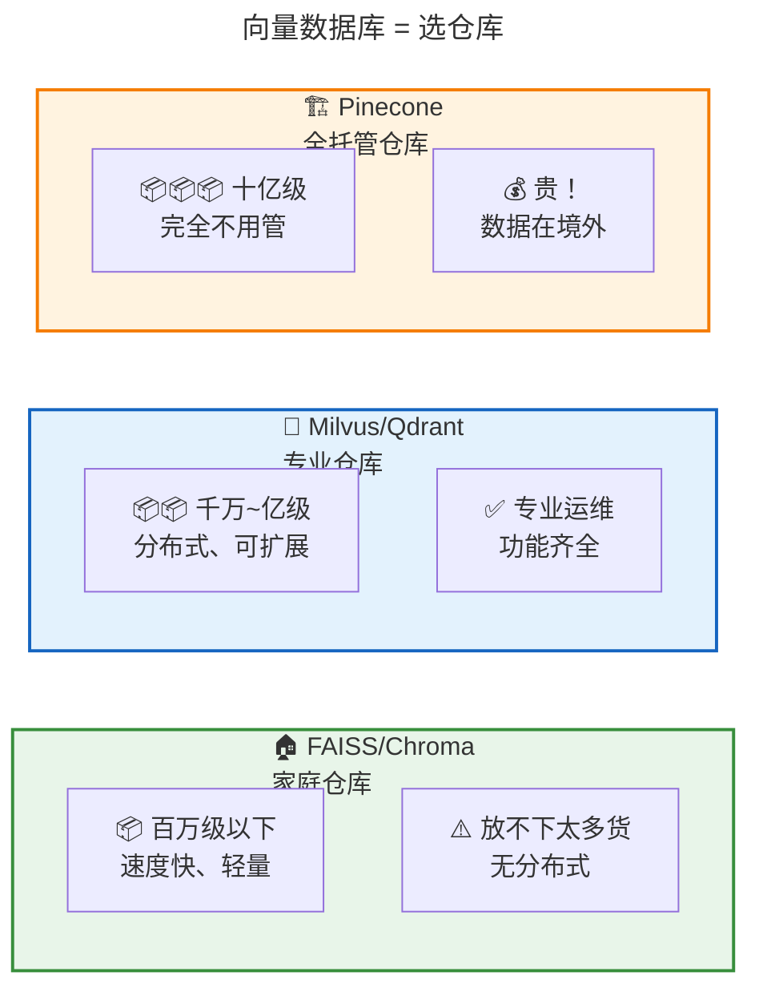

**面试重点** ⭐⭐⭐⭐ [高频 | 中级 | 场景题]：
> Q：你们项目用的什么向量数据库？为什么选它？

| 数据库 | 类型 | 规模 | 核心优势 | 核心劣势 | 推荐场景 |
|--------|------|------|---------|---------|---------|
| **FAISS** | 本地库 | 百万级 | 速度极快、Facebook 出品、纯内存 | 不持久化（需手动保存）、无分布式、无 API | 原型开发、单机场景、研究实验 |
| **Chroma** | 嵌入式 | 百万级 | 轻量、API 友好、内置持久化 | 分布式支持弱、生产案例少 | 快速原型、中小规模、本地开发 |
| **Milvus** | 专用型 | **十亿级** | 云原生、分布式、高性能、生态丰富 | 部署复杂、资源消耗大 | **大规模生产环境首选** |
| **Pinecone** | 托管型 | 十亿级 | 全托管免运维、开箱即用 | **贵**、数据在境外、定制性低 | 海外业务、不想运维、预算充足 |
| **Weaviate** | 专用型 | 亿级 | 内置向量化、GraphQL API、混合搜索强 | 学习曲线陡、社区相对小 | 需要混合搜索、多模态场景 |
| **Qdrant** | 专用型 | 亿级 | Rust 实现性能强、过滤能力强 | 中文社区较小 | 高并发、复杂过滤场景 |
| **pgvector** | 扩展型 | 百万级 | 复用 PostgreSQL、事务一致性 | 性能不如专用型、规模受限 | 已有 PG 基础设施、数据量不大 |

### 3.2 选型决策树

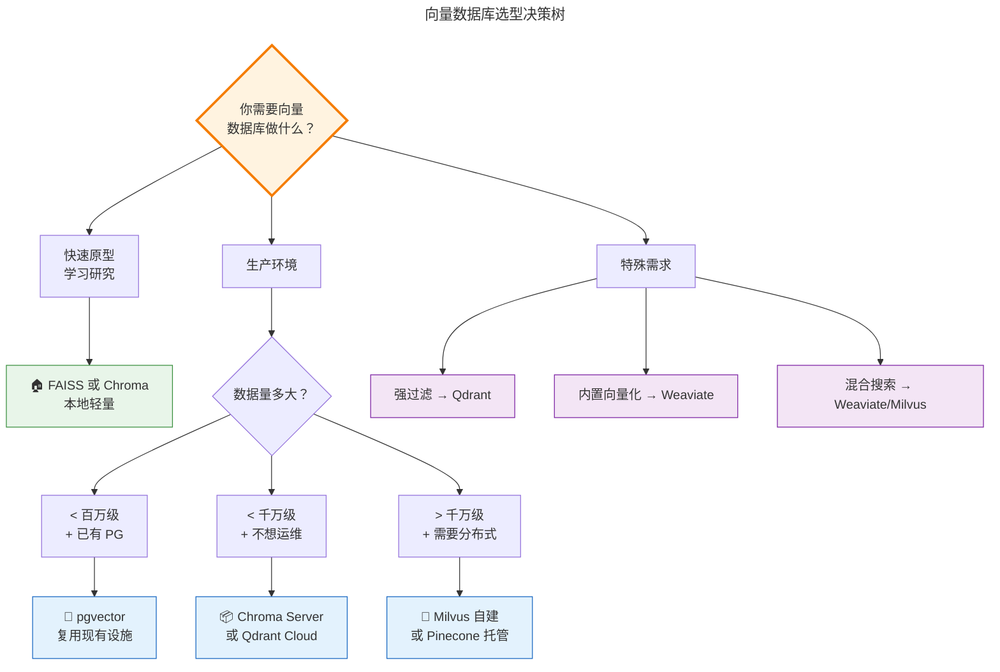

### 3.3 LangChain 集成示例

<!-- [AGC:START] tool=Cc author=fangkun -->
```python
# FAISS（本地快速原型）
from langchain_community.vectorstores import FAISS
faiss_store = FAISS.from_documents(chunks, embeddings)
faiss_store.save_local("./faiss_index")  # 持久化
faiss_store.load_local("./faiss_index", embeddings)

# Chroma（轻量持久化）
from langchain_community.vectorstores import Chroma
chroma_store = Chroma.from_documents(
    chunks, embeddings,
    persist_directory="./chroma_db"
)

# Milvus（生产级分布式）
from langchain_community.vectorstores import Milvus
milvus_store = Milvus.from_documents(
    chunks, embeddings,
    connection_args={"host": "localhost", "port": "19530"},
    collection_name="company_docs"
)
```
<!-- [AGC:END] -->

---

## 四、检索优化（Retrieval Optimization）

> 🎯 **这一节是面试区分度最高的部分**，也是生产环境准确率提升的核心手段。

### 4.1 检索流程优化全景

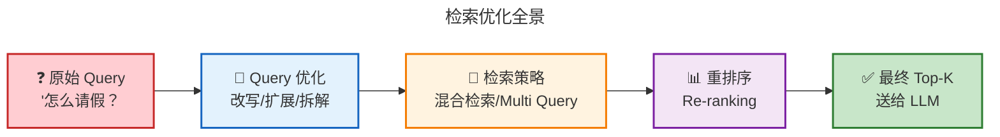

### 4.2 Query 改写（Query Rewrite）

> 📖 **名词解释 — Query Rewrite（查询改写）**
>
> **Query** = 用户的原始查询/问题
> **Rewrite** = 改写、重写
>
> 用户的问题往往不够好（太短、太口语化、有歧义），直接用原句检索效果差。Query 改写就是**让 LLM 把用户问题改写成更适合检索的形式**。
>
> 相关术语：
> | 术语 | 解释 |
> |------|------|
> | **Multi Query** | 让 LLM 生成多个改写版本，分别检索后合并结果 |
> | **Decomposition** | 把复杂问题拆成多个子问题，分别检索 |
> | **Step-back** | 先问一个更抽象的问题获取背景，再用背景信息检索 |

**类比理解**：用户的问题像**病人的口述**——"我肚子不舒服"，你需要把它翻译成**医生的术语**——"腹痛、恶心、持续 2 天"，才能高效查到病历。

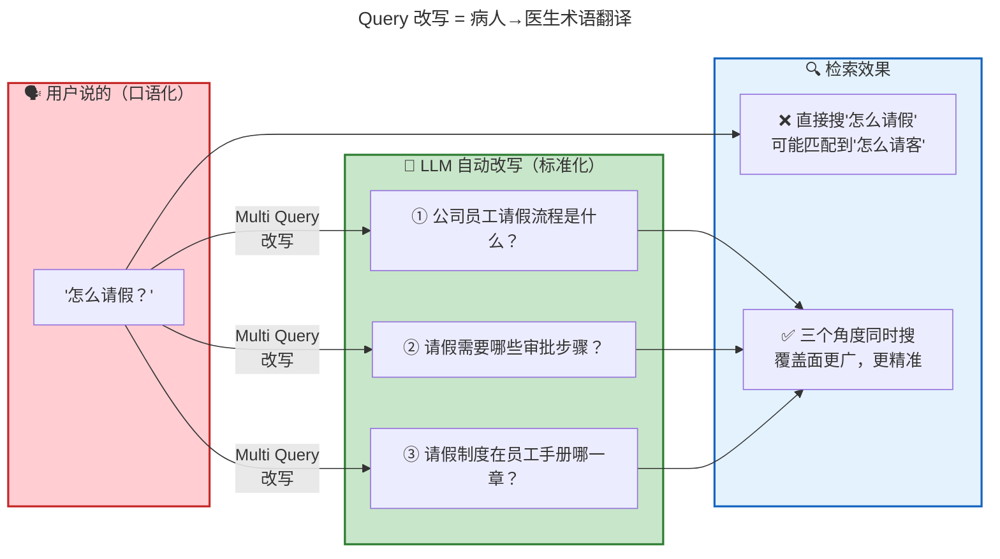

**面试重点** ⭐⭐⭐⭐ [高频 | 中级 | 原理题]：
> Q：Query 改写有哪些方法？

| 方法 | 原理 | 适用场景 | LangChain 实现 |
|------|------|---------|---------------|
| **Multi Query** | LLM 生成多个改写版本，分别检索后合并 | 原始 Query 模糊 | `MultiQueryRetriever` |
| **Decomposition** | 把复杂问题拆成多个子问题，分别检索 | 多跳推理问题 | 自定义 Chain |
| **Step-back** | 先问一个更抽象的问题，获取背景信息 | 需要背景知识 | `StepBackPrompt` |

**Multi Query 代码**：

<!-- [AGC:START] tool=Cc author=fangkun -->
```python
from langchain.retrievers.multi_query import MultiQueryRetriever
from langchain_community.chat_models import Tongyi

llm = Tongyi(model_name="qwen-plus")
retriever = vectorstore.as_retriever()

# LLM 会自动生成 3 个不同角度的 Query
multi_retriever = MultiQueryRetriever.from_llm(
    retriever=retriever,
    llm=llm
)

# 原始问题："怎么请假？"
# 自动改写为：
# 1. "公司员工请假流程是什么？"
# 2. "请假需要哪些审批步骤？"
# 3. "请假制度在员工手册的哪一章？"
docs = multi_retriever.invoke("怎么请假？")
```
<!-- [AGC:END] -->

### 4.3 HyDE（Hypothetical Document Embeddings）

> 📖 **名词解释 — HyDE**
>
> **Hypothetical** = 假设的
> **Document** = 文档
> **Embeddings** = 向量嵌入
>
> 合起来：**生成一个"假设性文档"，用它的向量去检索真实文档**。
>
> 核心思路：用户问题和知识库文档的表述风格不同，直接检索效果差。HyDE 让 LLM 先"假装写一篇答案"，这篇假答案的表述风格更接近真实文档，用它检索效果更好。
>
> 由论文《Precise Zero-Shot Dense Retrieval without Relevance Labels》（2022）提出。

**类比理解**：HyDE 像**模拟考**——先让 LLM "假装写一篇答案"，然后用这篇"模拟答案"去查资料。因为模拟答案的表述方式和真实文档更接近，比直接用问题去搜效果好得多。

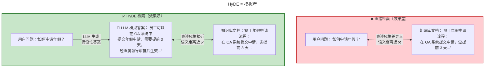

**面试重点** ⭐⭐⭐⭐⭐ [高频 | 高级 | 原理题]：
> Q：什么是 HyDE？它解决了什么问题？
>
> A：**核心原理**：用户问题和文档的表述方式不同，直接做向量检索效果不好。HyDE 让 LLM 先"假装回答"，用生成的**假设性答案**去做检索，因为假设性答案和真实文档的表述风格更接近。

**适用场景**：
- 用户问题很短或很口语化
- 用户问题和文档的表述风格差异大

**不适用**：
- 需要精确事实匹配（如查数据、查编号）
- 文档和 Query 表述已经一致

### 4.4 Re-ranking（重排序）

> 📖 **名词解释 — Re-ranking（重排序）与两种编码器**
>
> **Re-ranking** = 重新排序，对初步检索结果做精排
>
> 两种核心编码器：
> | 术语 | 英文全称 | 原理 | 速度 | 精度 |
> |------|---------|------|------|------|
> | **Bi-Encoder** | 双编码器 | Query 和 Doc **分别编码**成向量，算余弦相似度 | ⚡ 快（毫秒） | 中 |
> | **Cross-Encoder** | 交叉编码器 | Query 和 Doc **拼接后一起编码**，直接输出相关性分数 | 🐌 慢（百毫秒） | **高** |
>
> **典型流程**：Bi-Encoder 粗筛 Top-20（快）→ Cross-Encoder 精排 Top-5（准）

**类比理解**：Re-ranking 像**招聘**——先用"关键词筛选"快速过一遍简历（向量检索），再用"面试官逐个面谈"精挑细选（Cross-Encoder）。

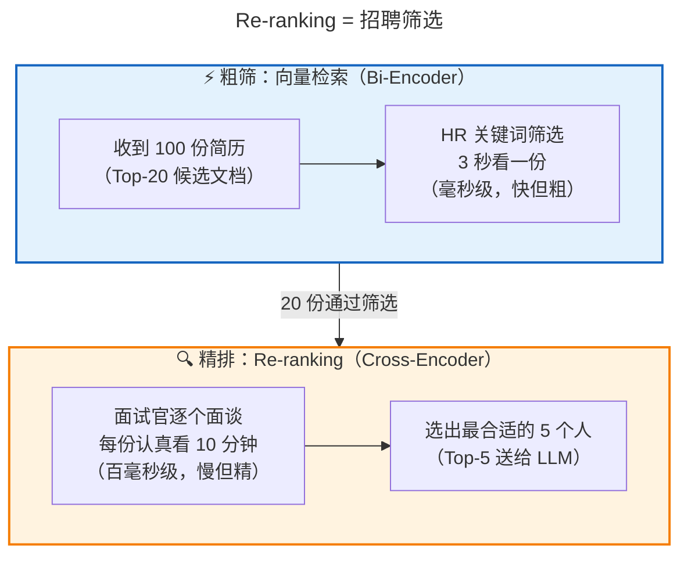

**面试对比**：

| 模型类型 | 速度 | 精度 | 原理 |
|---------|------|------|------|
| Bi-Encoder（Embedding） | 快（毫秒级） | 中 | Query 和 Doc 分别编码，算余弦相似度 |
| Cross-Encoder | 慢（百毫秒级） | **高** | Query 和 Doc 拼接后一起编码，直接打分 |

**生产推荐**：

<!-- [AGC:START] tool=Cc author=fangkun -->
```python
from langchain.retrievers import ContextualCompressionRetriever
from langchain.retrievers.document_compressors import CrossEncoderReranker
from langchain_community.cross_encoders import HuggingFaceCrossEncoder

# 1. 先用向量检索粗筛
base_retriever = vectorstore.as_retriever(search_kwargs={"k": 20})

# 2. 用 Cross-Encoder 精排
model = HuggingFaceCrossEncoder(model_name="BAAI/bge-reranker-v2-m3")
compressor = CrossEncoderReranker(model=model, top_n=5)

# 3. 组合成 Re-ranking Retriever
reranking_retriever = ContextualCompressionRetriever(
    base_compressor=compressor,
    base_retriever=base_retriever
)
```
<!-- [AGC:END] -->

### 4.5 Hybrid Search（混合检索）

> 📖 **名词解释 — Hybrid Search（混合检索）与 BM25**
>
> **Hybrid Search** = 混合检索，同时使用**语义检索**和**关键词检索**两种方式
>
> 核心术语：
> | 术语 | 解释 |
> |------|------|
> | **BM25** | 经典关键词检索算法（Best Matching 25），根据词频和稀有度给文档打分。是 TF-IDF 的改进版 |
> | **TF-IDF** | Term Frequency - Inverse Document Frequency，词频越高越重要，在越少文档中出现越重要 |
> | **RRF（Reciprocal Rank Fusion）** | 倒数排名融合，把多路检索结果按排名融合的统一算法。公式：`score = Σ 1/(k + rank)` |
> | **语义检索** | 用向量相似度匹配（擅长理解意思） |
> | **关键词检索** | 用精确关键词匹配（擅长找专有名词） |

**类比理解**：混合检索像**看病用两种检查**——CT 扫描（向量检索，看整体）+ 验血（关键词检索，看具体指标），两种结果综合判断最准确。

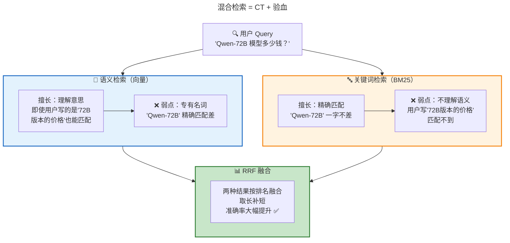

**RRF（Reciprocal Rank Fusion）融合公式**：
```
RRF_score(d) = Σ 1/(k + rank_i(d))
```
其中 `k` 通常取 60，`rank_i(d)` 是文档 d 在第 i 个检索结果中的排名。

**LangChain 实现**：

<!-- [AGC:START] tool=Cc author=fangkun -->
```python
from langchain.retrievers import EnsembleRetriever
from langchain_community.retrievers import BM25Retriever

# BM25 关键词检索
bm25_retriever = BM25Retriever.from_documents(chunks)
bm25_retriever.k = 10

# 向量语义检索
vector_retriever = vectorstore.as_retriever(search_kwargs={"k": 10})

# 混合检索（EnsembleRetriever 默认用 RRF 融合）
hybrid_retriever = EnsembleRetriever(
    retrievers=[bm25_retriever, vector_retriever],
    weights=[0.4, 0.6]  # BM25 权重 0.4，向量检索权重 0.6
)
```
<!-- [AGC:END] -->

**生产经验** 💡💡💡：
> - 混合检索在企业场景中**几乎总是比纯向量检索好**
> - 特别是包含专有名词、产品编号、人名的场景
> - `weights` 需要根据实际效果调优，一般语义匹配权重略高（0.5~0.7）

### 4.6 Metadata Filtering（元数据过滤）

> 📖 **名词解释 — Metadata（元数据）**
>
> **Metadata** = Meta（关于）+ Data（数据）= **关于数据的数据**
>
> 给每个文档块标注额外信息（来源、日期、部门、类别等），检索时先用这些标签过滤缩小范围，再做向量检索。
>
> 类比：图书馆先按"楼层-区域-书架"定位（Metadata 过滤），再在书架上找具体的书（向量检索）。

**类比理解**：Metadata Filtering 像**图书馆的分类检索**——你先说"我要去计算机区"（部门过滤），再在计算机区里找具体的书（向量检索）。

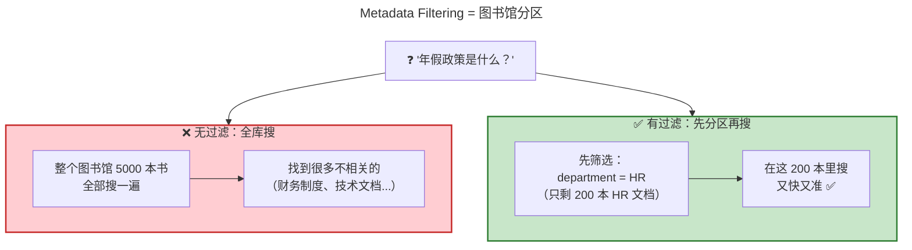

<!-- [AGC:START] tool=Cc author=fangkun -->
```python
from langchain_core.documents import Document

# 给文档块添加元数据
docs_with_metadata = []
for doc in chunks:
    doc.metadata["source"] = "employee_handbook"
    doc.metadata["department"] = "hr"
    doc.metadata["year"] = 2026
    docs_with_metadata.append(doc)

# 检索时用元数据过滤
retriever = vectorstore.as_retriever(
    search_type="similarity",
    search_kwargs={
        "k": 5,
        "filter": {"department": "hr"}  # 只检索 HR 部门的文档
    }
)
```
<!-- [AGC:END] -->

**适用场景**：
- 多部门知识库（只检索相关部门的文档）
- 多版本文档（只检索最新版本的）
- 多类型文档（只检索 FAQ，不检索政策文件）

---

## 五、生成优化（Generation Optimization）

> 📖 **名词解释 — Generation（生成阶段）**
>
> 在 RAG 中，Generation 指**把检索到的文档和用户问题组装成 Prompt，送入 LLM 生成最终回答**的过程。
>
> 核心术语：
> | 术语 | 解释 |
> |------|------|
> | **Prompt** | 提示词，喂给 LLM 的完整输入文本 |
> | **Context** | 上下文，这里特指检索到的文档片段 |
> | **Token** | LLM 处理文本的最小单位（约 1 个中文字 ≈ 1.5 token，1 个英文单词 ≈ 1 token） |
> | **幻觉（Hallucination）** | LLM 编造不存在的信息，看起来很专业但实际是假的 |
> | **溯源（Attribution）** | 回答中标注信息来源，让用户可以验证 |

### 5.1 Prompt Engineering for RAG

**类比理解**：RAG 的 Prompt 就像给 LLM 的**考试规则**——"只能抄资料，不能自己编，找不到就说不知道"。

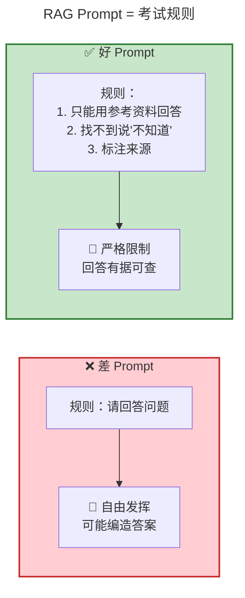

**标准 RAG Prompt 模板**：

```
你是一个企业知识库助手。请根据以下参考资料回答用户问题。

规则：
1. 只能使用参考资料中的信息回答
2. 如果参考资料中没有相关信息，请回复"根据现有资料无法回答"
3. 回答时标注信息来源（引用文档编号）
4. 回答要简洁、准确、有条理

参考资料：
{context}

用户问题：{question}

回答：
```

### 5.2 Contextual Compression（上下文压缩）

> 📖 **名词解释 — Contextual Compression（上下文压缩）**
>
> **Contextual** = 上下文的、与语境相关的
> **Compression** = 压缩
>
> 检索到的文档块可能很长，但只有几句话和问题相关。压缩器**提取出和 Query 最相关的片段**，去掉无关内容，减少 Token 消耗和噪声。
>
> 对比：
> | 方法 | 做法 | 优缺点 |
> |------|------|--------|
> | LLM 提取 | 用 LLM 抽取相关句子 | 准确但慢（多一次 LLM 调用） |
> | 截断 | 直接截取前 N 个字符 | 快但可能截掉关键信息 |
> | 关键词定位 | 找到包含关键词的段落 | 折中方案 |

**类比理解**：像**给 LLM 划重点**——100 页的文档块里可能只有 3 句话和问题相关，压缩器帮你把这 3 句话划出来，省 Token 又减噪声。

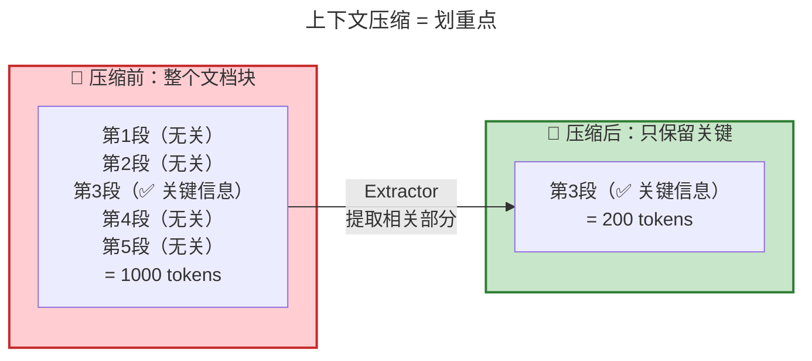

<!-- [AGC:START] tool=Cc author=fangkun -->
```python
from langchain.retrievers.document_compressors import LLMChainExtractor
from langchain.retrievers import ContextualCompressionRetriever

# 用 LLM 提取和 Query 相关的片段
extractor = LLMChainExtractor.from_llm(llm)

compression_retriever = ContextualCompressionRetriever(
    base_compressor=extractor,
    base_retriever=retriever
)
```
<!-- [AGC:END] -->

**生产经验** 💡：
> - 压缩能**显著降低 Token 消耗**（节省 30%~60%）
> - 但会增加一次 LLM 调用延迟
> - 如果对延迟敏感，可以用更轻量的方法：截断 + 关键词高亮定位

### 5.3 Chain Types（文档组合策略）

> 📖 **名词解释 — Chain Types（链类型）**
>
> 检索到多个文档块后，如何把它们"喂"给 LLM？不同的组合方式叫不同的 Chain Type：
>
> | 术语 | 直译 | 一句话解释 |
> |------|------|-----------|
> | **stuff** | 塞进去 | 把所有文档块**拼在一起**一次性送给 LLM。最简单，但 Token 超限会报错 |
> | **refine** | 逐步精炼 | **逐块阅读**，每读完一块就更新答案。能处理大量文档，但慢 |
> | **map_reduce** | 映射-归约 | 每块**独立生成**答案，最后**汇总**所有答案。可并行，但可能丢失全局关系 |
> | **map_rerank** | 映射-排序 | 每块独立回答并**打分**，只取分数最高的。准确率高，但浪费其他块的信息 |
>
> **map_reduce** 来自大数据领域的 MapReduce 编程模型（Google 2004 年提出）。

**类比理解**：检索到多个文档后怎么给 LLM？像**做菜用食材**——

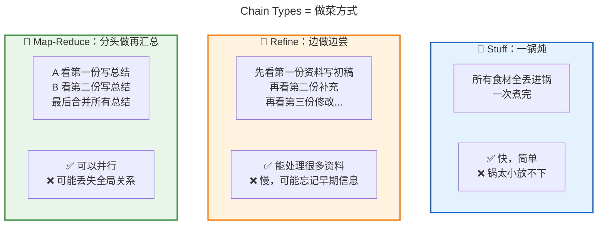

**面试重点** ⭐⭐⭐ [中频 | 中级 | 概念题]：
> Q：检索到多个文档后，怎么组合送给 LLM？

| Chain Type     | 原理                  | 适用场景              | 优缺点                 |
| -------------- | ------------------- | ----------------- | ------------------- |
| **stuff**      | 把所有文档拼在一起，一次性送给 LLM | 文档少（<5 块）、Token 够 | 简单快速，但 Token 超限会报错  |
| **refine**     | 逐块阅读，逐步完善答案         | 文档多、需要综合多处信息      | 能处理大量文档，但慢且可能丢失早期信息 |
| **map_reduce** | 每块独立生成答案，再汇总        | 文档多、需要全面覆盖        | 可并行，但可能丢失全局关系       |
| **map_rerank** | 每块独立回答并打分，取最高分      | 需要最相关的单块回答        | 准确率较高，但浪费其他块的信息     |

---

## 六、Advanced RAG 进阶架构

> 📖 **名词解释 — Advanced RAG（进阶 RAG）**
>
> 在 Naive RAG 的基础上，通过**优化检索质量和生成质量**来提升整体效果的各种架构。
>
> 本文介绍的四种进阶架构：
> | 架构 | 核心思想 | 一句话总结 |
> |------|---------|-----------|
> | **Self-RAG** | LLM 自己判断是否需要检索、检索结果是否有用 | 自省的写手 |
> | **CRAG** | 检索后评估文档质量，质量差则纠正 | 质检员 |
> | **Graph RAG** | 用知识图谱补充向量检索，捕捉实体关系 | 关系网络 |
> | **Agentic RAG** | LLM 作为 Agent 自主决定使用什么工具 | 自主决策的 CEO |

### 6.1 Advanced RAG 全景图

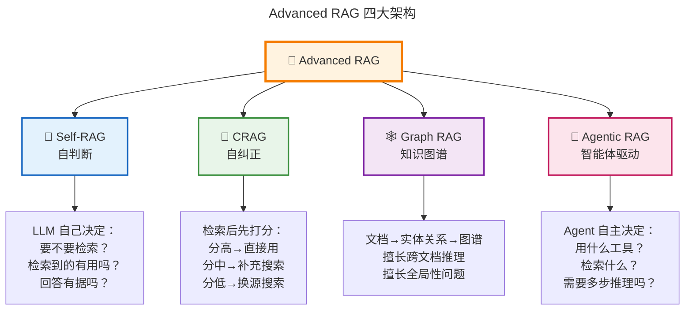

### 6.2 Self-RAG

**类比理解**：Self-RAG 像一个**会自省的写手**——写之前先想"我要不要查资料？"，写完还要检查"我写的内容资料里有吗？"

```mermaid
---
title: "Self-RAG = 会自省的写手"
---
flowchart TD
    Q["❓ 用户问题"] --> JUDGE1{"🤔 需要查资料吗？<br/>（Retrieve 判断）"}
    JUDGE1 -->|"不需要<br/>（我知道答案）"| A1["✅ 直接回答"]
    JUDGE1 -->|"需要"| SEARCH["🔍 检索文档"]

    SEARCH --> JUDGE2{"📄 文档相关吗？<br/>（IsRelevant 判断）"}
    JUDGE2 -->|"不相关"| RETRY["🔄 重新检索或放弃"]
    JUDGE2 -->|"相关"| GENERATE["✍️ 生成回答"]

    GENERATE --> JUDGE3{"📋 回答有据吗？<br/>（IsSupported 判断）"}
    JUDGE3 -->|"无依据<br/>（幻觉！）"| REGEN["🔄 重新生成"]
    JUDGE3 -->|"有据可查"| FINAL["✅ 输出回答"]

    style Q fill:#e3f2fd,stroke:#1565c0,stroke-width:2px
    style JUDGE1 fill:#fff3e0,stroke:#f57c00,stroke-width:2px
    style JUDGE2 fill:#fff3e0,stroke:#f57c00,stroke-width:2px
    style JUDGE3 fill:#fff3e0,stroke:#f57c00,stroke-width:2px
    style A1 fill:#c8e6c9,stroke:#2e7d32,stroke-width:2px
    style FINAL fill:#c8e6c9,stroke:#2e7d32,stroke-width:2px
    style REGEN fill:#ffcdd2,stroke:#c62828,stroke-width:2px
```

**面试重点** ⭐⭐⭐⭐ [中频 | 高级 | 原理题]：
> Q：什么是 Self-RAG？
>
> A：核心思想是让 LLM **自己判断**三个信号：
> 1. **Retrieve**：需要检索吗？（有些问题不需要外部知识）
> 2. **IsRelevant**：检索到的文档和问题相关吗？
> 3. **IsSupported**：生成的回答被文档支持吗？（幻觉检测）

### 6.3 Corrective RAG (CRAG)

**类比理解**：CRAG 像**质检员**——产品做完了先检查，质量合格直接发货，不合格返工或换材料。

```mermaid
---
title: "CRAG = 质检员"
---
flowchart TB
    SEARCH["🔍 检索文档"] --> QC["🔬 评估器打分"]

    QC --> HIGH{"分数 > 0.7？"}
    HIGH -->|"高质量 ✅"| REFINE1["知识精炼"]
    REFINE1 --> GEN1["✅ 生成回答"]

    QC --> MID{"0.3 < 分数 < 0.7？"}
    MID -->|"中等 ⚠️"| REFINE2["知识精炼<br/>+ 网络搜索补充"]
    REFINE2 --> GEN2["✅ 生成回答"]

    QC --> LOW{"分数 < 0.3？"}
    LOW -->|"低质量 ❌"| WEB["🌐 触发网络搜索<br/>（换源）"]
    WEB --> GEN3["✅ 生成回答"]

    style SEARCH fill:#e3f2fd,stroke:#1565c0,stroke-width:2px
    style QC fill:#fff3e0,stroke:#f57c00,stroke-width:2px
    style GEN1 fill:#c8e6c9,stroke:#2e7d32,stroke-width:2px
    style GEN2 fill:#c8e6c9,stroke:#2e7d32,stroke-width:2px
    style GEN3 fill:#c8e6c9,stroke:#2e7d32,stroke-width:2px
    style WEB fill:#ffcdd2,stroke:#c62828,stroke-width:2px
```

### 6.4 Graph RAG

> 📖 **名词解释 — Graph RAG 与知识图谱**
>
> **Graph** = 图（数学中的图论概念，由节点和边组成）
> **Knowledge Graph（知识图谱）** = 用"节点-边-节点"的结构表示实体之间的关系
>
> 核心术语：
> | 术语 | 解释 |
> |------|------|
> | **Entity（实体）** | 图谱中的节点，如"张三"、"A 公司" |
> | **Relation（关系）** | 图谱中的边，如"张三 → 就职于 → A 公司" |
> | **Triple（三元组）** | 一组（实体1, 关系, 实体2），如（张三, 就职于, A 公司） |
> | **子图（Subgraph）** | 图谱中的一部分，检索时只取和问题相关的子图 |
>
> 由微软在 2024 年论文《From Local to Global: A Graph RAG Approach to Query-Focused Summarization》中提出。

**类比理解**：传统 RAG 像**翻字典**——一个问题查一个词条。Graph RAG 像**看关系图谱**——直接看到 A 和 B 的关系连线。

```mermaid
---
title: "Graph RAG = 关系图谱"
---
flowchart LR
    subgraph 传统RAG["❌ 传统 RAG（翻字典）"]
        D1["文档A：张三负责前端"]
        D2["文档B：李四负责后端"]
        D3["文档C：张三和李四<br/>一起做了 X 项目"]
        Q1["❓ '张三和李四有<br/>什么合作关系？'<br/>→ 信息分散在 3 个文档<br/>可能找不到 ❌"]
    end

    subgraph GraphRAG["✅ Graph RAG（看图谱）"]
        E1(("张三")) ---|"同事"| E2(("李四"))
        E2 ---|"同组"| E3(("王五"))
        E1 ---|"负责"| E4["X 项目"]
        E2 ---|"负责"| E4
        Q2["❓ '张三和李四的关系？'<br/>→ 图谱中直接看到连线 ✅"]
    end

    style 传统RAG fill:#ffcdd2,stroke:#c62828,stroke-width:2px
    style GraphRAG fill:#c8e6c9,stroke:#2e7d32,stroke-width:2px
```

**面试重点** ⭐⭐⭐⭐ [中频 | 高级 | 原理题]：
> Q：Graph RAG 解决了什么问题？
>
> A：传统 RAG 检索的是独立文档块，无法处理**跨文档的关系推理**和**全局性问题**。Graph RAG 用知识图谱补充向量检索，图谱能捕捉实体间的关系。

**适用场景**：
- 需要跨文档推理（"这个项目涉及哪些部门？"）
- 实体关系密集（合同、组织架构、供应链）
- 全局性摘要（"总结公司所有产品线"）

### 6.5 Agentic RAG

> 📖 **名词解释 — Agentic RAG 与 Agent（智能体）**
>
> **Agentic** = 具有 Agent 特性的
> **Agent（智能体）** = 能够**自主感知环境、做出决策、采取行动**的 AI 系统
>
> 核心术语：
> | 术语 | 解释 |
> |------|------|
> | **Tool（工具）** | Agent 可以调用的外部能力，如"搜索知识库"、"查数据库"、"执行代码" |
> | **LangGraph** | LangChain 出品的 Agent 编排框架，用图结构定义 Agent 的工作流 |
> | **ReAct** | Reasoning + Acting 的缩写，Agent 先思考（Reason）再行动（Act）的循环模式 |
> | **Multi-step Reasoning** | 多步推理，一个问题需要分多步解决 |
>
> 普通 RAG 是"固定流水线"，Agentic RAG 是"有自主判断力的员工"。

**类比理解**：普通 RAG 像**流水线工人**（固定流程），Agentic RAG 像**CEO**（自主决策用什么工具、怎么解决问题）。

```mermaid
---
title: "Agentic RAG = CEO 决策"
---
flowchart TB
    subgraph 普通RAG["🏭 普通 RAG（流水线工人）"]
        P1["❓ 问题"] -->|"固定流程"| P2["🔍 检索"]
        P2 -->|"固定流程"| P3["✍️ 生成"]
        P3 --> P4["📤 回答"]
    end

    subgraph AgenticRAG["🤖 Agentic RAG（CEO）"]
        A1["❓ 问题"] --> A2["🤔 Agent 思考"]
        A2 -->|"我来查知识库"| A3["📚 向量检索"]
        A2 -->|"需要查数据库"| A4["🗄️ SQL 查询"]
        A2 -->|"需要搜互联网"| A5["🌐 网络搜索"]
        A2 -->|"需要算数据"| A6["🧮 代码执行"]
        A3 & A4 & A5 & A6 --> A7["🤔 综合判断"]
        A7 -->|"信息够了"| A8["✅ 回答"]
        A7 -->|"信息不够"| A2
    end

    style 普通RAG fill:#e3f2fd,stroke:#1565c0,stroke-width:2px
    style AgenticRAG fill:#fce4ec,stroke:#c2185b,stroke-width:2px
```

**面试重点** ⭐⭐⭐⭐⭐ [高频 | 高级 | 原理题]：
> Q：Agentic RAG 和普通 RAG 有什么区别？
>
> A：普通 RAG 是**固定流程**（检索→生成），Agentic RAG 让 LLM 像一个 Agent 一样**自主决定**用什么工具、检索什么、是否需要多步推理。

**LangGraph 实现**（LangChain 1.2）：

<!-- [AGC:START] tool=Cc author=fangkun -->
```python
from langgraph.graph import StateGraph, END
from langchain.tools import Tool
from langchain.agents import create_react_agent

# 定义工具
tools = [
    Tool(name="vector_search", func=retriever.invoke, description="搜索知识库"),
    Tool(name="sql_query", func=sql_chain.run, description="查询数据库"),
    Tool(name="web_search", func=search.run, description="网络搜索"),
]

# Agent 自主决定使用哪些工具
agent = create_react_agent(llm, tools)

# 在 LangGraph 中编排复杂流程
workflow = StateGraph(AgentState)
workflow.add_node("agent", agent_step)
workflow.add_node("tools", tool_step)
workflow.add_conditional_edges("agent", should_continue, {
    "continue": "tools",
    "end": END
})
workflow.add_edge("tools", "agent")
```
<!-- [AGC:END] -->

---

## 七、RAG 评估体系

> 📖 **名词解释 — RAG Evaluation（RAG 评估）**
>
> 评估 RAG 系统的好坏，需要从两个维度分别打分：
>
> | 维度 | 评估什么 | 核心指标 |
> |------|---------|---------|
> | **检索质量** | 找到的文档对不对、全不全 | Context Precision + Context Recall |
> | **生成质量** | 回答得准不准、切不切题 | Faithfulness + Answer Relevancy |
>
> 四大核心指标：
> | 指标 | 英文含义 | 一句话解释 |
> |------|---------|-----------|
> | **Faithfulness** | 忠实度 | 回答中的每一句话都能在检索到的文档中找到依据吗？ |
> | **Answer Relevancy** | 答案相关性 | 回答是否切题？（是否回答了用户的问题？） |
> | **Context Precision** | 上下文精确度 | 检索到的文档中，有多少是真正相关的？（宁缺毋滥） |
> | **Context Recall** | 上下文召回率 | 标准答案中的关键信息，有多少被检索到了？（宁多勿漏） |

### 7.1 核心评估指标

**类比理解**：RAG 评估像**考试评分**——不仅看答案对不对（生成质量），还看翻书翻得好不好（检索质量）。

```mermaid
---
title: "RAG 评估 = 考试评分"
---
flowchart TB
    EVAL["📊 RAG 评估体系"]

    EVAL --> GEN["✍️ 生成质量（答案写得好不好）"]
    EVAL --> RET["🔍 检索质量（书翻得好不好）"]

    GEN --> F["📋 Faithfulness 忠实度<br/>答案里的话资料里都有吗？<br/>（不能自己编）"]
    GEN --> AR["🎯 Answer Relevancy 相关性<br/>答案回答了问题吗？<br/>（不能答非所问）"]

    RET --> CP["🎯 Context Precision 精确度<br/>翻到的资料都是相关的吗？<br/>（别翻一堆没用的）"]
    RET --> CR["📋 Context Recall 召回率<br/>该翻的都翻到了吗？<br/>（别漏掉关键信息）"]

    style EVAL fill:#fff3e0,stroke:#f57c00,stroke-width:3px
    style GEN fill:#e3f2fd,stroke:#1565c0,stroke-width:2px
    style RET fill:#e8f5e9,stroke:#388e3c,stroke-width:2px
    style F fill:#e3f2fd,stroke:#1565c0
    style AR fill:#e3f2fd,stroke:#1565c0
    style CP fill:#e8f5e9,stroke:#388e3c
    style CR fill:#e8f5e9,stroke:#388e3c
```

**面试重点** ⭐⭐⭐⭐ [高频 | 中级 | 概念题]：
> Q：RAG 系统怎么评估？有哪些指标？

| 指标 | 评估什么 | 怎么算 | 重要性 |
|------|---------|--------|--------|
| **Faithfulness**（忠实度） | 回答是否忠于检索到的文档 | 从回答中提取声明 → 检查每个声明能否从上下文中推导 | ⭐⭐⭐⭐⭐ |
| **Answer Relevancy**（答案相关性） | 回答是否切题 | 从答案反向生成问题 → 计算和原始问题的相似度 | ⭐⭐⭐⭐ |
| **Context Precision**（上下文精确度） | 检索到的文档中，相关的占比 | 相关文档排名越靠前越好 | ⭐⭐⭐⭐ |
| **Context Recall**（上下文召回率） | 标准答案中的信息，是否都被检索到了 | 标准答案的要点 → 检查是否出现在检索结果中 | ⭐⭐⭐⭐ |

### 7.2 评估工具对比

> 📖 **名词解释 — RAG 评估工具**
>
> | 工具 | 全称/来源 | 一句话定位 |
> |------|----------|-----------|
> | **RAGAS** | Retrieval Augmented Generation Assessment | 最流行的开源 RAG 评估框架，覆盖四大核心指标 |
> | **DeepEval** | - | 类 Pytest 风格的 LLM 评估框架，14+ 指标，含幻觉检测 |
> | **TruLens** | True Lens（真实透镜） | 专注 LLM 可观测性（Observability），持续监控生产环境 |
> | **LangSmith** | - | LangChain 官方的调试和评估平台，全链路追踪 |
> | **Ground Truth** | 标准答案 | 人工标注的正确答案，用于对比 RAG 系统的输出 |

| 工具 | 特点 | 指标 | 集成难度 | 推荐场景 |
|------|------|------|---------|---------|
| **RAGAS** | 专门做 RAG 评估、开源 | 4 个核心指标全覆盖 | 低 | **首选**，最常用 |
| **DeepEval** | 全面、类 Pytest 风格 | 14+ 指标，含幻觉检测 | 中 | 需要更丰富指标 |
| **TruLens** | 专注可观测性 + 评估 | 3 个核心指标 | 中 | 需要持续监控 |
| **LangSmith** | LangChain 官方、全链路追踪 | 自定义评估 | 低（LangChain 用户） | 用 LangChain 的项目 |

### 7.3 RAGAS 评估示例

<!-- [AGC:START] tool=Cc author=fangkun -->
```python
from ragas import evaluate
from ragas.metrics import (
    faithfulness,
    answer_relevancy,
    context_precision,
    context_recall
)
from datasets import Dataset

# 准备评估数据
eval_data = {
    "question": ["公司年假政策是什么？", "如何报销差旅费？"],
    "answer": [  # RAG 系统生成的回答
        "员工入职满一年后享有 5 天带薪年假...",
        "差旅报销需要在 OA 系统提交申请..."
    ],
    "contexts": [  # 检索到的文档块
        ["根据员工手册第 3 章，年假规定如下..."],
        ["财务制度第 5 条：差旅报销流程..."]
    ],
    "ground_truth": [  # 人工标注的标准答案
        "员工入职满 1 年享 5 天年假，满 5 年享 10 天，满 10 年享 15 天。",
        "在 OA 系统提交报销单，附发票，经部门经理和财务审批后打款。"
    ]
}

dataset = Dataset.from_dict(eval_data)

# 执行评估
results = evaluate(
    dataset=dataset,
    metrics=[faithfulness, answer_relevancy, context_precision, context_recall]
)

# 查看结果
print(results)
# {'faithfulness': 0.85, 'answer_relevancy': 0.92, 'context_precision': 0.88, 'context_recall': 0.78}
```
<!-- [AGC:END] -->

### 7.4 生产评估流程

```mermaid
---
title: "生产环境 RAG 评估流程"
---
flowchart TB
    subgraph 离线["📋 ① 离线评估（每次迭代前）"]
        O1["维护 100~500 条<br/>标注数据集"]
        O2["跑 RAGAS 四指标<br/>和上一版本对比"]
        O3["指标下降 → 不上线 ❌"]
        O1 --> O2 --> O3
    end

    subgraph 在线["📡 ② 在线监控（持续运行）"]
        M1["记录每次请求的<br/>Query/检索/回答"]
        M2["用户反馈<br/>点赞 👍 / 点踩 👎"]
        M3["监控延迟<br/>Token 消耗"]
    end

    subgraph 回归["🔄 ③ 定期回归（每周/月）"]
        R1["收集点踩 Case<br/>加入测试集"]
        R2["重新跑评估<br/>确保不退化"]
        R1 --> R2
    end

    离线 -->|"上线"| 在线 -->|"每周"| 回归 -->|"优化"| 离线

    style 离线 fill:#e3f2fd,stroke:#1565c0,stroke-width:2px
    style 在线 fill:#fff3e0,stroke:#f57c00,stroke-width:2px
    style 回归 fill:#e8f5e9,stroke:#388e3c,stroke-width:2px
```

---

## 八、生产踩坑实录

> 📖 **名词解释 — 生产环境常见问题术语**
>
> | 术语 | 解释 |
> |------|------|
> | **幻觉（Hallucination）** | LLM 编造不存在的信息，看起来自信但实际是假的 |
> | **延迟（Latency）** | 从用户提问到收到回答的时间差，单位毫秒（ms） |
> | **吞吐量（Throughput）** | 单位时间内系统能处理的请求数，单位 QPS（Queries Per Second） |
> | **Token 消耗** | LLM 每次调用消耗的 token 数，直接决定 API 费用 |
> | **置信度（Confidence Score）** | 系统对回答正确性的信心程度，低于阈值时应转人工 |
> | **Bad Case** | 效果不好的案例，用于排查问题和回归测试 |
> | **回归测试（Regression Test）** | 每次修改后重新跑测试，确保不会把好的变差 |

### 8.1 按 Pipeline 阶段分类

```mermaid
---
title: "生产问题分布图"
---
flowchart LR
    subgraph Indexing问题["📦 Indexing 阶段"]
        I1["🔴 文档解析质量差"]
        I2["🔴 分块策略不合理"]
        I3["🟡 Embedding 模型不匹配"]
    end

    subgraph Retrieval问题["🔍 Retrieval 阶段"]
        R1["🔴 检索结果不相关"]
        R2["🔴 相关文档没检索到"]
        R3["🟡 检索太慢"]
    end

    subgraph Gen问题["✍️ Generation 阶段"]
        G1["🔴 幻觉（编造答案）"]
        G2["🔴 回答和文档矛盾"]
        G3["🟡 回答太啰嗦"]
        G4["🟡 延迟太高"]
    end

    subgraph 系统问题["⚙️ 系统层面"]
        S1["🟡 Token 成本失控"]
        S2["🟡 并发能力不足"]
    end

    style Indexing问题 fill:#e3f2fd,stroke:#1565c0,stroke-width:2px
    style Retrieval问题 fill:#fff3e0,stroke:#f57c00,stroke-width:2px
    style Gen问题 fill:#f3e5f5,stroke:#7b1fa2,stroke-width:2px
    style 系统问题 fill:#fce4ec,stroke:#c2185b,stroke-width:2px
```

| 阶段 | 常见问题 | 严重程度 | 解决方案 |
|------|---------|---------|---------|
| **Indexing** | 文档解析质量差（PDF 表格、图片） | 🔴 高 | 用专业解析库（pdfplumber, Unstructured），表格单独处理 |
| **Indexing** | 分块策略不合理（边界截断） | 🔴 高 | 调整 chunk_size/overlap，按语义分块 |
| **Indexing** | Embedding 模型不匹配（中英文混用） | 🟡 中 | 中文场景用国产模型，英文用 OpenAI |
| **Retrieval** | 检索结果不相关 | 🔴 高 | 混合检索 + Re-ranking（详见第四节） |
| **Retrieval** | 相关文档没被检索到 | 🔴 高 | 扩大 Top-K，降低 score_threshold，Query 改写 |
| **Retrieval** | 检索太慢 | 🟡 中 | 换更快的向量库，加缓存，减小数据规模 |
| **Generation** | 幻觉（回答不在文档中） | 🔴 高 | Prompt 加强约束，加 Faithfulness 评估 |
| **Generation** | 回答和文档矛盾 | 🔴 高 | 检查 Prompt 是否有冲突，检查文档版本 |
| **Generation** | 回答太啰嗦 | 🟡 中 | Prompt 中限制长度，或加后处理 |
| **Generation** | 延迟太高 | 🟡 中 | 用更快的模型，流式输出，减少 Top-K |
| **系统** | Token 成本失控 | 🟡 中 | 上下文压缩，缓存，精简文档 |
| **系统** | 并发能力不足 | 🟡 中 | 向量库集群，LLM 负载均衡 |

### 8.2 高频问题详解

#### 问题 1：检索结果不相关（最高频 🔴）

**症状**：用户问"年假政策"，检索出来的是"加班制度"。

**排查流程图**：

```mermaid
---
title: "检索不相关排查流程"
---
flowchart TD
    PROBLEM["🔴 检索结果不相关"]

    PROBLEM --> CHECK1{"① Embedding<br/>模型对吗？"}
    CHECK1 -->|"中文用了英文模型"| FIX1["换 bge/m3e"]
    CHECK1 -->|"模型太旧"| FIX1B["升级到最新版"]
    CHECK1 -->|"模型没问题"| CHECK2

    CHECK2{"② 分块质量<br/>好不好？"}
    CHECK2 -->|"chunk 太小"| FIX2A["增大 chunk_size"]
    CHECK2 -->|"chunk 太大"| FIX2B["减小 chunk_size"]
    CHECK2 -->|"边界截断"| FIX2C["增大 chunk_overlap"]
    CHECK2 -->|"分块没问题"| CHECK3

    CHECK3{"③ 检索策略<br/>对吗？"}
    CHECK3 -->|"纯向量检索"| FIX3A["加 BM25<br/>混合检索"]
    CHECK3 -->|"Top-K 太小"| FIX3B["增大 K"]
    CHECK3 -->|"阈值太高"| FIX3C["降低 threshold"]
    CHECK3 -->|"策略没问题"| CHECK4

    CHECK4{"④ 加 Re-ranking"}
    CHECK4 --> FIX4["粗筛 Top-20<br/>精排 Top-5"]

    style PROBLEM fill:#ffcdd2,stroke:#c62828,stroke-width:3px
    style FIX1 fill:#c8e6c9,stroke:#2e7d32
    style FIX1B fill:#c8e6c9,stroke:#2e7d32
    style FIX2A fill:#c8e6c9,stroke:#2e7d32
    style FIX2B fill:#c8e6c9,stroke:#2e7d32
    style FIX2C fill:#c8e6c9,stroke:#2e7d32
    style FIX3A fill:#c8e6c9,stroke:#2e7d32
    style FIX3B fill:#c8e6c9,stroke:#2e7d32
    style FIX3C fill:#c8e6c9,stroke:#2e7d32
    style FIX4 fill:#c8e6c9,stroke:#2e7d32
```

#### 问题 2：LLM 幻觉（最危险 🔴）

**症状**：回答看起来很专业，但内容在文档中根本不存在。

**解决方案（四层防线）**：

```mermaid
---
title: "幻觉四层防线"
---
flowchart TB
    LLM["🤖 LLM 生成回答"]

    subgraph 防线1["🛡️ 第1层：Prompt 约束"]
        P1["'只能用资料回答，<br/>找不到说不知道'"]
    end

    subgraph 防线2["🛡️ 第2层：检索过滤"]
        P2["提高 score_threshold<br/>只送高相关文档"]
    end

    subgraph 防线3["🛡️ 第3层：评估监控"]
        P3["RAGAS Faithfulness<br/>持续监控"]
    end

    subgraph 防线4["🛡️ 第4层：后处理"]
        P4["另一个 LLM 检查<br/>回答是否有据"]
    end

    LLM --> 防线1 --> 防线2 --> 防线3 --> 防线4

    style 防线1 fill:#e3f2fd,stroke:#1565c0,stroke-width:2px
    style 防线2 fill:#e8f5e9,stroke:#388e3c,stroke-width:2px
    style 防线3 fill:#fff3e0,stroke:#f57c00,stroke-width:2px
    style 防线4 fill:#fce4ec,stroke:#c2185b,stroke-width:2px
```

#### 问题 3：多文档冲突

**症状**：不同版本的文档内容矛盾，RAG 给出了过时信息。

**解决方案**：
1. **元数据标注**：给每篇文档标注版本号和日期
2. **检索过滤**：只检索最新版本的文档
3. **冲突检测**：检索结果中标注来源和日期，让 LLM 自己判断

---

## 九、行业案例

> 📖 **名词解释 — 行业场景相关术语**
>
> | 术语 | 解释 |
> |------|------|
> | **FAQ** | Frequently Asked Questions，常见问题集 |
> | **QA 对** | Question-Answer Pair，一问一答的配对，用于评估和测试 |
> | **SLA** | Service Level Agreement，服务等级协议（如"99.9% 的请求在 2 秒内响应"） |
> | **转人工率** | RAG 系统无法回答、需要转接人工客服的比例 |
> | **满意度（CSAT）** | Customer Satisfaction Score，客户满意度评分 |

### 9.1 企业知识库（最典型场景）

**场景**：公司员工 2000 人，内部制度文档 500+ 篇，需要一个智能问答系统。

**架构图**：

```mermaid
---
title: "企业知识库 RAG 架构"
---
flowchart TB
    subgraph 数据源["📦 数据源"]
        D1["📄 Word/PDF 制度文档"]
        D2["📊 FAQ 表格"]
        D3["📝 Markdown 流程文档"]
    end

    subgraph 处理["⚙️ 处理流水线"]
        P1["📥 Loader 加载"]
        P2["✂️ 分块 800+150"]
        P3["🔢 bge Embedding"]
        P4["🏷️ Metadata 标注<br/>department/doc_type"]
        P1 --> P2 --> P3 --> P4
    end

    subgraph 存储["📚 存储"]
        V["🏢 Milvus 向量库"]
    end

    subgraph 检索["🔍 检索层"]
        R1["混合检索<br/>BM25 + 向量"]
        R2["Metadata 过滤<br/>按部门筛选"]
        R3["Re-ranking<br/>bge-reranker"]
        R1 --> R2 --> R3
    end

    subgraph 生成["✍️ 生成层"]
        L["Qwen-Plus<br/>通义千问"]
    end

    subgraph 评估["📊 评估"]
        E["RAGAS 四指标<br/>300 条测试集"]
    end

    数据源 --> 处理 --> 存储 --> 检索 --> 生成 --> 评估

    style 数据源 fill:#e3f2fd,stroke:#1565c0,stroke-width:2px
    style 处理 fill:#fff3e0,stroke:#f57c00,stroke-width:2px
    style 存储 fill:#e8f5e9,stroke:#388e3c,stroke-width:2px
    style 检索 fill:#f3e5f5,stroke:#7b1fa2,stroke-width:2px
    style 生成 fill:#fce4ec,stroke:#c2185b,stroke-width:2px
    style 评估 fill:#e0f2f1,stroke:#00796b,stroke-width:2px
```

**技术方案**：
| 组件 | 选型 | 理由 |
|------|------|------|
| 文档解析 | PyPDFLoader + Unstructured | 处理 Word/PDF/Markdown 混合 |
| 分块 | RecursiveCharacterTextSplitter | chunk_size=800, overlap=150 |
| Embedding | bge-large-zh-v1.5 | 中文理解强，本地部署 |
| 向量库 | Milvus | 文档量大，需要分布式 |
| 检索 | Hybrid Search + Re-ranking | 专有名词多，混合检索效果好 |
| LLM | Qwen-Plus（通义千问） | 中文能力强，国内访问快 |
| 评估 | RAGAS | 定期回归测试 |

**关键优化**：
- 给每篇文档标注 `department`（部门）和 `doc_type`（制度/FAQ/流程），检索时按部门过滤
- 建立了 300 条标注测试集，每次迭代都跑评估
- 上线后用户满意度从 60% 提升到 85%

### 9.2 智能客服

**场景**：电商客服，日均咨询 10000+，需要自动回答常见问题。

```mermaid
---
title: "智能客服 RAG 架构"
---
flowchart TB
    USER["👤 用户提问<br/>'这个能退吗？'"]

    subgraph 路由["🔀 意图路由"]
        ROUTE{"什么类型？"}
        ROUTE -->|"售前咨询"| PRE["🛒 售前 FAQ"]
        ROUTE -->|"售后退换"| POST["📦 售后政策"]
        ROUTE -->|"投诉建议"| COMP["📢 投诉流程"]
    end

    subgraph RAG["🔍 RAG 检索"]
        QW["Query 改写<br/>口语→标准 FAQ"]
        MF["Metadata 过滤<br/>category + product_line"]
        TH["置信度阈值<br/>< 0.7 → 转人工"]
        QW --> MF --> TH
    end

    subgraph 回答["✍️ 回答"]
        STREAM["流式输出<br/>减少等待感"]
        HUMAN["👨‍💼 低于阈值<br/>转人工客服"]
    end

    USER --> 路由 --> RAG --> 回答

    style USER fill:#e3f2fd,stroke:#1565c0,stroke-width:2px
    style 路由 fill:#fff3e0,stroke:#f57c00,stroke-width:2px
    style RAG fill:#e8f5e9,stroke:#388e3c,stroke-width:2px
    style 回答 fill:#f3e5f5,stroke:#7b1fa2,stroke-width:2px
```

**技术方案亮点**：
- 用 Metadata 区分 `category`（售前/售后）、`product_line`（产品线）
- Query 改写：把用户口语化的问题改写成标准 FAQ 格式
- 置信度阈值：低于 0.7 直接转人工，不冒险回答
- 流式输出：减少用户等待感知

### 9.3 合同/文档审核

**场景**：法务团队每天审核 50+ 份合同，需要快速定位关键条款。

**技术方案亮点**：
- 分块策略：按条款编号分块（保留结构），而不是按字符切
- 多跳检索：一个问题拆成多个子问题，分别检索后综合
- 引用溯源：每个回答都标注具体的条款编号和页码
- 人工复核：系统标记置信度低于 0.8 的必须人工复核

---

## 十、性能优化

> 📖 **名词解释 — 性能优化相关术语**
>
> | 术语 | 全称 | 解释 |
> |------|------|------|
> | **Batch Encoding** | 批量编码 | 一次送多条文本给 Embedding 模型，减少网络往返 |
> | **Streaming** | 流式输出 | LLM 生成一个 token 就返回一个，不用等全部生成完 |
> | **CDN** | Content Delivery Network，内容分发网络 | 把静态资源缓存到离用户最近的节点 |
> | **负载均衡** | Load Balancing | 把请求分发到多个 LLM 实例，避免单点过载 |
> | **A/B 测试** | - | 同时运行两个版本，对比哪个效果好 |

### 10.1 延迟优化

```mermaid
---
title: "延迟优化 = 加速漏斗"
---
flowchart TB
    subgraph 慢["🐌 优化前：5 秒"]
        S1["Embedding 逐个编码"] --> S2["向量检索"]
        S2 --> S3["LLM 生成<br/>（等全部完成才显示）"]
    end

    subgraph 快["🚀 优化后：1.5 秒"]
        F1["Embedding 批量编码"] --> F2["ANN 索引优化"]
        F2 --> F3["流式输出<br/>（边生成边显示）"]
        F3 --> F4["缓存重复 Query"]
    end

    style 慢 fill:#ffcdd2,stroke:#c62828,stroke-width:2px
    style 快 fill:#c8e6c9,stroke:#2e7d32,stroke-width:2px
```

| 优化点          | 方案                    | 效果                  |
| ------------ | --------------------- | ------------------- |
| Embedding 计算 | 批量编码（batch encoding）  | 减少 API 调用次数，提升 2~5x |
| 向量检索         | ANN 索引优化（HNSW 参数调优）   | 检索延迟降低 30%~50%      |
| LLM 生成       | 流式输出（streaming）       | 首 Token 延迟降低 50%+   |
| 整体           | 缓存（Query → Answer 缓存） | 重复问题直接返回，延迟接近 0     |
| 整体           | 异步并行（检索和预处理并行）        | 充分利用多核/多线程          |

### 10.2 成本优化

| 优化点 | 方案 | 效果 |
|--------|------|------|
| Token 消耗 | 上下文压缩（Contextual Compression） | 减少 30%~60% Token |
| Token 消耗 | 精简 Prompt（去掉冗余指令） | 减少 10%~20% Token |
| API 调用 | Embedding 缓存（相同文本不重复编码） | 减少 50%+ Embedding 调用 |
| 模型选择 | 简单问题用小模型，复杂问题用大模型 | 成本降低 50%+，效果不明显下降 |
| 向量库 | 选择性价比高的方案（pgvector vs Milvus） | 基础设施成本优化 |

### 10.3 可扩展性

```mermaid
---
title: "RAG 系统规模演进"
---
flowchart LR
    subgraph 小["🏠 小规模<br/>< 10 万文档"]
        S1["FAISS/Chroma<br/>+ 单实例 LLM"]
    end

    subgraph 中["🏢 中规模<br/>10万~1000万"]
        M1["Milvus/Qdrant 集群<br/>+ LLM 负载均衡"]
    end

    subgraph 大["🏗️ 大规模<br/>> 1000 万"]
        L1["Milvus 分布式<br/>+ 多 LLM 实例<br/>+ 缓存层 + CDN"]
    end

    小 -->|"数据增长"| 中 -->|"数据增长"| 大

    style 小 fill:#e8f5e9,stroke:#388e3c,stroke-width:2px
    style 中 fill:#e3f2fd,stroke:#1565c0,stroke-width:2px
    style 大 fill:#fff3e0,stroke:#f57c00,stroke-width:2px
```

---

## 十一、RAG 技术前沿（2026）

> 📖 **名词解释 — 前沿技术术语**
>
> | 术语 | 解释 |
> |------|------|
> | **Contextual Retrieval** | Anthropic 提出的上下文感知检索，在分块前先给每个块加上整篇文档的上下文摘要 |
> | **Long Context** | 超长上下文窗口（200K+ tokens），如 Claude 的 200K、Gemini 的 1M |
> | **Lost in the Middle** | "中间迷失"现象——LLM 对长文本中间部分的信息关注度低，容易遗漏 |
> | **Multimodal RAG** | 多模态 RAG，不只处理文本，还能处理图片、表格、代码等 |
> | **Context Window** | 上下文窗口，LLM 一次能处理的最大 token 数 |

### 11.1 最新趋势

| 趋势 | 说明 | 面试价值 |
|------|------|---------|
| **Contextual Retrieval** | Anthropic 提出，用上下文感知检索替代传统向量检索 | ⭐⭐⭐⭐ |
| **Long Context vs RAG** | 大上下文窗口（200K+）是否会取代 RAG？ | ⭐⭐⭐⭐⭐ |
| **RAG + Fine-tuning 结合** | 用 RAG 提供知识，Fine-tuning 调整风格 | ⭐⭐⭐⭐ |
| **Multimodal RAG** | 图片、表格、代码等多模态文档的 RAG | ⭐⭐⭐ |
| **RAG 评估标准化** | 行业统一的评估基准和最佳实践 | ⭐⭐⭐ |

### 11.2 Long Context vs RAG

**类比理解**：RAG 和 Long Context 的关系像**望远镜 vs 显微镜**——各有各的用处，不是谁替代谁。

```mermaid
---
title: "RAG vs Long Context = 望远镜 vs 显微镜"
---
flowchart LR
    subgraph RAG镜["🔭 RAG = 望远镜"]
        R1["📚 知识库很大<br/>100+ 文档"]
        R2["🔍 只看相关部分<br/>省 Token"]
        R3["🔄 随时更新知识库"]
        R1 --> R2 --> R3
    end

    subgraph LC镜["🔬 Long Context = 显微镜"]
        L1["📄 文档少但很长<br/>单篇几十万字"]
        L2["📖 整篇塞进去细看<br/>全局理解"]
        L3["⚠️ 但很贵<br/>Lost in the Middle"]
        L1 --> L2 --> L3
    end

    subgraph 最佳["✅ 最佳实践"]
        B1["RAG 粗筛<br/>找到相关文档"]
        B2["Long Context 精读<br/>深入理解"]
        B1 --> B2
    end

    style RAG镜 fill:#e3f2fd,stroke:#1565c0,stroke-width:2px
    style LC镜 fill:#f3e5f5,stroke:#7b1fa2,stroke-width:2px
    style 最佳 fill:#c8e6c9,stroke:#2e7d32,stroke-width:2px
```

**面试重点** ⭐⭐⭐⭐⭐ [高频 | 高级 | 概念题]：
> Q：现在模型上下文窗口越来越大（200K+），RAG 还有存在的必要吗？
>
> A：RAG 和 Long Context **互补而非替代**。

| 维度 | RAG | Long Context |
|------|-----|-------------|
| 成本 | 只检索相关部分，Token 少 | 整个文档塞进去，Token 多且贵 |
| 速度 | 检索 + 生成，有额外延迟 | 直接生成，但超长上下文也慢 |
| 准确性 | 依赖检索质量 | "Lost in the Middle" 问题 |
| 实时性 | 更新知识库即可 | 需要重新输入 |
| 适用场景 | 知识库大（100+ 文档） | 文档少但长（10 篇长文） |

---

## 十二、面试软技能

> 📖 **名词解释 — 面试方法论**
>
> | 术语 | 全称 | 解释 |
> |------|------|------|
> | **STAR 法则** | Situation-Task-Action-Result | 讲述项目经验的结构：背景→任务→行动→结果 |
> | **技术选型** | Technology Selection | 解释"为什么选 A 不选 B"，需要说出对比理由 |
> | **Trade-off** | 权衡取舍 | 没有完美方案，每个选择都有代价，面试官想看你是否理解代价 |

### 12.1 项目经验怎么讲

**STAR 法则**：
- **Situation**：背景是什么？为什么要做 RAG？
- **Task**：你的任务是什么？负责哪部分？
- **Action**：你做了什么？用了什么技术？为什么这么选？
- **Result**：效果如何？（用数据说话：准确率提升 XX%，延迟降低 XX%）

**示例回答**：
> "我负责的公司知识库项目，背景是 2000 名员工找不到内部制度文档，HR 每天要回答大量重复问题（**Situation**）。我负责整个 RAG 系统的设计和开发（**Task**）。技术上选了 LangChain + Milvus + bge Embedding，做了混合检索和 Re-ranking 优化，建立了 RAGAS 评估体系（**Action**）。上线后准确率从 60% 提升到 85%，HR 工作量减少 40%（**Result**）。"

### 12.2 技术选型怎么讲

**核心原则**：说出**为什么这么选**，而不是只说用了什么。

**示例**：
> "向量库选了 Milvus 而不是 FAISS，因为：
> 1. 文档量预计会超过 100 万，FAISS 单机性能不够
> 2. 需要多用户并发访问，FAISS 不支持分布式
> 3. Milvus 是云原生架构，可以水平扩展
> 4. 团队有 K8s 运维经验，部署复杂度可接受
>
> 如果文档量小、单机部署，我会选 FAISS，因为更轻量、速度更快。"

### 12.3 踩坑经验怎么讲

**核心原则**：说出**怎么发现问题 → 怎么分析问题 → 怎么解决问题**。

**示例**：
> "上线后发现检索准确率只有 60%，排查过程是：
> 1. 先看 bad case，发现大量是专有名词没检索到 → 怀疑向量检索不擅长精确匹配
> 2. 做对照实验：纯向量检索 vs 混合检索，混合检索准确率高了 15%
> 3. 又加了 Re-ranking（bge-reranker），准确率再提升 10%
> 4. 最终准确率到 85%
>
> 教训是：**不要只依赖向量检索，企业场景一定要上混合检索。**"

---

## 十三、面试题速查表

### 13.1 高频必问题（必须掌握）

| # | 题目 | 难度 | 考察点 | 简答要点 |
|---|------|------|--------|---------|
| 1 | 请描述 RAG 的完整流程 | ⭐⭐ | 基础概念 | Indexing → Retrieval → Generation 三阶段 |
| 2 | RAG 和 Fine-tuning 怎么选？ | ⭐⭐ | 技术选型 | RAG 适合知识更新快、需要准确性；FT 适合风格调整 |
| 3 | 向量数据库怎么选？ | ⭐⭐⭐ | 技术选型 | 数据量、部署方式、成本、团队能力 |
| 4 | 如何提高检索准确率？ | ⭐⭐⭐⭐ | 优化能力 | 混合检索 + Re-ranking + Query 改写 |
| 5 | 什么是 HyDE？ | ⭐⭐⭐⭐ | 原理理解 | 生成假设性答案做检索，解决 Query-Doc 表述差异 |
| 6 | Re-ranking 的原理和作用？ | ⭐⭐⭐⭐ | 原理理解 | Cross-Encoder 精排，弥补 Bi-Encoder 精度不足 |
| 7 | RAG 的评估指标有哪些？ | ⭐⭐⭐⭐ | 评估能力 | Faithfulness / Answer Relevancy / Context Precision / Recall |
| 8 | 如何解决幻觉问题？ | ⭐⭐⭐⭐ | 问题解决 | Prompt 约束 + 高阈值检索 + 评估监控 |
| 9 | Long Context 会取代 RAG 吗？ | ⭐⭐⭐⭐⭐ | 技术视野 | 互补关系，RAG 适合大知识库，Long Context 适合少量长文档 |
| 10 | 讲一个你 RAG 项目的踩坑经验 | ⭐⭐⭐⭐ | 实战经验 | 发现问题 → 分析问题 → 解决问题（用数据说话） |

### 13.2 中频进阶题（加分项）

| # | 题目 | 难度 | 考察点 |
|---|------|------|--------|
| 1 | Self-RAG 和 CRAG 的区别？ | ⭐⭐⭐⭐ | Advanced RAG 理解 |
| 2 | Graph RAG 解决了什么问题？ | ⭐⭐⭐⭐ | 技术视野 |
| 3 | Agentic RAG 怎么实现？ | ⭐⭐⭐⭐⭐ | 架构设计 |
| 4 | 混合检索的融合算法（RRF）？ | ⭐⭐⭐⭐ | 原理深度 |
| 5 | 如何优化 RAG 的延迟和成本？ | ⭐⭐⭐ | 工程能力 |
| 6 | Embedding 模型怎么选？ | ⭐⭐⭐ | 技术选型 |
| 7 | 分块策略对检索质量的影响？ | ⭐⭐⭐ | 细节理解 |
| 8 | Metadata Filtering 的应用场景？ | ⭐⭐⭐ | 工程实践 |

### 13.3 低频深入题（专家级）

| # | 题目 | 难度 | 考察点 |
|---|------|------|--------|
| 1 | 向量索引算法（HNSW/IVF/PQ）的原理？ | ⭐⭐⭐⭐⭐ | 底层原理 |
| 2 | 如何微调 Embedding 模型？ | ⭐⭐⭐⭐⭐ | 深度定制 |
| 3 | 如何设计 RAG 的 A/B 测试？ | ⭐⭐⭐⭐ | 评估体系 |
| 4 | 多模态 RAG 怎么实现？ | ⭐⭐⭐⭐⭐ | 前沿探索 |
| 5 | 如何构建 RAG 的知识图谱？ | ⭐⭐⭐⭐⭐ | Graph RAG 深度 |

---

## 十四、学习路线图

### 14.1 面试冲刺（1~2 周）

```
Day 1~2：基础概念（一～三节）
  - RAG 流程、对比 Fine-tuning、向量库选型

Day 3~4：核心技术（四～五节）
  - 混合检索、Re-ranking、Prompt 工程

Day 5~6：进阶架构 + 评估（六～七节）
  - Self-RAG、Graph RAG、RAGAS 评估

Day 7~8：生产经验 + 面试题（八～十三节）
  - 踩坑经验、行业案例、面试题速查

Day 9~10：模拟面试 + 查漏补缺
```

### 14.2 系统学习（1~2 月）

```
Week 1~2：基础 + 动手
  - 跑通一个完整 RAG Pipeline
  - 替换不同的向量库、Embedding 模型，感受差异

Week 3~4：检索优化
  - 实现混合检索、Re-ranking、Query 改写
  - 做对照实验，记录准确率变化

Week 5~6：Advanced RAG
  - 实现 Self-RAG / Graph RAG
  - 了解 Agentic RAG 的 LangGraph 实现

Week 7~8：评估 + 生产
  - 建立评估数据集，跑 RAGAS
  - 研究生产环境的踩坑案例

Week 9~10：项目实战
  - 选一个场景（企业知识库/客服/文档审核）
  - 完整实现 + 评估 + 优化

Week 11~12：面试准备
  - 刷面试题，准备项目讲解
  - 模拟面试，练习表达
```

---

## 参考资料

### 论文
- [Retrieval-Augmented Generation for Knowledge-Intensive NLP Tasks](https://arxiv.org/abs/2005.11401) - RAG 开山论文
- [Self-RAG: Learning to Retrieve, Generate, and Critique through Self-Reflection](https://arxiv.org/abs/2310.11511)
- [Corrective Retrieval Augmented Generation](https://arxiv.org/abs/2401.15884)
- [From Local to Global: A Graph RAG Approach to Query-Focused Summarization](https://arxiv.org/abs/2404.16130)

### 官方文档
- [LangChain 官方文档](https://python.langchain.com/docs/)
- [RAGAS 评估框架](https://docs.ragas.io/)
- [Milvus 向量数据库](https://milvus.io/docs)

### 教程
- [LangChain RAG Tutorial](https://python.langchain.com/docs/tutorials/rag/)
- [Advanced RAG Techniques](https://docs.llamaindex.ai/en/stable/optimizing/advanced_retrieval/)

---

> 📝 **更新日志**
> - 2026-09-13：初版发布，覆盖 RAG 全链路技术栈
> - 2026-09-13：费曼笔记版，全文增加 Mermaid 类比图 + 业务场景可视化
