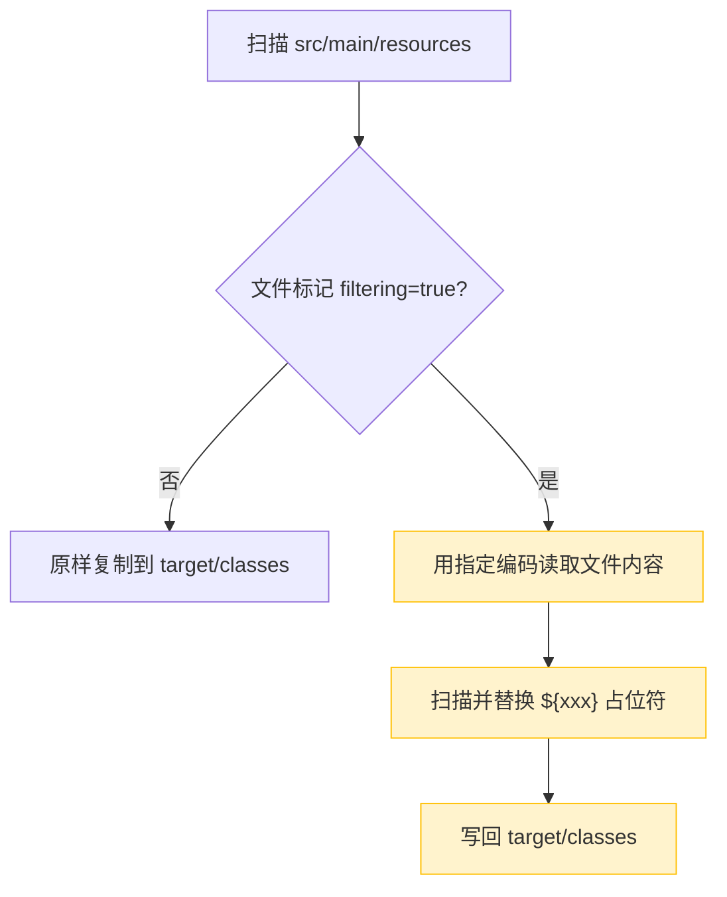

# Maven 资源过滤导致二进制文件损坏：原理、问题与最佳实践

<!-- [AGC:START] tool=Cc author=fangkun -->

> 本地运行一切正常，打包上线后 Excel 模板打不开、字体加载失败、证书读取报错？这篇文章带你深入理解 Maven 资源过滤机制，彻底搞清楚问题根因，并给出生产环境最佳配置方案。

## 一、一句话搞懂核心问题

**Maven 打包时的资源过滤（filtering）会把资源文件当文本读取并替换 `${xxx}` 占位符。如果 Excel、字体、证书这些二进制文件也被过滤了，它们的内部结构就会被破坏，导致文件损坏无法使用。**

## 二、用生活类比理解原理

把 Maven 想象成一个**工厂流水线**：

- 流水线有个工位叫"资源处理"（`process-resources` 阶段），负责把文件从 `src/main/resources` 复制到 `target/classes`
- 这个工位有个**文字替换员**，专门找文件里的 `${xxx}` 并替换成实际值（如 `${project.version}` → `1.0.0`）
- 替换员**不识字**——他分不清这是配置文件还是 Excel 表格
- 你让他处理 `.properties` 文件，没问题 ✅
- 你让他处理 `.xlsx` 文件？他照样当文本改，结果把 ZIP 结构搞坏了 💥

**类比**：就像你用 Word 打开一张图片然后按了"保存"——看似没动，但二进制数据已经被文本编码破坏了。

## 三、Build 生命周期与资源过滤

### 3.1 Maven Build 关键阶段

执行 `mvn package` 时，Maven 按顺序执行以下阶段：

```
validate → generate-resources → process-resources → compile → test → package → install → deploy
                                  ⬆
                        资源过滤在这里发生！
```

### 3.2 maven-resources-plugin 做了什么

在 `process-resources` 阶段，`maven-resources-plugin` 执行以下操作：



### 3.3 二进制文件为什么会损坏

以 `.xlsx` 为例（本质是 ZIP 压缩包）：

1. Maven 用 UTF-8 编码读取 ZIP 二进制字节
2. 某些字节序列不是合法的 UTF-8 字符 → 被替换为 `?` 或 `U+FFFD`
3. 行尾符可能被转换（`\n` ↔ `\r\n`）
4. 写回文件后，ZIP 内部结构已被不可逆破坏
5. Java 读取时抛出 `ZipException` 或 `InvalidFormatException`

## 四、生产问题复盘

### 4.1 问题现象

同事在 `pom.xml` 中添加了以下配置后：

```xml
<nonFilteredFileExtensions>
    <nonFilteredFileExtension>docx</nonFilteredFileExtension>
    <nonFilteredFileExtension>doc</nonFilteredFileExtension>
</nonFilteredFileExtensions>
```

**问题表现**：

- Excel 模板文件通过接口下载后无法打开，提示文件损坏
- 下载的文件大小与 `resources` 目录下的原始文件不一致
- 代码中读取模板时抛出 `InvalidFormatException` 或 `ZipException`

### 4.2 根因分析

| 配置项 | 作用 | 问题所在 |
|--------|------|----------|
| `docx` / `doc` | 保护 Word 文件不被过滤 | ✅ 已配置 |
| `xlsx` / `xls` | 保护 Excel 文件不被过滤 | ❌ **未配置** |

同事只配置了 Word 文件的白名单，但项目实际需要导出 **Excel 模板**。由于 `xlsx` 不在排除列表中，Maven 构建时对其进行了过滤，导致文件损坏。

### 4.3 类似问题的高发场景

| 场景 | 被破坏的文件类型 | 表现 |
|------|-----------------|------|
| 添加新 Office 模板 | `.xlsx`、`.pptx` | 文件无法打开 |
| 引入字体文件 | `.ttf`、`.woff`、`.woff2` | 前端字体加载失败 |
| 导入证书/密钥 | `.pfx`、`.jks`、`.p12` | SSL/签名报错 |
| 嵌入 DLL/native 库 | `.dll`、`.so`、`.dylib` | JNI 调用崩溃 |

## 五、解决方案

### 方案一：黑名单模式（列出不需要过滤的扩展名）

```xml
<plugin>
    <groupId>org.apache.maven.plugins</groupId>
    <artifactId>maven-resources-plugin</artifactId>
    <version>3.3.1</version>
    <configuration>
        <nonFilteredFileExtensions>
            <!-- Office 文档 -->
            <nonFilteredFileExtension>xlsx</nonFilteredFileExtension>
            <nonFilteredFileExtension>xls</nonFilteredFileExtension>
            <nonFilteredFileExtension>docx</nonFilteredFileExtension>
            <nonFilteredFileExtension>doc</nonFilteredFileExtension>
            <nonFilteredFileExtension>pptx</nonFilteredFileExtension>
            <!-- 字体文件 -->
            <nonFilteredFileExtension>ttf</nonFilteredFileExtension>
            <nonFilteredFileExtension>woff</nonFilteredFileExtension>
            <nonFilteredFileExtension>woff2</nonFilteredFileExtension>
            <!-- 证书/密钥 -->
            <nonFilteredFileExtension>pfx</nonFilteredFileExtension>
            <nonFilteredFileExtension>jks</nonFilteredFileExtension>
            <nonFilteredFileExtension>p12</nonFilteredFileExtension>
            <!-- 图片 -->
            <nonFilteredFileExtension>png</nonFilteredFileExtension>
            <nonFilteredFileExtension>jpg</nonFilteredFileExtension>
            <nonFilteredFileExtension>gif</nonFilteredFileExtension>
            <!-- 其他二进制 -->
            <nonFilteredFileExtension>pdf</nonFilteredFileExtension>
            <nonFilteredFileExtension>zip</nonFilteredFileExtension>
            <nonFilteredFileExtension>dll</nonFilteredFileExtension>
            <nonFilteredFileExtension>so</nonFilteredFileExtension>
        </nonFilteredFileExtensions>
    </configuration>
</plugin>
```

**优点**：配置简单，改动小

**缺点**：容易遗漏新加入的二进制类型（如这次的 xlsx）

### 方案二：白名单模式（推荐 ⭐）

```xml
<build>
    <resources>
        <!-- 默认关闭过滤：所有文件原样复制 -->
        <resource>
            <directory>src/main/resources</directory>
            <filtering>false</filtering>
        </resource>
        <!-- 只对需要变量替换的配置文件开启过滤 -->
        <resource>
            <directory>src/main/resources</directory>
            <filtering>true</filtering>
            <includes>
                <include>**/*.properties</include>
                <include>**/*.yml</include>
                <include>**/*.yaml</include>
                <include>**/*.xml</include>
            </includes>
        </resource>
    </resources>
</build>
```

**优点**：安全性高，新增的二进制文件不会被误伤

**缺点**：需要明确列出需要过滤的文件类型

## 六、注意事项

| 要点 | 说明 |
|------|------|
| **完整性** | 黑名单模式下，项目中所有二进制文件扩展名都必须配置，不可遗漏 |
| **大小写** | 扩展名区分大小写，需同时配置 `xlsx` 和 `XLSX` 等变体 |
| **版本要求** | `maven-resources-plugin` 版本需 >= 2.3 才支持 `nonFilteredFileExtensions` |
| **子模块继承** | 子模块**不会**自动继承父模块的 `nonFilteredFileExtensions` 配置，需在各子模块单独配置 |
| **验证方法** | 构建后解压 jar 包，检查 `target` 目录下的二进制文件是否能正常打开 |
| **文件大小对比** | 如果过滤了二进制文件，通常文件大小会发生变化，可作为快速排查手段 |

## 七、排查 Checklist

遇到"资源文件打包后损坏"的问题时，按以下顺序排查：

1. ✅ 确认 `pom.xml` 中是否开启了 `<filtering>true</filtering>`
2. ✅ 检查 `nonFilteredFileExtensions` 是否包含了所有二进制扩展名
3. ✅ 对比 `src/main/resources` 和 `target/classes` 下的文件大小是否一致
4. ✅ 解压 jar 包，尝试手动打开二进制文件验证
5. ✅ 执行 `mvn clean package` 确保是全新构建
6. ✅ 如果是多模块项目，确认子模块也配置了白名单

## 八、总结

### 核心认知

1. **资源过滤的本质**：Maven 在 `process-resources` 阶段用文本方式读取文件，替换 `${xxx}` 占位符
2. **损坏的根本原因**：二进制文件（xlsx、ttf、pfx 等）被当作文本处理，内部结构被不可逆破坏
3. **最佳实践**：采用**白名单模式**，默认关闭过滤，只对明确需要变量替换的配置文件开启

### 配置口诀

> **二进制文件多如牛，黑名单里总有漏；**
> **白名单模式最安全，需要替换才开口。**

## 参考资料

- [Apache Maven Resources Plugin - Filtering](https://maven.apache.org/plugins/maven-resources-plugin/examples/filter.html)
- [Apache Maven Resources Plugin - Binaries Filtering](https://maven.apache.org/plugins/maven-resources-plugin/examples/binaries-filtering.html)
- [Maven Build Lifecycle](https://maven.apache.org/guides/introduction/introduction-to-the-lifecycle.html)
- [Stack Overflow: Maven corrupting binary files](https://stackoverflow.com/questions/46734985/maven-corrupting-binary-files-in-src-main-resources-when-building-jar)
- [Baeldung - Maven Resources Plugin](https://www.baeldung.com/maven-resources-plugin)

<!-- [AGC:END] -->
