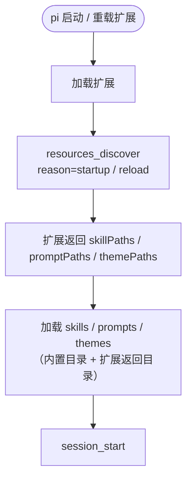

# hellopi 事件包 12 · 资源发现：动态挂载外部 skills

<!-- [AGC:START] tool=Cc author=fangkun -->

## 这个事件解决什么问题

Pi 启动时会加载内置的 skills、slash command 提示词和主题。默认情况下这些资源只来自 pi 自己的配置目录。但真实团队里常有这样的需求：

- 公司维护了一个内部 skill 仓库，希望**所有人的 pi 都能自动挂上**，而不是每人手工复制；
- 不同项目有自己的 `.pi/prompts` 提示词集，**进入哪个项目就挂哪个**；
- 扩展自带一套主题，希望**装了扩展就有主题**。

`resources_discover` 就是 pi 向扩展询问"你还有没有额外的资源目录"的事件。它在**扩展加载后、会话初始化阶段**触发，早于 `session_start`：



- `reason: "startup"`：pi 首次启动；
- `reason: "reload"`：扩展被重载——这意味着资源目录可以**热更新**，改完目录重载即可生效。

## 事件字段与返回值

| 字段 | 类型 | 说明 |
|------|------|------|
| `event.cwd` | `string` | 当前工作目录（可据此按项目返回不同路径） |
| `event.reason` | `"startup" \| "reload"` | 触发原因 |

返回值（全部可选，返回 `undefined` 或空数组表示不添加）：

| 字段 | 类型 | 说明 |
|------|------|------|
| `skillPaths` | `string[]` | 额外的 skills 目录 |
| `promptPaths` | `string[]` | 额外的 slash command 提示词目录 |
| `themePaths` | `string[]` | 额外的主题目录 |

## Demo：挂载 `~/.pi-hellopi/` 下的三个资源目录

hellopi 的 demo 检查三个约定目录是否存在，存在就作为资源路径返回：

```typescript
// [AGC:START] tool=Cc author=fangkun
import type { ExtensionAPI } from "@earendil-works/pi-coding-agent";
import { existsSync } from "node:fs";
import { logEvent, logAction, demoPath } from "../shared/log.js";

export default function register(pi: ExtensionAPI): void {
  pi.on("resources_discover", async (event) => {
    logEvent("resources_discover", { cwd: event.cwd, reason: event.reason });

    const result = {
      skillPaths: [demoPath("skills")].filter(existsSync),
      promptPaths: [demoPath("prompts")].filter(existsSync),
      themePaths: [demoPath("themes")].filter(existsSync),
    };

    const mounted = [
      result.skillPaths.length > 0 ? `skills×${result.skillPaths.length}` : "",
      result.promptPaths.length > 0 ? `prompts×${result.promptPaths.length}` : "",
      result.themePaths.length > 0 ? `themes×${result.themePaths.length}` : "",
    ]
      .filter(Boolean)
      .join(" ");
    if (mounted) logAction("resources_discover", `动态挂载: ${mounted}`);

    return result;
  });
}
// [AGC:END]
```

几个实现细节值得注意：

1. **`existsSync` 过滤**：目录不存在时不返回，避免 pi 去加载一个不存在的路径而告警；
2. **`demoPath("skills")`** 即 `~/.pi-hellopi/skills`——所有 demo 产物都收敛在同一个目录下；
3. **挂载成功才打印 ACTION 日志**：日常启动没有资源目录时不刷屏。

## 实战场景

### 场景 1：团队共享 skills 仓库

把公司内部 skill 仓库 clone 到固定目录，扩展统一挂载。新人装好扩展就自动获得全套团队 skill，无需知道 pi 配置目录在哪：

```typescript
// [AGC:START] tool=Cc author=fangkun
pi.on("resources_discover", async () => {
  const teamSkills = "D:/team/pi-resources/skills"; // 内部仓库统一 clone 位置
  return { skillPaths: existsSync(teamSkills) ? [teamSkills] : [] };
});
// [AGC:END]
```

### 场景 2：项目级提示词

利用 `event.cwd` 判断当前项目，返回该项目自己的提示词目录。这比把提示词塞进全局配置更内聚——项目换了机器、换了人，只要扩展在就能挂上：

```typescript
// [AGC:START] tool=Cc author=fangkun
pi.on("resources_discover", async (event) => {
  const projectPrompts = join(event.cwd, ".pi", "prompts");
  return { promptPaths: existsSync(projectPrompts) ? [projectPrompts] : [] };
});
// [AGC:END]
```

### 场景 3：扩展自带主题

主题文件随扩展分发（放在扩展目录下的 `themes/`），一处安装处处可用：

```typescript
// [AGC:START] tool=Cc author=fangkun
import { fileURLToPath } from "node:url";
import { dirname, join } from "node:path";

const here = dirname(fileURLToPath(import.meta.url));

pi.on("resources_discover", async () => ({
  themePaths: [join(here, "..", "themes")],
}));
// [AGC:END]
```

### 场景 4：资源热更新

`reason: "reload"` 时重新扫描目录。新增 skill 后不用重启 pi，重载扩展即可被发现——这对边开发边调试 skill 的工作流很友好。

## 动手测试

```bash
# 1. 准备一个外部 skill 目录
mkdir -p ~/.pi-hellopi/skills/hello-skill
cat > ~/.pi-hellopi/skills/hello-skill/SKILL.md <<'EOF'
---
name: hello-skill
description: hellopi 动态挂载测试 skill
---
当用户说"测试挂载"时，回复"挂载成功"。
EOF

# 2. 重启 pi（或重载扩展）
# 3. 预期：启动日志出现 [hellopi] resources_discover → 动态挂载: skills×1
# 4. 在 pi 中输入 / 查看命令补全，或直接问"测试挂载"，skill 应被识别
```

验证要点：**目录不存在时启动无变化；目录存在并放入合法 SKILL.md 后，skill 立即可用**。把 SKILL.md 删掉再重载，资源随之消失——这就是"动态挂载"的含义。

## 相关文档

- [hellopi 事件包总览](./11-hellopi-events-overview) - 环境搭建、产物目录与开关速查
- [Pi Coding Agent 事件系统](./5-events) - 全部事件字段参考
- [编写扩展](./4-writing-extensions) - 扩展入口与异步工厂

<!-- [AGC:END] -->
