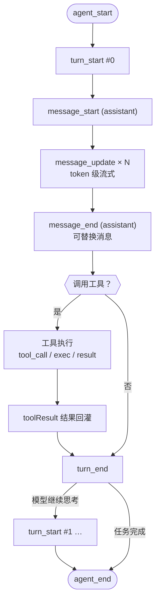

# hellopi 事件包 16 · 轮次与消息：流式输出的观测与改写

<!-- [AGC:START] tool=Cc author=fangkun -->

进入 agent 循环后，活动按"轮次"组织：一个轮次 = 一次模型响应 + 它触发的工具调用。轮次内部有消息的生命周期（开始 → 流式更新 → 定稿）。本篇讲 5 个事件：`turn_start` / `turn_end` 和 `message_start` / `message_update` / `message_end`。



## turn_start / turn_end：轮次的边界

| 事件 | 关键字段 |
|------|----------|
| `turn_start` | `turnIndex`（从 0 开始）、`timestamp` |
| `turn_end` | `turnIndex`、`message`（本轮 assistant 消息）、`toolResults`（本轮全部工具结果，含 `toolName`、`isError`） |

两者都是只读通知。一次提交对应 1～N 个轮次：模型不需要工具时只有 1 轮；每多调一次工具就多一轮。

### Demo：轮次流水 + 工具失败告警

```typescript
// [AGC:START] tool=Cc author=fangkun
// turn_start：记录轮次序号
export default function register(pi: ExtensionAPI): void {
  pi.on("turn_start", async (event) => {
    logEvent("turn_start", { turnIndex: event.turnIndex });
    appendDemoFile("turns.log", `turn-start #${event.turnIndex} ts=${event.timestamp}`);
  });
}
// [AGC:END]
```

```typescript
// [AGC:START] tool=Cc author=fangkun
// turn_end：统计工具结果数与失败数，失败时红色告警
export default function register(pi: ExtensionAPI): void {
  pi.on("turn_end", async (event) => {
    const toolResults = event.toolResults ?? [];
    const errorCount = toolResults.filter((r) => r.isError).length;

    logEvent("turn_end", {
      turnIndex: event.turnIndex,
      toolCount: toolResults.length,
      errors: errorCount,
    });
    appendDemoFile(
      "turns.log",
      `turn-end   #${event.turnIndex} tools=${toolResults.length} errors=${errorCount}`,
    );

    if (errorCount > 0) {
      const failed = toolResults.filter((r) => r.isError).map((r) => r.toolName).join(", ");
      logAction("turn_end", `第 ${event.turnIndex} 轮有工具失败: ${failed}`);
    }
  });
}
// [AGC:END]
```

`turn_end` 是"失败即干预"的最佳挂载点：所有工具结果已经确定，`isError` 一目了然。demo 只打印警告，真实扩展可以在这里注入提示、通知用户、或阻止后续动作。

### 业务场景

1. **Git 检查点**：每轮开始前自动 `git add -A && git commit`（checkpoint），工具搞砸了可回退；
2. **失败即干预**：bash 退出码非 0 时自动注入排查提示；
3. **自动提交**：一轮中文件被修改且无错误时，自动创建 checkpoint；
4. **轮次质量统计**：任务平均需要几轮、工具成功率、每轮工具调用密度。

```bash
pi> 你好                                   # turns.log: turn-start #0（通常 1 轮）
pi> 看看当前目录有什么文件，然后读取 package.json   # #0、#1 甚至 #2
pi> 读取 ./not-exist-xxx.txt 的内容          # 控制台红色告警"第 0 轮有工具失败: read"
```

## message_start / message_update / message_end：消息的一生

消息有三种角色：`user`（用户输入）、`assistant`（模型响应，流式生成）、`toolResult`（工具结果回灌）。三个事件对三种角色都会触发，但 **`message_update` 只在 assistant 流式生成时触发**。

### message_start：消息开始处理

| 字段 | 说明 |
|------|------|
| `event.message` | 开始处理的消息（可读 `role`） |

```typescript
// [AGC:START] tool=Cc author=fangkun
export default function register(pi: ExtensionAPI): void {
  pi.on("message_start", async (event) => {
    const role = event.message?.role;
    logEvent("message_start", { role });
    appendDemoFile("messages.log", `message-start role=${role}`);
  });
}
// [AGC:END]
```

典型顺序（工具调用场景）：`assistant`（决定调工具）→ `toolResult`（结果回灌）→ `assistant`（总结）。业务用途：消息计数与时序分析、自定义 UI 挂载消息组件、toolResult 回灌内容审计、与 message_end 配对测延迟。

### message_update：最高频的事件，必须节流

assistant 消息流式生成期间**逐 token 触发**，是所有事件中频率最高的。字段：`event.message`（当前累积的完整 assistant 消息，content 持续增长）、`event.assistantMessageEvent`（本次增量）。

demo 做了两件事：按字符增量计算进度，并用 `shared/state.ts` 的 `throttle` 把输出限制到 **800ms 一次**：

```typescript
// [AGC:START] tool=Cc author=fangkun
const STREAM_KEY = "assistant-stream";

export default function register(pi: ExtensionAPI): void {
  pi.on("message_update", async (event) => {
    if (event.message.role !== "assistant") return;

    const chars = event.message.content.reduce(
      (sum, p) => sum + (p.type === "text" ? p.text.length : 0),
      0,
    );
    const prev = streamLastChars.get(STREAM_KEY) ?? 0;
    const delta = chars < prev ? chars : chars - prev;
    streamLastChars.set(STREAM_KEY, chars);

    if (throttle(STREAM_KEY)) {
      appendDemoFile("messages.log", `stream chars=${chars} delta=${delta}`);
      console.log(`[hellopi] message_update 流式进度 chars=${chars} (+${delta})`);
    }
  });
}
// [AGC:END]
```

两个工程细节：

- **`chars < prev` 时 delta 取 chars**：新的一次提交开始，累积计数"归零重来"，防止算出负增量；
- **节流 key 用固定字符串**：与工具流式事件（用 toolCallId 做 key）区分开，互不干扰。

业务场景：外部状态栏/网页显示"已生成 N 字"、长时间无 update 判定生成卡顿、边生成边扫描敏感词、测量 tokens/s 评估模型速度。**原则：这个事件里绝不能做重活**（同步 IO、网络请求都会拖慢流式体验）。

### message_end：消息定稿，最后一次修改机会

消息进入会话历史之前最后触发。返回 `{ message }` 可以**替换最终消息**，但 role 必须与原消息一致。

```typescript
// [AGC:START] tool=Cc author=fangkun
const SIGNATURE = "\n\n-- hellopi signature demo (HELLOPI_SIGNATURE=1) --";

export default function register(pi: ExtensionAPI): void {
  pi.on("message_end", async (event) => {
    const { message } = event;
    const textLength =
      message.role === "assistant"
        ? message.content.reduce((sum, p) => sum + (p.type === "text" ? p.text.length : 0), 0)
        : 0;

    logEvent("message_end", { role: message.role, textLength });
    appendDemoFile("messages.log", `message-end role=${message.role} textLen=${textLength}`);

    // 仅 assistant 文本消息、且显式开启环境变量时替换消息
    if (process.env.HELLOPI_SIGNATURE === "1" && message.role === "assistant") {
      const lastTextIndex = message.content.map((p) => p.type).lastIndexOf("text");
      if (lastTextIndex >= 0) {
        const content = message.content.map((part, i) =>
          i === lastTextIndex && part.type === "text"
            ? { ...part, text: `${part.text}${SIGNATURE}` }
            : part,
        );
        logAction("message_end", "已为 assistant 消息追加签名");
        return { message: { ...message, content } };
      }
    }
    return;
  });
}
// [AGC:END]
```

这里展示了不可变更新的标准写法：`content.map(...)` 生成新数组、`{ ...part, text }` 生成新片段、`{ ...message, content }` 生成新消息——不原地改任何对象。替换发生在**最后一个文本片段**上，避免影响消息中可能存在的工具调用等结构化内容。

> 注意：替换消息会改变进入 LLM 上下文的历史内容。demo 的签名行后续轮次的模型也能看到（追问"上一条消息末尾写了什么"可验证），生产环境请谨慎使用。

业务场景：读取 `usage` 做精细化成本核算、统一修正格式/剥离套话、上下文过滤漏掉的敏感内容在落盘前最后清洗、往 details 注入追踪 ID。

```bash
pi> 写一篇 800 字的科幻短文     # 流式过程中周期出现 chars=… (+…)
export HELLOPI_SIGNATURE=1      # 开启后重启 pi
pi> 说一句话                    # 回复末尾出现签名行，且签名进入后续上下文
cat ~/.pi-hellopi/messages.log
```

## 本类事件小结

| 事件 | 频率 | 能否改变流程 | 核心用途 |
|------|------|--------------|----------|
| `turn_start` | 每轮 1 次 | 否 | Git 检查点、轮次前检查 |
| `turn_end` | 每轮 1 次 | 否 | 工具失败告警、自动提交、质量统计 |
| `message_start` | 每条消息 1 次 | 否 | 消息计数、UI 挂载、延迟起点 |
| `message_update` | **token 级** | 否 | 流式进度、卡顿检测（必须节流、轻量） |
| `message_end` | 每条消息 1 次 | **可替换消息** | 成本核算、消息后处理、落盘前清洗 |

记忆法：**turn 管"一轮的边界"，message 管"一条消息的一生"；update 只观测，end 才能动**。

## 相关文档

- [输入拦截与 Agent 循环](./15-hellopi-input-agent) - input/before_agent_start/agent_start/end
- [工具执行观测](./17-hellopi-tool-execution) - 工具侧的 start/update/end
- [hellopi 事件包总览](./11-hellopi-events-overview)

<!-- [AGC:END] -->
