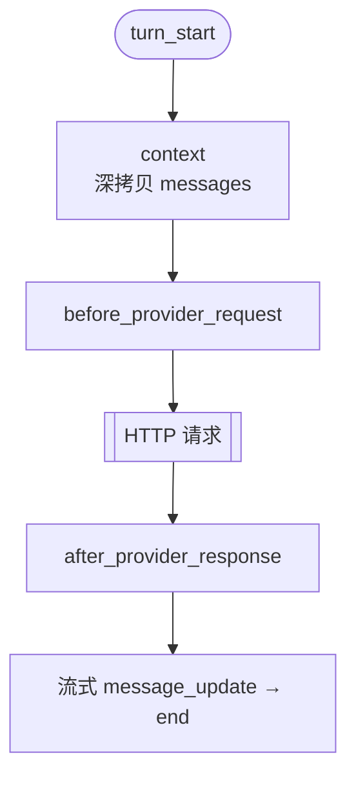

# hellopi 事件包 18 · Context 事件：发给模型前的最后一道关口

<!-- [AGC:START] tool=Cc author=fangkun -->

## 事件定位

`context` 在**每次 LLM 调用之前**触发（每个轮次至少一次），携带即将发送给模型的完整消息数组。它位于消息定稿之后、HTTP 请求发出之前：



与其他改写点的分工：

- `before_agent_start` 改的是**系统提示词**（身份、规则）；
- `message_end` 改的是**单条定稿消息**（会落盘到会话历史）；
- `context` 改的是**本次请求的整个消息数组**——而且**只影响发给模型的内容，不改变本地会话历史**。这是它最独特、最适合做安全脱敏的原因。

| 字段 | 类型 | 说明 |
|------|------|------|
| `event.messages` | `AgentMessage[]` | 本次调用的完整消息（已是深拷贝，可安全修改） |

返回 `{ messages }` 替换本次请求使用的消息；不返回则用原消息。

## Demo：发给模型前抹掉演示密钥

demo 递归扫描所有消息内容，把形如 `SK-DEMO-xxxx` 的演示密钥替换为 `***REDACTED***`：

```typescript
// [AGC:START] tool=Cc author=fangkun
import type { ExtensionAPI, ContextEvent } from "@earendil-works/pi-coding-agent";

const SECRET_PATTERN = /SK-DEMO-[A-Za-z0-9-]+/g;
const REDACTED = "***REDACTED***";

/** 递归处理字符串 / 数组 / 对象，把消息树里所有字符串中的密钥替换掉 */
function redactValue(value: unknown): unknown {
  if (typeof value === "string") return value.replace(SECRET_PATTERN, REDACTED);
  if (Array.isArray(value)) return value.map(redactValue);
  if (value !== null && typeof value === "object") {
    return Object.fromEntries(Object.entries(value).map(([k, v]) => [k, redactValue(v)]));
  }
  return value;
}

export default function register(pi: ExtensionAPI): void {
  pi.on("context", async (event: ContextEvent) => {
    const raw = JSON.stringify(event.messages);
    const matches = raw.match(SECRET_PATTERN) ?? [];

    logEvent("context", { messageCount: event.messages.length, secrets: matches.length });
    appendDemoFile("context.log", `messages=${event.messages.length} secrets=${matches.length}`);

    if (matches.length > 0) {
      logAction("context", `脱敏 ${matches.length} 处演示密钥（${[...new Set(matches)].join(", ")}）`);
      const messages = redactValue(structuredClone(event.messages)) as ContextEvent["messages"];
      return { messages };
    }
    return;
  });
}
// [AGC:END]
```

实现要点：

1. **先探测再处理**：`JSON.stringify(messages)` 后用正则计数，命中数为 0 时直接返回，避免无谓的深拷贝；
2. **递归脱敏**：消息结构是嵌套的（content 是片段数组，工具结果里还有 details），只替换顶层字符串会漏，`redactValue` 递归走进数组和对象；
3. **`structuredClone` 深拷贝**：虽然文档说明 messages 已是深拷贝，demo 仍显式克隆一次再改，双重保险且意图清晰；
4. **去重展示**：`[...new Set(matches)]` 让日志里同一个密钥只显示一次。

## 动手测试：模型真的看不到密钥

```bash
# 1. 告诉 agent 一个"密钥"
pi> 记住我的密钥是 SK-DEMO-ABC123-XYZ，后面会用到

# 2. 让它复述
pi> 我刚才给你的密钥是什么？
# 预期：模型回复 ***REDACTED***——它在上下文里看到的就是脱敏后的
# 控制台出现 "脱敏 1 处演示密钥"

# 3. 观察脱敏触发次数
cat ~/.pi-hellopi/context.log
# 每轮 LLM 调用都会触发 context；同一条消息在多轮对话中会被反复带入，
# secrets=N 的次数 = 该消息被带入请求的次数
```

这个测试能直观说明三件事：模型看到的是脱敏后的内容、本地历史保留原文（消息并没有被删改）、脱敏在**每次请求**都会重新执行。

## 业务场景

### 1. 数据防泄漏（DLP）

密钥、token、内部域名、身份证号在发给模型前抹掉。相比在 `tool_result` 里脱敏，`context` 覆盖面更广——**用户自己输入的**、历史消息里的、工具结果里的敏感内容全部经过这一道。生产环境通常会维护一组正则/识别规则，在这一层统一兜底。

### 2. 上下文裁剪与成本控制

超长会话中主动移除陈旧、低价值消息，控制 token 成本：

```typescript
// [AGC:START] tool=Cc author=fangkun
pi.on("context", async (event) => {
  if (event.messages.length <= 20) return;
  // 保留系统消息 + 最近 20 条；也可按 token 数、消息类型做更精细的裁剪
  const system = event.messages.filter((m) => m.role === "system");
  const recent = event.messages.slice(-20);
  return { messages: [...system, ...recent] };
});
// [AGC:END]
```

> 注意：裁剪是"请求视角"的，本地历史仍然完整；这与 pi 自带的压缩（会改写会话树）是两套机制。

### 3. 动态注入上下文

在消息数组前插入当前时间、git 状态、文件变更摘要等**只在本次请求有效**的信息——不想让它落盘到会话历史时，用 `context` 注入比 `before_agent_start` 注入消息更合适。

### 4. 多租户隔离

按会话来源过滤掉不属于当前用户的历史消息（多用户共用一套 pi 服务的场景）。

## 使用注意

- **高频事件**：每次 LLM 调用都触发，处理逻辑要轻量；重活（网络请求、大文件读取）应缓存结果；
- **返回值必须形状合法**：替换后的 messages 要符合 pi 的消息类型约定，role 不能乱改，否则可能导致 provider 报错；
- **与 `before_provider_request` 的边界**：`context` 改的是 pi 语义层的消息数组；`before_provider_request` 改的是 provider 特定的最终 payload（序列化后）。改消息内容用 context，改 HTTP 层参数用 provider 事件（见[下一篇](./19-hellopi-provider)）。

## 相关文档

- [Provider 请求与响应](./19-hellopi-provider) - payload 替换、状态码与限流
- [工具拦截：结果脱敏](./21-hellopi-tool-intercept) - tool_result 在结果侧脱敏
- [轮次与消息事件](./16-hellopi-turn-message) - message_end 改写单条消息
- [hellopi 事件包总览](./11-hellopi-events-overview)

<!-- [AGC:END] -->
