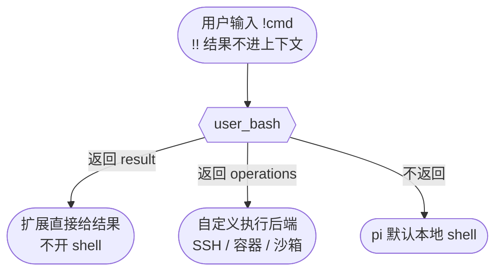

# hellopi 事件包 22 · 用户 Bash：`!` 命令的审计与接管

<!-- [AGC:START] tool=Cc author=fangkun -->

## 先分清两种"执行命令"

pi 里有两条完全不同的命令执行路径，对应不同事件：

| 路径 | 谁发起 | 经过事件 |
|------|--------|----------|
| agent 调 bash **工具** | 模型决定（"帮我执行 ls"） | `tool_call` → `tool_execution_*` → `tool_result` |
| 用户用 **`!` / `!!`** 前缀 | 用户手动输入（`!ls -la`） | `user_bash`（本篇） |

`user_bash` 只在用户于输入框直接敲 shell 命令时触发。`!cmd` 的结果会进入 LLM 上下文，`!!cmd`（双感叹号）只在本地执行、结果不进上下文。



## 字段与返回值

| 字段 | 类型 | 说明 |
|------|------|------|
| `event.command` | `string` | 要执行的命令 |
| `event.excludeFromContext` | `boolean` | `!!` 前缀时为 true（结果不进 LLM 上下文） |
| `event.cwd` | `string` | 当前工作目录 |

返回值（三选一）：

| 返回 | 含义 |
|------|------|
| 不返回 / `undefined` | pi 按默认本地 shell 执行 |
| `{ result: { output, exitCode, cancelled, truncated } }` | **完全接管**：直接给结果，不启动 shell |
| `{ operations: BashOperations }` | 替换执行后端（实现 `exec` 即可，常用于 SSH 远程执行） |

## Demo：命令审计 + hellopi-version 快捷命令

```typescript
// [AGC:START] tool=Cc author=fangkun
export default function register(pi: ExtensionAPI): void {
  pi.on("user_bash", async (event) => {
    logEvent("user_bash", { command: event.command, excludeFromContext: event.excludeFromContext });
    appendDemoFile(
      "user-bash.log",
      `command=${JSON.stringify(event.command)} excludeFromContext=${event.excludeFromContext} cwd=${event.cwd}`,
    );

    // 接管：hellopi-version 直接返回结果，不实际开 shell
    if (event.command.trim() === "hellopi-version") {
      logAction("user_bash", "接管 hellopi-version 命令（未启动 shell）");
      return {
        result: {
          output: "hellopi demo extension v1.0.0\n事件包: 29 个生命周期事件\n",
          exitCode: 0,
          cancelled: false,
          truncated: false,
        },
      };
    }

    // 其他命令不返回 → pi 按默认本地 shell 执行
    return;
  });
}
// [AGC:END]
```

两种处理模式在同一个 handler 里共存：

- **审计不干预**：所有命令先写日志，然后"不返回"放行给默认 shell——对用户完全透明；
- **选择性接管**：匹配到 `hellopi-version` 时返回 `result`，pi 不再启动 shell，直接把 output 当作命令输出。这相当于零成本注册了一个内置命令（不需要真的写一个可执行文件放到 PATH 里）。

`result` 的四个字段是 pi 执行 bash 后的标准结果结构：`output`（输出文本）、`exitCode`（退出码，0 成功）、`cancelled`（是否被用户中断）、`truncated`（输出是否被截断）。接管时按这个形状返回，pi 的 UI 渲染和上下文处理都无需特殊对待。

## 业务场景

### 1. 内置快捷命令

把常用复杂命令包装成短指令：`!deploy`、`!db-connect`、`!ticket <id>`——扩展内部可以是任意 Node 逻辑（查 API、拼命令），最终把文本结果返回。比让用户记一长串 shell 命令友好得多（demo 的 `hellopi-version` 即此场景的最小形态）。

### 2. 命令审计

记录所有手动命令（谁、在哪个 cwd、是否进上下文），识别危险操作并告警。agent 调工具走 `tool_call` 审计，用户手动命令走 `user_bash` 审计，两条路径合起来才是完整的命令审计链。

### 3. SSH 远程执行 / 换执行后端

返回 `operations` 把命令送到远程主机或容器里执行。典型写法是包装 pi 内置的本地后端，只在某些条件下改道：

```typescript
// [AGC:START] tool=Cc author=fangkun
import { createLocalBashOperations } from "@earendil-works/pi-coding-agent";

pi.on("user_bash", (event) => {
  const local = createLocalBashOperations();

  // 场景：以 remote: 开头的命令走 SSH，其余走本地
  if (event.command.startsWith("remote: ")) {
    const cmd = event.command.slice("remote: ".length);
    return {
      operations: {
        exec(_command, cwd, options) {
          // 通过 SSH 在远程主机执行（这里用本地后端示意接口形状）
          return local.exec(`ssh dev-server 'cd ${cwd} && ${cmd}'`, cwd, options);
        },
      },
    };
  }
  // 也可以给所有命令统一注入环境：
  return {
    operations: {
      exec(command, cwd, options) {
        return local.exec(`source ~/.profile\n${command}`, cwd, options);
      },
    },
  };
});
// [AGC:END]
```

`BashOperations` 接口实现 `exec(command, cwd, options)` 即可，pi 会用它替代内置 shell 后端——这让 `!` 命令天然支持远程开发、容器内执行、沙箱隔离等场景。

### 4. 沙箱化

把命令重定向到受限环境（Docker、firejail、临时 VM）执行，输出回传，保护本机。

## 动手测试

```bash
# 1. 接管命令（不会真的开 shell）
pi> ! hellopi-version
# 输出 "hellopi demo extension v1.0.0 ..."，控制台提示"接管"

# 2. 普通命令（默认执行 + 审计）
pi> ! echo hello
# 正常输出 hello

# 3. 双感叹号（不进上下文）
pi> !! ls
# 正常执行，user-bash.log 中 excludeFromContext=true

cat ~/.pi-hellopi/user-bash.log
# 每条命令一行：command=... excludeFromContext=... cwd=...
```

验证要点：`hellopi-version` 不是系统里的任何可执行文件——输出完全由扩展构造；而 `! echo hello` 走默认 shell，行为与不装扩展时完全一致。

## 本类事件小结

| 能力 | 做法 | 适用场景 |
|------|------|----------|
| 只审计不干预 | 写日志后不返回值 | 命令留痕、危险操作告警 |
| 完全接管 | 返回 `{ result }` | 内置快捷命令、Mock 输出 |
| 换执行后端 | 返回 `{ operations }` | SSH 远程、容器、沙箱 |

记忆法：**agent 干活过 `tool_call`，用户亲手敲过 `user_bash`；想给 `!` 命令换个地方跑，就返回 operations**。

## 系列结语

到这里 hellopi 的 29 个事件包全部讲完。建议的学习路径：先按[总览篇](./11-hellopi-events-overview)把扩展跑起来、玩一遍哨兵和环境变量开关，再回到你业务里最痛的点（安全管控选 21/18，成本监控选 15/19/20，自定义命令选 15/22，团队资源选 12）照抄对应 demo 改造。事件参考手册随时查[事件系统](./5-events)。

## 相关文档

- [工具拦截：危险命令闸门与结果脱敏](./21-hellopi-tool-intercept) - agent 侧的 bash 工具走这里
- [输入拦截与 Agent 循环](./15-hellopi-input-agent) - input 事件与 user_bash 的边界
- [hellopi 事件包总览](./11-hellopi-events-overview) - 全部 12 篇导航
- [Pi Coding Agent 事件系统](./5-events) - 完整字段参考

<!-- [AGC:END] -->
