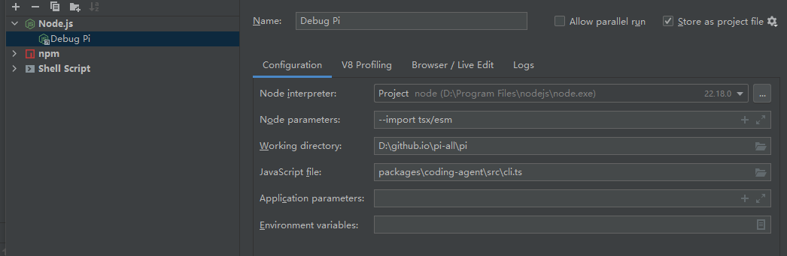

# 2026-08-31 pi 扩展断点调试配置

<!-- [AGC:START] tool=Cc author=fangkun -->

## 问题

`.pi/settings.json` 配置了扩展 `examples/extensions/plan-mode/index.ts`，功能生效但 VS Code 断点永不命中。

## 根因

pi 加载扩展走 `loader.ts` -> jiti：

1. Babel 转译 TS -> CJS 风格代码
2. `vm.runInThisContext()` 执行转译产物，filename 借用原路径
3. jiti `sourceMaps` 默认 false -> 转译产物无 sourcemap

VS Code 按 `.ts` 源码位置下发断点，无 map 无法映射到实际执行的代码。
实际执行代码缓存于 `C:\Users\ThinkPad\AppData\Local\Temp\jiti\`。
pi 本体 `src/*.ts` 走 tsx（自带 inline sourcemap），所以断点正常。

## 修复（一劳永逸）

`packages/coding-agent/src/core/extensions/loader.ts` 的 `loadExtensionModule()`：

```diff
 	const jiti = createJiti(import.meta.url, {
 		moduleCache: false,
+		sourceMaps: true,// 源码断点支持
 		// In Bun binary: use virtualModules for bundled packages (no filesystem resolution)
 		// Also disable tryNative so jiti handles ALL imports (not just the entry point)
 		// In Node.js/dev: use aliases to resolve to node_modules paths
 		...(isBunBinary ? { virtualModules: VIRTUAL_MODULES, tryNative: false } : { alias: getAliases() }),
 	});
```

jiti 转译时带 `sourceMaps: "inline"` + `sourceFileName = 原 .ts 路径`，VS Code 即可映射断点。

## 启动调试

IDEA 调试配置截图：



VS Code JavaScript Debug Terminal（PowerShell）：

```powershell
node --import tsx packages/coding-agent/src/cli.ts
```

launch.json 等价配置：

```json
{
  "type": "node",
  "request": "launch",
  "name": "pi debug",
  "cwd": "${workspaceFolder}",
  "runtimeArgs": ["--import", "tsx", "packages/coding-agent/src/cli.ts"],
  "env": { "JITI_SOURCE_MAPS": "1" }
}
```

## 验证

```powershell
ls C:\Users\ThinkPad\AppData\Local\Temp\jiti\ | Select-String plan-mode
```

新缓存文件名带 `+map` 后缀即生效。

## 注意

- 只影响源码跑法。全局安装的 pi 用 `$env:JITI_SOURCE_MAPS="1"; pi` 等价替代
- 工厂函数体（`registerCommand` 等）仅在加载时执行一次，须 debugger 下从启动跑起；事件回调断点随触发命中；`moduleCache: false` 支持热重载，重载会再次执行
- 扩展不要 import `cli.js`（入口脚本，import 会再启动一遍 pi）；API 用 `import "@earendil-works/pi-coding-agent"`，运行时状态用工厂参数 `pi: ExtensionAPI`
- dev 下扩展 import 运行时值会拿到 jiti 转译的第二份 pi 副本，instanceof 失败

<!-- [AGC:END] -->
