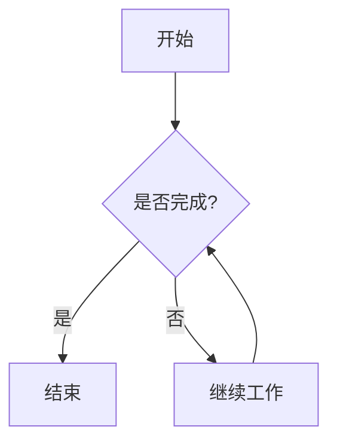
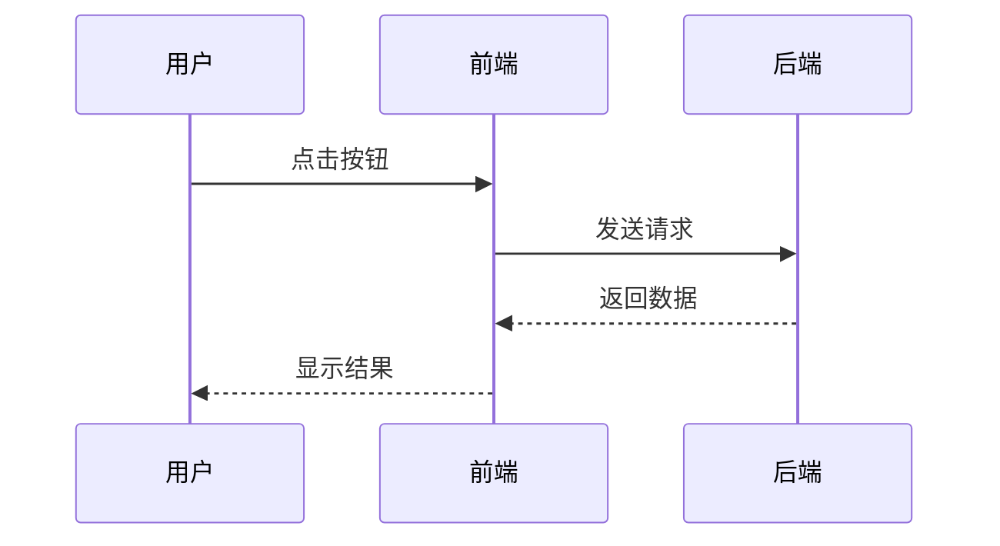
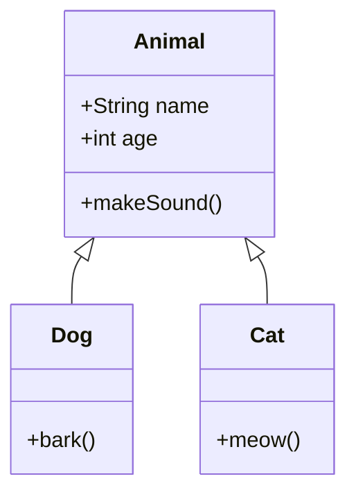

# Mermaid 流程图测试

<!-- [AGC:START] tool=Cc author=fangkun -->

这篇文章用于测试 Mermaid 流程图在博客中的渲染效果。

## 简单流程图

下面是一个简单的流程图示例：

## 序列图

下面是一个序列图示例：

## 类图

下面是一个类图示例：

以上是 Mermaid 流程图的测试内容。

<!-- [AGC:END] -->
