<!-- [AGC:FILE] tool=Cc author=fangkun date=2026-09-03 -->

# 大白话版：Pi-Agent 会话管理

> 这是《第10章：会话管理 —— 对话的存储、恢复与分叉》的通俗解读版
> 核心理念：用大白话把技术概念讲明白，让自己和同事都能听懂
>
> 📖 **[查看原始文档](./source/M10 · 第10章：会话管理 —— 对话的存储、恢复与分叉.md)**

---

## 一、一句话说明白：会话管理 是什么？

**会话管理是 Agent 的"对话存档系统"——它把对话历史存成一棵树（而不是线性数组），每条消息只追加不修改不删除（append-only），回退和分支只是移动一个指针（leafId），所有历史完整保留。下次打开或恢复会话时，从树里沿着"当前路径"把消息"压扁"成线性数组发给 LLM。**

> 📖 **原文引用**：第10章 § 一 + §二
>
> "Pi 的答案是 Session Tree——把对话历史组织成一棵只追加、不修改、不删除的树。回退/分支不是'删数据'，而是'移动一个指针'。"

[查看原文档完整内容](./source/M10 · 第10章：会话管理 —— 对话的存储、恢复与分叉.md)

### 类比理解

**🌳 类比：Git 版本管理**

Session Tree 就像 Git——每次提交（commit）只追加不修改，分支（branch）只是多了一个指针，切换分支不删数据。你随时可以 `checkout` 回到任何历史节点。

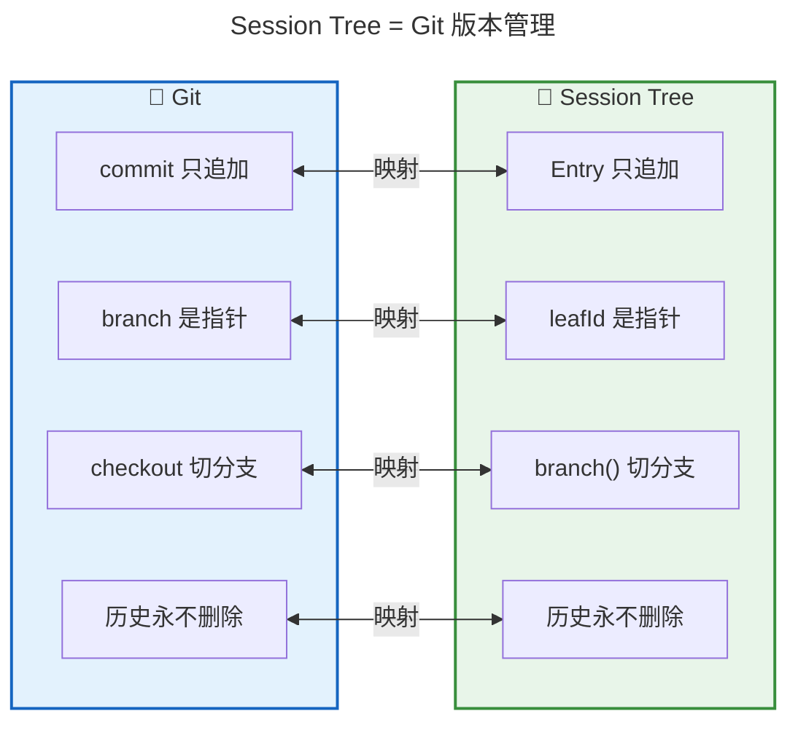

**对比表格**：

| 概念 | 像什么 | 特点 |
|------|--------|------|
| **Session Tree** | 🔀 Git 仓库 | 对话历史是树，不是线性列表 |
| **Entry 节点** | 📝 Git commit | 每条消息/操作是一个节点 |
| **leafId 指针** | 🏷️ Git HEAD | 指向"当前所在节点" |
| **branch()** | 🔀 git checkout | 移动指针，不删数据 |
| **JSONL 文件** | 📄 .git 目录 | 本地文件存储，纯文本可调试 |

**关键区别**：

- 如果**用线性数组存对话**：回退 = 删除后面的消息，删了就没了
- 如果**用 Session Tree**：回退 = 移动指针，旧分支完整保留，随时可以回去

---

## 二、核心概念详解

### 2.1 两个正交问题：存哪里 + 长什么样

**大白话**：会话数据怎么存，要拆成两个**独立的问题**来想——**存在哪里**（存储介质）和**长什么样**（数据结构）。就像你可以用 mysql 存数组，也可以用 JSONL 文件存一棵树，两者互不干扰。

> 📖 **原文引用**：第10章 § 一 - 问题
>
> "两个维度是正交的——你可以'用 mysql 存线性数组'，也可以'用 JSONL 文件存一棵树'。混淆它们会让后续讨论糊成一团。"

[查看原文档完整内容](./source/M10 · 第10章：会话管理 —— 对话的存储、恢复与分叉.md#一问题会话数据怎么存)

**📊 两个维度对比**：

| 维度 | 回答什么 | 一般做法 | Pi 的选择 | 类比 |
|------|---------|---------|----------|------|
| **存哪里** | 存储介质 | mysql 等数据库 | 本地 JSONL 文件 | 📁 笔记本 vs 电脑 |
| **长什么样** | 数据结构 | 线性数组 | 树（Session Tree） | 📏 直线 vs 🔀 树杈 |

**🎨 类比图：存哪里 vs 长什么样**

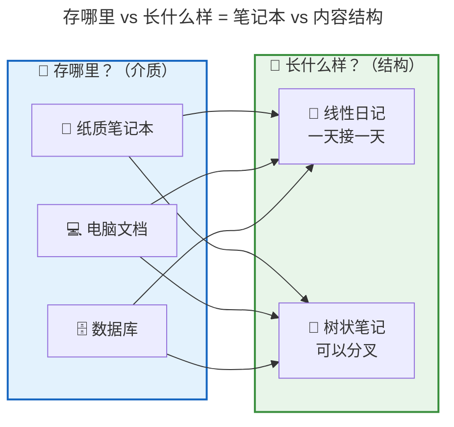

**Pi 为什么选 JSONL 文件？**
- **单用户本地运行**：CLI 工具，不需要数据库那套并发/索引
- **会话跟项目走**：`cd /project-a` 就打开项目 a 的对话历史
- **零依赖零运维**：不需要装 mysql
- **可读可调试**：纯文本，可以 `cat` / `grep` 直接看

### 2.2 Session Tree：对话是一棵"只长不砍"的树

**大白话**：Session Tree 的核心设计就八个字——**只追加、不修改、不删除**。每次对话产生一个新节点挂在树上，回退不删旧节点只移动指针，分支从分叉点长出新枝条。所有历史永远完整保留。

> 📖 **原文引用**：第10章 § 二 - 跟着一次真实会话
>
> "对话是一棵树，每条消息是一个节点，回退/分支不删数据，只是移动指针。"

[查看原文档完整内容](./source/M10 · 第10章：会话管理 —— 对话的存储、恢复与分叉.md#二跟着一次真实会话看树怎么长出来)

**🌱 树的生长过程（8 步调试场景）**：

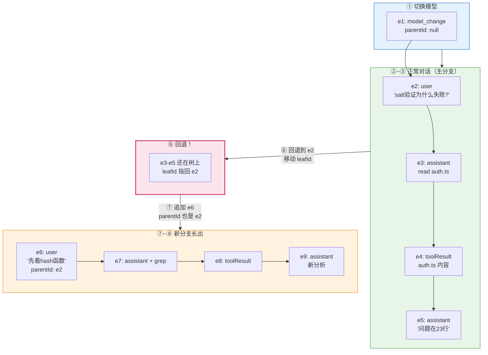

**📊 完整树形结构**：

```plaintext
e1 (model_change)
 └── e2 (user: "salt验证为什么失败?")
      ├── e3 (assistant: read auth.ts)     ← 旧分支（保留）
      │    └── e4 (toolResult)
      │         └── e5 (assistant: "问题在23行")
      │
      └── e6 (user: "先看hash函数")        ← 新分支（当前）
           └── e7 (assistant: grep hash)
                └── e8 (toolResult)
                     └── e9 (assistant: 新分析)
                           ↑ leafId
```

### 2.3 认父不认子：append-only 的必然选择

**大白话**：每个节点只知道自己从哪来（parentId），不知道自己有哪些孩子。这不是疏忽，是**设计**——因为如果父节点要维护 children 列表，追加子节点时就得修改父节点，就违反了 append-only 原则。

> 📖 **原文引用**：第10章 § 三 - 节点解剖
>
> "如果父节点要维护 children 列表，追加新子节点时就得修改父节点，违反 append-only 原则。所以'认父不认子'是 append-only 的必要条件。"

[查看原文档完整内容](./source/M10 · 第10章：会话管理 —— 对话的存储、恢复与分叉.md#三树上节点的解剖)

**🎨 类比图：认父不认子 = 只留出生证明**

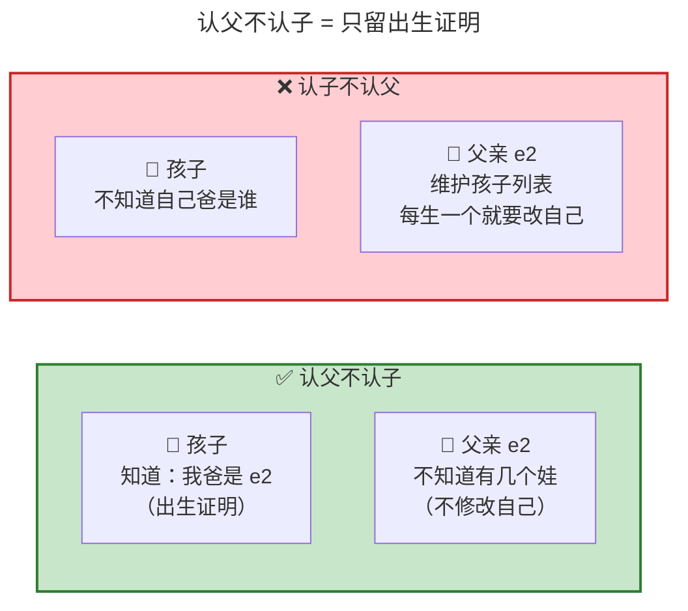

**📊 为什么必须认父不认子？**

| 方案 | 追加 e6 时 | 是否违反 append-only |
|------|-----------|---------------------|
| ✅ 认父不认子 | e6 记录 parentId=e2，e2 不动 | ✅ 不违反 |
| ❌ 认子不认父 | e2 的 children 从 [e3] 改成 [e3, e6] | ❌ 修改了 e2！ |

### 2.4 9 种 Entry 类型：按"对 LLM 的影响"分三组

**大白话**：树上有 9 种节点类型，看似很多，但按"对 LLM 调用有什么影响"分成三组就清楚了——**进上下文的**（4 种）、**改状态的**（2 种）、**纯元数据**（3 种）。

> 📖 **原文引用**：第10章 § 三 - 9 种 Entry 类型
>
> "按'对 LLM 调用的影响'分三组就清晰了。"

[查看原文档完整内容](./source/M10 · 第10章：会话管理 —— 对话的存储、恢复与分叉.md#9-种-entry-类型按职责分三组)

**📊 9 种 Entry 速记表**：

| 组 | 类型 | 对 LLM 的影响 | 例子 |
|----|------|-------------|------|
| **① 进上下文** | MessageEntry | → 变成 messages 数组的一项 | 用户说话、AI 回复、工具结果 |
| | CustomMessageEntry | → 自定义消息 | BashExecution 等 |
| | CompactionEntry | → 压缩摘要替换旧消息 | 第 9 章的压缩结果 |
| | BranchSummaryEntry | → 被弃分支的"遗言" | 分支摘要 |
| **② 改状态** | ModelChangeEntry | → 改后续用哪个模型 | 切换到 Claude 4.6 |
| | ThinkingLevelChangeEntry | → 改思考级别 | 调整思考强度 |
| **③ 纯元数据** | LabelEntry | → 跳过，不影响 LLM | 给节点贴书签 |
| | SessionInfoEntry | → 跳过 | 会话元信息 |
| | CustomEntry | → 跳过 | 扩展自定义 |

**🎨 类比图：三种处理方式**

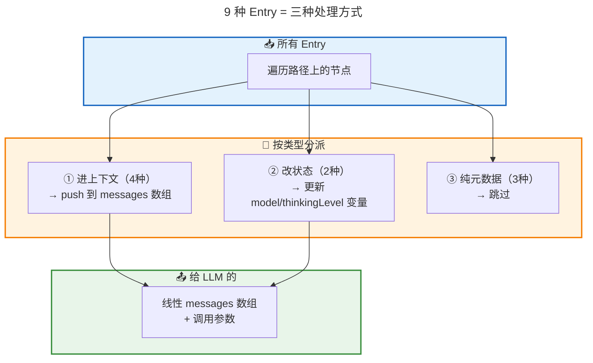

### 2.5 三个核心操作：追加、回退、分支

**大白话**：Session Tree 只有三个操作——**追加**（创建新节点+移动 leafId）、**回退**（只移动 leafId）、**分支**（回退+追加的自然结果）。三个操作都是 O(1)，而且**都不修改任何旧节点**。

> 📖 **原文引用**：第10章 § 四 - 三个核心操作
>
> "分支不是独立的操作，是'回退 + 追加'的组合效果。"

[查看原文档完整内容](./source/M10 · 第10章：会话管理 —— 对话的存储、恢复与分叉.md#四三个核心操作--分支摘要)

**📊 三个操作对比**：

| 操作 | 做什么 | 复杂度 | 类比 |
|------|--------|--------|------|
| **追加** | 创建新 Entry + leafId = 新 id | O(1) | 📝 写新日记 |
| **回退** | leafId = 旧节点 id | O(1) | 🔀 git checkout |
| **分支** | 回退 + 追加 | O(1) | 🌿 树干长新枝 |

**🔄 操作流程图**：

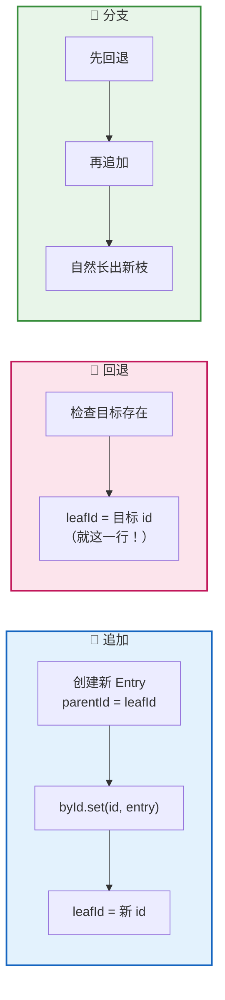

### 2.6 buildSessionContext：把树"压扁"成线性数组

**大白话**：LLM 只认识线性 messages 数组，不认识树。所以每次调用 LLM 前，`buildSessionContext` 要做的就是把树沿着"当前路径"（从 leaf 到 root）遍历一遍，按类型分派处理，最终"压扁"成一个线性数组。

> 📖 **原文引用**：第10章 § 五 - buildSessionContext
>
> "无论你的内部数据结构多复杂，到 LLM 边界必须变成线性。"

[查看原文档完整内容](./source/M10 · 第10章：会话管理 —— 对话的存储、恢复与分叉.md#五从树到-llm-上下文buildsessioncontext)

**🔄 流程图：两步走**

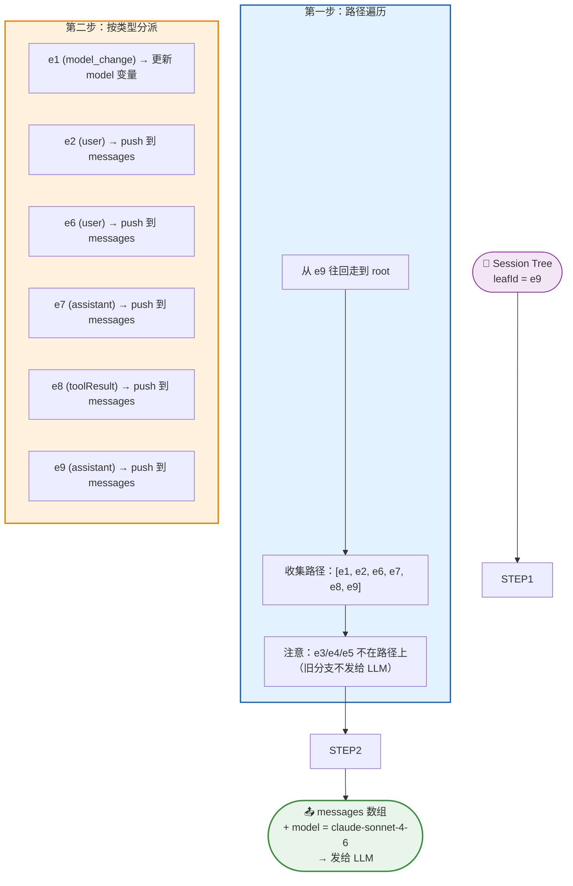

**状态变量的"覆盖式提取"**：

沿路径从 root 走到 leaf，遇到 model_change 就覆盖，最后一次覆盖生效。**回退时自动正确**——如果路径不包含某条 model_change，model 自动回到切换前的值。

### 2.7 分支摘要：被放弃分支的"遗言"

**大白话**：回退后旧分支的数据完整保留，但当前路径的 LLM 看不到。如果你希望新分支的 Agent **大致知道** 之前试过什么，可以用 `branchWithSummary()`——给旧分支生成一份 5 段式结构化摘要，像一张"遗言明信片"注入新分支的上下文。

> 📖 **原文引用**：第10章 § 四 - 分支摘要
>
> "BranchSummaryEntry 是被抛弃分支的'遗言'，不是真实发生的对话。"

[查看原文档完整内容](./source/M10 · 第10章：会话管理 —— 对话的存储、恢复与分叉.md#分支摘要branchsummaryentry回退时的可选项)

**🎨 类比图：分支摘要 = 旅行分支的明信片**

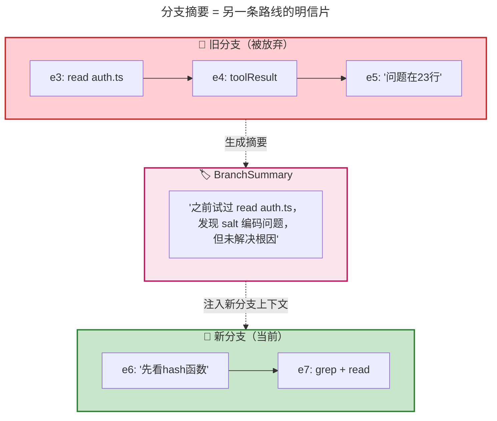

### 2.8 JSONL 持久化：行级追加 + 延迟写入

**大白话**：JSONL 文件一行一个 Entry，新数据直接 `appendFileSync` 到末尾——和 append-only 树完美契合（树只追加，文件也只追加）。还有一个精巧的"延迟写入"机制：首次 assistant 消息到达前不写盘，避免"有问无答"的半截对话残留。

> 📖 **原文引用**：第10章 § 六 - JSONL 持久化
>
> "JSONL 是行级追加的——新 Entry 直接 appendFileSync 到文件末尾，不需要读入-修改-重写整个文件。"

[查看原文档完整内容](./source/M10 · 第10章：会话管理 —— 对话的存储、恢复与分叉.md#六jsonl-持久化的具体细节)

**🎨 类比图：JSONL = 日记本只加页不撕页**

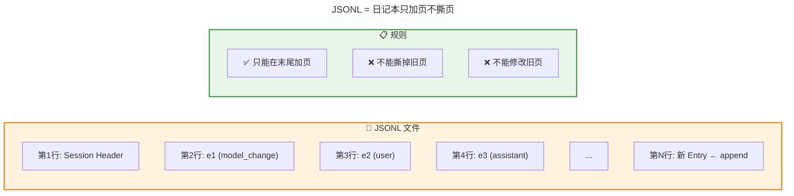

---

## 三、可视化总览

### 3.1 会话管理全景架构图

> 📖 **原文引用**：第10章 § 一 + §八
>
> 原文中的架构描述位置

[查看原文档完整内容](./source/M10 · 第10章：会话管理 —— 对话的存储、恢复与分叉.md)

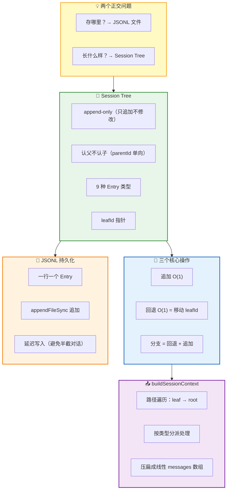

---

## 四、关键数字速记

> 📖 **原文引用**：第10章 全文
>
> 原文中的关键数字位置

[查看原文档完整内容](./source/M10 · 第10章：会话管理 —— 对话的存储、恢复与分叉.md)

```
┌────────────────────────────────────────────────────────┐
│  📊 关键数字（吹牛用）                                 │
├────────────────────────────────────────────────────────┤
│  • 2 个维度：存哪里（介质）+ 长什么样（结构）           │
│  • 9 种 Entry 类型：4 进上下文 + 2 改状态 + 3 元数据   │
│  • 3 个核心操作：追加、回退、分支（全部 O(1)）          │
│  • 1 个指针：leafId（当前所在节点）                     │
│  • 1 条铁律：append-only（只追加、不修改、不删除）      │
│  • 2 步转换：路径遍历 + 按类型分派                     │
│  • 2 层实现：agent-core（通用框架）+ coding-agent（独立）│
└────────────────────────────────────────────────────────┘
```

---

## 五、类比速记卡

| 概念 | 类比 | 原文出处 |
|------|------|----------|
| **Session Tree** | 🔀 Git 版本管理 | § 一 |
| **append-only** | 📓 日记本只加页不撕页 | § 二 |
| **leafId** | 🏷️ Git HEAD 指针 | § 二 |
| **认父不认子** | 👶 出生证明（只知爸，爸不知娃数） | § 三 |
| **9 种 Entry 分三组** | 📥🔄📋 进上下文 / 改状态 / 纯元数据 | § 三 |
| **回退** | 🔀 git checkout（移动指针不删数据） | § 四 |
| **分支摘要** | 🏷️ 旅行分支的明信片（遗言） | § 四 |
| **buildSessionContext** | 🫓 把树"压扁"成线性数组 | § 五 |
| **JSONL 文件** | 📓 日记本一行一条 | § 六 |
| **延迟写入** | 🚫 避免"有问无答"的半截对话 | § 六 |

---

## 六、一句话总结（费曼技巧版）

**会话管理 是什么？**
> 把对话历史存成一棵 append-only 的树（Session Tree），回退和分支只是移动指针不删数据，每次调用 LLM 前把当前路径"压扁"成线性 messages 数组。

**为什么重要？**
> 线性数组做回退就得删数据，删了就没了。树形结构让历史完整保留，用户可以随时回到任何岔路口尝试不同方案——就像 Git 让你随时 checkout 到任何 commit。

**三个可迁移的设计思路？**
> ① 拆开"存哪里"和"长什么样"两个维度；② append-only 数据结构用于撤销/回退/分支场景；③ 节点化状态变量，让回退天然正确。

---

## 七、设计精华：一连串自洽的设计选择

> 📖 **原文引用**：第10章 § 八 - 总结
>
> "这一连串设计选择是连贯的——每一个选择都回应了上一个选择带来的约束。"

[查看原文档完整内容](./source/M10 · 第10章：会话管理 —— 对话的存储、恢复与分叉.md#八总结)

**🔗 设计链**：

```mermaid
flowchart LR
    Q1["为什么用树？<br/>对话不是线性的<br/>（回退/分支）"] --> A1["用 Session Tree"]
    A1 --> Q2["为什么不删旧数据？<br/>删了就找不回来"]
    Q2 --> A2["append-only"]
    A2 --> Q3["为什么认父不认子？<br/>节点不可变"]
    Q3 --> A3["父不维护 children"]
    A3 --> Q4["为什么需要 buildSessionContext？<br/>LLM 只认线性数组"]
    Q4 --> A4["路径遍历+压扁"]

    style Q1 fill:#fff9c4,stroke:#f9a825
    style Q2 fill:#fff9c4,stroke:#f9a825
    style Q3 fill:#fff9c4,stroke:#f9a825
    style Q4 fill:#fff9c4,stroke:#f9a825
    style A1 fill:#c8e6c9,stroke:#2e7d32
    style A2 fill:#c8e6c9,stroke:#2e7d32
    style A3 fill:#c8e6c9,stroke:#2e7d32
    style A4 fill:#c8e6c9,stroke:#2e7d32
```

---

> 📝 **学习笔记**
> - 学习日期：2026-09-03
> - 学习方式：费曼学习法（大白话版）
> - 原始文档：M10 · 第10章：会话管理 —— 对话的存储、恢复与分叉.md
> - 下一步：理解后，用自己的话讲给同事听（Step 3）
> - 🎉 源码学习篇 10 章全部完结！
