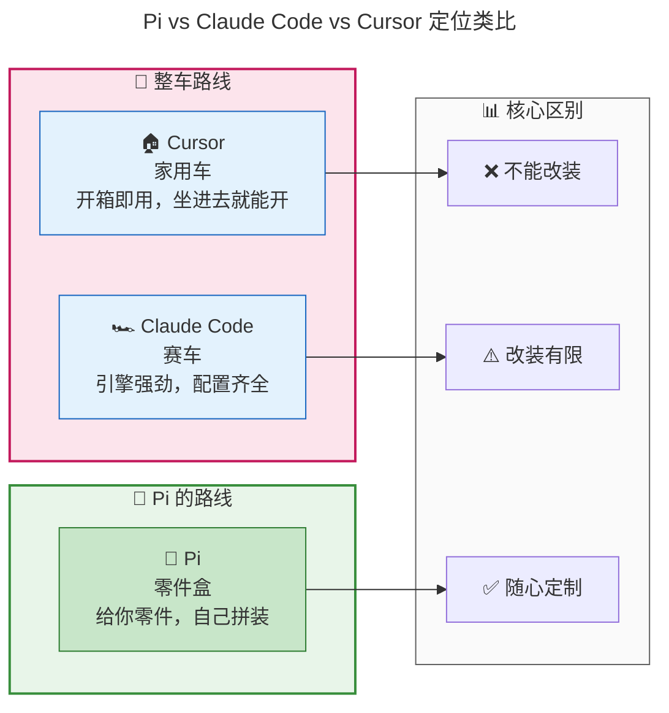
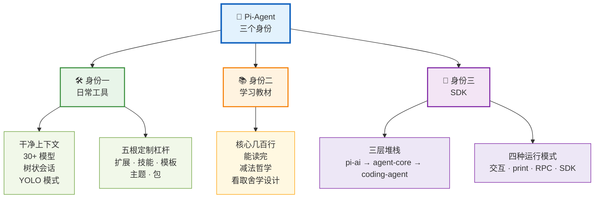
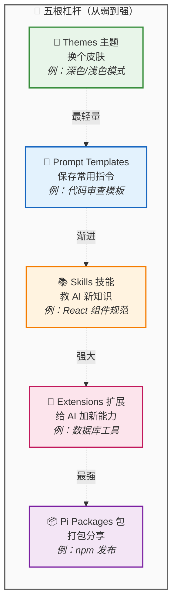
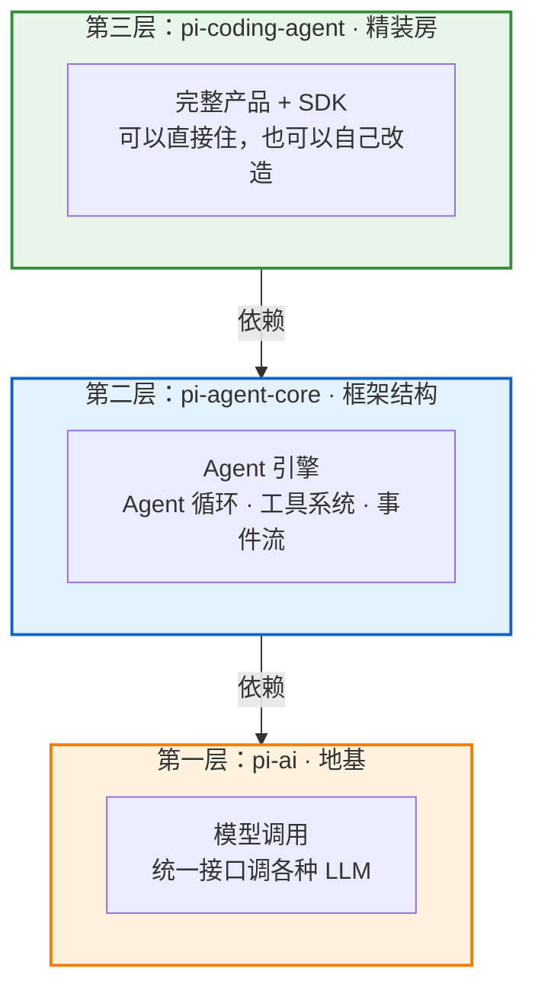
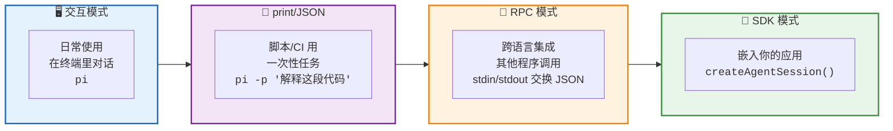
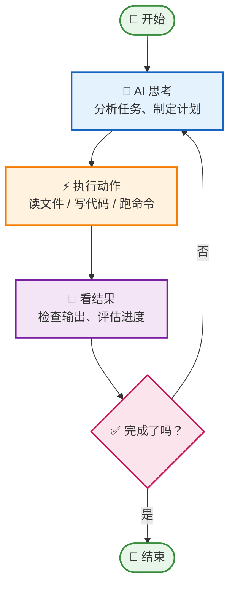
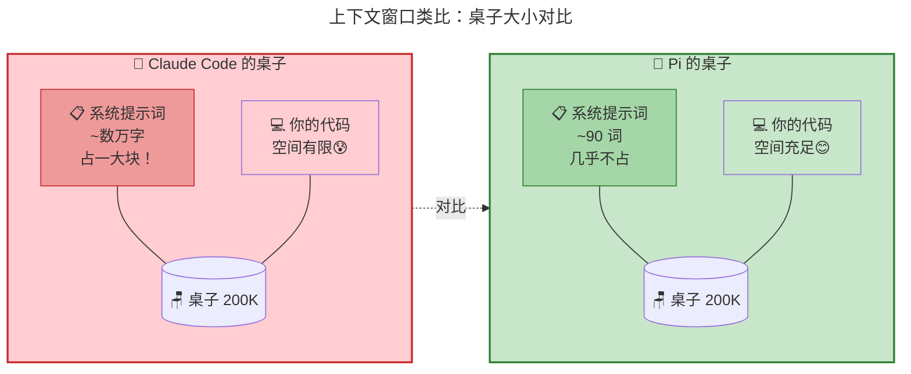
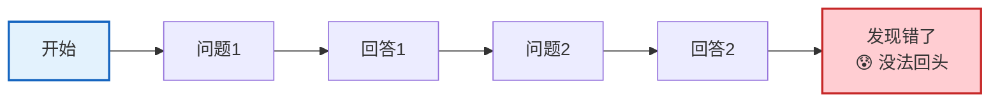
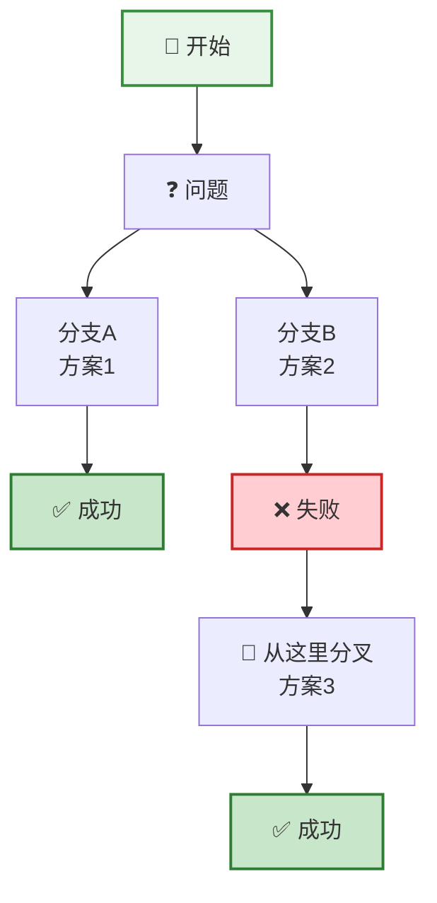

<!-- [AGC:FILE] tool=Cc author=fangkun date=2026-09-01 -->

# 大白话版：Pi-Agent 为什么值得你花时间

> 这是《第1章：开篇》的通俗解读版
> 核心理念：用大白话把技术概念讲明白，让自己和同事都能听懂

---

## 一、一句话说明白：Pi 是什么？

**Pi 是一个"可以自己组装"的 AI 编程助手。**

### 🎨 类比图：积木 vs 整车



### 📋 对比表格

| 工具              | 像什么     | 特点                         |
| --------------- | ------- | -------------------------- |
| **Cursor**      | 一辆造好的整车 | 座椅、空调、导航都装好，坐进去就能开。但你改不了什么 |
| **Claude Code** | 一辆赛车    | 引擎强劲，配置齐全。但也是整车，定制空间有限     |
| **Pi**          | 一盒积木/零件 | 给你发动机、底盘、转向柱，让你自己拼出一辆车     |

**关键区别**：

- Claude Code/Cursor 是"别人决定了功能，你来用"
- Pi 是"你决定要什么功能，自己来装"

---

## 二、Pi 的三个身份（为什么要学它）



### 身份一：作为日常工具 —— 好用、干净、可控

#### 2.1 为什么说它"干净"？

想象你去餐厅吃饭：

- **Claude Code** 像一家大酒店，菜单上有 100 道菜（功能），服务员（系统提示词）会先给你念一遍所有菜品介绍，占用了你很多时间
- **Pi** 像一家小店，菜单只有 4 道菜（4 个核心工具），服务员一句话都不多说，直接问你"想吃啥"

**技术解释**：
- Claude Code 的系统提示词有**几万字**，每次对话先占掉一大块"上下文窗口"
- Pi 的系统提示词只有**约 90 个英文单词**，上下文窗口几乎全留给你的代码

**好处**：你的代码能更多地被 AI "看到"，回答更准确。

#### 2.2 五根"定制杠杆"（Pi 的真正能力）

Pi 本身功能很少，但它给你 5 种方式来"加功能"：



**重点理解扩展（Extensions）**：

扩展是 TypeScript 文件，Pi 会自动加载，而且**支持热重载**——你改一下代码，正在运行的会话立刻生效，不用重启。

这意味着：**你可以让 AI 自己修改自己的能力！**

举个例子：
- AI 发现"我需要查数据库"
- AI 自己写一个数据库查询的扩展
- 扩展立即生效，AI 立刻能查数据库了

这就像车开在路上，司机发现需要导航，然后自己装了个导航系统，不用停车。

#### 2.3 日常能享受到的好处

| 好处 | 大白话解释 |
|------|------------|
| **上下文干净** | AI 不会被一堆废话占满脑子，能专注于你的代码 |
| **透明无黑箱** | 你能看到 AI 看到的每一条消息，知道它在想什么 |
| **30+ 模型供应商** | 支持 Anthropic、OpenAI、智谱、DeepSeek、Kimi 等，中途还能换 |
| **树状会话** | 对话可以像树枝一样分叉，走错路能回头重来 |
| **YOLO 模式** | 默认不弹确认框，AI 直接执行（快，但要小心） |

---

### 身份二：作为学习教材 —— 学习"怎么设计 AI Agent"

#### 3.1 为什么 Pi 适合学习？

**因为它足够小。**

- Claude Code 的代码你读不完（几十万行）
- LangChain 的代码你读不完（几万行起步）
- **Pi 的核心循环只有几百行，你能在几小时内读完**

**类比**：
- 学开车：用拖拉机学（简单、能看到内部结构），不用航空母舰学（太复杂）

#### 3.2 "减法哲学"：看取舍，学设计

Pi 有一份"我们没做什么"的清单，这才是最有价值的部分：

| Pi 没做的 | 为什么不做？ | 替代方案 |
|-----------|--------------|----------|
| **MCP 支持** | MCP 工具会灌入 13,700+ 个 token 的描述，太占空间 | 用带 README 的命令行工具，AI 需要时再读 |
| **子 Agent** | 增加复杂度，你看不清 AI 在干什么 | 用 tmux 开多个 Pi 实例 |
| **权限弹窗** | 弹窗太多你会烦，最后看都不看点同意 | 用容器隔离（Docker） |
| **计划模式** | 写在 markdown 文件里更持久、更灵活 | 让 AI 写一个 plan.md |
| **后台任务** | tmux 已经能解决这个问题 | 用 tmux |
| **待办列表** | TODO.md 文件更灵活 | 用 markdown 文件 |

**核心洞察**：
> 看一个"什么都做了"的框架，你只能学到"他们做了什么"。
> 看一个"刻意什么都不做"的框架，你才能学到"做 Agent 到底需要什么"。

---

### 身份三：作为 SDK —— 构建你自己的 AI Agent

#### 4.1 三层堆栈（从下到上）

想象盖房子：



**每一层都能独立使用**：

| 层                   | 用途                  | 适合谁                     |
| ------------------- | ------------------- | ----------------------- |
| **pi-ai**           | 只想调 LLM，不需要 Agent   | 做聊天机器人、文档分析的人           |
| **pi-agent-core**   | 想构建自己的 Agent，不需要 UI | 做数据分析 Agent、客服 Agent 的人 |
| **pi-coding-agent** | 想要完整产品 + SDK        | 做编码 Agent 产品的人          |

#### 4.2 还有一个"旁支"：pi-tui

`pi-tui` 是终端 UI 库（约 12,000 行代码），**和 Agent 完全无关**。

**它是干什么的？**
- 在终端里画界面（输入框、按钮、表格）
- 支持 Markdown 渲染、语法高亮
- 差分渲染（只重绘变化的部分，不闪烁）

**适合谁？**
- 做 CLI 工具的人
- 做终端 Dashboard 的人
- 做 TUI 游戏的人（作者本来就是做游戏引擎的）

#### 4.3 四种运行模式



---

## 三、核心概念大白话解释

### 3.1 什么是"Agent Loop"（智能体循环）？

**大白话**：AI 思考 → 执行动作 → 看结果 → 再思考 → 再执行... 直到任务完成。

**流程图**：



Pi 把这个循环做得很简洁（几百行代码），但功能完整。

### 3.2 什么是"上下文窗口"？

**大白话**：AI 一次能"看到"的信息量。

### 🎨 类比图：上下文窗口 = 桌子大小



**类比说明**：
- AI 的脑子像一张桌子，大小有限（比如 200K token）
- Claude Code：系统提示词占了 5 万字 → 桌子快满了，没地方放你的代码
- Pi：系统提示词只有 90 词 → 桌子几乎全留给你的代码

**Pi 的优势**：系统提示词极短，上下文窗口几乎全给你的代码。

### 3.3 什么是"树状会话"？

**大白话**：对话可以像树枝一样分叉，走错路能回头。

**普通对话（线性）**：



**树状对话（Pi）**：



**好处**：你可以同时尝试多种方案，不用怕"回不去了"。

### 3.4 什么是"热重载"？

**大白话**：改代码不用重启，立即生效。

**类比**：
- 普通方式：改配置 → 重启服务 → 生效（像重启电脑）
- 热重载：改配置 → 立刻生效（像改手机主题，不用重启）

**Pi 的扩展支持热重载**：
- 你改了一个扩展文件
- 正在运行的 Pi 会话立刻获得新能力
- 不用重启，不用重新对话

---

## 四、Pi vs Claude Code vs Cursor 对比表

| 维度 | Pi | Claude Code | Cursor |
|------|-----|-------------|--------|
| **定位** | 积木（自己组装） | 赛车（整车） | 家用车（整车） |
| **系统提示词** | ~90 词 | 数万字 | 未知 |
| **核心工具数** | 4 个 | 很多 | 很多 |
| **定制能力** | 极强（扩展/技能/包） | 中等 | 较弱 |
| **学习曲线** | 中等（需要了解架构） | 低（开箱即用） | 低（开箱即用） |
| **适合谁** | 想掌控一切的技术人员 | 想要强力的开发者 | 想要方便的开发者 |
| **上下文效率** | 极高 | 中等 | 未知 |
| **透明度** | 完全透明 | 部分透明 | 黑箱 |
| **模型支持** | 30+ 供应商 | 仅 Anthropic | 多家 |
| **会话结构** | 树状（可分叉） | 线性 | 线性 |

---

## 五、关键数字速记

```
┌────────────────────────────────────────────────────────┐
│  📊 Pi 关键数字（吹牛用）                              │
├────────────────────────────────────────────────────────┤
│  • GitHub Stars：64,000+                               │
│  • 核心工具：4 个（read/write/edit/bash）              │
│  • 系统提示词：~90 词（运行时 200-400 词）             │
│  • TUI 代码量：~12,000 行                              │
│  • 支持供应商：30+ 家（约 27 个独立品牌）              │
│  • 核心包数量：4 个                                    │
│  • 运行模式：4 种                                      │
│  • TerminalBench 排名：第 2（用 Claude Opus 4.5）      │
└────────────────────────────────────────────────────────┘
```

---

## 六、一句话总结（费曼技巧版）

**Pi 是什么？**
> 一个"可以自己组装"的 AI 编程助手，给你零件而不是整车，让你按自己的需求造出专属的编码 Agent。

**为什么值得花时间？**
> 1. 作为工具：上下文干净、透明可控、30+ 模型随便换
> 2. 作为教材：几百行核心代码，能让你真正读懂 Agent 是怎么工作的
> 3. 作为 SDK：三层架构，从"调模型"到"造 Agent"到"做产品"全覆盖

**适合谁？**
> 想掌控自己工具的开发者、想学习 Agent 设计的技术人员、想构建自己 Agent 产品的团队。

---

## 七、类比速记卡

| 概念         | 类比                |
| ---------- | ----------------- |
| Pi 的定位     | 积木 vs 整车          |
| 扩展系统       | 给车加装新零件（支持热插拔）    |
| 技能系统       | 给司机一本操作手册         |
| 提示词模板      | 导航路线收藏            |
| 主题         | 车的涂装              |
| Pi 包       | 4S 店的改装套件         |
| 上下文窗口      | AI 的桌子大小          |
| 树状会话       | 对话的"时光机"+ 平行宇宙    |
| Agent Loop | AI 的思考循环：想→做→看→再想 |
| 热重载        | 改设置不用重启，立即生效      |
|            |                   |

---

## 八、学习路径建议

```
第 1 章（本篇）← 你现在在这里
   ↓ 建立全局认知
第 2 章：项目结构与分层架构
   ↓ 了解四个包怎么分工
第 3 章：Agent Loop（核心中的核心）
   ↓ 理解 AI 是怎么循环思考的
第 4 章：模型调用
   ↓ 理解怎么一套代码调 30+ 家模型
第 5 章：工具系统
   ↓ 理解工具怎么定义、执行
第 6 章：消息系统
   ↓ 理解对话历史怎么表示
第 7-10 章：进阶主题（按需跳读）
```

---

> 📝 **学习笔记**
> - 学习日期：2026-09-01
> - 学习方式：费曼学习法（大白话版）
> - 下一步：理解后，用自己的话讲给同事听（Step 3）
