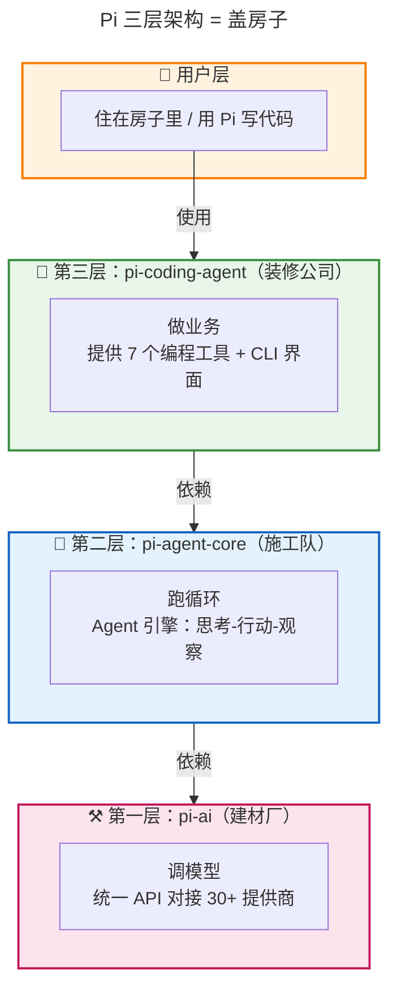
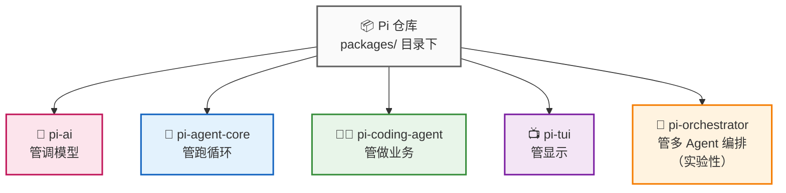
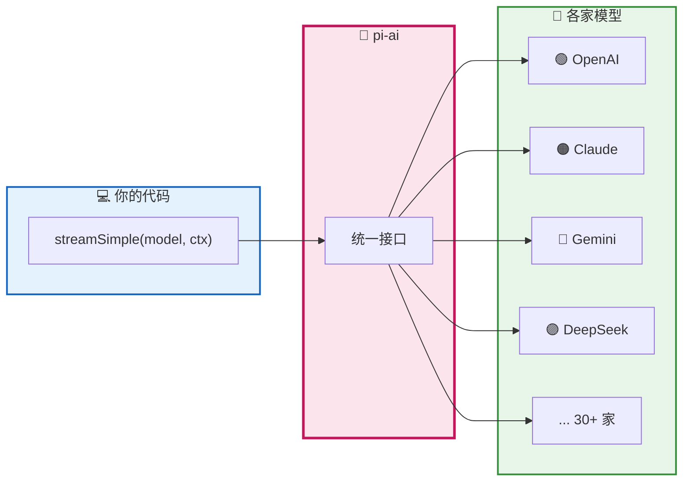
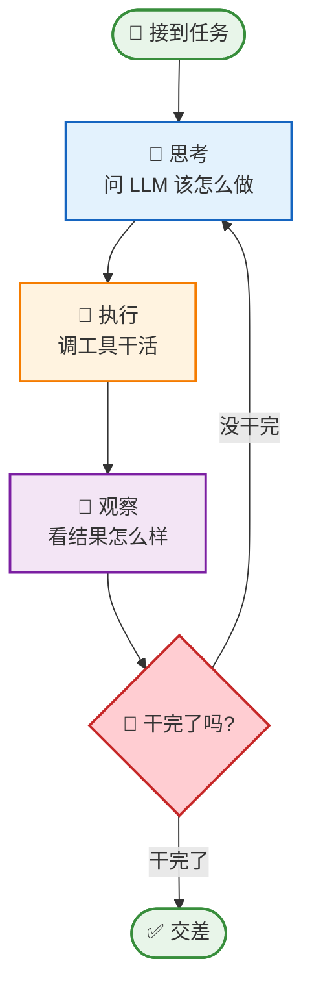
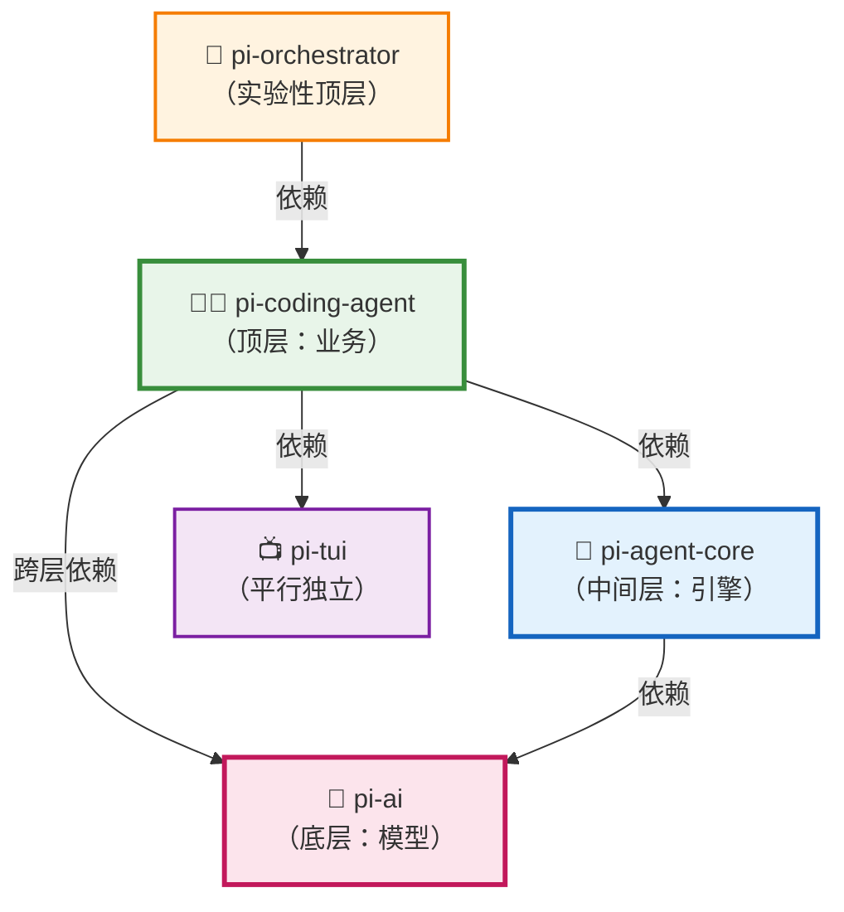
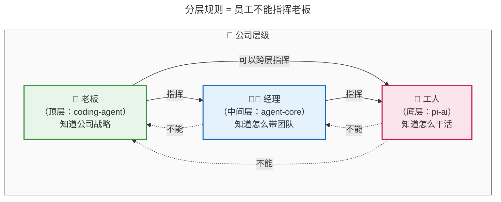
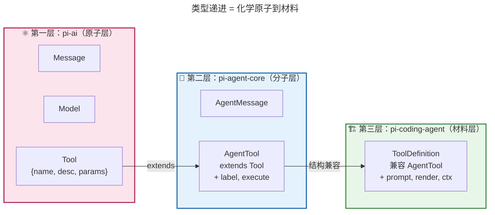
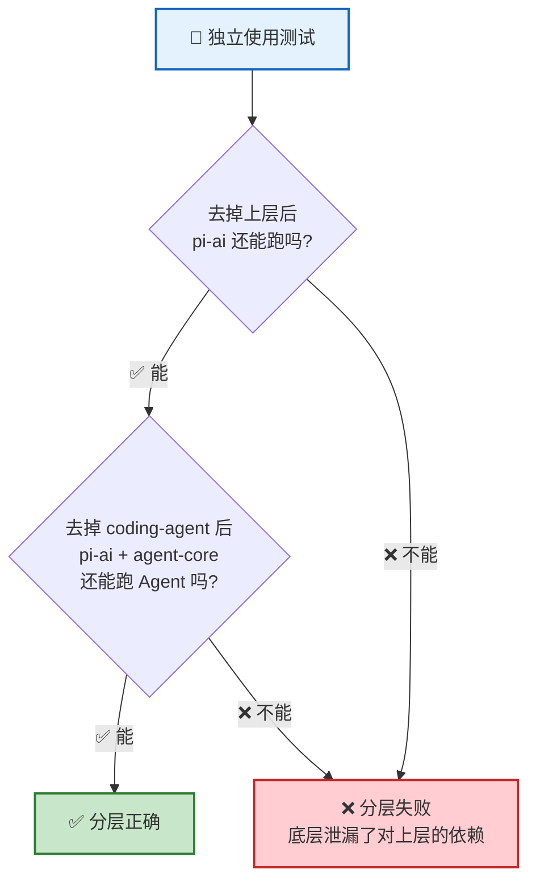
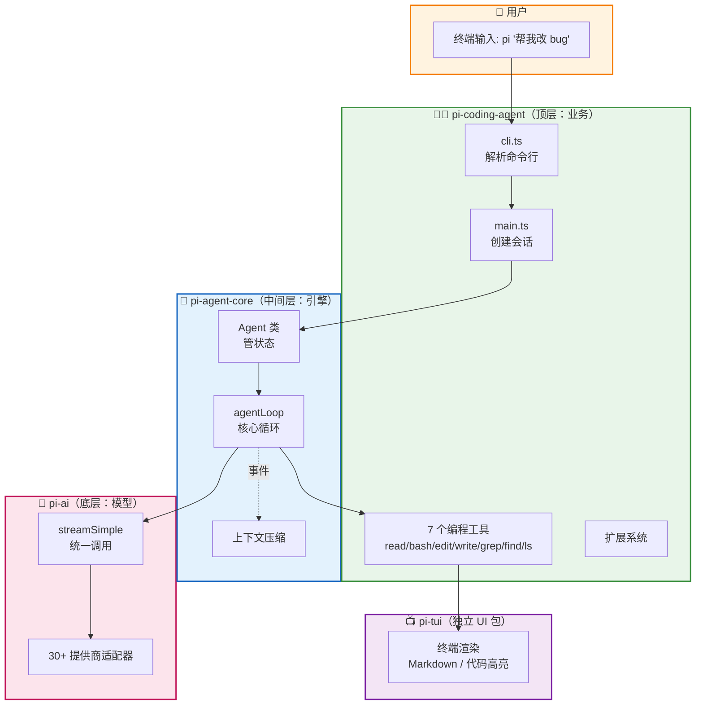
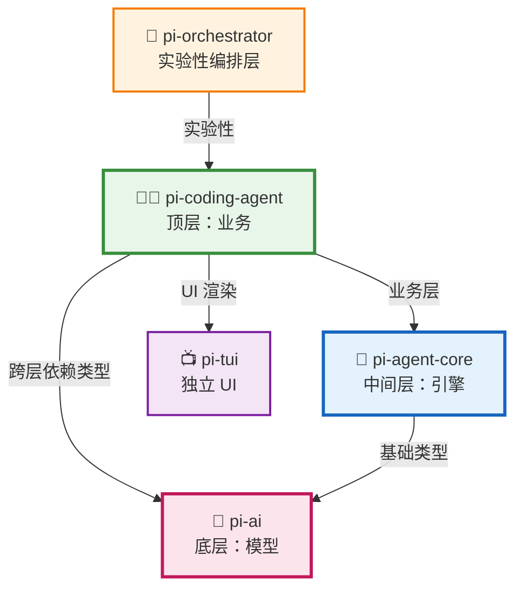

<!-- [AGC:FILE] tool=Cc author=fangkun date=2026-09-01 -->

# 大白话版：Pi-Agent 三层架构

> 这是《第2章：三层架构 —— Pi-Agent 项目的骨骼》的通俗解读版
> 核心理念：用大白话把技术概念讲明白，让自己和同事都能听懂
>
> 📖 **[查看原始文档](./source/M02 · 第2章：三层架构 —— Pi-Agent 项目的骨骼.md)**
---

## 一、一句话说明白：Pi-Agent 三层架构 是什么？

**Pi-Agent 的三层架构是一个像"盖房子"一样分层堆起来的代码组织方式：最底层负责"调模型"（和 AI 对话），中间层负责"跑循环"（让 AI 反复思考-行动-再看结果），最顶层负责"做业务"（让它成为一个能写代码的助手）。每一层只管自己那一摊事，单向依赖下层，下层对上层一无所知。**

> 📖 **原文引用**：第2章 § 1 - 你打开了一个 Agent 代码库
>
> "五个包，整整齐齐排成一排... 为什么是五个包？它们之间的关系是什么？"

[查看原文档完整内容](./source/M02 · 第2章：三层架构 —— Pi-Agent 项目的骨骼.md#1-你打开了一个-agent-代码库)

### 类比理解

**🏗️ 类比：盖房子**

想象你要盖一栋能住人的房子。你不会自己从烧砖开始干，而是：
- **建材厂**（最底层）：烧砖、生产水泥、炼钢筋 —— 它不管你要盖啥
- **施工队**（中间层）：拿建材打地基、搭框架 —— 它不管你要住还是开店
- **装修公司**（最顶层）：根据你的需求刷漆、装灯、摆家具 —— 它知道你要干嘛

Pi 的三层架构就是这样的：



**🔌 另一个更直观的类比：万能充电头**

| 概念 | 像什么 | 特点 |
|------|--------|------|
| **pi-ai** | 🔌 万能充电头 | 不管什么手机（OpenAI / Claude / Gemini），插上都能充 |
| **pi-agent-core** | 🍳 厨房万能灶 | 不管你要炒啥菜（编程 / 客服 / 翻译），它都提供稳定的火 |
| **pi-coding-agent** | 👨‍🍳 厨师 + 菜谱 | 知道怎么做"编程"这道菜，有 7 个工具当厨具 |

**关键区别**：
- 充电头不关心你用手机刷什么 APP（pi-ai 不管 Agent 循环）
- 灶不关心厨师要做川菜还是粤菜（pi-agent-core 不管具体业务）
- 厨师可以换灶，灶可以换充电头 —— 每一层都能独立替换

---

## 二、核心概念详解

### 2.1 代码库长什么样？

**大白话**：Pi 把整个代码库拆成了 5 个包（目录），像把一个团队拆成 5 个小组，每组只管一件事。这种把多个包放在同一个仓库里的做法叫 **monorepo**（Pi 用的是 npm workspaces）。

> 📖 **原文引用**：第2章 § 1 - 你打开了一个 Agent 代码库
>
> 原文的目录结构：
> ```
> repo/
> ├── packages/
> │   ├── ai/              ← @earendil-works/pi-ai
> │   ├── agent/           ← @earendil-works/pi-agent-core
> │   ├── coding-agent/    ← @earendil-works/pi-coding-agent
> │   ├── orchestrator/    ← @earendil-works/pi-orchestrator
> │   └── tui/             ← @earendil-works/pi-tui
> ```

[查看原文档完整内容](./source/M02 · 第2章：三层架构 —— Pi-Agent 项目的骨骼.md#1-你打开了一个-agent-代码库)



### 2.2 三层架构每一层到底干啥？

#### 📍 pi-ai（底层）：万能充电头

**大白话**：pi-ai 解决的核心问题是"怎么用一个接口调用 30 多家 AI 模型"。不管你用 OpenAI、Claude 还是 Gemini，在 pi-ai 里都是一个 `streamSimple()` 函数搞定。

> 📖 **原文引用**：第2章 § 2.1 - pi-ai：管"调模型"
>
> "Unified LLM API with automatic model discovery and provider configuration"<br/>
> **为什么这么理解**：原文强调 pi-ai 没有 agent、没有 tool、没有 loop——它**只管**一件事：把 LLM API 的差异抹平。

[查看原文档完整内容](./source/M02 · 第2章：三层架构 —— Pi-Agent 项目的骨骼.md#21-pi-ai管调模型)



#### 📍 pi-agent-core（中间层）：厨房万能灶

**大白话**：pi-agent-core 是"通用 Agent 引擎"。它只知道怎么跑一个"调用 LLM → 执行工具 → 看结果 → 再调用 LLM"的循环，但**完全不知道**你让它去写代码、做客服还是翻译文档。

> 📖 **原文引用**：第2章 § 2.2 - pi-agent-core：管"跑循环"
>
> 关键词 "general-purpose"（通用的）—— 它不知道自己在做编程 Agent、客服 Agent 还是任何具体领域的 Agent<br/>
> **为什么这么理解**：原文说 pi-agent-core 没有 read、bash、edit 这些具体工具，只关心"怎么把一个 Agent 跑起来"。

[查看原文档完整内容](./source/M02 · 第2章：三层架构 —— Pi-Agent 项目的骨骼.md#22-pi-agent-core管跑循环)



> 这个"思考-行动-观察"循环，就是传说中的 **Agent Loop**（下一章的主角）。

#### 📍 pi-coding-agent（顶层）：厨师 + 菜谱

**大白话**：pi-coding-agent 是最"厚"的一层（上百个源文件），它把前两层组合起来，再加上编程助手需要的所有具体功能：7 个编程工具（read、bash、edit、write、grep、find、ls）、扩展系统、CLI 界面、会话持久化等等。

> 📖 **原文引用**：第2章 § 2.3 - pi-coding-agent：管"具体业务"
>
> "Coding agent CLI with read, bash, edit, write tools and session management"<br/>
> **为什么这么理解**：原文说这一层最"厚"，因为"它知道所有具体的事"——从工具实现到 CLI 渲染，啥都管。

[查看原文档完整内容](./source/M02 · 第2章：三层架构 —— Pi-Agent 项目的骨骼.md#23-pi-coding-agent管具体业务)

#### 📍 pi-tui 和 pi-orchestrator：两个"外挂"

**大白话**：这两个包不属于核心三件套。

- **pi-tui**：终端 UI 库，只管把 Agent 的输出渲染得好看（Markdown、代码高亮）。它**完全独立**于 AI 部分，哪怕你不用 AI，也可以用它渲染终端。
- **pi-orchestrator**：实验性的"包工头"，负责让多个 coding-agent 一起干活。它是顶上加顶的**外围编排层**，入门阶段不用管。

> 📖 **原文引用**：第2章 § 2.4 和 § 2.5
>
> "pi-tui... 它的依赖里没有任何 AI 相关的包"<br/>
> "pi-orchestrator 为 v0.80.x 新增的实验性编排包... 不在核心三件套的学习主线里"

[查看原文档完整内容](./source/M02 · 第2章：三层架构 —— Pi-Agent 项目的骨骼.md#24-pi-tui管显示)

### 2.3 三层对比表

| 维度 | pi-ai | pi-agent-core | pi-coding-agent |
|------|-------|---------------|-----------------|
| **📌 定位** | 底层：模型调用 | 中间层：Agent 引擎 | 顶层：业务产品 |
| **🎯 类比** | 🔌 万能充电头 | 🍳 厨房万能灶 | 👨‍🍳 厨师+菜谱 |
| **🧱 类比** | ⚒️ 建材厂 | 🧱 施工队 | 🎨 装修公司 |
| **🤔 它知道什么** | 怎么调 30+ 模型 | 怎么跑 Agent 循环 | 怎么写代码 |
| **🙈 它不知道什么** | 什么是 Agent | 什么是编程 | 用户下一步要啥 |
| **📦 大小** | 精简 | 中等 | 很厚（100+ 文件） |
| **🔧 适合谁** | 想自己调 LLM 的人 | 想做自己 Agent 的人 | 想用编程助手的人 |

---

## 三、最关键的分层规则

### 3.1 依赖方向单向向上

**大白话**：分层的核心不是"只能找楼下"（coding-agent 可以直接找 pi-ai，不必非得通过 pi-agent-core），而是"**楼上能找楼下，楼下永远不能找楼上**"。

> 📖 **原文引用**：第2章 § 4 - 打开 package.json，事情没那么简单
>
> "关键不在于能不能跨层引用，而在于依赖方向是不是单向的"<br/>
> "底层永远不知道上层的存在 —— pi-ai 的代码里没有任何一个 import 指向 pi-agent-core 或 pi-coding-agent"<br/>
> **为什么这么理解**：原文明确指出 coding-agent 直接依赖 pi-ai 不是设计失误而是必然，因为基础类型必须在一处统一定义。

[查看原文档完整内容](./source/M02 · 第2章：三层架构 —— Pi-Agent 项目的骨骼.md#4-打开-packagejson事情没那么简单)



**❌ 下面这些箭头绝对不存在**：
- pi-ai → pi-agent-core （底层不知道中间层）
- pi-ai → pi-coding-agent （底层不知道顶层）
- pi-agent-core → pi-coding-agent （中间层不知道顶层）

### 3.2 验证单向依赖表

| 包 | 它依赖了谁 | 有没有反向依赖？ |
|---|-----------|----------------|
| **pi-ai** | OpenAI SDK、Claude SDK 等外部包 | ❌ 没有，它不依赖任何 pi-xxx 包 |
| **pi-agent-core** | pi-ai, typebox, yaml | ✅ 只向上依赖 pi-ai，不依赖 coding-agent |
| **pi-coding-agent** | pi-ai, pi-agent-core, pi-tui | ✅ 只向上依赖，不反向依赖 |

### 3.3 类比理解"单向向上"



> **记住**：老板可以直接给工人派活（跨层调用），但工人不能给老板派活（反向依赖）。

---

## 四、类型在三层之间怎么传递？

### 4.1 类比：原子 → 分子 → 材料

**大白话**：Pi 用"化学"的思路组织类型：
- **pi-ai 定义"原子"**：`Message`、`Model`、`Tool` —— 最基础的概念，像化学元素
- **pi-agent-core 把原子组成"分子"**：`AgentTool extends Tool` —— 加上执行能力
- **pi-coding-agent 把分子合成"材料"**：`ToolDefinition` —— 再加上 UI、渲染等业务属性

> 📖 **原文引用**：第2章 § 5 - 类型在层间的流转：从原子到分子
>
> "pi-ai 定义了'原子'（最基础的类型），pi-agent-core 把原子组合成'分子'（Agent 专用类型），pi-coding-agent 再把分子组合成'材料'（业务专用类型）"

[查看原文档完整内容](./source/M02 · 第2章：三层架构 —— Pi-Agent 项目的骨骼.md#5-类型在层间的流转从原子到分子)



### 4.2 类型扩展对照表

| 维度 | Tool<br/>（pi-ai 层） | AgentTool<br/>（agent-core 层） | ToolDefinition<br/>（coding-agent 层） |
|------|----------------------|--------------------------------|--------------------------------------|
| **关心什么** | "工具长什么样" | "工具怎么执行" | "工具怎么显示 + 接入扩展" |
| **核心字段** | `name` `description` `parameters` | ↑ 继承 + `label` `execute` `executionMode` | ↑ 兼容 + `promptSnippet` `renderCall` `execute(ctx)` |
| **谁知道它** | LLM | Agent 引擎 | 产品 UI + 扩展系统 |
| **能独立发布吗** | ✅ 完全可以 | ❌ 依赖 Tool | ❌ 依赖 AgentTool |

### 4.3 一句话总结类型递进

**大白话**：每一层只加自己该关心的字段，**不改底层**。这样底层（pi-ai）就能独立发布 —— 别人可以只引用 `Tool` 类型，不用把整个 Agent 框架都拖进来。

> 📖 **原文引用**：第2章 § 5 - DESIGN PRINCIPLE
>
> "底层定义最小类型，上层通过继承和联合类型扩展——每一层只加自己该关心的字段，不改底层。"

[查看原文档完整内容](./source/M02 · 第2章：三层架构 —— Pi-Agent 项目的骨骼.md#5-类型在层间的流转从原子到分子)

---

## 五、一定要用三层吗？

### 5.1 灵活度对比

**大白话**：三层架构不是教条。你用几层，取决于你的需求有多复杂。

> 📖 **原文引用**：第2章 § 6 - 那我写 Agent 真的需要三层吗？
>
> 原文列了三个场景（A 不分层 / B 两层 / C 一层）来证明"**三层不是教条，依赖方向控制才是**"。

[查看原文档完整内容](./source/M02 · 第2章：三层架构 —— Pi-Agent 项目的骨骼.md#6-那我写-agent-真的需要三层吗)

| 场景 | 用哪几层 | 适合做什么 | 你要自己做什么 |
|------|---------|-----------|----------------|
| **只用 pi-ai** | 1 层 | 只想调 LLM，不需要 Agent 循环 | 自己管状态、自己写循环 |
| **pi-ai + pi-agent-core** | 2 层 | 想做自己的 Agent，但业务独特 | 写自己的工具和入口 |
| **三层全用** | 3 层 | 做 Pi 同类的编程助手 | 直接用，或写扩展 |

### 5.2 "独立使用测试"



### 5.3 唯一不能违反的规则

**底层的代码里不能出现任何对上层的引用**。

这条规则确保了：你可以把任何一层换成自己的实现，而不影响其他层。比如你可以把 pi-ai 换成自己的模型调用层，pi-agent-core 和 pi-coding-agent 都不需要改。

---

## 六、可视化总览

### 6.1 全景架构图

> 📖 **原文引用**：第2章 § 3 - 看完五个包，你大概有了直觉
>
> 原文的 ASCII 堆叠图（"很直觉的分层：底层调模型，中间跑循环，顶层做业务"）

[查看原文档完整内容](./source/M02 · 第2章：三层架构 —— Pi-Agent 项目的骨骼.md#3-看完五个包你大概有了直觉)



### 6.2 完整依赖关系图



---

## 七、关键数字速记

> 📖 **原文引用**：第2章 各章节
>
> 原文中反复出现的关键数字

[查看原文档完整内容](./source/M02 · 第2章：三层架构 —— Pi-Agent 项目的骨骼.md)

```
┌────────────────────────────────────────────────────────┐
│  📊 关键数字（吹牛用）                                 │
├────────────────────────────────────────────────────────┤
│  • 5 个包：pi-ai / agent-core / coding-agent / tui / orchestrator │
│  • 3 层核心：ai（调模型）→ agent-core（跑循环）→ coding-agent（做业务）│
│  • 30+ 提供商：pi-ai 支持的 LLM 厂商数量              │
│  • 7 个编程工具：read/bash/edit/write/grep/find/ls    │
│  • 1 条核心规则：依赖方向必须单向向上                   │
│  • 100+ 文件：coding-agent 的"厚度"（比前两层加起来还多）│
└────────────────────────────────────────────────────────┘
```

---

## 八、类比速记卡

| 概念 | 类比 | 原文出处 |
|------|------|----------|
| **pi-ai** | 🔌 万能充电头 / ⚒️ 建材厂 | § 2.1 |
| **pi-agent-core** | 🍳 厨房万能灶 / 🧱 施工队 | § 2.2 |
| **pi-coding-agent** | 👨‍🍳 厨师+菜谱 / 🎨 装修公司 | § 2.3 |
| **pi-tui** | 📺 独立的显示器（不依赖 AI） | § 2.4 |
| **pi-orchestrator** | 👷 包工头（管多个工人） | § 2.5 |
| **三层整体** | 🏠 盖房子 / 🔌→🍳→👨‍🍳 充电头到厨师 | § 1 |
| **单向依赖** | 🏢 老板能指挥工人，工人不能指挥老板 | § 4 |
| **类型递进** | ⚛️ 原子 → 🧬 分子 → 🏗️ 材料 | § 5 |
| **monorepo** | 📦 一个仓库里装多个独立包 | § 1 |

---

## 九、一句话总结（费曼技巧版）

**Pi-Agent 三层架构是什么？**
> 像盖房子一样分三层堆起来的代码结构 —— 最底层（pi-ai）调模型、中间层（pi-agent-core）跑 Agent 循环、最顶层（pi-coding-agent）做编程业务，每一层只管自己那一摊事。

**为什么这么设计重要？**
> 因为只有这样，你才能**想换模型就换模型**（只改底层）、**想做新业务就做新业务**（只改顶层），而不必牵一发动全身。分层 = 隔离变化。

**唯一的核心规则是什么？**
> 依赖方向必须**单向向上** —— 底层永远不能引用上层。这条规则守住了，整个架构就活了。

**适合谁？**
- 想读懂 Pi 源码的开发者
- 想自己写 Agent 但不想从零开始的团队
- 想学习"如何优雅地组织大型代码库"的程序员

---

> 📝 **学习笔记**
> - 学习日期：2026-09-01
> - 学习方式：费曼学习法（大白话版）
> - 原始文档：M02 · 第2章：三层架构 —— Pi-Agent 项目的骨骼.md
> - 下一步：理解后，用自己的话讲给同事听（Step 3）；然后进入下一章《Agent Loop》
