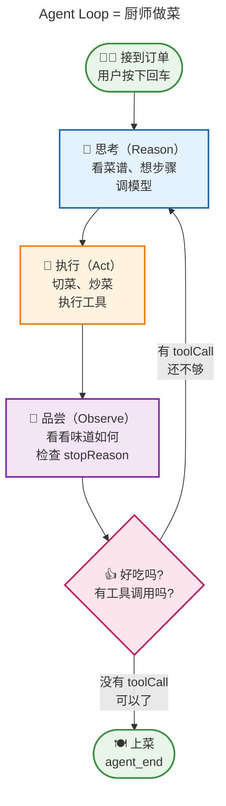
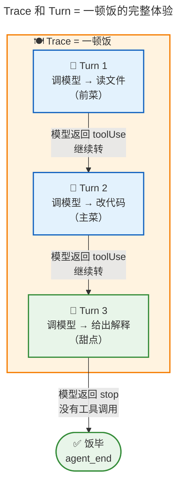
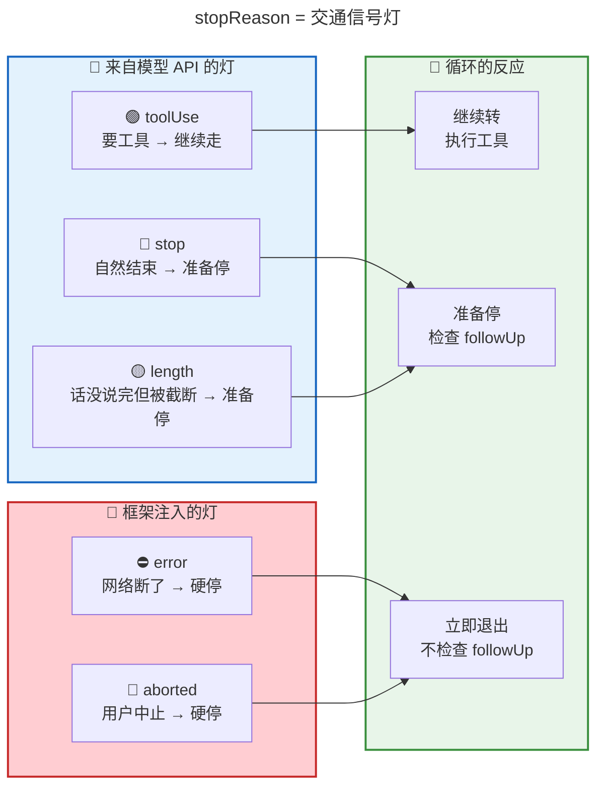
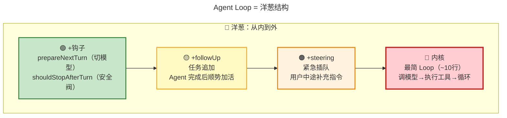
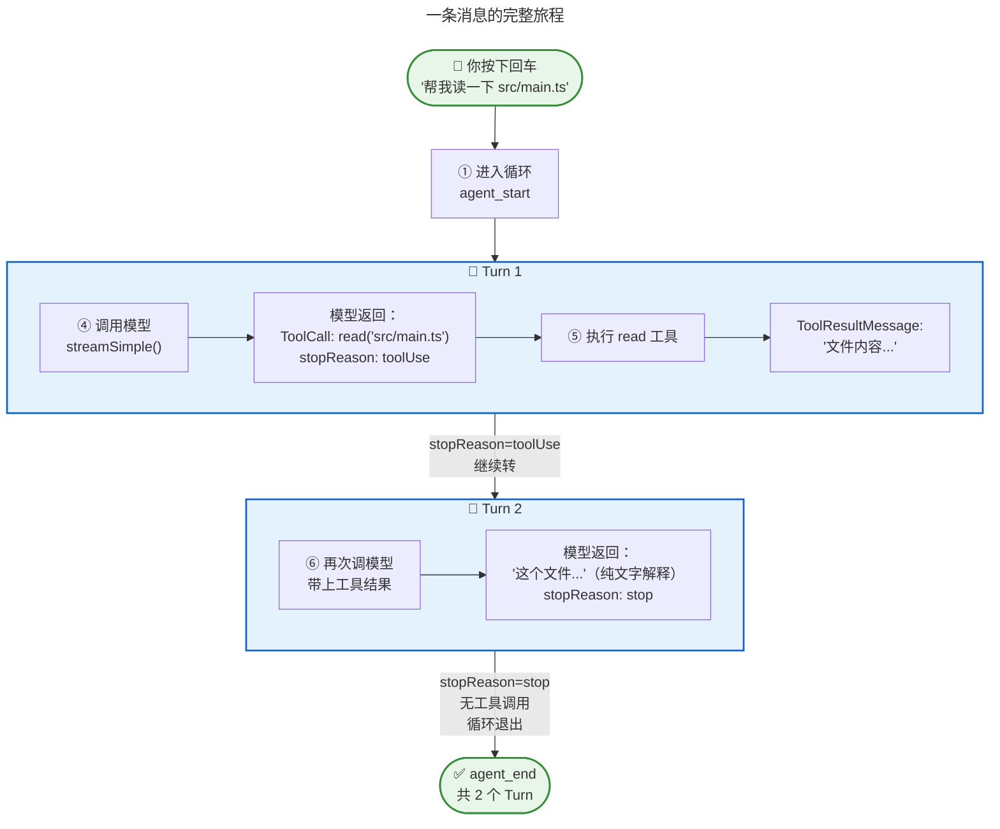
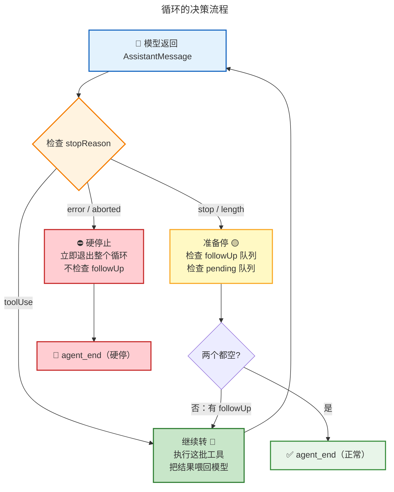
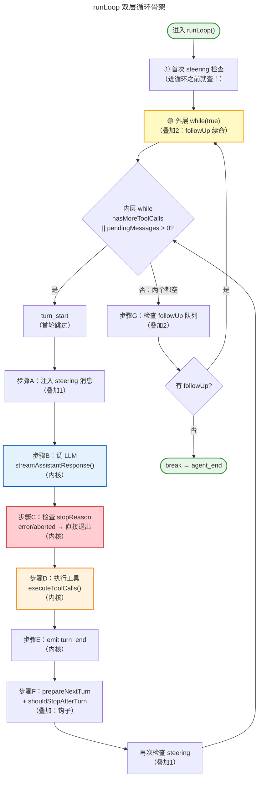
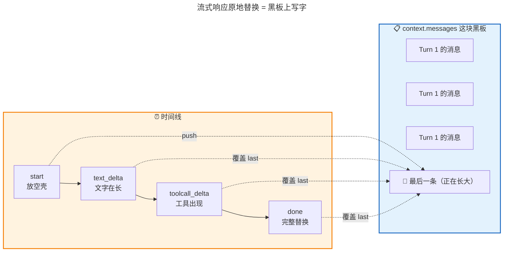
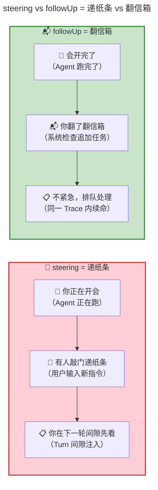

<!-- [AGC:FILE] tool=Cc author=fangkun date=2026-09-02 -->

# 大白话版：Agent Loop —— 让模型转动起来的引擎

> 这是《第3章：Agent Loop —— 让模型转动起来的引擎》的通俗解读版
> 核心理念：用大白话把技术概念讲明白，让自己和同事都能听懂
>
> 📖 **[查看原始文档](./source/M03 · 第3章：Agent Loop —— 让模型转动起来的引擎.md)**

---

## 一、一句话说明白：Agent Loop 是什么？

**Agent Loop 是一个"让 AI 反复思考-动手-看结果-再思考"的循环引擎。就像厨师做菜：想步骤 → 切菜炒菜 → 尝一口 → 不够好再来一轮 —— 直到满意才上菜。**

> 📖 **原文引用**：第3章 § 三 - 全景：一条消息的旅程，以及循环怎么转
>
> "Loop 实际上只看一件事——模型输出里有没有工具调用。"

[查看原文档完整内容](./source/M03 · 第3章：Agent Loop —— 让模型转动起来的引擎.md#三全景一条消息的旅程以及循环怎么转)

### 类比理解

**🎨 类比图：Agent Loop = 厨师做菜**



**对比表格：三种"使用大模型"的方式**

| 概念 | 像什么 | 决策者 | 调用次数 | 适合谁 |
|------|--------|--------|----------|--------|
| **直接调用** | 📞 打电话问一句话 | 用户自己 | 1 次 | 翻译、摘要——一问一答 |
| **Workflow** | 🏭 流水线 | 你的代码 | N 次（代码控制） | 文档流水线、RAG |
| **Agent Loop** | 👨‍🍳 厨师做菜 | 模型自己 | 不确定（模型控制） | 编程助手、自动化任务 |

> 📖 **原文引用**：第3章 § 一 - 引子：大模型的三种用法
>
> "关键区别：步骤之间的流转不再由你写死，而是由模型的输出内容来驱动。"

[查看原文档完整内容](./source/M03 · 第3章：Agent Loop —— 让模型转动起来的引擎.md#一引子大模型的三种用法)

---

## 二、核心概念详解

### 2.1 Trace 和 Turn：两个容易混的概念

**大白话**：
- **Trace** = 你按下回车到 Agent 彻底停下的 **整个过程**（像"一顿饭"）
- **Turn** = 一次"调模型 + 执行工具"的 **单轮循环**（像"上一道菜"）

一顿饭（Trace）可以上很多道菜（Turn），但最终只有一次完整体验。

> 📖 **原文引用**：第3章 § 二 - 先搞清楚几个概念：Trace、Turn
>
> "一个 Trace 是从用户按下回车、到 Agent 彻底停下来、发出 agent_end 事件的整个过程。一个 Trace 包含多个 Turn。"
>
> **为什么这么理解**：原文用树形结构展示了 Trace 包裹 Turn 的嵌套关系，Trace 是 `agent_start → agent_end`，Turn 是 `turn_start → turn_end`。

[查看原文档完整内容](./source/M03 · 第3章：Agent Loop —— 让模型转动起来的引擎.md#二先搞清楚几个概念traceturn)

**🎨 类比图：Trace 和 Turn = 饭局和菜**



**关键规则**：
- **一圈内层循环 = 一个 Turn** = 一次 `turn_start` → 一次模型调用 → 工具执行 → 一次 `turn_end`
- **一个 Turn 只有一次模型调用**——如果模型一口气要求 3 个工具，这 3 个都在同一个 Turn 里执行
- 执行完工具再把结果喂回去调模型——那就是 **下一个 Turn** 了

---

### 2.2 stopReason：循环唯一的信号灯

**大白话**：`stopReason` 是模型每次回答时自带的"交通信号灯"。循环只看这一个字来决定：继续走还是停下来。

但这里有一个**反直觉的关键认知**：模型不会说"我做完了"。模型只是个 token 预测器，它不"知道"任务完没完。所谓"完成"，其实是 **我们人类定义的规则**——"模型没有要工具，就当它做完了"。

> 📖 **原文引用**：第3章 § 三 - 循环怎么转：stopReason —— 唯一的信号灯
>
> "不是模型在说'我完成了'，而是我们在说'你没要工具，那就当你完成了'。"
>
> **为什么这么理解**：原文强调 stopReason 有两种来源——三种来自模型 API（toolUse/stop/length），两种是框架流式层注入的兜底（error/aborted）。

[查看原文档完整内容](./source/M03 · 第3章：Agent Loop —— 让模型转动起来的引擎.md#循环怎么转stopreason--唯一的信号灯)

**🎨 类比图：stopReason = 交通信号灯**



**stopReason 五种值速记表**：

| stopReason | 从哪来 | 含义 | 循环反应 |
|------------|--------|------|----------|
| `toolUse` | 模型 API | 模型要工具 | 继续转 |
| `stop` | 模型 API | 自然结束 | 准备停 |
| `length` | 模型 API | 达到上限被截断 | 准备停 |
| `error` | 框架注入 | 调用异常 | 硬停止 |
| `aborted` | 框架注入 | 用户中止 | 硬停止 |

> **注意**：实际驱动循环的不是 `stopReason === "toolUse"`，而是 `toolCalls 数组长度 > 0 && !terminate`。这意味着即使被截断（length），只要有 toolCall，循环仍会执行工具。

---

### 2.3 最简 Loop vs coding-agent 的叠加设计

**大白话**：Agent Loop 的核心只有十几行代码（调模型 → 检查 → 执行工具 → 再来）。但 Pi 的 coding-agent 作为交互式编程助手，在这个核心外面又"叠"了四层功能——像洋葱一样，一层一层包上去。

> 📖 **原文引用**：第3章 § 四 - 源码详解：基础 Loop 与 coding-agent 的叠加设计
>
> "这些叠加设计都是 coding-agent 的功能选择，不是 Agent 的通用法则。"
>
> **为什么这么理解**：原文明确说"如果你做的是一个'一问一答带工具'的简单 Agent，上面全是多余的——你只需要最简 Loop。"

[查看原文档完整内容](./source/M03 · 第3章：Agent Loop —— 让模型转动起来的引擎.md#四源码详解基础-loop-与-coding-agent-的叠加设计)

**🎨 类比图：内核 + 叠加 = 洋葱**



**对比表：内核 vs 叠加**：

| 层级 | 功能 | 谁需要 | 类比 |
|------|------|--------|------|
| **内核** | 调模型→执行工具→循环 | 所有 Agent | 🚗 发动机 |
| **+steering** | 用户中途插队消息 | 交互式 Agent | 📝 开会递纸条 |
| **+followUp** | 完成后追加任务 | 需要连续任务的 Agent | 📬 会后翻信箱 |
| **+钩子** | 动态切模型/安全阀 | 复杂产品 Agent | 🔧 维修工按需换零件 |

---

## 三、可视化总览

### 3.1 一条消息的完整旅程

> 📖 **原文引用**：第3章 § 三 - 全景：一条消息的旅程
>
> 原文展示了从"你按下回车"到"agent_end"的完整流程，包含四个反复出现的实体：消息（Message）、模型（Model）、工具（Tool）、事件（Event）。

[查看原文档完整内容](./source/M03 · 第3章：Agent Loop —— 让模型转动起来的引擎.md#三全景一条消息的旅程以及循环怎么转)



### 3.2 循环的决策流程（stopReason 驱动）

> 📖 **原文引用**：第3章 § 三 - 循环的所有退出路径
>
> 原文展示了五种 stopReason 分三路处理的决策流程图。

[查看原文档完整内容](./source/M03 · 第3章：Agent Loop —— 让模型转动起来的引擎.md#循环的所有退出路径)



### 3.3 runLoop 的骨架：双层循环 + 四个步骤

> 📖 **原文引用**：第3章 § 4.2 - runLoop() 的骨架
>
> 原文展示了完整的 runLoop 代码骨架，标注了"内核"与"叠加"的位置。

[查看原文档完整内容](./source/M03 · 第3章：Agent Loop —— 让模型转动起来的引擎.md#42-runloop-的骨架先看内核再看叠加)



---

## 四、源码关键步骤速览

### 4.1 streamAssistantResponse：流式响应的"原地替换"

**大白话**：模型回答不是一次性返回的，而是一个字一个字"流"过来的。为了让你能看到实时文字，代码用了一个巧妙的设计——先往消息列表里放一个"空壳"，然后随着 token 到来，**原地替换**最后一条消息的内容（不是新增，是覆盖）。

> 📖 **原文引用**：第3章 § 4.4 - streamAssistantResponse() — 调 LLM
>
> "先 push 空壳再原地替换...这样 context 的消息数量不变，但最后一条消息的内容在'长大'。"
>
> **为什么这么理解**：原文用四个时间点展示了 context.messages[last] 的演变：空壳 → 文字在长 → 工具调用出现 → 最终完整消息。

[查看原文档完整内容](./source/M03 · 第3章：Agent Loop —— 让模型转动起来的引擎.md#44-内核步骤bstreamassistantresponse--调-llm)

**🎨 类比图：原地替换 = 在黑板上写字**



### 4.2 convertToLlm：两层消息的翻译官

**大白话**：Agent 内部用很多"只有自己能看懂"的消息类型（比如"上下文压缩摘要"、"Bash 执行详情"），但模型只认识三种标准消息（user/assistant/toolResult）。`convertToLlm` 就是站在边界上的翻译官——把 Agent 内部语言翻译成 LLM 能理解的协议。

> 📖 **原文引用**：第3章 § 4.4 阶段B - AgentMessage → Message 转换
>
> "Agent 内部维护对话历史时，需要记录自己的内部状态...LLM 根本不认识这些消息类型——它只认三种标准消息。"

[查看原文档完整内容](./source/M03 · 第3章：Agent Loop —— 让模型转动起来的引擎.md#阶段-bagentmessage--message-转换两层消息的边界)

**对比表**：

| 消息类型 | 谁认识 | 例子 | 发给模型? |
|----------|--------|------|-----------|
| UserMessage | Agent + LLM | "帮我读一下文件" | ✅ |
| AssistantMessage | Agent + LLM | "好的，我来读..." | ✅ |
| ToolResultMessage | Agent + LLM | "文件内容是..." | ✅ |
| CompactionSummaryMessage | 只 Agent 知道 | "之前的对话摘要" | ❌ 过滤掉 |
| BashExecutionMessage | 只 Agent 知道 | "命令执行的详细信息" | ❌ 过滤掉 |

### 4.3 工具执行：并行 vs 串行

**大白话**：模型可能一口气要求读 3 个文件。这些工具可以并行跑（同时读 3 个文件，省时间），但 Pi 的规则很保守——**只要有一个工具说"我得排队"，整批都乖乖排队**。宁可多等，不可出错。

> 📖 **原文引用**：第3章 § 4.6 - executeToolCalls() — 执行工具
>
> "一票否决策略：只要这批工具中有任何一个声明了 executionMode: 'sequential'，整批都串行。"

[查看原文档完整内容](./source/M03 · 第3章：Agent Loop —— 让模型转动起来的引擎.md#46-内核步骤dexecutetoolcalls--执行工具)

**对比表：两种执行模式**

| 维度 | 串行模式 | 并行模式（三阶段） |
|------|----------|-------------------|
| **执行方式** | 一个做完才开始下一个 | 准备顺序 → 执行并行 → 事件有序 |
| **速度** | 慢 | 快（但准备阶段仍顺序） |
| **安全性** | 最安全 | 有第二道防线（同文件编辑串行化） |
| **触发条件** | 任何工具声明 sequential | 所有工具都允许并行 |

---

## 五、关键概念对比：steering vs followUp

**大白话**：
- **steering** = 开会时有人敲门递了张纸条——"紧急，先看这个"
- **followUp** = 开完会翻了翻信箱——"不急，但需要处理"

> 📖 **原文引用**：第3章 § 4.10 - steering vs followUp：一张表看清两种干预
>
> "steering 是你正在开会，有人敲门递了张纸条...followUp 是开完会翻了翻信箱。"

[查看原文档完整内容](./source/M03 · 第3章：Agent Loop —— 让模型转动起来的引擎.md#410-steering-vs-followup一张表看清两种干预)

**🎨 类比图**



**对比表**：

| 维度 | steering（递纸条） | followUp（翻信箱） |
|------|-------------------|-------------------|
| **检查时机** | 内层循环 **每圈** 开头+结尾 | 内层循环 **全部结束** 后 |
| **语义** | 紧急插队 | 排队等叫号 |
| **典型场景** | 用户中途补充："也检查一下测试文件" | 系统追加："顺便跑个测试" |
| **对循环的影响** | 驱动循环继续（不等当前完成） | 触发外层循环，内层重开 |

> 📖 **原文引用**：第3章 § 4.10
>
> 原文用左右对照图展示了两种机制在循环时间线上的不同位置。

---

## 六、关键数字速记

> 📖 **原文引用**：第3章 § 全文关键源码索引
>
> 原文在结尾给出了 v0.80.2 实际行号的源码索引。

[查看原文档完整内容](./source/M03 · 第3章：Agent Loop —— 让模型转动起来的引擎.md#本章关键源码索引-v0802-实际行号)

```
┌────────────────────────────────────────────────────────┐
│  📊 关键数字（吹牛用）                                 │
├────────────────────────────────────────────────────────┤
│  • ~10 行代码：最简 Agent Loop 的全部                  │
│  • 5 种 stopReason：toolUse/stop/length/error/aborted  │
│  • 3 种来自模型 API + 2 种框架注入                     │
│  • 4 层洋葱结构：内核 + steering + followUp + 钩子     │
│  • 2 层消息系统：Agent 内部语言 vs LLM 标准协议        │
│  • 3 个 prompt cache 标记位置（Anthropic）             │
│  • "一票否决"：1 个工具要串行 → 整批串行              │
│  • terminate 用 every 不用 some：全停才停              │
└────────────────────────────────────────────────────────┘
```

---

## 七、循环的所有退出路径速记

> 📖 **原文引用**：第3章 § 三 - 循环的所有退出路径
>
> 原文给出了四种退出路径的完整对比表。

[查看原文档完整内容](./source/M03 · 第3章：Agent Loop —— 让模型转动起来的引擎.md#循环的所有退出路径)

| 退出路径 | 触发条件 | 类比 |
|----------|----------|------|
| **正常退出** | stop/length + 无 followUp + 无 pendingMessages | 菜上齐了，客人走了 |
| **硬停止** | error / aborted | 厨房着火了，全员撤退 |
| **外部钩子停** | shouldStopAfterTurn() 返回 true | 经理说"今天打烊" |
| **工具终止** | 所有工具结果都 terminate: true | 所有厨师都说"做不了了" |

---

## 八、类比速记卡

| 概念 | 类比 | 原文出处 |
|------|------|----------|
| Agent Loop | 👨‍🍳 厨师做菜（思考→做→尝→循环） | § 一/三 |
| Trace | 🍽️ 一顿饭（完整体验） | § 二 |
| Turn | 🥗 上一道菜（单次循环） | § 二 |
| stopReason | 🚦 交通信号灯 | § 三 |
| 最简 Loop | 🚗 发动机（所有车都需要） | § 四 |
| steering | 📝 开会递纸条（紧急插队） | § 4.3/4.10 |
| followUp | 📬 会后翻信箱（排队处理） | § 4.9/4.10 |
| 内核+叠加 | 🧅 洋葱（一层层剥） | § 五 |
| convertToLlm | 🌐 翻译官（内部语言→标准协议） | § 4.4 阶段B |
| 原地替换 | 📋 黑板上写字（覆盖最后一条） | § 4.4 阶段D |
| prompt cache | 📚 书签（记住上次阅读位置） | § 4.4 阶段C |

---

## 九、一句话总结（费曼技巧版）

**Agent Loop 是什么？**
> 一个让 AI "想→做→看→再想"的循环引擎。核心只有十几行代码：调模型→检查有没有工具调用→有就执行工具再继续→没有就停。

**为什么重要？**
> 因为这是 Agent 区别于普通"问答AI"的核心。没有 Loop，模型只能回答一次；有了 Loop，模型可以读文件、改代码、跑测试——像真人程序员一样工作。

**核心设计原则？**
> "是否继续"不靠代码的复杂判断，只靠一条简单规则：**模型的输出中有没有工具调用。** 这不是模型的"智能决策"，而是人类定义的工程约定。

**适合谁？**
> 做 AI Agent 产品的开发者。理解内核（最简 Loop）+ 叠加（steering/followUp/钩子）的分层思路，你就能按需搭建自己的 Agent，而不被复杂性淹没。

---

## 十、源码索引（吹牛用）

> 📖 **原文引用**：第3章 - 本章关键源码索引（v0.80.2 实际行号）

| 功能 | 文件位置 |
|------|----------|
| `runAgentLoop()` 入口 | `agent-loop.ts:95-118` |
| `runLoop()` 双层循环 | `agent-loop.ts:155-269` |
| steering 首次检查 | `agent-loop.ts:167` |
| turn_start 首轮跳过 | `agent-loop.ts:175-179` |
| stopReason 硬停止 | `agent-loop.ts:196-200` |
| 流式响应 | `agent-loop.ts:275-368` |
| 原地替换 | `agent-loop.ts:313-357` |
| 工具并行/串行调度 | `agent-loop.ts:373-516` |
| turn_end + 钩子 | `agent-loop.ts:218-253` |
| steering 二次检查 | `agent-loop.ts:253` |
| prompt cache 标记 | `anthropic-messages.ts` L922/L1208/L1157 |

---

> 📝 **学习笔记**
> - 学习日期：2026-09-02
> - 学习方式：费曼学习法（大白话版）
> - 原始文档：M03 · 第3章：Agent Loop —— 让模型转动起来的引擎.md
> - 前一篇：[第2章：三层架构 - 大白话版](./第2章：三层架构 —— Pi-Agent 项目的骨骼.md)
> - 下一篇预告：第4章 - 模型调用——一行代码驾驭多个模型
> - 下一步：理解后，用自己的话讲给同事听（Step 3）
