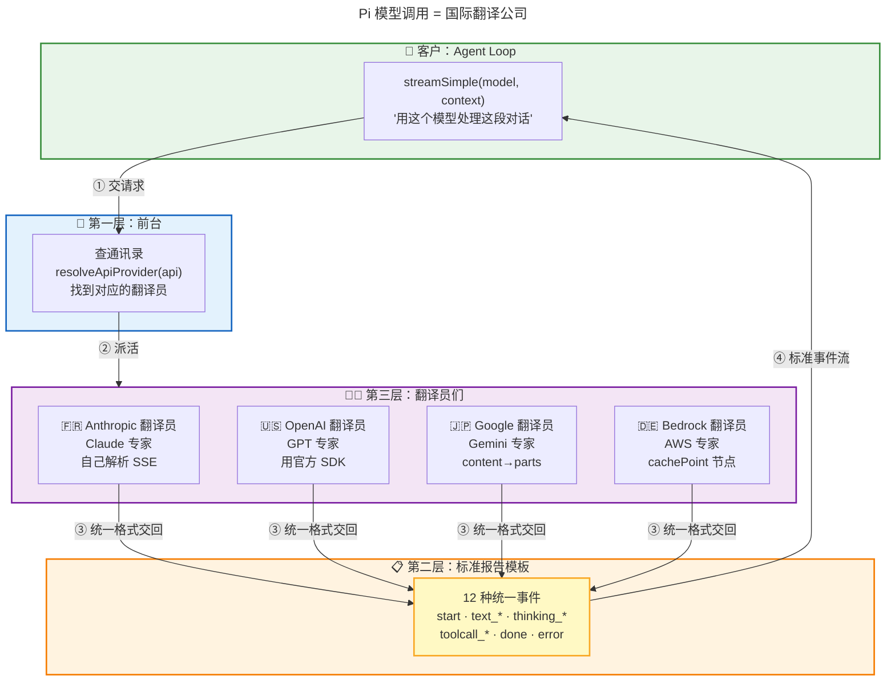
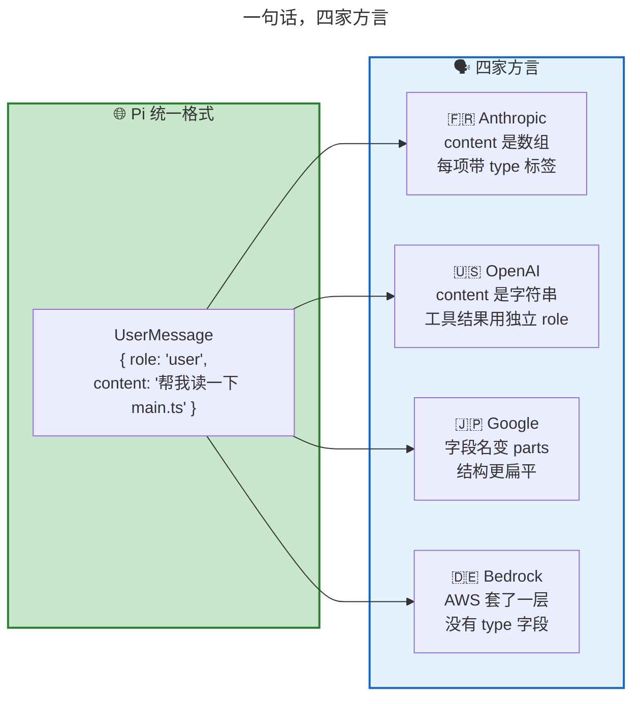
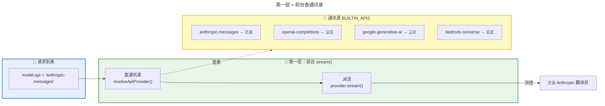
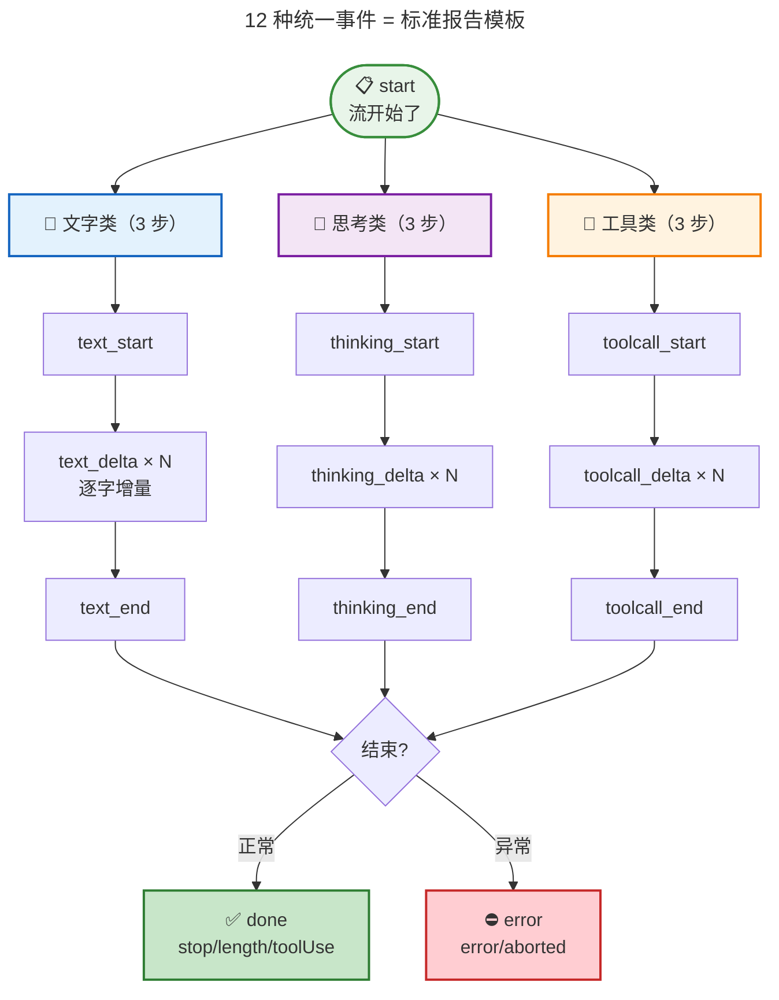
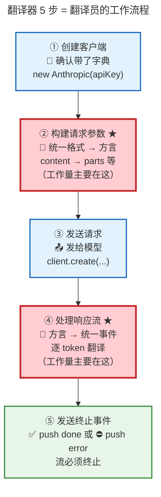
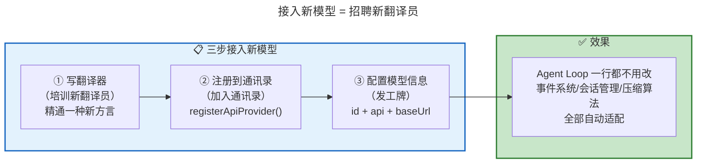
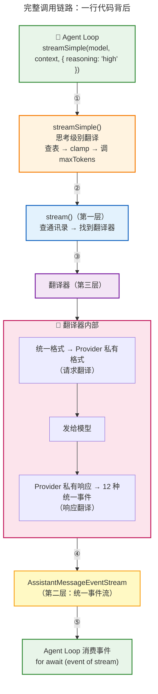
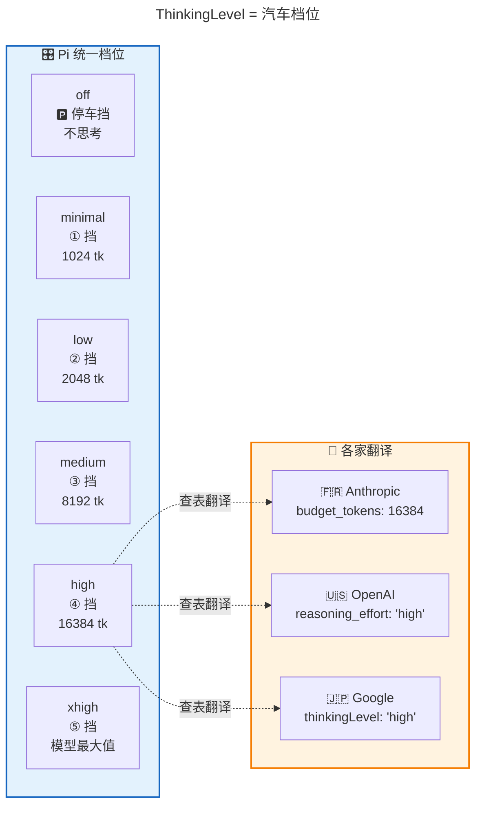
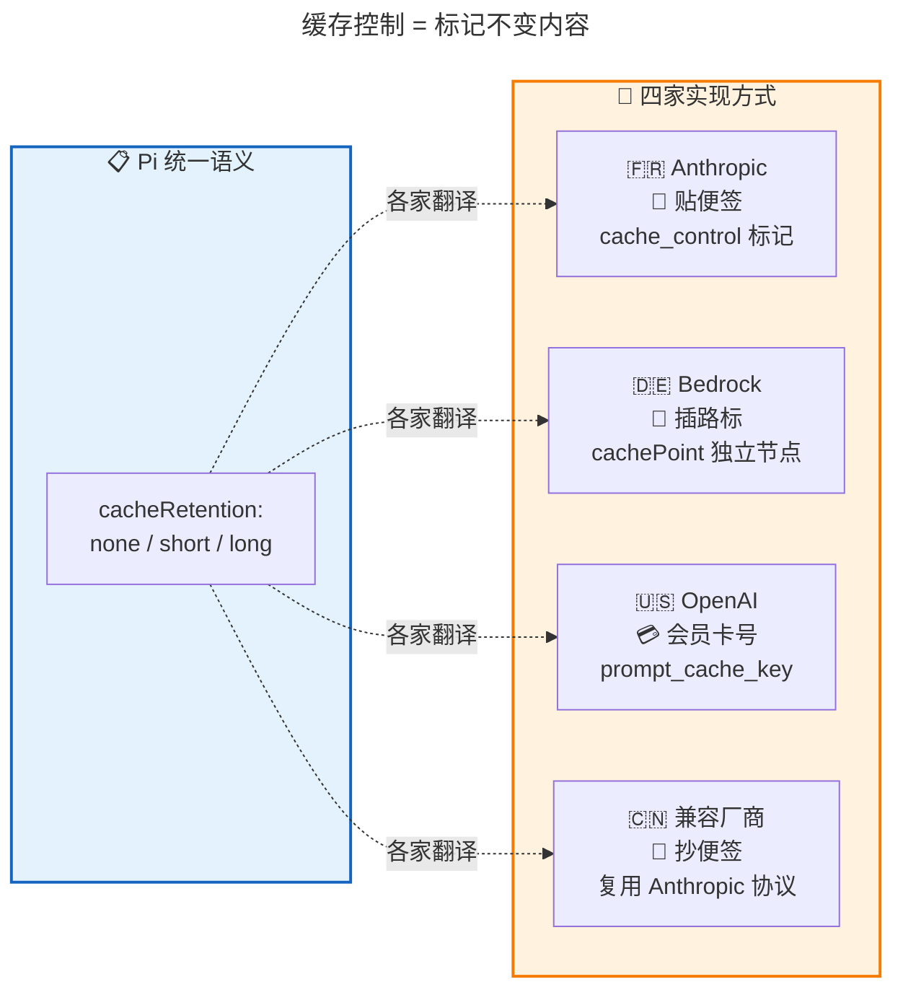
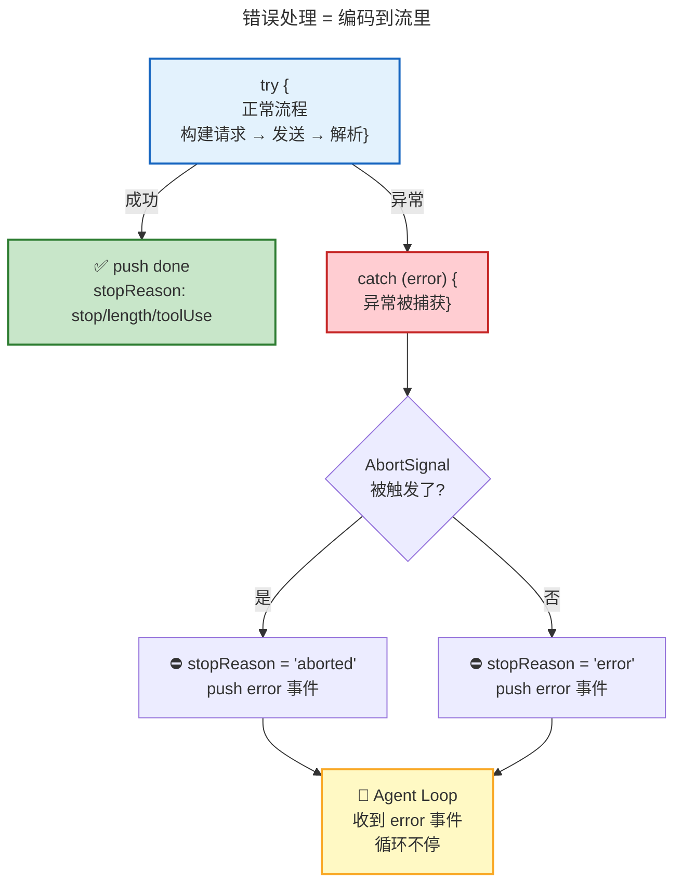

<!-- [AGC:FILE] tool=Cc author=fangkun date=2026-09-02 -->

# 大白话版：模型调用 —— 一行代码驾驭多个模型

> 这是《第4章：模型调用 —— 一行代码驾驭多个模型》的通俗解读版
> 核心理念：用大白话把技术概念讲明白，让自己和同事都能听懂
>
> 📖 **[查看原始文档](./source/M04 · 第4章：模型调用 —— 一行代码驾驭多个模型.md)**

---

## 一、一句话说明白：Pi 的模型调用层 是什么？

**Pi 的模型调用层是一个"翻译公司"——它把统一的请求翻译成 30 多家模型各自听得懂的"方言"，再把各家模型的回答翻译回统一的格式。上层（Agent Loop）只需要说一句"给我用这个模型处理这段对话"，中间的翻译全由这个翻译公司搞定。**

> 📖 **原文引用**：第4章 § 二 - 解法：三层架构，各管一件事
>
> "Agent Loop 就是那个'客户'——它把请求交给前台（第一层），拿到标准格式的报告（第二层），从不直接接触翻译员（第三层）。"

[查看原文档完整内容](./source/M04 · 第4章：模型调用 —— 一行代码驾驭多个模型.md#二解法三层架构各管一件事)

### 类比理解

**🎨 类比图：模型调用 = 国际翻译公司**



**对比表格：为什么需要翻译公司？**

| 问题 | 像什么 | 解决方案 |
|------|--------|----------|
| 30 多家模型 API 格式不同 | 🗣️ 30 种方言 | 翻译公司统一翻译 |
| 同一个消息四家写法不同 | 📝 "帮我读一下" 四种写法 | 统一格式 → 各家私有格式 |
| 流式返回机制不同 | 📡 有的发 SSE 原文，有的给结构化数据 | 翻译器统一翻译成 12 种事件 |
| "思考模式"参数不同 | 🧠 预算制 vs 努力度 vs 配置项 | ThinkingLevel 统一五级刻度 |

**关键区别**：
- 没有翻译公司：Agent Loop 要写 30 套逻辑（每家一套）
- 有了翻译公司：Agent Loop 只写 1 套逻辑，翻译公司帮你搞定所有方言

---

## 二、核心概念详解

### 2.1 问题：同一段对话，四家模型有四种写法

**大白话**：哪怕是最简单的一句"帮我读一下 main.ts"，在 Anthropic、OpenAI、Google、Bedrock 四家的 API 里写法都完全不同。字段名不同（`content` vs `parts`），结构不同（有的要 `type` 字段，有的不要），连工具结果的处理方式都不一样。

> 📖 **原文引用**：第4章 § 一 - 问题：同一段对话，不同模型要"翻译"成不同格式
>
> "连最简单的纯文本消息都有四种写法。字段名不同（content vs parts），结构不同（有的要 type 字段，有的不要）。"
>
> **为什么这么理解**：原文用并排代码块展示了同一条消息在四家的不同长相。

[查看原文档完整内容](./source/M04 · 第4章：模型调用 —— 一行代码驾驭多个模型.md#一问题同一段对话不同模型要翻译成不同格式)

**🎨 类比图：一句话四种方言**



**四个维度的差异全景**：

| 维度 | 差在哪 | 举个例子 |
|------|--------|----------|
| **消息格式** | 字段名和结构不同 | Anthropic 用 `content[]`，Google 用 `parts[]` |
| **流式传输** | 逐字返回机制不同 | Anthropic 发原始 SSE 要自己解析，OpenAI SDK 直接给结构化 chunk |
| **思考模式** | "让模型深度思考"的参数完全不同 | Anthropic 用 `budget_tokens`，OpenAI 用 `reasoning_effort` |
| **缓存控制** | "标记不变内容"的方式不同 | Anthropic 打 `cache_control` 标记，Bedrock 插入 `cachePoint` 节点 |

---

### 2.2 三层架构：前台 + 标准报告 + 翻译员

**大白话**：Pi 把"调用不同模型"这件事拆成三层，每层只管一件事：
- **第一层（前台）**：查通讯录，找到对应的翻译员
- **第二层（标准报告）**：约定输出格式——不管谁翻译，交回来的都是统一格式
- **第三层（翻译员）**：每个翻译员精通一种方言，负责真正干活

> 📖 **原文引用**：第4章 § 二 - 解法：三层架构，各管一件事
>
> "前台不懂外语，翻译员不懂公司流程——两者靠'标准报告'协议连接。"
>
> **为什么这么理解**：原文用"国际翻译公司"的类比贯穿全章，三层职责分明。

[查看原文档完整内容](./source/M04 · 第4章：模型调用 —— 一行代码驾驭多个模型.md#二解法三层架构各管一件事)

#### 第一层：统一入口

**大白话**：入口函数叫 `stream()`，代码只有两行：**查表，派活。** 它不处理任何业务逻辑，纯粹是一个路由器。

```
通讯录 = BUILTIN_APIS[] = {
  "anthropic-messages"    → Anthropic 翻译器
  "openai-completions"    → OpenAI 翻译器
  "google-generative-ai"  → Google 翻译器
  "bedrock-converse"      → Bedrock 翻译器
  ...
}
```

> 📖 **原文引用**：第4章 § 二 - 第一层：统一入口
>
> "model.api 是一个字符串，系统启动时已经把所有翻译器注册进了一个'通讯录'。拿 key 查表，找到翻译器，调用它。"

[查看原文档完整内容](./source/M04 · 第4章：模型调用 —— 一行代码驾驭多个模型.md#第一层统一入口)

**🎨 类比图：第一层 = 前台查通讯录**



#### 第二层：事件协议（12 种统一事件）

**大白话**：不管底层是哪家模型，翻译器都必须输出统一的事件流。一共 12 种事件，模式很简单：**模型回复分三类（文字、思考、工具调用），每类都有"开始→逐字增量→结束"三步，再加上流开始和流结束两个信号。**

> 📖 **原文引用**：第4章 § 二 - 第二层：事件协议
>
> "每类内容为什么是三步？因为这是流式输出——翻译器先告诉你'文字要开始了'（text_start），然后逐字推送（text_delta），最后告诉你'文字结束了'（text_end）。"

[查看原文档完整内容](./source/M04 · 第4章：模型调用 —— 一行代码驾驭多个模型.md#第二层事件协议)

**🎨 类比图：12 种事件 = 标准报告模板**



#### 第三层：翻译器（5 步骨架）

**大白话**：翻译器是真正干活的角色。每个翻译器都遵循同一个 5 步工作流程——创建客户端 → 构建请求参数 → 发送请求 → 处理响应流 → 发送终止事件。其中第 2 步（请求翻译）和第 4 步（响应翻译）是核心工作量所在。

> 📖 **原文引用**：第4章 § 二 - 第三层：翻译器
>
> "第 2 步（请求翻译）和第 4 步（响应翻译）是核心工作量所在，也是每个翻译器上千行代码的主要原因。"

[查看原文档完整内容](./source/M04 · 第4章：模型调用 —— 一行代码驾驭多个模型.md#第三层翻译器)

**🎨 类比图：翻译器 5 步 = 翻译员的工作流程**



**翻译器的"宪法"：StreamFunction**

```typescript
type StreamFunction = (model, context, options?)
  => AssistantMessageEventStream;  // ← 必须返回统一事件流
```

三条铁律：
1. **输入相同**：所有翻译器接受同样的三个参数
2. **输出相同**：必须返回统一事件流
3. **错误不抛异常**：API 失败时，不发 `throw`，而是发 `{ type: "error" }` 事件

> 📖 **原文引用**：第4章 § 二 - StreamFunction：翻译器的"入职要求"
>
> "第 3 条呼应了第 3 章的'永不抛出'原则。翻译器把异常信息包装成一个 error 事件，推进事件流里。"

[查看原文档完整内容](./source/M04 · 第4章：模型调用 —— 一行代码驾驭多个模型.md#streamfunction翻译器的入职要求)

---

### 2.3 怎么用：调用模型 vs 接入新模型

**大白话**：
- **调用已有模型**：一行 `streamSimple(model, context, { reasoning: "high" })`，不管底层是 Claude 还是 GPT，返回的都是同一个事件流
- **接入新模型**：三步——写翻译器 → 注册到通讯录 → 配置模型信息。Agent Loop 一行都不用改

> 📖 **原文引用**：第4章 § 三 - 怎么用：从调用到接入新模型
>
> "新模型的接入成本被限制在了'写一个翻译器'这一个点，不需要动其他任何地方。"

[查看原文档完整内容](./source/M04 · 第4章：模型调用 —— 一行代码驾驭多个模型.md#三怎么用从调用到接入新模型)

**🎨 类比图：接入新模型 = 招聘新翻译员**



**对比表：stream() vs streamSimple()**

| 维度 | stream() | streamSimple() |
|------|----------|---------------|
| **定位** | 最底层入口 | 便捷封装 |
| **思考级别** | 不管 | 自动翻译 ThinkingLevel |
| **maxTokens** | 不管 | 自动调整 |
| **实际使用** | 一般不直接用 | Agent Loop 用这个 |

---

## 三、可视化总览

### 3.1 完整调用链路

> 📖 **原文引用**：第4章 § 六 - 回到那一行代码
>
> "Agent Loop 说了一句'给我用这个模型处理这段对话'，前台查出该找哪个翻译器，翻译器把请求翻译成 Provider 的格式发给模型，再把模型的流式响应翻译成统一事件返回。"

[查看原文档完整内容](./source/M04 · 第4章：模型调用 —— 一行代码驾驭多个模型.md#六回到那一行代码)



---

### 3.2 ThinkingLevel 统一思考刻度

> 📖 **原文引用**：第4章 § 四 - Pi 怎么统一：ThinkingLevel 五级刻度
>
> "上层代码只需说 reasoning: 'high'，翻译器自己查表翻译成各 Provider 的具体参数。"

[查看原文档完整内容](./source/M04 · 第4章：模型调用 —— 一行代码驾驭多个模型.md#pi-怎么统一thinkinglevel-五级刻度)

**🎨 类比图：ThinkingLevel = 汽车档位**



**回退策略（clampThinkingLevel）**：
- 请求的级别模型不支持时，**先向上找**（思考更多通常比更少安全）
- 找不到再向下找

---

### 3.3 缓存控制：四种"贴标签"的方式

> 📖 **原文引用**：第4章 § 五 - 缓存控制：让模型"算更少"
>
> "同样是'告诉服务器这段内容不变'，四家给出了四种完全不同的协议设计。"

[查看原文档完整内容](./source/M04 · 第4章：模型调用 —— 一行代码驾驭多个模型.md#缓存控制让模型算更少)

**🎨 类比图：缓存控制 = 四种"标记不变内容"的方式**



**对比表：四家缓存策略**

| Provider | none | short | long | 打点位置 |
|----------|------|-------|------|----------|
| **Anthropic** | 不打 | `cache_control: ephemeral`（5 分钟） | 加 `ttl: "1h"` | system 末尾 + 最后一个 tool + 最后一条 user（rolling） |
| **Bedrock** | 不插 | 插 `cachePoint` 独立对象 | 加 `ttl: ONE_HOUR` | system 块后 + 最后一条消息后 |
| **OpenAI** | 不发 key | `prompt_cache_key: sessionId` | 加 `retention: "24h"` | 不打点，后端自动匹配前缀 |
| **兼容厂商** | 不打 | 抄 Anthropic 便签 | 加 `ttl: "1h"` | 复用 Anthropic 三处策略 |

**经济价值**：缓存命中的 token 按缓存读取价计费，通常是正常输入价的 **1/10**。200K token 对话历史，缓存后省约 **90%** 输入成本。

---

### 3.4 错误处理：编码到流里，不打断循环

> 📖 **原文引用**：第4章 § 五 - 错误处理：编码到流里，不打断循环
>
> "所有翻译器的错误处理都遵循同一个模式：错误不抛出，而是编码到流中。"

[查看原文档完整内容](./source/M04 · 第4章：模型调用 —— 一行代码驾驭多个模型.md#错误处理编码到流里不打断循环)



**这就是第 3 章说的 `stopReason: "error"` 和 `"aborted"` 的注入点！** 模型 API 本身不会返回这两个值——它们是翻译器的 catch 块在异常时设置的。

---

## 四、关键数字速记

> 📖 **原文引用**：第4章 § 全文
>
> 原文给出了三层架构的关键数字和源码行号。

[查看原文档完整内容](./source/M04 · 第4章：模型调用 —— 一行代码驾驭多个模型.md#本章关键源码索引)

```
┌────────────────────────────────────────────────────────┐
│  📊 关键数字（吹牛用）                                 │
├────────────────────────────────────────────────────────┤
│  • 30+ 家模型供应商：一套代码全搞定                    │
│  • 12 种统一事件：start/text_*/thinking_*/toolcall_*   │
│    + done + error                                      │
│  • 3 层架构：入口 + 事件协议 + 翻译器                  │
│  • 5 步骨架：创建客户端→构建请求→发送→处理响应→终止   │
│  • 6 级思考：off/minimal/low/medium/high/xhigh        │
│  • 4 种缓存策略：贴便签/插路标/会员卡/抄便签          │
│  • 每个翻译器 ~1000 行代码                            │
│  • 缓存命中省 90% 输入成本                            │
│  • 3 处 Anthropic cache breakpoint 标记               │
│  • 接入新模型只需 3 步，Agent Loop 一行不改           │
└────────────────────────────────────────────────────────┘
```

---

## 五、设计精华（三条核心思路）

> 📖 **原文引用**：第4章 § 六 - 设计精华
>
> 原文总结了三条核心设计思路。

[查看原文档完整内容](./source/M04 · 第4章：模型调用 —— 一行代码驾驭多个模型.md#设计精华)

| 设计思路 | 大白话 | 类比 |
|----------|--------|------|
| **协议 > 实现** | 不要求翻译器继承同一个基类，只约定"输入什么、输出什么" | 📝 考卷不规定你怎么答题，只看答案格式对不对 |
| **统一枚举 + 映射表** | 上层说 `"high"`，底层自己查表翻译。比取交集灵活，比暴露原生参数简洁 | 🎛️ 统一档位 + 各车型的档位映射表 |
| **语义统一，实现分散** | 上层说"我要长期缓存"，不管底层是打标记还是插节点 | 🗣️ 说"我要翻译"，不管翻译员用什么方法翻 |

---

## 六、类比速记卡

| 概念 | 类比 | 原文出处 |
|------|------|----------|
| 模型调用层 | 🏢 国际翻译公司 | § 二 |
| 第一层 stream() | 🏢 前台查通讯录 | § 二 |
| 第二层 12 种事件 | 📋 标准报告模板 | § 二 |
| 第三层 翻译器 | 👨‍💼 精通一种方言的翻译员 | § 二 |
| BUILTIN_APIS | 📖 通讯录 | § 二 |
| StreamFunction | 📜 翻译员的"入职要求"/"宪法" | § 二 |
| 翻译器 5 步 | 🔄 翻译员的标准工作流程 | § 二 |
| streamSimple() | 🎛️ 带自动档位翻译的便捷入口 | § 三 |
| ThinkingLevel | 🎛️ 汽车档位（6 级） | § 四 |
| ThinkingLevelMap | 📖 各车型的档位映射表 | § 四 |
| clampThinkingLevel | 🔄 回退策略：先向上找，再向下 | § 四 |
| 缓存控制（Anthropic） | 📌 贴便签 | § 五 |
| 缓存控制（Bedrock） | 🚧 插路标 | § 五 |
| 缓存控制（OpenAI） | 💳 会员卡号 | § 五 |
| 错误处理 | 📡 编码到流里，不打断循环 | § 五 |

---

## 七、一句话总结（费曼技巧版）

**Pi 的模型调用层是什么？**
> 一个"翻译公司"——三层架构：前台查表路由 + 12 种统一事件协议 + 精通各方言的翻译器。上层只需一行 `streamSimple()`，30 多家模型的差异全被封装在翻译器里。

**为什么重要？**
> 没有这层抽象，Agent Loop 要写 30 套逻辑（每家模型一套）。有了它，Agent Loop 只写一套逻辑，接入新模型只需写一个翻译器——一行 Loop 代码都不用改。

**核心设计原则？**
> "协议 > 实现"——不要求翻译器继承同一个基类，只约定输入输出格式。"统一枚举 + 映射表"——上层说"high"，底层查表翻译。"语义统一，实现分散"——上层说"做什么"，底层决定"怎么做"。

**适合谁？**
> 做 AI Agent 产品的开发者。如果你想接入多个模型（或者未来可能接入），这套三层架构 + 翻译器模式是最值得借鉴的设计。

---

## 八、源码索引（吹牛用）

> 📖 **原文引用**：第4章 - 本章关键源码索引

| 功能 | 文件位置 |
|------|----------|
| `stream()` 入口（第一层） | `compat.ts:237-247` |
| `streamSimple()` 入口 | `compat.ts:258-268` |
| Provider 注册（通讯录） | `compat.ts:172-206` |
| `StreamFunction` 签名（宪法） | `types.ts:304-308` |
| 12 种 `AssistantMessageEvent` | `types.ts:453-465` |
| Anthropic 翻译器 | `anthropic-messages.ts` |
| OpenAI 翻译器 | `openai-completions.ts` |
| `ThinkingLevel` 枚举 | `types.ts:74-76` |
| `clampThinkingLevel` 回退 | `models.ts:410-429` |
| `isContextOverflow` 三重检测 | `utils/overflow.ts:126-155` |

---

> 📝 **学习笔记**
> - 学习日期：2026-09-02
> - 学习方式：费曼学习法（大白话版）
> - 原始文档：M04 · 第4章：模型调用 —— 一行代码驾驭多个模型.md
> - 前一篇：[第3章：Agent Loop - 大白话版](./第3章：Agent%20Loop%20——%20让模型转动起来的引擎.md)
> - 下一篇预告：第5章 - 工具系统——Agent 的手脚是怎么被管住的
> - 下一步：理解后，用自己的话讲给同事听（Step 3）
