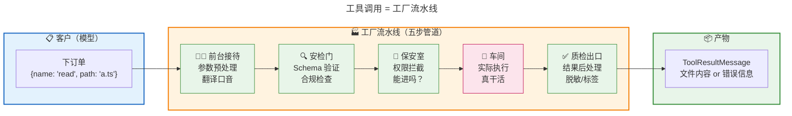
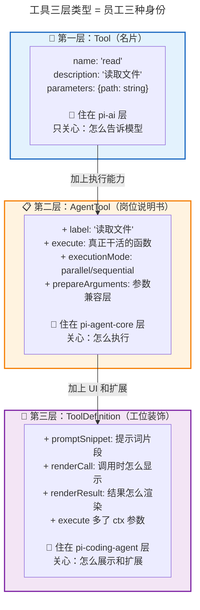
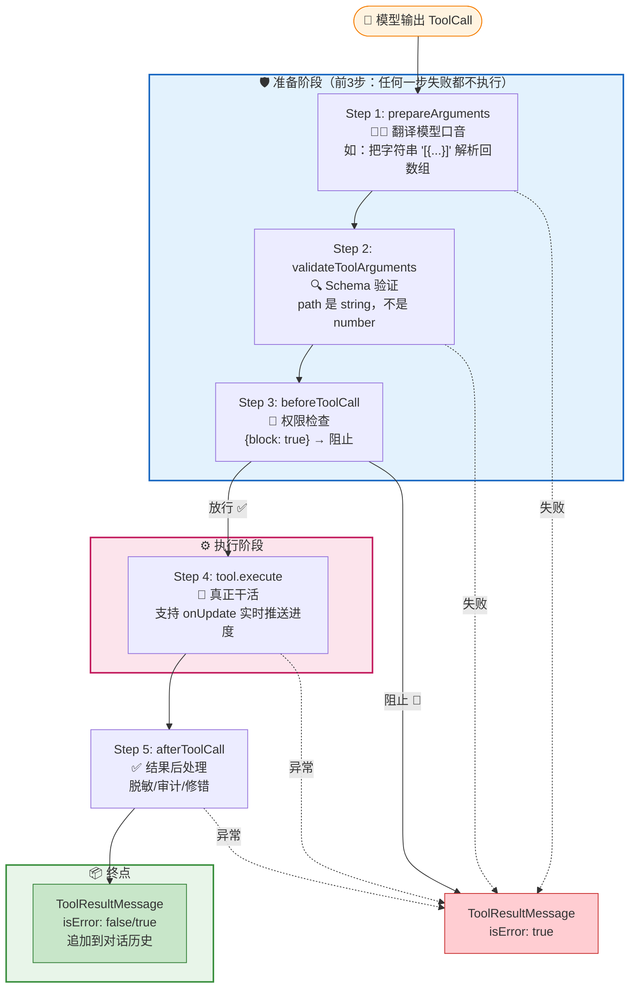
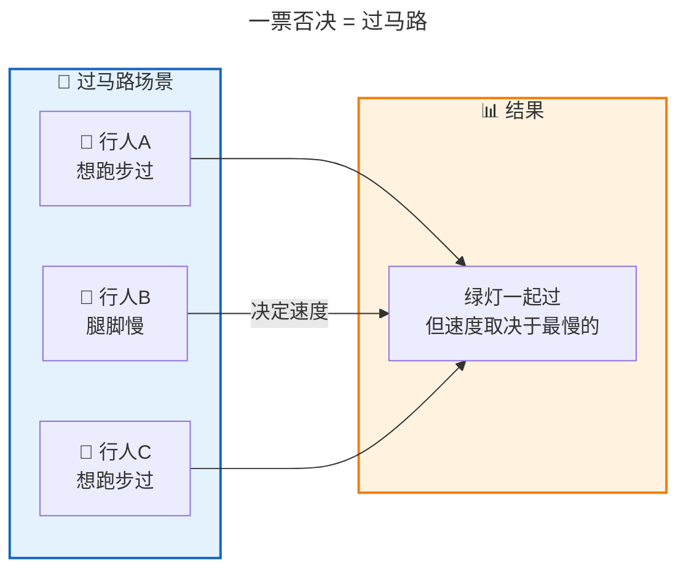
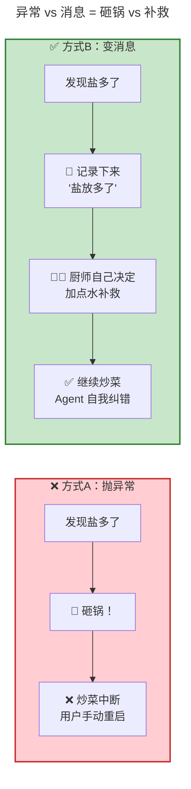
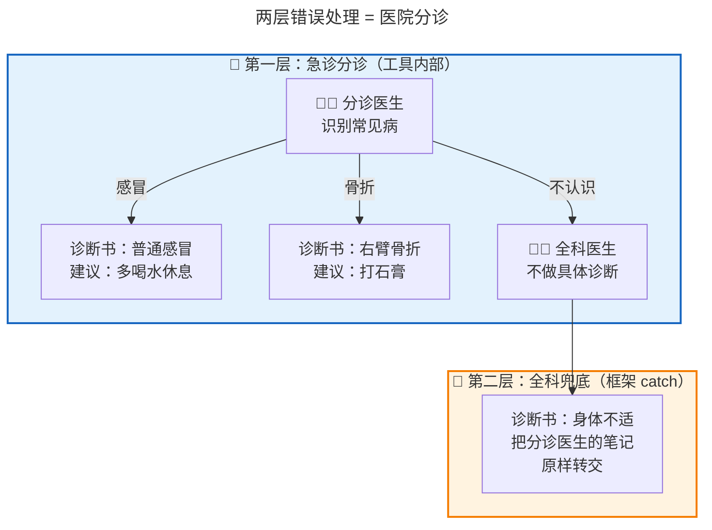
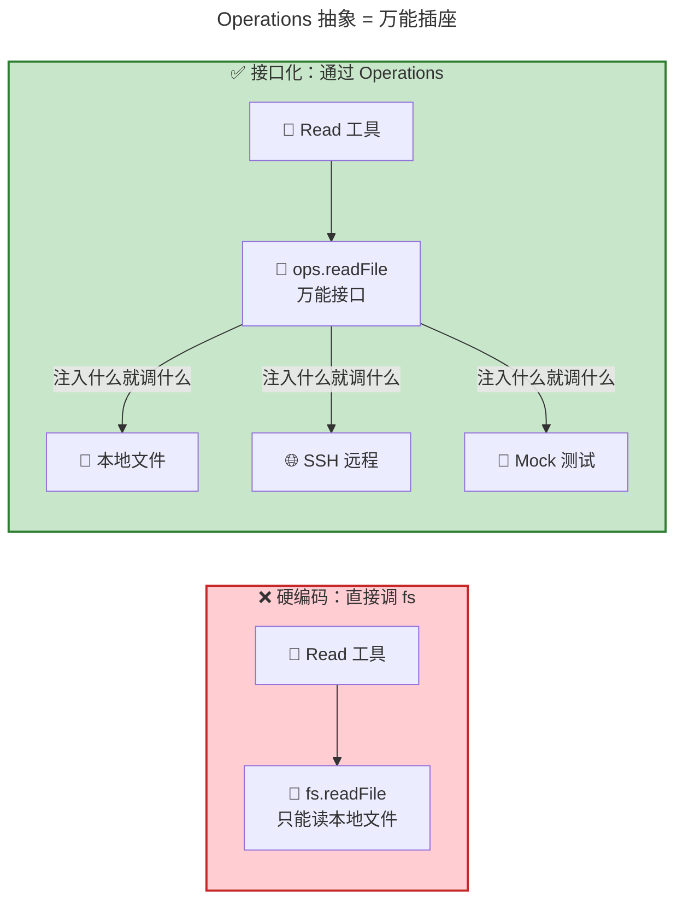
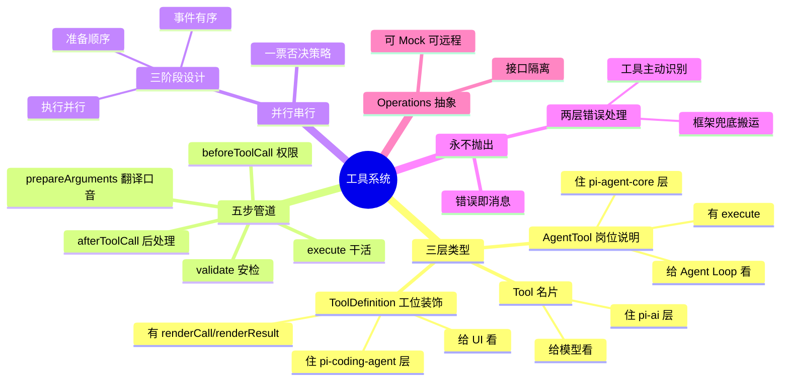
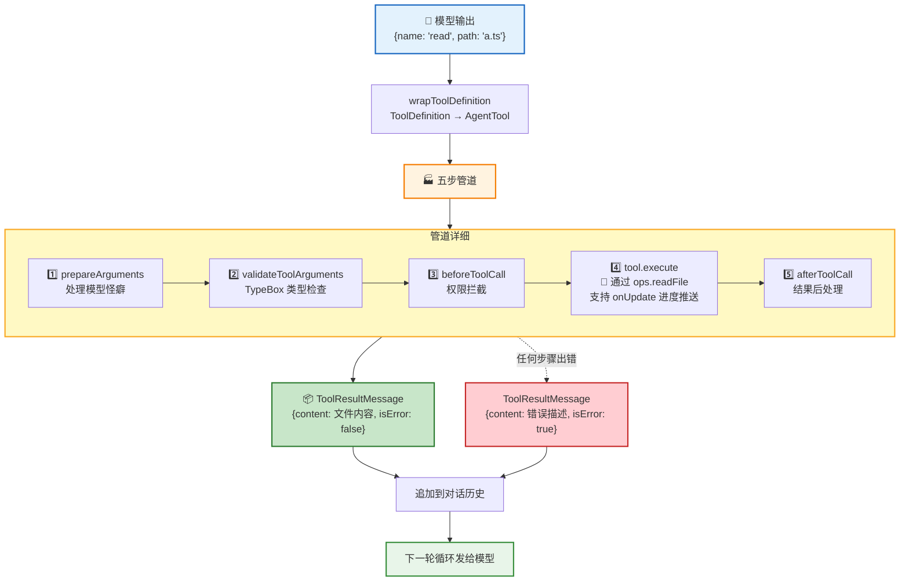

<!-- [AGC:FILE] tool=Cc author=fangkun date=2026-09-03 -->

# 大白话版：Pi-Agent 工具系统

> 这是《第5章：工具系统 —— Agent 的手脚是怎么被管住的》的通俗解读版
> 核心理念：用大白话把技术概念讲明白，让自己和同事都能听懂
>
> 📖 **[查看原始文档](./source/M05 · 第5章：工具系统 —— Agent 的手脚是怎么被管住的.md)**

---

## 一、一句话说明白：工具系统 是什么？

**工具系统是 Agent 的"手脚管理器"——它不是简单地让 AI "读个文件"、"跑个命令"就完事，而是给每个工具套上一条"受控管道"：参数先过安检、权限先审一遍、执行过程全程可观察、出了错也不崩溃，而是把错误变成一条消息让 AI 自己决定怎么办。**

> 📖 **原文引用**：第5章 § 开篇
>
> "Pi 用一条五步管道来解决这些问题：参数预处理 → Schema 验证 → 权限拦截 → 工具执行 → 结果后处理。每一步都有明确的职责，每一步的错误都不会'炸掉'整个循环。"

[查看原文档完整内容](./source/M05 · 第5章：工具系统 —— Agent 的手脚是怎么被管住的.md)

### 类比理解

**🏭 类比：工厂流水线**

想象你经营一家工厂。客户（模型）送来一张订单："帮我查一下 A 文件的第 10 行"。你不会直接冲到车间去翻文件，而是：

1. **前台接待**（参数预处理）：客户说话口音重？帮他翻译一下
2. **安检门**（Schema 验证）：带的东西合规吗？（参数类型对吗？）
3. **保安室**（权限拦截）：这个人有权限进这个房间吗？
4. **车间干活**（实际执行）：真正去读文件
5. **质检出口**（结果后处理）：出来的产品要不要贴个标签、去掉敏感信息？



**关键区别**：

- **简单想法**：找到 read 工具 → 读文件 → 返回内容。一行代码搞定。
- **现实问题**：模型可能传错参数（`path: 12345`）、可能要求危险操作（`rm -rf /`）、执行可能抛异常（文件不存在）
- **Pi 的答案**：每一步都有"关卡"，每个关卡都能"拦截"，所有错误最终都变成一条消息

---

## 二、核心概念详解

### 2.1 三层类型：为什么"一个工具"要分三层来定义？

**大白话**：就像一个员工有三种"身份"——**名片**（我叫什么、干什么的）、**岗位说明书**（我怎么干活、能不能跟别人同时干）、**工位装饰**（我怎么在屏幕上显示、有没有额外提示词）。三层身份各管一摊事，不能混在一起。

> 📖 **原文引用**：第5章 § 一 - 三层类型
>
> "三层递进的本质是：每一层只加自己这个层级需要的能力，不越界。Tool 管'我能描述自己'，AgentTool 管'我能被执行'，ToolDefinition 管'我能被展示和扩展'。"

[查看原文档完整内容](./source/M05 · 第5章：工具系统 —— Agent 的手脚是怎么被管住的.md#一三层类型为什么一个工具要分三层来定义)

**🎭 类比图：工具三层身份**



**📊 对比表**：

| 维度 | Tool（名片） | AgentTool（岗位说明） | ToolDefinition（工位装饰） |
|------|-------------|---------------------|--------------------------|
| **住哪层** | pi-ai（最底层） | pi-agent-core（中间层） | pi-coding-agent（产品层） |
| **管什么** | "我能描述自己" | "我能被执行" | "我能被展示和扩展" |
| **核心字段** | name, description, parameters | execute, executionMode | renderCall, renderResult, promptSnippet |
| **给谁看** | 模型 | Agent Loop | 终端 UI |
| **能干活吗** | ❌ 只是名片 | ✅ 能执行 | ✅ 能执行 + 能展示 |

**为什么要分三层？**

把所有字段塞进一个 `Tool` 接口不行吗？不行！因为 **每层有独立的依赖范围**。如果在最底层的 `Tool` 里加了 `renderCall`（返回终端 UI 组件），`pi-ai` 就得依赖终端 UI 渲染库——但它是纯模型适配层，不该知道终端长什么样。

### 2.2 五步管道：工具调用不是"调个函数就完了"

**大白话**：每次模型说"用 read 工具读文件"，不是直接去读文件，而是要过五道关卡。就像进一个安保严格的大楼，每道门都有各自的检查任务，任何一道门不让你过，你都进不去。

> 📖 **原文引用**：第5章 § 二 - 五步管道
>
> "每一步都有明确的职责和退出机制。前 3 步是'准备工作'——任何一步失败都不会执行工具。第 4 步是'真正干活'。第 5 步是'收尾'。"

[查看原文档完整内容](./source/M05 · 第5章：工具系统 —— Agent 的手脚是怎么被管住的.md#二五步管道工具调用不是调个函数就完了)

**📋 五步速记表**：

| 步骤 | 做什么 | 类比 | 失败后果 |
|------|--------|------|----------|
| **1. prepareArguments** | 处理模型的参数怪癖 | 前台翻译口音 | 参数预处理失败 → 错误消息 |
| **2. validateToolArguments** | TypeBox Schema 类型检查 | 安检门查合规 | 类型不对 → 错误消息 |
| **3. beforeToolCall** | 权限检查，可以阻止执行 | 保安查门禁卡 | 被拦截 → 错误消息 |
| **4. tool.execute** | 真正干活（读文件/跑命令） | 车间生产 | 出异常 → 错误消息 |
| **5. afterToolCall** | 结果后处理（脱敏/审计） | 质检出口 | 后处理出错 → 错误消息 |

**🔄 流程图**：



**为什么每步失败都生成消息而不是抛异常？**

因为模型需要知道"出了什么错"然后自己决定下一步。如果直接抛异常打断循环，Agent 就崩了。

### 2.3 并行 vs 串行：一票否决策略

**大白话**：模型经常一次叫好几个工具。直觉告诉我们应该并行跑（省时间）。但如果其中有个 edit 工具在改文件，并行跑就互相覆盖了。Pi 的策略很简单——**只要有一个工具说"我要串行"，整批工具都排队一个个来**。宁可多等，不可出错。

> 📖 **原文引用**：第5章 § 三 - 并行 vs 串行
>
> "Pi 选择了保守策略：宁可多等，不可出错。"

[查看原文档完整内容](./source/M05 · 第5章：工具系统 —— Agent 的手脚是怎么被管住的.md#三并行-vs-串行一个批次的工具不是一起跑就完了)

**🎨 类比图**：



**并行执行的三阶段设计**：

当确定可以并行时，也不是简单地 `Promise.all` 跑完就完，而是分成三个阶段：

```
阶段 1 - 准备（顺序执行）：
  ToolCall A: 验证 → 权限
  ToolCall B: 验证 → 权限
  ToolCall C: 验证 → 权限
  ⚠️ 准备阶段必须顺序：B 被拦截了 C 就不该跑

阶段 2 - 执行（并行）：
  A.execute() ─┐
  B.execute() ─┤ Promise.all 同时跑
  C.execute() ─┘
  ✅ 只有这一步真正并行

阶段 3 - 事件发送（有序）：
  end 按完成顺序（谁先完成谁先报）
  result 按调用顺序（A→B→C）
  ⚠️ 结果消息保持顺序：模型依赖调用顺序
```

**对比表**：

| 维度 | 并行模式（默认） | 串行模式（一票否决） |
|------|-----------------|---------------------|
| **触发条件** | 所有工具都是 parallel | 有任何一个 sequential |
| **准备阶段** | 顺序执行 | 顺序执行 |
| **执行阶段** | `Promise.all` 并行 | 瀑布式一个个来 |
| **结果消息** | 按调用顺序排列 | 按调用顺序排列 |
| **速度** | 快（同时跑） | 慢（排队等） |
| **安全性** | 可能冲突 | 不会冲突 |

### 2.4 永不抛出：错误即消息

**大白话**：这是整个工具系统最核心的设计哲学——**工具出的任何错，都不抛异常打断循环，而是"翻译"成一条 `isError: true` 的消息发给模型，让模型自己决定怎么办**。就像你炒菜发现盐放多了，不会把锅砸了（抛异常），而是加点水补救（模型自己纠错）。

> 📖 **原文引用**：第5章 § 四 - 永不抛出
>
> "错误信息是给模型的反馈，不是给框架的终止信号。"

[查看原文档完整内容](./source/M05 · 第5章：工具系统 —— Agent 的手脚是怎么被管住的.md#四永不抛出工具出错也是一条消息)

**🎨 类比图**：



**6 种错误，1 种产物**：

| 哪一步出错                | 最终产物                                                                 |
| -------------------- | -------------------------------------------------------------------- |
| 工具未找到                | `ToolResultMessage { isError: true, content: "Tool xxx not found" }` |
| prepareArguments 抛异常 | `ToolResultMessage { isError: true, content: 异常信息 }`                 |
| Schema 验证失败          | `ToolResultMessage { isError: true, content: 验证错误描述 }`               |
| beforeToolCall 阻止    | `ToolResultMessage { isError: true, content: 阻止原因 }`                 |
| **tool.execute 抛异常** | `ToolResultMessage { isError: true, content: 异常信息 }`                 |
| afterToolCall 抛异常    | `ToolResultMessage { isError: true, content: 异常信息 }`                 |

**📊 异常 vs 消息对比**：

| 维度 | 抛异常（❌） | 编码成消息（✅） |
|------|-------------|-----------------|
| **接收者** | 调用栈（外层框架） | 模型 |
| **效果** | 打断循环，Agent 崩溃 | 模型看到错误，自己决定怎么办 |
| **模型能纠错吗** | ❌ 不能（循环已断） | ✅ 能（错误是输入） |
| **用户感受** | Agent 挂了，手动重启 | Agent 自己重试/换方案 |

**为什么模型纠错比框架替它决定更好？**

| 错误场景 | 模型看到错误后的合理反应 |
|----------|----------------------|
| `read` 报"文件不存在" | 先 `ls` 看目录，找到正确文件名再读 |
| `edit` 报"oldText 找不到匹配" | 先 `read` 文件看实际内容，调整 oldText 后重试 |
| `bash("npm run build")` 报"模块未找到" | `npm install` 后再 build |
| `bash("rm -rf /")` 被阻止 | 换一种安全写法或向用户解释 |

每种场景正确的下一步都不同，**只有模型有足够的上下文判断该走哪条路**。

### 2.5 两层错误处理：工具主动 + 框架兜底

**大白话**：Pi 不是只靠框架兜底 catch 来处理错误。每个工具内部就 **主动识别** 已知的错误类型，把错误描述写得尽可能具体（"文件只有100行，你的 offset 是 200"）。只有遇到实在识别不了的异常，才原样抛出让框架兜底。**框架只搬运，不创造**。

> 📖 **原文引用**：第5章 § 四 - 两层错误处理
>
> "第一层（工具内部，主动）：识别已知错误类型，包装成具体可读的描述。第二层（框架兜底，被动）：只在工具没识别出来时生效。"

[查看原文档完整内容](./source/M05 · 第5章：工具系统 —— Agent 的手脚是怎么被管住的.md#pi-的真实做法两层错误处理分层负责)

**🎨 类比图**：



**模糊 vs 具体错误对比**：

```
模糊错误（❌ 不可取）：              具体错误（✅ 推荐）：
{                                    {
  content: [{ text: "Read failed" }]   content: [{ text: "Offset 200 is
}]                                        beyond end of file (100 lines total)" }]
  isError: true                        isError: true
}                                    }

模型看到只能盲目重试                 模型立刻知道"哦，文件只有100行，
                                    我 offset 给错了"
```

### 2.6 Operations 抽象：工具不等于系统调用

**大白话**：Read 工具读文件，不是直接调 `fs.readFile`，而是调一个接口 `ops.readFile`。这样测试时可以 Mock（不用创建真实文件），远程时可以走 SSH，Docker 里可以走容器——工具代码一行不用改。

> 📖 **原文引用**：第5章 § 五 - Operations 抽象
>
> "工具不直接调用系统 API，而是通过最小化的 Operations 接口间接调用。测试可以 Mock，远程可以 SSH，不改工具代码。"

[查看原文档完整内容](./source/M05 · 第5章：工具系统 —— Agent 的手脚是怎么被管住的.md#五进阶operations-抽象工具执行不等于系统调用)

**🎨 类比图**：



**每个工具定义自己需要的最小接口**：

| 工具 | 接口 | 方法 |
|------|------|------|
| Read | `ReadOperations` | `readFile`, `access` |
| Write | `WriteOperations` | `writeFile`, `mkdir` |
| Edit | `EditOperations` | `readFile`, `writeFile`, `access` |
| Bash | `BashOperations` | `exec` |
| Grep | `GrepOperations` | `isDirectory`, `readFile` |
| Find | `FindOperations` | `exists`, `glob` |
| Ls | `LsOperations` | `exists`, `stat`, `readdir` |

Read 不需要写文件，所以 `ReadOperations` 没有 `writeFile`。**每个工具只声明自己需要的方法，不多不少**——这就是接口隔离原则。

---

## 三、可视化总览

### 3.1 工具系统全景图



### 3.2 从 ToolCall 到 ToolResultMessage 全流程



---

## 四、关键数字速记

```
┌────────────────────────────────────────────────────────┐
│  📊 关键数字（吹牛用）                                 │
├────────────────────────────────────────────────────────┤
│  • 3 层类型：Tool → AgentTool → ToolDefinition         │
│  • 5 步管道：预处理→验证→权限→执行→后处理              │
│  • 6 种错误 → 1 种产物（isError: true 的消息）          │
│  • 2 层错误处理：工具主动识别 + 框架兜底搬运             │
│  • 3 阶段并行设计：准备(顺序)→执行(并行)→事件(有序)     │
│  • 7 个内置工具：read/write/edit/bash/grep/find/ls      │
│  • 每个内置工具默认 parallel                            │
│  • 1 票否决：有一个 sequential → 整批串行               │
└────────────────────────────────────────────────────────┘
```

---

## 五、类比速记卡

| 概念 | 类比 | 原文出处 |
|------|------|----------|
| 三层类型 | 名片→岗位说明→工位装饰 | § 一 |
| 五步管道 | 工厂流水线（前台→安检→保安→车间→质检） | § 二 |
| 一票否决 | 过马路（速度取决于最慢的人） | § 三 |
| 永不抛出 | 炒菜盐多了→加水补救 vs 砸锅 | § 四 |
| 两层错误处理 | 医院分诊（急诊识别常见病→全科兜底） | § 四 |
| Operations 抽象 | 万能插座（注入什么就调什么） | § 五 |
| ToolDefinition 包装器 | 翻译官（Agent Loop 不知道 ctx 的存在） | § 一 |
| onUpdate 进度推送 | 厨房报菜（边做边报进度，不是做完才报） | § 二 |

---

## 六、一句话总结（费曼技巧版）

**工具系统是什么？**
> 一条五步管道，让 AI 调用工具像过安检一样——每步都有检查、每步都能拦截、出了错也不崩溃，而是把错误变成消息让 AI 自己决定怎么办。

**为什么重要？**
> 因为模型不是完美的——它会传错参数、要求危险操作、碰到文件不存在。没有这套管道，Agent 动不动就崩；有了它，Agent 能自我纠错，持续运行。

**四个可复用的设计模式**：
> 1. **分层接口递进**：基础→运行时→产品，每层只加自己需要的
> 2. **管道+钩子**：核心流程是管道，前后加钩子可拦截可修改
> 3. **错误即消息**：所有错误变成 `isError: true` 的消息，绝不让异常穿透
> 4. **Operations 抽象**：工具不直接调系统 API，通过可替换接口间接调用

---

## 七、方法论提炼（可直接复用）

**1. 分层接口递进法**
- 基础层只管"能描述"
- 运行时层加"能执行"
- 产品层加"能展示和扩展"
- 通过包装器桥接层间差异

**2. 管道+钩子模式**
- 核心流程是一条管道
- 管道前后各有一个钩子（before/after）
- 管道内每步出错都不抛异常

**3. 错误即消息原则**
- 所有错误编码成 `isError: true` 的消息
- 模型自己根据错误信息决定下一步
- 即便未知异常也兜底成消息

**4. Operations 抽象法**
- 工具通过最小化接口间接调用系统
- 测试可 Mock，远程可 SSH
- 接口按工具需求裁剪

---

> 📝 **学习笔记**
> - 学习日期：2026-09-03
> - 学习方式：费曼学习法（大白话版）
> - 原始文档：M05 · 第5章：工具系统 —— Agent 的手脚是怎么被管住的.md
> - 下一章：第6章 - 消息系统（Agent 的记忆如何组织与传递）
