<!-- [AGC:FILE] tool=Cc author=fangkun date=2026-09-03 -->

# 大白话版：Pi-Agent 消息系统

> 这是《第6章：消息系统 —— Agent 的记忆如何组织与传递》的通俗解读版
> 核心理念：用大白话把技术概念讲明白，让自己和同事都能听懂
>
> 📖 **[查看原始文档](./source/M06 · 第6章：消息系统 —— Agent 的记忆如何组织与传递.md)**

---

## 一、一句话说明白：消息系统 是什么？

**消息系统是 Agent 的"记忆仓库 + 翻译官"——Agent 内部用 7 种消息类型自由记录各种事情（用户说话、模型回复、工具结果、Bash 执行、压缩摘要、分支切换……），但到了要发给 LLM 的那一刻，统一"翻译"成 LLM 只认识的 3 种标准格式（user/assistant/toolResult）。内部怎么丰富怎么来，对外只说 LLM 能听懂的"标准话"。**

> 📖 **原文引用**：第6章 § 开篇
>
> "Pi 消息系统最核心的设计——两层消息：Agent 内部用丰富的格式自由表达，到了 LLM 边界翻译回严格的标准格式。"

[查看原文档完整内容](./source/M06 · 第6章：消息系统 —— Agent 的记忆如何组织与传递.md)

### 类比理解

**🏠 类比：双语家庭的"内部方言 + 对外普通话"**

想象一个温州家庭住在北京：

- **家里**（Agent 内部）：大家说温州话、闽南话、各种方言，怎么方便怎么来——奶奶用温州话唠叨、爸爸用闽南话回电话、孩子用普通话做作业
- **外人来**（LLM 调用）：不管家里说什么方言，门口迎接客人时**统一用普通话**——因为客人只听得懂普通话

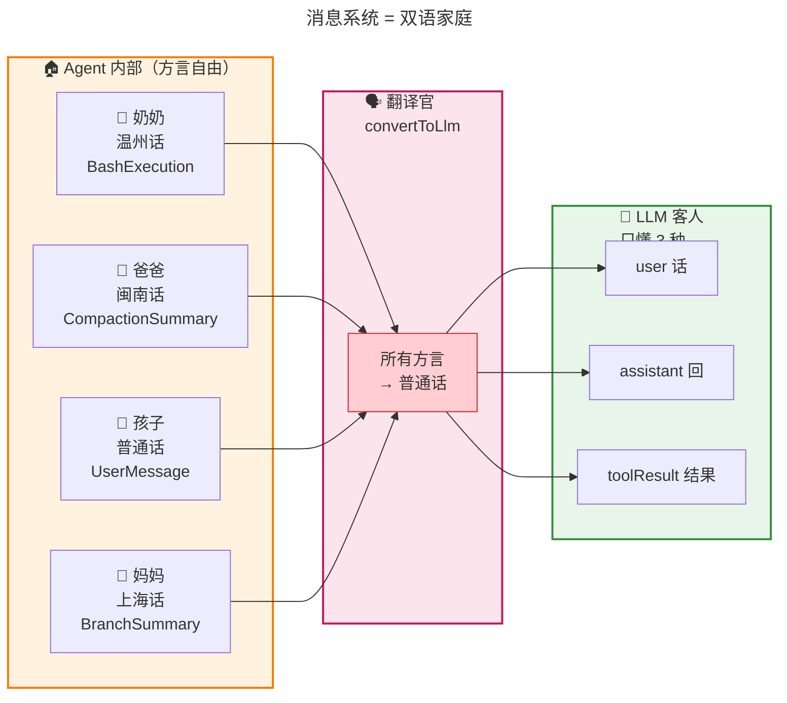

**对比表**：

| 概念 | 像什么 | 特点 |
|------|--------|------|
| **AgentMessage（7 种）** | 家里的方言 | 丰富、自由、各有用途 |
| **Message（3 种）** | 普通话 | 标准、精简、外人都懂 |
| **convertToLlm** | 翻译官 | 在门口做翻译，最后一刻发生 |
| **excludeFromContext** | "这句话不让客人听到" | 家里能听见，客人不知道 |

**关键区别**：

- 如果**只用 3 种标准消息**：家里所有方言都得提前拍扁成普通话，奶奶的温州话韵味就丢了（UI 拿不到结构化字段）
- 如果**只用 7 种内部消息**：客人来了听不懂，对话就断了（LLM 不认识自定义消息）
- **Pi 的答案**：两层各管各的，内部保留所有细节，对外做有损翻译

---

## 二、核心概念详解

### 2.1 LLM 只认识 3 种消息：标准格式

**大白话**：LLM 就像一个只懂三种话的"死板客人"——你说"user 话"它知道是它要回答的，你说"assistant 话"它知道是它自己之前说的，你说"toolResult 话"它知道是工具给它的反馈。**别的任何格式它都不认识**。

> 📖 **原文引用**：第6章 § 二 - LLM 认识的消息只有三种
>
> "LLM 能理解的消息格式，在 Pi 里叫做 Message 类型，定义在最底层的 packages/ai/src/types.ts 里。它只有三个成员：UserMessage、AssistantMessage、ToolResultMessage。"

[查看原文档完整内容](./source/M06 · 第6章：消息系统 —— Agent 的记忆如何组织与传递.md#二第一层llm-认识的消息只有三种)

**📊 三种标准消息对比**：

| 消息类型 | role 字段 | 谁说的 | 核心字段 | 类比 |
|---------|----------|--------|---------|------|
| **UserMessage** | `"user"` | 用户/系统注入 | `content: string \| Content[]` | 客户说话 |
| **AssistantMessage** | `"assistant"` | LLM 自己 | `content: (Text\|Thinking\|ToolCall)[]`<br/>+ `model`、`usage`、`stopReason` | AI 回答 + 想调用工具 |
| **ToolResultMessage** | `"toolResult"` | 工具反馈 | `toolCallId`、`toolName`、`isError` | 工具交回来的结果 |

**🎨 类比图：LLM 的"三种话世界"**

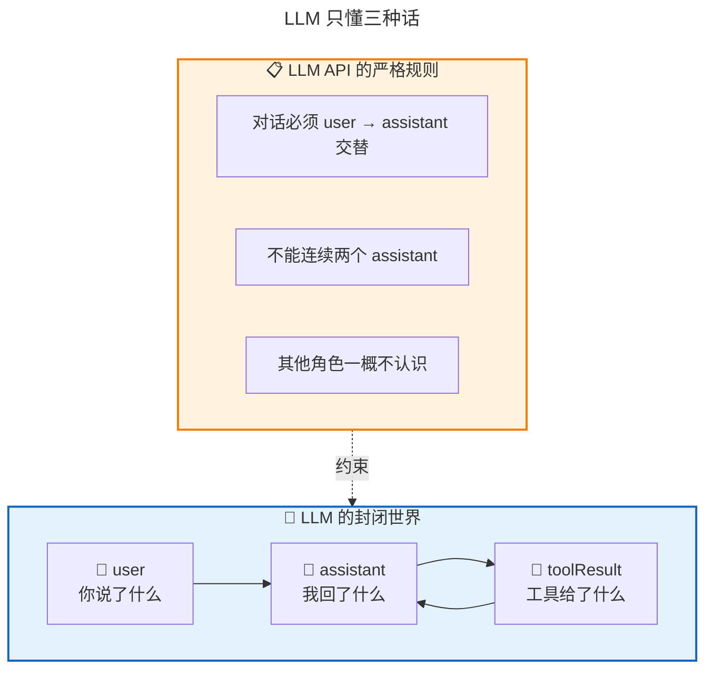

**AssistantMessage 的 content 是个"百宝箱"**：

一条 AssistantMessage 的 content 不是简单的字符串，而是一个**数组**，能同时装三种东西：

```plaintext
AssistantMessage.content = [
    📝 TextContent        "让我帮你看看这个文件"
    💭 ThinkingContent    "(我在想，应该先读 auth.ts...)"
    🔧 ToolCall           { name: "read", arguments: { path: "auth.ts" } }
]
```

**这就像 LLM 一边说话、一边想、一边伸手拿工具**——三件事发生在同一条消息里。

### 2.2 矛盾：Agent 内部要记的事情远不止 3 种

**大白话**：Agent 内部除了"对话"这件事，还有一大堆功能性数据要管——Bash 命令的执行记录、上下文压缩后的摘要、Git 分支切换的记录、用户上传的附件……这些东西**有两个读者**，而且两个读者的需求是**冲突的**：

- **UI 端**要结构化字段（命令、输出、退出码分开存）才能漂亮渲染
- **LLM 端**只要一段扁平文本塞进 user 消息就够用了

> 📖 **原文引用**：第6章 § 三 - 矛盾
>
> "如果为了 LLM 把字段提前拍扁存进 UserMessage，UI 就再也拿不回结构化数据了——你已经搅成一锅粥。反过来，如果只存结构化的自定义消息、不进 LLM 上下文，那 LLM 就会失忆。"

[查看原文档完整内容](./source/M06 · 第6章：消息系统 —— Agent 的记忆如何组织与传递.md#三矛盾agent-里的消息不止三种)

**🎨 类比图：两个读者的冲突**

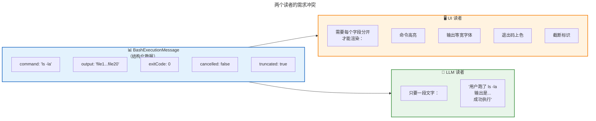

**📊 两种错误做法的对比**：

| 做法 | 后果 | 为什么不行 |
|------|------|-----------|
| ❌ 提前拍扁成文本 | UI 拿不回结构化数据 | 退出码、截断信息永久丢失 |
| ❌ 只存自定义消息不进 LLM | LLM 失忆 | 下一轮它不知道用户刚才执行了什么 |
| ✅ **Pi 的方案**：两层都保留 | 两全其美 | UI 用结构化版本，LLM 用翻译版本 |

**自定义消息带来的三个独立能力**：

1. **UI 专用渲染**：根据 `role` 分派——`bashExecution` 用终端样式、`compactionSummary` 用摘要卡片
2. **持久化恢复**：session 文件存完整结构化数据，下次启动能精确还原渲染状态
3. **精细化可见性控制**：某些消息可以对 UI 可见但对 LLM 隐身（用 `excludeFromContext`）

### 2.3 AgentMessage：内富外严的双层设计

**大白话**：Pi 的核心设计是**不用一种格式打天下，而是用两层**——**内层**（AgentMessage）丰富，有 7 种消息类型，Agent 想怎么记就怎么记；**外层**（Message）严格，只有 3 种 LLM 认识的标准格式。两层之间用一个"翻译官"（`convertToLlm`）连接。

> 📖 **原文引用**：第6章 § 四 - 第二层
>
> "AgentMessage = LLM 标准消息 + 自定义消息。它是 Message（三种标准格式）和 CustomAgentMessages（自定义扩展）的联合类型。"

[查看原文档完整内容](./source/M06 · 第6章：消息系统 —— Agent 的记忆如何组织与传递.md#四第二层agentmessage-内富外严的双层设计)

**🏗️ 架构图：两层消息结构**

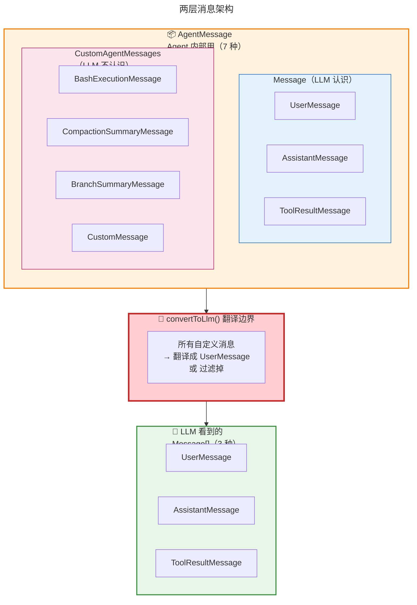

**📊 7 种消息类型速记表**：

| 消息类型 | role 字段 | LLM 认识？ | 干嘛用的 |
|---------|----------|-----------|---------|
| UserMessage | `"user"` | ✅ 认识 | 用户说话/发图 |
| AssistantMessage | `"assistant"` | ✅ 认识 | 模型回复 |
| ToolResultMessage | `"toolResult"` | ✅ 认识 | 工具结果 |
| BashExecutionMessage | `"bashExecution"` | ❌ 不认识 | Bash 命令执行记录 |
| CompactionSummaryMessage | `"compactionSummary"` | ❌ 不认识 | 上下文压缩后的摘要 |
| BranchSummaryMessage | `"branchSummary"` | ❌ 不认识 | 分支切换时的摘要 |
| CustomMessage | `"custom"` | ❌ 不认识 | 应用自定义扩展 |

### 2.4 声明合并：核心包零依赖的扩展魔法

**大白话**：核心包 `pi-agent-core` 完全不知道有什么 BashExecutionMessage，它只提供了一个**空插槽**（`CustomAgentMessages` 接口）。应用层通过 TypeScript 的**声明合并**，把自己的消息类型"注入"到这个空插槽里。**就像插座本身不知道你会插什么电器，但只要你插头对得上，就能用**。

> 📖 **原文引用**：第6章 § 四 - 声明合并
>
> "核心包完全不知道有什么 BashExecutionMessage、CompactionSummaryMessage 这些东西。它只提供了一个'插槽'，让应用层往里插。"

[查看原文档完整内容](./source/M06 · 第6章：消息系统 —— Agent 的记忆如何组织与传递.md#声明合并类型安全的扩展魔法)

**🎨 类比图：声明合并 = 插座与电器**

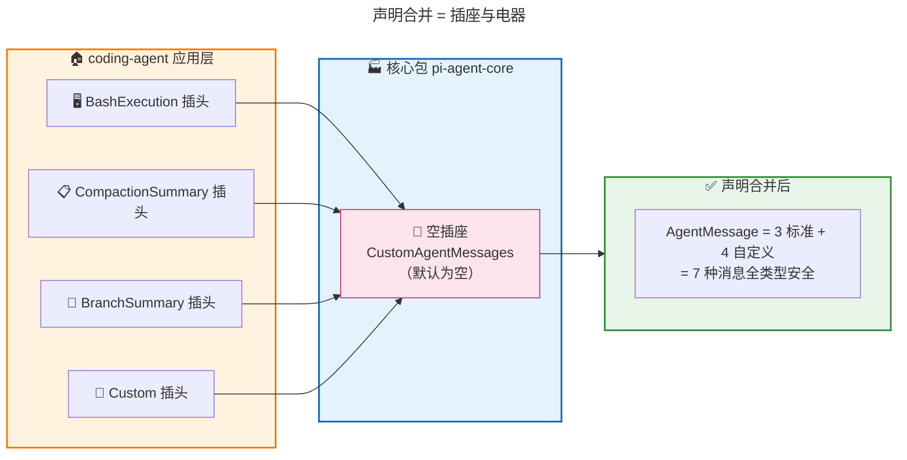

**为什么不用继承或泛型？**

| 方案 | 问题 |
|------|------|
| ❌ 继承 | 需要修改基类，你改不了 `pi-agent-core` 包 |
| ❌ 泛型 | 每个函数签名都要加泛型参数，污染代码 |
| ✅ **声明合并** | 核心包零依赖，应用层全栈类型安全 |

**关键代码**：

```typescript
// 核心包：空插槽
export interface CustomAgentMessages {
    // Empty by default - apps extend via declaration merging
}

// 应用层：通过 declare module 注入
declare module "@earendil-works/pi-agent-core" {
    interface CustomAgentMessages {
        bashExecution: BashExecutionMessage;
        custom: CustomMessage;
        branchSummary: BranchSummaryMessage;
        compactionSummary: CompactionSummaryMessage;
    }
}

// 最终效果
export type AgentMessage = Message | CustomAgentMessages[keyof CustomAgentMessages];
// = 3 种标准 + 4 种自定义 = 7 种
```

### 2.5 convertToLlm：最后一刻的翻译

**大白话**：每次调用 LLM 前，`convertToLlm` 函数会把 `AgentMessage[]`（7 种）翻译成 `Message[]`（3 种）。**所有自定义消息都被翻译成 `user` 角色的消息**——因为 LLM API 要求对话必须 user/assistant 交替，自定义消息本质上是"系统注入的信息"，放在 user 角色最安全。

> 📖 **原文引用**：第6章 § 五 - 转换规则
>
> "所有自定义消息都被转换成了 user 角色的消息。因为 LLM API 对角色顺序有严格要求——对话格式是 user → assistant → user → ... 交替的。"

[查看原文档完整内容](./source/M06 · 第6章：消息系统 —— Agent 的记忆如何组织与传递.md#五转换边界converttollm-一切自定义消息终将变成-user)

**📊 转换规则表**：

| 原始 role | 怎么处理 | 结果 |
|----------|---------|------|
| `"user"` | 直接透传 | UserMessage |
| `"assistant"` | 直接透传 | AssistantMessage |
| `"toolResult"` | 直接透传 | ToolResultMessage |
| `"bashExecution"` | `excludeFromContext=true` → 过滤；否则 → 翻译 | UserMessage 或 丢弃 |
| `"custom"` | 翻译 | UserMessage |
| `"branchSummary"` | 翻译（加 XML 标签包裹） | UserMessage |
| `"compactionSummary"` | 翻译（加 XML 标签包裹） | UserMessage |

**🔄 翻译前后对比（BashExecutionMessage 的例子）**：

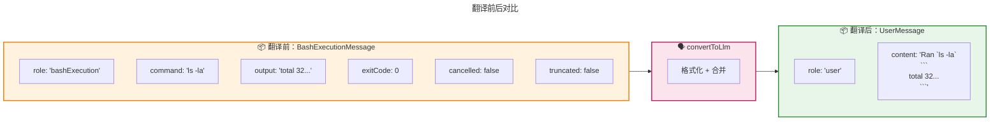

**变化总结**：
- `role`：`"bashExecution"` → `"user"`
- 结构化字段 → 被格式化成一段文本
- 丢失的信息：`cancelled`、`truncated` 等布尔标志被融合进文本里

### 2.6 两阶段管道：为什么分 transformContext 和 convertToLlm？

**大白话**：LLM 调用前的消息处理分两步——**先 transformContext**（同层变换，类型不变，做裁剪/注入/压缩），**再 convertToLlm**（跨层翻译，类型变了，把 7 种翻译成 3 种）。**分两步是因为职责不同，可以独立替换**。

> 📖 **原文引用**：第6章 § 六 - 两阶段管道
>
> "换了上下文管理策略，只需要改 transformContext。换了应用类型，只需要改 convertToLlm。互不影响。"

[查看原文档完整内容](./source/M06 · 第6章：消息系统 —— Agent 的记忆如何组织与传递.md#六两阶段管道为什么-transformcontext-和-converttollm-分开)

**🎨 类比图：两步 = 整理行李 + 过海关**

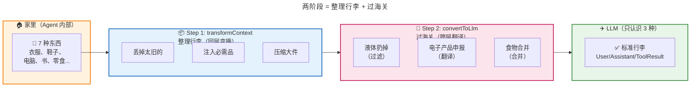

**📊 两阶段对比表**：

| 维度 | transformContext | convertToLlm |
|------|-----------------|--------------|
| **做什么** | 裁剪、注入、压缩 | 翻译、过滤 |
| **类型变吗** | ❌ 不变（AgentMessage[] → AgentMessage[]） | ✅ 变了（AgentMessage[] → Message[]） |
| **什么时候用** | 可选 | 必须 |
| **改什么影响** | 改上下文策略 | 改应用类型 |
| **类比** | 整理行李 | 过海关 |

**完整的消息处理管道**：

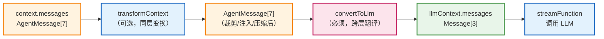

**特别注意**：换了 LLM 提供商（如从 Claude 换成 GPT），`convertToLlm` **不需要动**！因为 `convertToLlm` 的输出是统一的 `Message[]`，再往下翻译成各家 Provider 的私有格式是 `pi-ai` 层的工作——这是**两层不同的抽象**。

### 2.7 可见性控制：三种消息级别

**大白话**：Pi 的消息有三种"可见性级别"——**全可见**（UI 和 LLM 都看到）、**LLM 不可见**（UI 看到但 LLM 看不到，用 `excludeFromContext=true`）、**仅持久化**（UI 和 LLM 都看不到，只存着）。**一个布尔字段就能让消息对 LLM "隐身"**。

> 📖 **原文引用**：第6章 § 七 - 过滤机制
>
> "excludeFromContext = true 的消息仍然存在于 context.messages 中。UI 仍然可以看到它、渲染它。只是在调用 LLM 的那一刻，这条消息被'隐身'了。"

[查看原文档完整内容](./source/M06 · 第6章：消息系统 —— Agent 的记忆如何组织与传递.md#七过滤机制有些消息-llm-不该看)

**🎨 类比图：三种可见性 = 三种聊天权限**

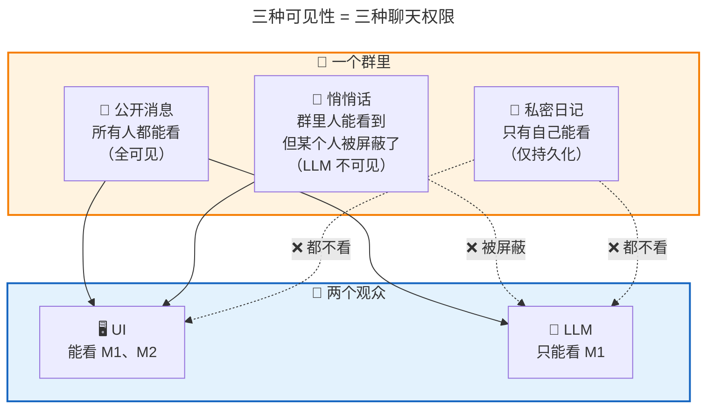

**📊 三种可见性对比表**：

| 可见性级别 | LLM 看到？ | UI 看到？ | 实现方式 | 典型消息 |
|-----------|-----------|----------|---------|---------|
| **全可见** | ✅ 是 | ✅ 是 | convertToLlm 正常转换 | 普通 BashExecution、User、Assistant |
| **LLM 不可见** | ❌ 否 | ✅ 是 | `excludeFromContext = true` | `!!` 前缀的 Bash 执行 |
| **仅持久化** | ❌ 否 | ❌ 否 | UI 跳过，convertToLlm 也过滤 | Web UI 的 ArtifactMessage |

---

## 三、可视化总览

### 3.1 完整数据流：一条 Bash 命令的消息之旅

> 📖 **原文引用**：第6章 § 八 - 完整数据流
>
> 原文中的完整数据流描述位置

[查看原文档完整内容](./source/M06 · 第6章：消息系统 —— Agent 的记忆如何组织与传递.md#八完整数据流从用户操作到-llm-看到的消息)

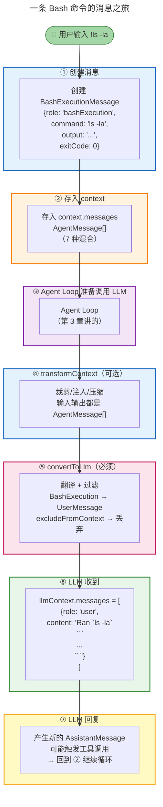

### 3.2 核心设计：两个读者，两层架构

> 📖 **原文引用**：第6章 § 九 - 总结
>
> "Pi 的消息系统所有设计都围绕一个朴素的思想——在设计数据结构时，要同时考虑模型要用的、和功能层面要用的。"

[查看原文档完整内容](./source/M06 · 第6章：消息系统 —— Agent 的记忆如何组织与传递.md#九总结)

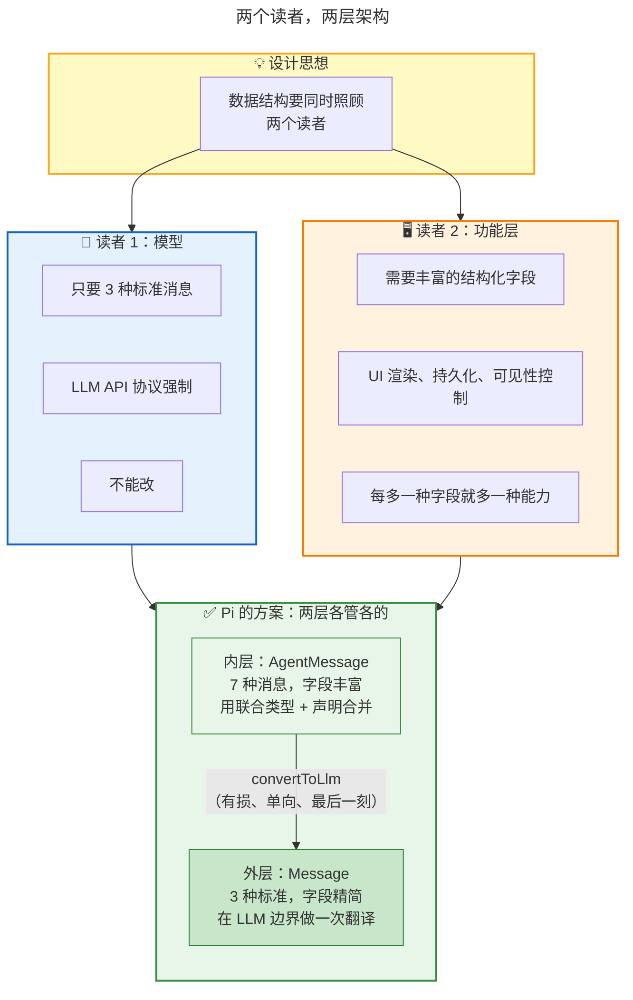

---

## 四、关键数字速记

> 📖 **原文引用**：第6章 § 二、四、五
>
> 原文中的关键数字位置

[查看原文档完整内容](./source/M06 · 第6章：消息系统 —— Agent 的记忆如何组织与传递.md)

```
┌────────────────────────────────────────────────────────┐
│  📊 关键数字（吹牛用）                                 │
├────────────────────────────────────────────────────────┤
│  • 3 种：LLM 只认识的标准消息（User/Assistant/ToolResult）│
│  • 7 种：Agent 内部的消息类型（3 标准 + 4 自定义）       │
│  • 2 层：内富外严的双层架构                             │
│  • 2 阶段：transformContext + convertToLlm 管道         │
│  • 3 种可见性：全可见 / LLM不可见 / 仅持久化            │
│  • 1 个翻译官：convertToLlm 函数                       │
│  • 0 依赖：核心包对应用层零依赖（声明合并）              │
└────────────────────────────────────────────────────────┘
```

---

## 五、类比速记卡

| 概念 | 类比 | 原文出处 |
|------|------|----------|
| **消息系统整体** | 双语家庭的"方言 + 普通话" | § 一 |
| **LLM 的 3 种消息** | 只懂三种话的死板客人 | § 二 |
| **两个读者冲突** | UI 要结构化 vs LLM 要文本 | § 三 |
| **AgentMessage 双层** | 内层方言丰富，外层普通话标准 | § 四 |
| **声明合并** | 空插座 + 电器插头 | § 四 |
| **convertToLlm** | 门口的翻译官 | § 五 |
| **两阶段管道** | 整理行李 + 过海关 | § 六 |
| **可见性控制** | 群聊的公开/屏蔽/私密 | § 七 |

---

## 六、一句话总结（费曼技巧版）

**消息系统 是什么？**
> Agent 内部用 7 种消息类型自由表达（内富），到了 LLM 边界统一翻译成 3 种标准格式（外严），既满足 UI 的结构化需求，又满足 LLM 的协议约束。

**为什么重要？**
> 没有这个设计，要么 UI 拿不到结构化数据（提前拍扁），要么 LLM 失忆（不进上下文）。两层架构让两者兼得。

**适合谁？**
> 任何"对外有协议约束、对内有丰富需求"的系统设计——不只是 Agent，任何需要对接外部协议的系统都可以套用"两个读者，两层架构"的思路。

---

## 七、实操：把这套设计用到自己的项目

> 📖 **原文引用**：第6章 § 九 - 把这条主线用到自己的项目里
>
> 原文中的三步法

[查看原文档完整内容](./source/M06 · 第6章：消息系统 —— Agent 的记忆如何组织与传递.md#九总结)

**三步套用模板**：

```
第一步：识别"两个读者"
├── 协议规定什么（不能改）？
└── 功能层需要什么（可以自定义）？

第二步：内层结构化为"源"，外层翻译为"流"
├── 存储和功能层：用原始结构化数据（不丢字段）
└── 协议边界：做一次有损翻译

第三步：用类型系统的扩展点做分层
├── 核心包：定义协议接口（封闭）+ 留空扩展插槽
└── 应用包：通过声明合并注入具体类型
```

---

> 📝 **学习笔记**
> - 学习日期：2026-09-03
> - 学习方式：费曼学习法（大白话版）
> - 原始文档：M06 · 第6章：消息系统 —— Agent 的记忆如何组织与传递.md
> - 下一步：理解后，用自己的话讲给同事听（Step 3）
