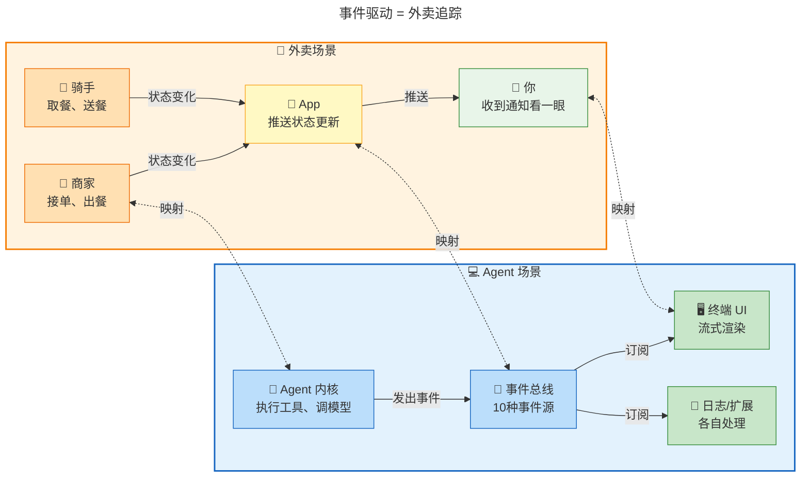
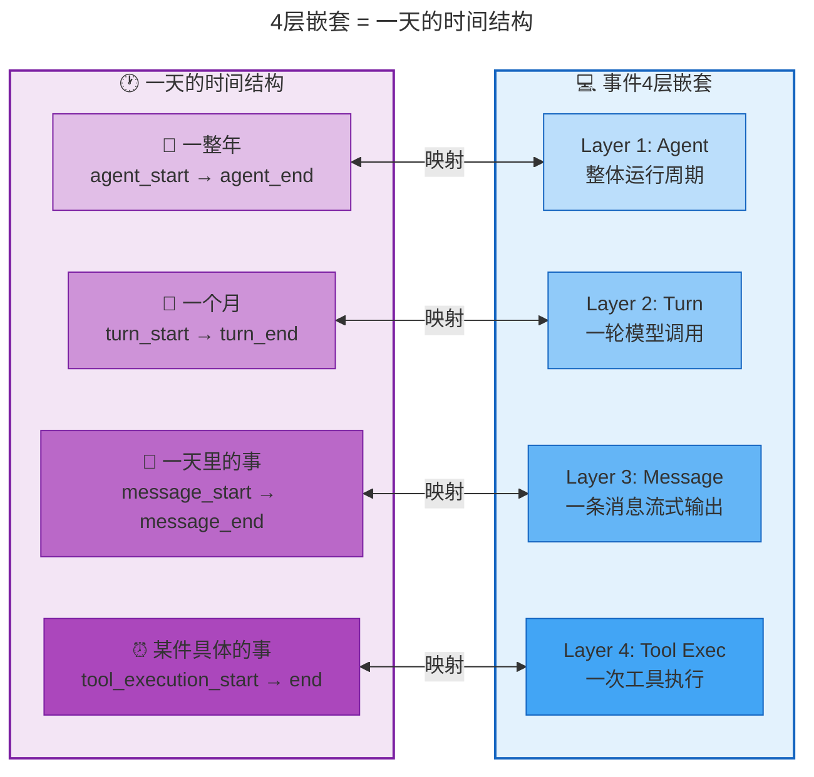
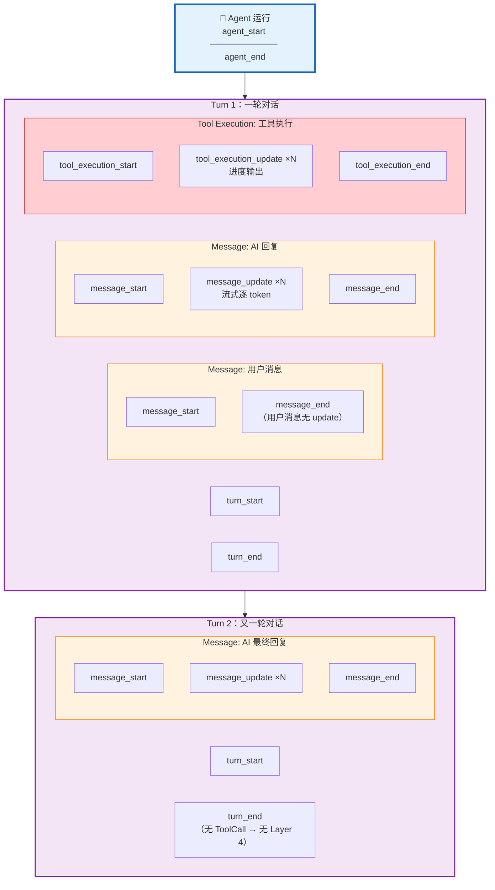
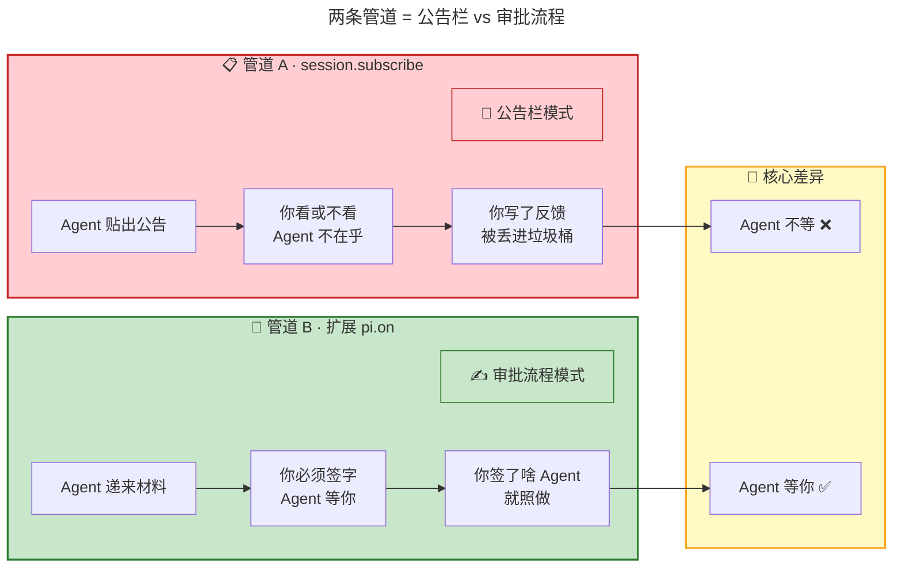
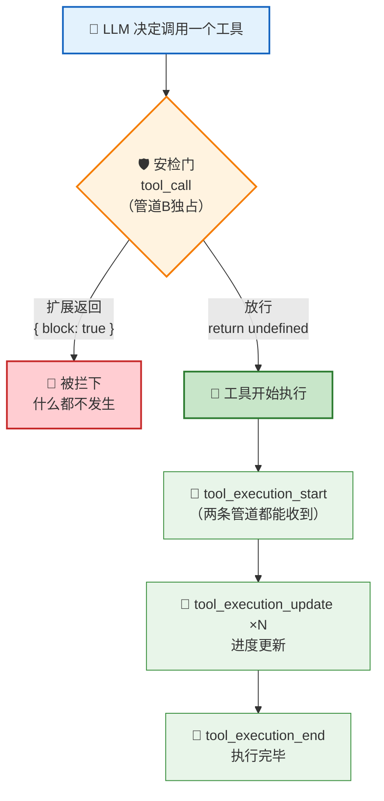
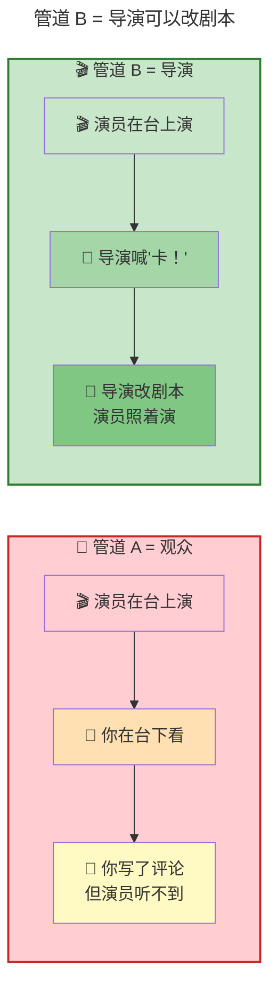
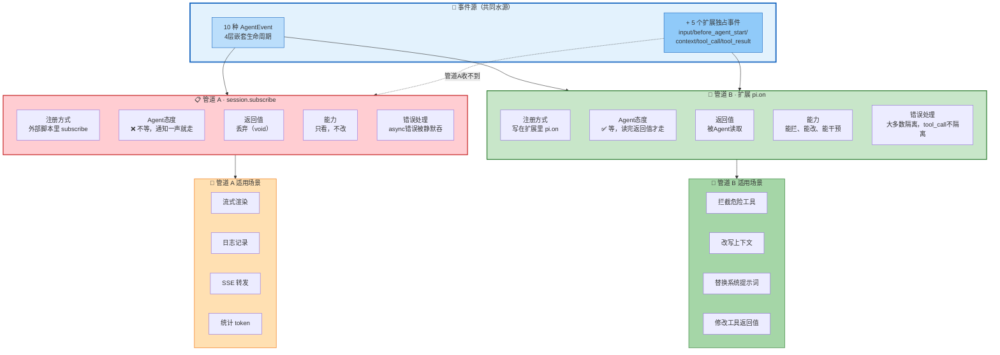
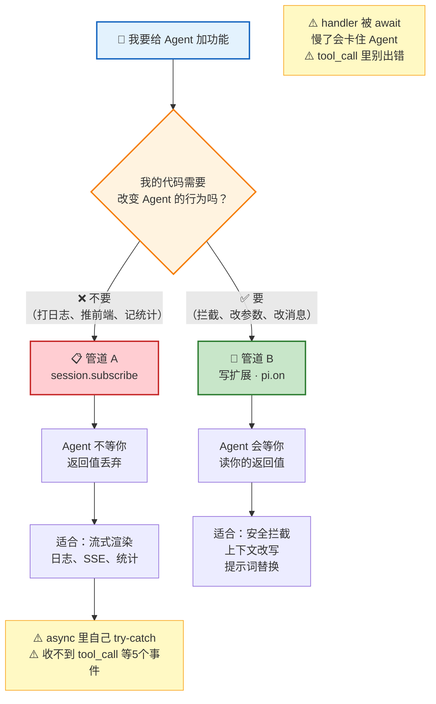

<!-- [AGC:FILE] tool=Cc author=fangkun date=2026-09-03 -->

# 大白话版：事件驱动 —— Agent 的神经系统

> 这是《第7章：事件驱动 —— Agent 的神经系统》的通俗解读版
> 核心理念：用大白话把技术概念讲明白，让自己和同事都能听懂
>

---

## 一、一句话说明白：事件驱动是什么？

**事件驱动就是 Agent 的"神经系统"——Agent 每做一件事就喊一嗓子，关心这事的人各自听到后各干各的，不用互相盯着。**

> 📖 **原文引用**：第7章 § 一、为什么需要事件系统？
>
> "把'发生了什么'和'谁关心什么'彻底分离。Agent 只管发事件，它不知道也不关心谁在听。"
>
> **为什么这么理解**：原文用外卖追踪类比——你不用一直盯骑手，状态变化时 App 推送给你。事件驱动本质就是"有事我通知你，你不用盯着我"。


### 类比理解

**🎨 类比图**（事件驱动 = 外卖追踪）：



**对比表格**：

| 概念 | 像什么 | 特点 |
|------|--------|------|
| **事件驱动** | 🛵 外卖追踪 | 有事推送，不用盯着，互不打扰 |
| **直接调用** | ☎️ 打电话通知 | 你得知道每个人的号码，加人要改通讯录 |
| **发布-订阅** | 📢 广播喇叭 | 对着空气喊，谁听到算谁的 |

**关键区别**：
- 直接调用：Agent 必须知道每个消费者的存在，加个新功能就得改 Agent
- 事件驱动：Agent 只管发事件，消费者各自订阅，新功能只需订阅、不用改 Agent

---

## 二、核心概念详解

### 2.1 十种事件：4 层嵌套的生命周期

**大白话**：Agent 运行时会发出 10 种事件，它们像俄罗斯套娃一样 4 层嵌套——最外面是"Agent 开始/结束"，里面是"一轮对话开始/结束"，再里面是"一条消息开始/更新/结束"，最里面是"一次工具执行开始/更新/结束"。每一层都是"开始→中间更新→结束"的套路。

> 📖 **原文引用**：第7章 § 2.1 事件源：10 种 AgentEvent
>
> "10 种看着不少，但规律很清楚——它们是 4 层嵌套的生命周期，每层都有'开始→更新→结束'的配对"
>
> **为什么这么理解**：原文的代码定义和嵌套结构图清楚地展示了 2+2+3+3=10 的规律。从外到内：Agent(2) → Turn(2) → Message(3) → Tool Execution(3)。


**类比图**（4 层嵌套 = 一天的时间结构）：



**嵌套关系图**：



**速记口诀**：

```
┌────────────────────────────────────────────────────────┐
│  📊 10种事件 = 2 + 2 + 3 + 3                          │
├────────────────────────────────────────────────────────┤
│  • Agent 层 (2种)：agent_start / agent_end            │
│  • Turn 层 (2种)：turn_start / turn_end               │
│  • Message 层 (3种)：start / update×N / end           │
│  • Tool 层 (3种)：start / update×N / end              │
│  规律：每层都是"开始 → 中间更新(可无) → 结束"        │
└────────────────────────────────────────────────────────┘
```

---

### 2.2 两条管道：等 vs 不等 —— 最核心的分水岭

**大白话**：Pi 有两条"接收事件的管道"。管道 A 像**公告栏**——Agent 把消息往上一贴就走，不管你看不看、看完有啥想法；管道 B 像**审批流程**——Agent 把材料递给你，必须等你签完字才走。一个是"通知一声就走"，一个是"等你回话才走"。

> 📖 **原文引用**：第7章 § 2.2 两条管道：subscribe 与扩展 pi.on
>
> "Pi 有两套并行的监听机制——session.subscribe（只读观察，Agent 不等你）和扩展系统的 pi.on（能拦截、能改写，Agent 会等你）。"
>
> "因果关系很直接：扩展要读返回值，所以必须等；subscribe 不读返回值，等了也没用。'能改 Agent 行为'是'等 + 读返回值'的结果，不是单独赋予的能力。"
>
> **为什么这么理解**：原文强调"等 vs 不等"是根本分水岭。不是先有"能改"的能力再去决定等不等，而是因为要读返回值所以必须等，"能改"只是等的自然结果。


**类比图**（两条管道 = 公告栏 vs 审批流程）：



**对比表格**：

| 维度 | 管道 A（session.subscribe） | 管道 B（扩展 pi.on） |
|------|---------|---------|
| **类比** | 📢 公告栏：贴了就走 | ✍️ 审批流程：等你签字 |
| **Agent 等不等** | ❌ 不等，通知一声就走 | ✅ 等，读完返回值才走 |
| **能不能改 Agent** | ❌ 不能，返回值被丢弃 | ✅ 能，返回值被 Agent 读取 |
| **代码写在哪** | 外部脚本里 | 扩展（插件）里 |
| **典型用途** | 日志、渲染、转发 SSE | 拦截工具、改上下文、换提示词 |
| **源码实现** | `this._emit(event)` 同步不等 | `await this._emitExtensionEvent(event)` |
| **错误处理** | async 错误被静默吞掉 | 大多数有 try-catch 隔离 |

---

### 2.3 容易搞混的两个事件：tool_call vs tool_execution_start

**大白话**：这两个名字很像，但完全不同。`tool_call` 是**安检门**——工具还没开始跑，你可以拦下来不让它跑；`tool_execution_start` 是**起跑发令枪**——工具已经开跑了，你只能看着、拦不住了。而且安检门只有管道 B 能过，管道 A 根本到不了那里。

> 📖 **原文引用**：第7章 § 2.2 两条管道（容易搞混的两个事件名）
>
> "tool_call 是执行前的安检门（能拦，管道 B 独占），tool_execution_start 是开跑后的广播（拦不了，两条管道都收）。"
>
> **为什么这么理解**：原文的时间线清楚地展示了先后顺序——先过安检门(tool_call)，没被拦才起跑(tool_execution_start)。被拦掉的调用根本不会触发后面的事件。


**流程图**：



---

### 2.4 管道 A 详解：session.subscribe

**大白话**：管道 A 就是一个"只看不动手"的观察窗。你在外面挂个摄像头看 Agent 干活——Agent 干它的，你看你的，互不影响。你可以在摄像头后面慢慢分析录像（异步处理），但 Agent 不会等你分析完。代价是：如果你的摄像头坏了（async 报错），没人会注意到。

> 📖 **原文引用**：第7章 § 三、管道 A：session.subscribe
>
> "listener 的签名返回值是 void——就算你在 listener 里 return { block: true }，Agent 也不读、不用。这是管道 A'只能看不能改'在类型层面的体现。"
>
> "async 监听器里的错误不会冒泡到 Agent。如果你在 async 监听器里 await 一个会失败的操作，失败会被悄悄吞掉。务必在 async 监听器里自己 try-catch。"
>
> **为什么这么理解**：返回值为 void 意味着 TypeScript 在类型层面就不让你"改"。不等意味着你的异步操作在后台跑，错误只能自己兜。


**三个关键后果**：

| 后果 | 说明 | 类比 |
|------|------|------|
| 异步重活不拖 Agent | 你在 listener 里 await 慢请求，Agent 早走了 | 你看监控不影響小偷作案 |
| 异步结果传不回去 | Agent 已经发下一个事件了 | 你写分析报告，没人等 |
| async 错误被静默吞掉 | 你的 try-catch 没写就啥都不知道 | 摄像头坏了没人修 |

**管道 A 能收到的事件**：

- 10 种内核生命周期事件（2.1 讲的那 10 种）
- 加上产品级事件：`agent_settled`（整轮收尾）、`compaction_start/end`（压缩）、`auto_retry_start/end`（重试）等
- ❌ 收不到管道 B 独占的 5 个决策点事件

---

### 2.5 管道 B 详解：扩展系统 pi.on

**大白话**：管道 B 是一个"能动手"的遥控器。你不仅能看 Agent 在干什么，还能在它要干蠢事时按下暂停键、改它的剧本、甚至替换它的台词。代价是你的代码必须写成"扩展"（插件形式），而且 Agent 会等你——你处理慢了，Agent 就卡住了。

> 📖 **原文引用**：第7章 § 四、管道 B：扩展系统 pi.on
>
> "handler 有返回值（return { block: true }）——这是管道 B 能干预 Agent 的根本，也是'Agent 必须等你'的原因。"
>
> "tool_call 是所有派发方法里唯一不包 try-catch 的——扩展抛错会冒泡，导致这次工具调用被 block（fail-closed：宁可错杀，不放行可能危险的操作）。"
>
> **为什么这么理解**：管道 B 的"能改"本质是 Agent 读了你的返回值。tool_call 的特殊 fail-closed 设计说明：安全 > 可用性，宁错拦不可漏放。


**三条派发路径对比**：

| 路径 | 处理什么 | 特点 | 异常处理 |
|------|----------|------|----------|
| **通知型 `emit()`** | message_update 等只读事件 | 串行 await、忽略返回值 | try-catch 隔离 |
| **决策型 `emitToolCall()`** | tool_call 拦截 | await + 读返回值 + block 短路 | ❌ 无 try-catch（fail-closed） |
| **链式 transform 型** | context、input、tool_result | 每个 handler 接力改、链式传递 | try-catch 隔离 |

**管道 B 独占的 5 个决策点**：

```
┌────────────────────────────────────────────────────────┐
│  🔑 管道 B 独占的 5 个"能动手"的入口                   │
├────────────────────────────────────────────────────────┤
│  1. input        — 用户输入后，展开 skill/template 前   │
│  2. before_agent_start — Agent 开跑前，可改系统提示词   │
│  3. context      — 发给 LLM 前，可改消息列表           │
│  4. tool_call    — 工具执行前，可拦截                  │
│  5. tool_result  — 工具执行后，可改工具返回值          │
│                                                        │
│  共同点：Agent 要停下来读你的返回值                     │
│  管道 A 一律收不到这些事件                             │
└────────────────────────────────────────────────────────┘
```

**类比图**（管道 B = 导演 vs 观众）：



---

## 三、可视化总览

### 3.1 事件系统全景架构图

> 📖 **原文引用**：第7章 § 二、两条管道的全貌
>
> 原文中的两张 SVG 配图展示了完整的事件流向：事件源 → 两条管道 → 两类监听器




### 3.2 判断流程图：我该用哪条管道？

> 📖 **原文引用**：第7章 § 5.3 怎么选管道？一句话判断




---

## 四、关键数字速记

> 📖 **原文引用**：第7章 § 2.1-2.2


```
┌────────────────────────────────────────────────────────┐
│  📊 关键数字（吹牛用）                                 │
├────────────────────────────────────────────────────────┤
│  • 10 种 AgentEvent：事件源的总数（2+2+3+3）           │
│  • 4 层嵌套：Agent → Turn → Message → Tool Execution  │
│  • 2 条管道：subscribe（只读）+ pi.on（能改）          │
│  • 5 个决策点：管道B独占的干预入口                     │
│  • 1 个分水岭："等 vs 不等"决定一切                    │
│  • 3 条派发路径：通知型/决策型/链式transform型         │
│  • 0 个例外：tool_call 是唯一不包 try-catch 的         │
│                                                        │
│  记忆口诀：10事件4层嵌套，2管道1分水岭                │
│  "等就有能力，不等就只能看"                           │
└────────────────────────────────────────────────────────┘
```

---

## 五、类比速记卡

| 概念 | 类比 | 原文出处 |
|------|------|----------|
| **事件驱动** | 🛵 外卖追踪——有事推送，不用盯着 | § 一 |
| **发布-订阅 vs 直接调用** | 📢 广播喇叭 vs ☎️ 打电话 | § 一 |
| **4 层事件嵌套** | 🕐 年→月→日→具体事情 | § 2.1 |
| **管道 A（subscribe）** | 📢 公告栏——贴了就走 | § 2.2 |
| **管道 B（pi.on）** | ✍️ 审批流程——等你签字 | § 2.2 |
| **tool_call** | 🛡️ 安检门——执行前能拦 | § 2.2 |
| **tool_execution_start** | 🏃 起跑发令枪——已经开跑拦不了 | § 2.2 |
| **"等 vs 不等"** | 🔑 分水岭——决定一切的根本差别 | § 2.2 |
| **管道 A 的 async 错误** | 📹 摄像头坏了没人知道 | § 3.2 |
| **管道 B 的 fail-closed** | 🛡️ 宁可错杀、不可漏放 | § 4.3 |
| **管道 A vs B** | 👀 观众 vs 🎬 导演 | § 四 |

---

## 六、实战代码速查

### 6.1 管道 A 代码模板

```typescript
// 管道 A：只读观察，Agent 不等
const unsubscribe = session.subscribe((event) => {
    // 流式渲染
    if (event.type === "message_update") {
        process.stdout.write(event.assistantMessageEvent.delta);
    }
    // 工具日志
    if (event.type === "tool_execution_end") {
        console.log(`🔧 ${event.toolName}: ${event.isError ? "❌" : "✅"}`);
    }
    // ⚠️ 如果用了 async，必须自己 try-catch！
});
// 不用了就注销
unsubscribe();
```

### 6.2 管道 B 代码模板

```typescript
// 管道 B：能拦截改写，Agent 等你
function myExtension(pi) {
    // 拦截危险工具
    pi.on("tool_call", async (event) => {
        if (event.toolName === "delete_table") {
            return { block: true, reason: "禁止删除" };
        }
        return undefined;  // 放行
    });

    // 改写上下文
    pi.on("context", async (event) => {
        return {
            messages: [
                { role: "user", content: `当前时间：${new Date()}` },
                ...event.messages
            ]
        };
    });
}
// 挂载到 loader 的 extensionFactories
```

---

## 七、一句话总结（费曼技巧版）

**事件驱动是什么？**
> Agent 每做一步就广播一个事件，关心的人各自订阅、各干各的——"发生了什么"和"谁关心什么"彻底分离。

**两条管道的本质区别？**
> 等 vs 不等。Agent 等你的 handler（管道 B），就能读你的返回值、就能被你拦截；Agent 不等你的 listener（管道 A），你就只能看、不能改。

**为什么重要？**
> 没有事件系统，你加任何功能都得改 Agent 源码。有了它，新功能只是"挂一段代码"，Agent 更新你只需 npm update。

**一句话判断用哪条管道？**
> 要改 Agent 行为 → 写扩展走管道 B；只看不动手 → subscribe 走管道 A。

---

## 八、知识关联

| 关联章节 | 关系 |
|----------|------|
| **第 3 章：Agent Loop** | Agent Loop 每步发事件 → 就是这里讲的事件源 |
| **第 5 章：工具系统** | 工具执行五步管道 → 第 3 步 beforeToolCall 底层就是管道 B 的 tool_call |
| **第 6 章：消息系统** | transformContext → 管道 B 的 context hook 在内核层的对应物 |
| **第 8-9 章（预告）** | Compaction 压缩 → 会触发 compaction_start/end 事件（管道 A 能收到） |

---

> 📝 **学习笔记**
> - 学习日期：2026-09-03
> - 学习方式：费曼学习法（大白话版）
> - 原始文档：M07 · 第7章：事件驱动 —— Agent 的神经系统.md
> - 下一步：理解后，用自己的话讲给同事听（Step 3）
