<!-- [AGC:FILE] tool=Cc author=fangkun date=2026-09-03 -->

# 大白话版：Pi-Agent 上下文工程

> 这是《第8章：上下文工程 —— 让有限窗口装下无限对话》的通俗解读版
> 核心理念：用大白话把技术概念讲明白，让自己和同事都能听懂
>
> 📖 **[查看原始文档](./source/M08 · 第8章：上下文工程 —— 让有限窗口装下无限对话.md)**

---

## 一、一句话说明白：上下文工程 是什么？

**上下文工程是 Agent 的"信息管家"——LLM 的上下文窗口是固定大小的（比如 200K token），但对话会无限增长。上下文工程就是在这扇"固定大小的窗户"前，布置四层漏斗：工具输出要截断、系统提示词要精选、长对话要压缩、分支切换要做摘要。最终让有限窗口里装的永远是"对当前任务最有价值的信息"。**

> 📖 **原文引用**：第8章 § 一 - 问题
>
> "上下文工程（Context Engineering）就是应对这个问题的工程 discipline：在内容送入 LLM 之前，多层裁剪、过滤、压缩、组织，让有限的窗口装下'对当前任务最有价值的信息'。"

[查看原文档完整内容](./source/M08 · 第8章：上下文工程 —— 让有限窗口装下无限对话.md)

### 类比理解

**🎒 类比：背包客收拾行李**

想象你要去旅行，背包只有 50 升（= LLM 的固定窗口）。但你想带的东西无限多：

- 📦 **工具输出** = 大件行李（帐篷、睡袋）→ 太大要压缩（真空袋）
- 📋 **系统提示词** = 旅行攻略（出发前就要装好）
- 📚 **对话历史** = 照片和纪念品（越积越多）→ 老照片做成相册摘要
- 🌿 **分支探索** = 另一条路线的游记 → 做张明信片塞背包里

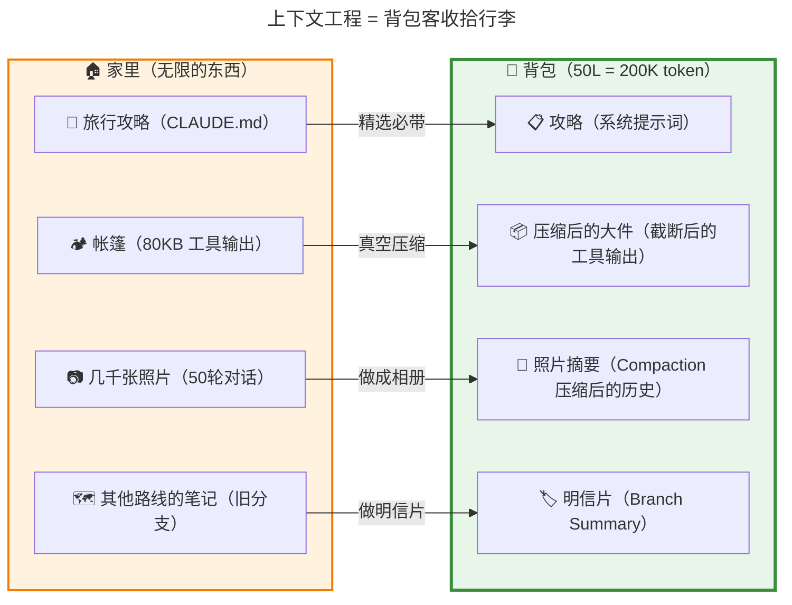

**对比表格**：

| 概念 | 像什么 | 特点 |
|------|--------|------|
| **上下文窗口** | 🎒 50L 背包 | 固定容量，超了装不下 |
| **工具输出截断** | 🗜️ 真空压缩袋 | 大件变小，保留精华 |
| **系统提示词组装** | 📋 旅行攻略 | 出发前装好，不用每次说 |
| **Compaction** | 📸 老照片做成相册 | 旧对话变摘要，腾出空间 |
| **Branch Summary** | 🏷️ 另一条路线的明信片 | 放弃的探索留个纪念 |

**关键区别**：

- 如果**不做上下文工程**：背包塞爆 → `prompt is too long` 报错，对话中断
- 如果**只做一种**（比如只压缩对话）：单次工具输出 80KB 照样塞爆
- **Pi 的答案**：四层漏斗，每层解决一个问题，层层兜底

---

## 二、核心概念详解

### 2.1 两层防护地图：输入侧 + 历史侧

**大白话**：Pi 的上下文工程分布在**两个环节**——**输入侧**（内容送进 LLM 之前做裁剪）和**历史侧**（长对话和分支管理）。四道防线，各管一摊事。

> 📖 **原文引用**：第8章 § 二 - 地图：两层防护
>
> "Pi 的上下文工程分布在两个环节：输入侧（送进 LLM 之前）和历史侧（长对话管理）。"

[查看原文档完整内容](./source/M08 · 第8章：上下文工程 —— 让有限窗口装下无限对话.md#二地图两层防护)

**🗺️ 四层防线速记表**：

| 层 | 名称 | 解决什么问题 | 触发频率 | 类比 |
|----|------|-------------|---------|------|
| ① | 工具输出截断 | 单次工具结果太大 | 每次工具调用 | 🗜️ 真空压缩袋 |
| ② | 系统提示词组装 | 项目规范要自动注入 | 每轮 prompt | 📋 旅行攻略 |
| ③ | Compaction | 长对话累积超窗口 | 阈值触发 | 📸 老照片做相册 |
| ④ | 分支摘要 | 切换分支旧内容不能丢 | 用户切换分支时 | 🏷️ 路线明信片 |

**🔄 架构图**：

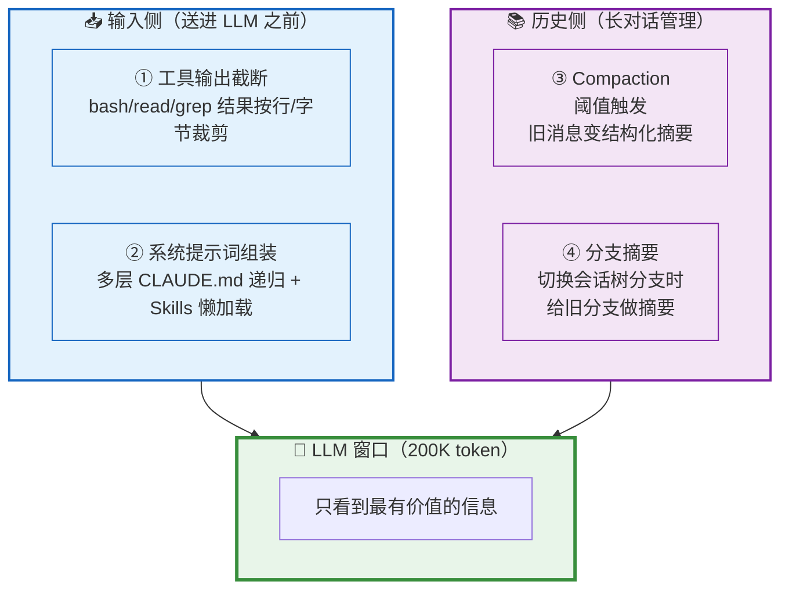

### 2.2 工具输出截断：双重限制 + 双向策略

**大白话**：每次工具调用的输出都要过一道"瘦身关"——**行数上限 2000 行** 和 **字节上限 50KB**，哪个先触发就用哪个。而且截断方向还不同：读文件保留开头（文件头部最重要），Bash 输出保留末尾（错误在最后）。

> 📖 **原文引用**：第8章 § 三 - 输入侧
>
> "任何工具输出都按'最多 2000 行'或'最多 50KB'裁剪，哪个先触发就用哪个。"

[查看原文档完整内容](./source/M08 · 第8章：上下文工程 —— 让有限窗口装下无限对话.md#三输入侧-工具输出截断truncatehead--truncatetail)

**🎨 类比图：双重限制 = 电梯限重 + 限人**

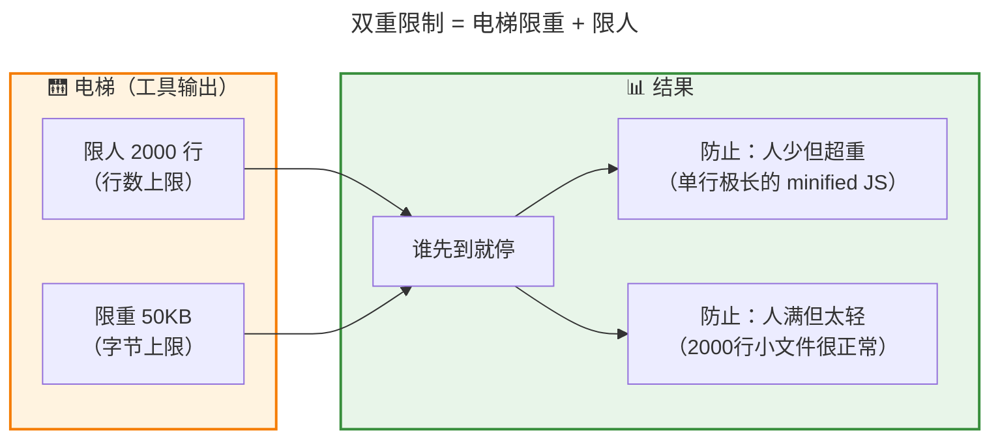

**📊 两种截断策略对比**：

| 函数 | 保留哪一段 | 用在哪 | 为什么 | 类比 |
|------|-----------|--------|--------|------|
| **truncateHead** | 🟢 开头 | read 文件 | 文件头部 = import / 类定义 / 接口签名，**信息密度最高** | 看书看目录和前几章 |
| **truncateTail** | 🟢 末尾 | bash 输出 | bash 的错误堆栈、最终结果都在末尾，**末尾最有信号** | 看日志直接翻到最后 |

**🔄 流程图**：

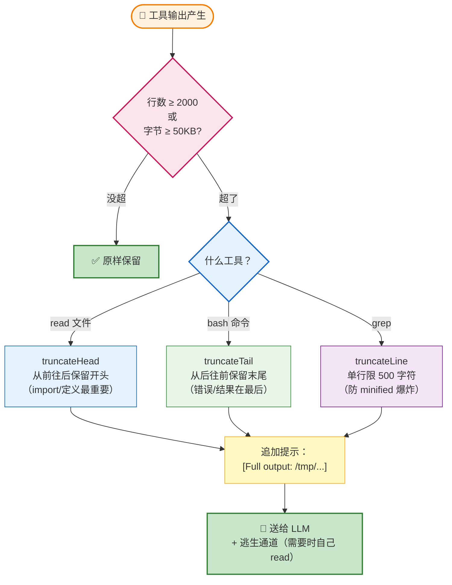

**边界安全处理**：

| 问题 | 解法 | 类比 |
|------|------|------|
| 切断 emoji（4字节） | 逐字符累加字节，遇到超预算就停 | 切蛋糕不切到装饰物 |
| 单行就超 50KB | 取该行末尾 50KB + 设 `lastLinePartial: true` | 书的一页比书包还大，撕最后一页 |
| grep 命中压缩文件 | 单行限 500 字符 + `... [truncated]` | 一行字太长就截断 |

**逃生通道**：截断后追加 `[Full output: /tmp/pi-bash-xxx.log]`，LLM 想看全文时自己用 read 工具去拉。

### 2.3 系统提示词组装：多层 CLAUDE.md 递归 + Skills 懒加载

**大白话**：这是上下文工程的"加法"——不是把东西变小，而是**自动注入**项目规范。Pi 会从当前目录向上递归找到所有 CLAUDE.md 文件（像 CSS 的层叠一样，越近越具体），再用 XML 标签包好塞进系统提示词。Skills 更聪明——只放清单，LLM 需要时才去读全文。

> 📖 **原文引用**：第8章 § 四 - 输入侧
>
> "Pi 的方案是两件事：多层 CLAUDE.md 递归 + Skills 懒加载。"

[查看原文档完整内容](./source/M08 · 第8章：上下文工程 —— 让有限窗口装下无限对话.md#四输入侧-系统提示词动态组装)

**🎨 类比图：多层 CLAUDE.md = CSS 层叠样式**

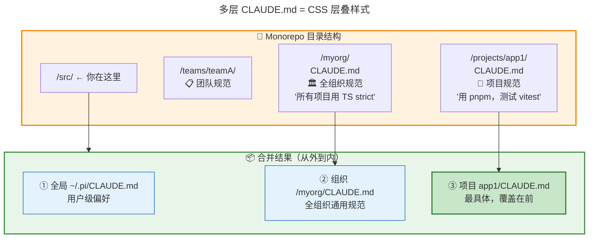

**Skills 懒加载：推模式 vs 拉模式**

| 维度 | ❌ 推模式（全文塞） | ✅ 拉模式（Pi 的方案） |
|------|-------------------|----------------------|
| **Token 开销** | 10 个 skill × 2000 字 ≈ **50K token** | 10 个 skill × 4 行 ≈ **500 token** |
| **信息密度** | 大部分无关 | 精准命中时才展开 |
| **LLM 主动性** | 被动接收 | 主动选择 |
| **类比** | 把 10 本书全塞书包 | 只带目录，需要时去图书馆借 |

**🎨 类比图：Skills 懒加载 = 餐厅菜单**

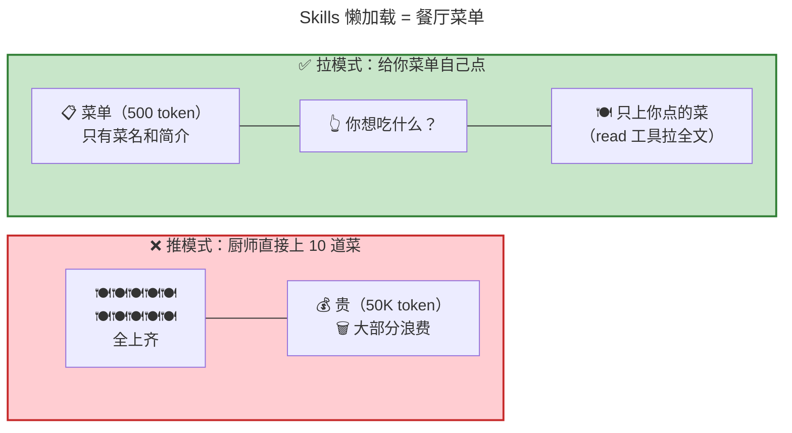

**XML 包装的威力**：

```xml
<project_context>
  <project_instructions path="/myorg/CLAUDE.md">
  全组织规范：所有项目使用 TypeScript strict 模式...
  </project_instructions>

  <project_instructions path=".../app1/CLAUDE.md">
  本项目使用 pnpm，测试用 vitest...
  </project_instructions>
</project_context>
```

为什么用 XML 而不是 Markdown？
1. **XML 边界明确** —— `</project_instructions>` 是清晰的结束标记
2. **带 path 属性** —— LLM 知道内容来自哪个文件，能区分优先级

### 2.4 Compaction：长对话的"照片相册"

**大白话**：当对话累积太长（超过 `contextWindow - reserveTokens`），Pi 会触发 Compaction——**把旧消息用 LLM 生成一份 6 段式结构化摘要**（目标/约束/进展/关键决策/下一步/关键上下文），然后用摘要替代原始消息，腾出空间。

> 📖 **原文引用**：第8章 § 五 - Compaction
>
> "Compaction 是 Pi 的核心压缩算法——把旧消息变成结构化摘要，用摘要替代原始消息，腾出空间但保留关键信息。"

[查看原文档完整内容](./source/M08 · 第8章：上下文工程 —— 让有限窗口装下无限对话.md#五历史侧-compaction联动第9章)

**🎨 类比图：Compaction = 老照片做相册**

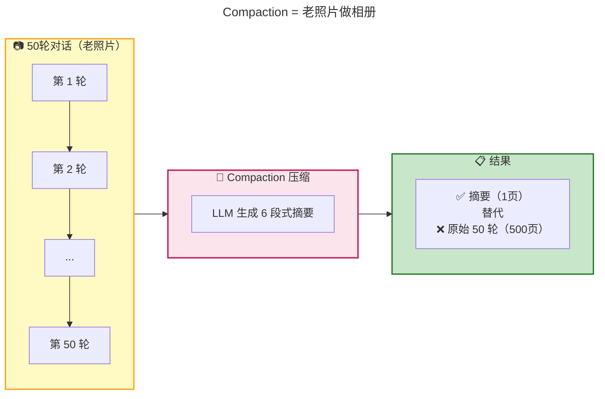

**Compaction 的 6 段式摘要模板**：

```
1. Goal（目标）—— 用户想做什么
2. Constraints（约束）—— 有什么限制
3. Progress（进展）—— 已经做了什么
4. Key Decisions（关键决策）—— 做了哪些重要选择
5. Next Steps（下一步）—— 接下来要做什么
6. Critical Context（关键上下文）—— 不能忘的重要信息
```

**关键特性**：
- **阈值触发**：`shouldCompact` 检查 `contextTokens > contextWindow - reserveTokens`
- **增量更新**：多次压缩时，在旧摘要基础上更新，不是从头来
- **文件跟踪**：摘要末尾附加 `<read-files>` 和 `<modified-files>` 列表

> 💡 **详情见第9章** —— Compaction 足够复杂，已经独立成章。

### 2.5 分支摘要：被放弃路线的"明信片"

**大白话**：Pi 的对话不是一条直线，而是一棵树——用户可以从历史节点分叉出新对话。当用户切换分支时，旧分支的探索成果不能丢。Pi 用 **LCA（最近公共祖先）算法**找到"分叉点"，然后给被放弃的分支生成一份 5 段式摘要（比 Compaction 少一个 Critical Context），注入新分支的上下文。

> 📖 **原文引用**：第8章 § 六 - 分支摘要
>
> "Pi 的解法是给被放弃的分支生成摘要，注入新分支的上下文。"

[查看原文档完整内容](./source/M08 · 第8章：上下文工程 —— 让有限窗口装下无限对话.md#六历史侧-分支摘要branch-summarization)

**🎨 类比图：分支摘要 = 旅行分支路线的明信片**

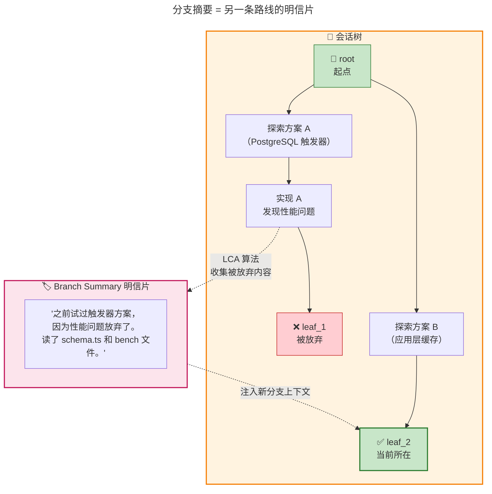

**LCA 算法三步走**：

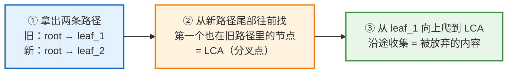

**📊 Compaction vs Branch Summary 对比表**：

| 维度 | Compaction | Branch Summarization |
|------|-----------|---------------------|
| **触发** | 阈值（tokens > window - reserve） | 用户切换会话树分支 |
| **目的** | 防止窗口溢出 | 保留被放弃分支的探索成果 |
| **切割** | findCutPoint（向后累积） | LCA 算法（找分叉点） |
| **摘要模板** | 6 section（含 Critical Context） | 5 section（无 Critical Context） |
| **maxTokens** | 可能上万 | 固定 2048（更精简） |
| **前言语义** | "history compacted" | "explored a different branch" |
| **类比** | 📸 老照片做相册 | 🏷️ 另一条路线的明信片 |

### 2.6 全景链路：一次工具调用的完整旅程

**大白话**：把四层防线串起来，一次 LLM 调用要经过的完整链路是：系统提示词组装 → 消息进 context → Agent Loop → 工具执行 → 工具输出截断 → 结果进历史 → 循环 → agent_end → shouldCompact 检查 → 可能需要 Compaction 或 Branch Summary。

> 📖 **原文引用**：第8章 § 七 - 全景链路
>
> "每一层都只解决自己擅长的问题，互不替代。"

[查看原文档完整内容](./source/M08 · 第8章：上下文工程 —— 让有限窗口装下无限对话.md#七全景链路一次工具调用经过的所有上下文处理)

**🔄 完整链路流程图**：

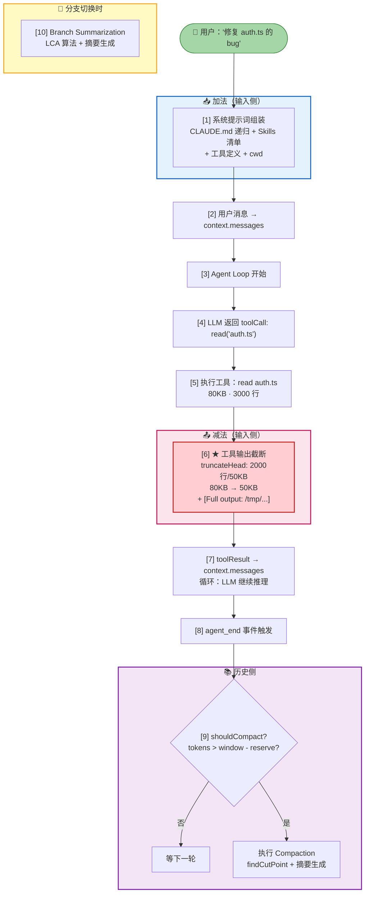

### 2.7 三大设计精华

**大白话**：Pi 的上下文工程有三个值得带走的设计思路：① 多层防护没有银弹；② 加法+减法双向操作；③ 工具调用=按需上下文加载。

> 📖 **原文引用**：第8章 § 八 - 设计精华
>
> "没有任何单一机制能搞定所有上下文问题。每层都只解决自己擅长的问题，互不替代。"

[查看原文档完整内容](./source/M08 · 第8章：上下文工程 —— 让有限窗口装下无限对话.md#八设计精华)

**📊 三大精华对比表**：

| 精华 | 核心思想 | 体现 | 类比 |
|------|---------|------|------|
| **① 多层防护** | 没有银弹，层层兜底 | 4 层各管一摊，互不替代 | 🛡️ 城堡的多道护城河 |
| **② 加法+减法** | 不只是压缩，而是"塑形" | 截断（减）+ 组装/摘要（加） | 🎨 雕塑：既去料也加料 |
| **③ 推 vs 拉** | 工具调用=按需加载 | Skills 只放清单，LLM 主动 read | 📋 菜单点菜 vs 满汉全席 |

**🎨 类比图：推模式 vs 拉模式**

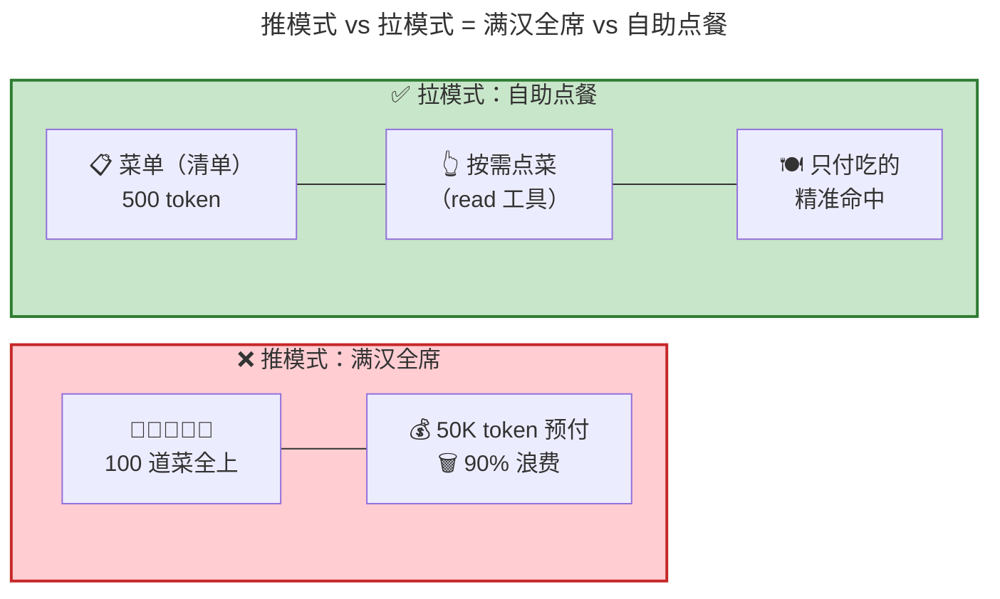

---

## 三、可视化总览

### 3.1 上下文工程全景架构图

> 📖 **原文引用**：第8章 § 二 + §七
>
> 原文中的两层防护图和全景链路图位置

[查看原文档完整内容](./source/M08 · 第8章：上下文工程 —— 让有限窗口装下无限对话.md)

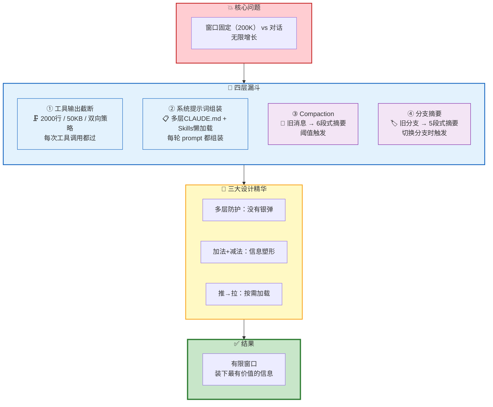

---

## 四、关键数字速记

> 📖 **原文引用**：第8章 § 三~§六
>
> 原文中的关键数字位置

[查看原文档完整内容](./source/M08 · 第8章：上下文工程 —— 让有限窗口装下无限对话.md)

```
┌────────────────────────────────────────────────────────┐
│  📊 关键数字（吹牛用）                                 │
├────────────────────────────────────────────────────────┤
│  • 2000 行：工具输出行数上限（DEFAULT_MAX_LINES）       │
│  • 50KB：工具输出字节上限（DEFAULT_MAX_BYTES）          │
│  • 500 字符：grep 单行长度上限（GREP_MAX_LINE_LENGTH）  │
│  • 4 层防线：截断 + 提示词 + Compaction + 分支摘要      │
│  • 6 段式：Compaction 摘要模板                          │
│  • 5 段式：Branch Summary 摘要模板                      │
│  • 2048 token：Branch Summary 固定 maxTokens            │
│  • 500 token vs 50K token：懒加载 vs 全文塞             │
└────────────────────────────────────────────────────────┘
```

---

## 五、类比速记卡

| 概念 | 类比 | 原文出处 |
|------|------|----------|
| **上下文工程整体** | 🎒 背包客收拾行李 | § 一 |
| **双重限制** | 🛗 电梯限重 + 限人 | § 三 |
| **truncateHead** | 📖 看书看目录和前几章 | § 三 |
| **truncateTail** | 📋 看日志直接翻到最后 | § 三 |
| **逃生通道** | 🚪 需要全文时自己去图书馆借 | § 三 |
| **多层 CLAUDE.md** | 🎨 CSS 层叠样式（越近越具体） | § 四 |
| **Skills 懒加载** | 📋 餐厅菜单点菜 vs 满汉全席 | § 四 |
| **Compaction** | 📸 老照片做成相册 | § 五 |
| **Branch Summary** | 🏷️ 另一条旅行路线的明信片 | § 六 |
| **多层防护** | 🛡️ 城堡的多道护城河 | § 八 |
| **推 vs 拉** | 🍱 满汉全席 vs 自助点餐 | § 八 |

---

## 六、一句话总结（费曼技巧版）

**上下文工程 是什么？**
> 在 LLM 固定大小的上下文窗口前布置四层漏斗（截断 + 提示词组装 + 压缩 + 分支摘要），让有限窗口永远装着"对当前任务最有价值的信息"。

**为什么重要？**
> 不做上下文工程，一次 `npm install` 的 8000 行日志就能撑爆窗口，对话直接中断。四层防线层层兜底，Agent 才能跑长任务。

**核心设计思想？**
> ① 多层防护没有银弹——每层只解决自己擅长的问题；② 加法+减法=信息塑形——不只是压缩，而是结构化；③ 推拉结合——工具调用=按需上下文加载。

---

## 七、实操：把这套思路用到自己的项目

> 📖 **原文引用**：第8章 § 八 - 设计精华
>
> "当 LLM 有工具调用能力时，'工具'本身就是上下文工程的载体。"

[查看原文档完整内容](./source/M08 · 第8章：上下文工程 —— 让有限窗口装下无限对话.md#八设计精华)

**三步套用模板**：

```
第一步：识别"爆炸点"
├── 哪些数据可能无限增长？（对话历史、工具输出）
├── 哪些数据必须自动注入？（项目规范、用户偏好）
└── 哪些数据可能用不到？（Skills、文档）

第二步：分层设防线
├── 单条级别：截断/裁剪（控制体积）
├── 提示词级别：精选+结构化（控制内容）
└── 历史级别：压缩+摘要（控制长度）

第三步：推拉结合
├── 必须知道的 → 推模式（塞进 system prompt）
└── 可能用到的 → 拉模式（放清单，LLM 按需 read）
```

---

> 📝 **学习笔记**
> - 学习日期：2026-09-03
> - 学习方式：费曼学习法（大白话版）
> - 原始文档：M08 · 第8章：上下文工程 —— 让有限窗口装下无限对话.md
> - 下一步：理解后，用自己的话讲给同事听（Step 3）
