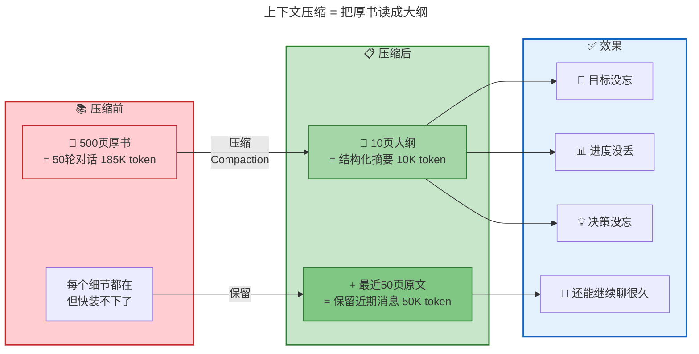
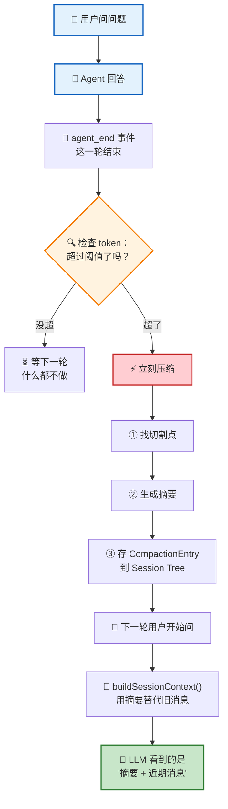
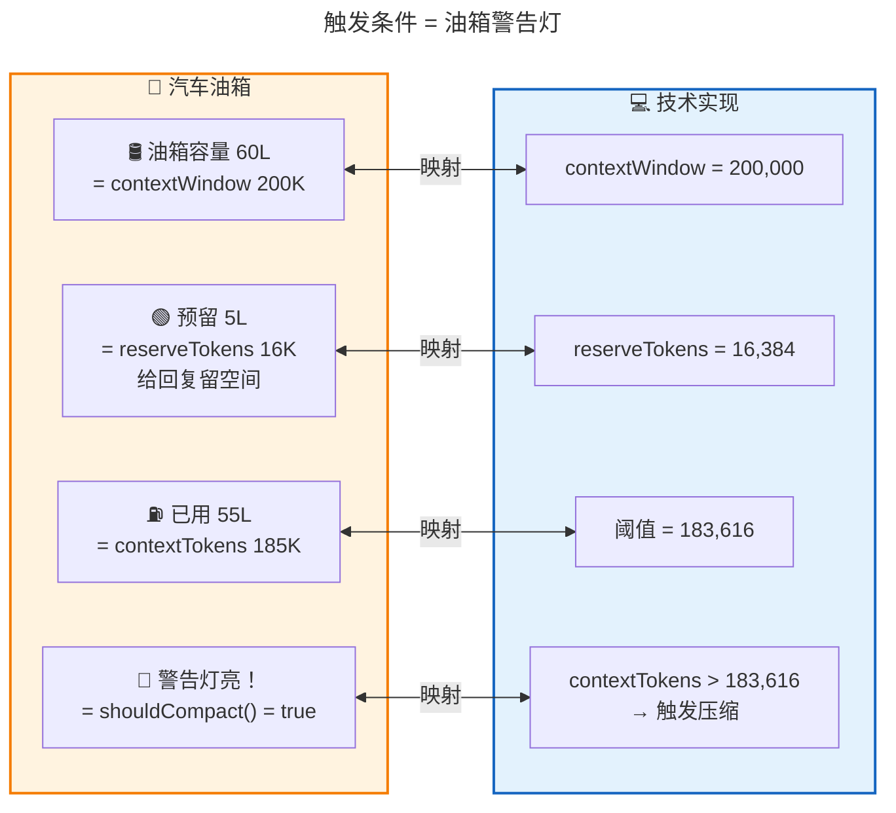
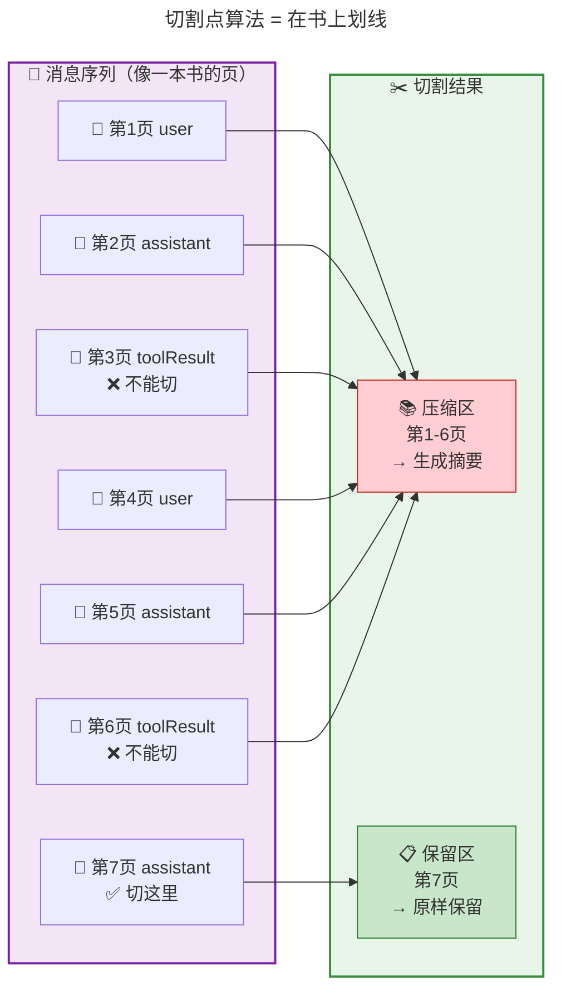
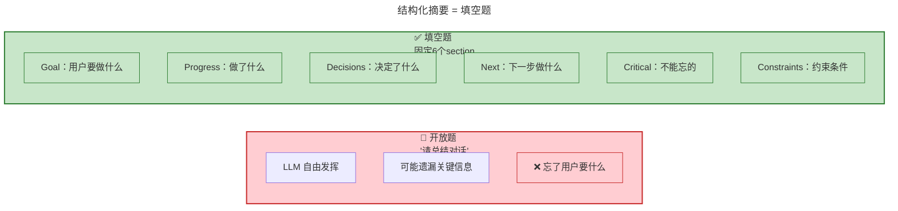
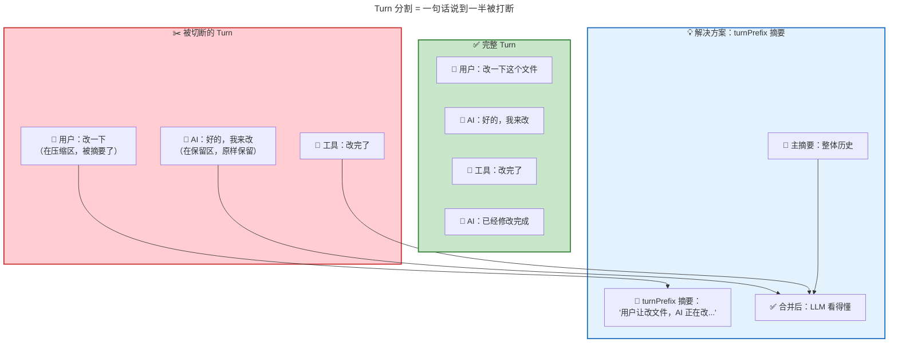
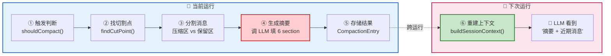
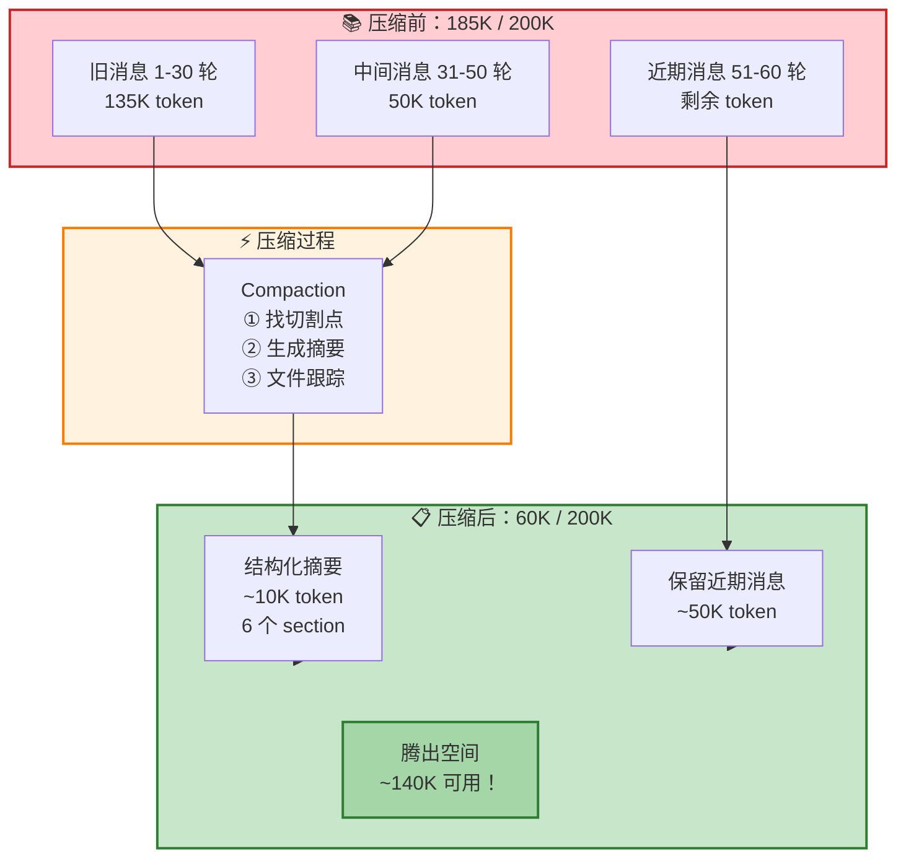

<!-- [AGC:FILE] tool=Cc author=fangkun date=2026-09-03 -->

# 大白话版：上下文压缩 —— 当对话太长怎么办

> 这是《第9章：上下文压缩 —— 当对话太长怎么办》的通俗解读版
> 核心理念：用大白话把技术概念讲明白，让自己和同事都能听懂

---

## 一、一句话说明白：上下文压缩是什么？

**上下文压缩（Compaction）就是把一本厚书读薄成一份大纲——扔掉细节，保留目标、进度、决策，让 Agent 在有限的上下文窗口里"记住"之前发生了什么。**

> 📖 **原文引用**：第9章 § 一、问题：对话越来越长，窗口装不下了
>
> "Pi 的解法是压缩（Compaction）：把旧消息变成一段结构化摘要，用摘要替代原始消息。这样既腾出了空间，又保留了关键信息。"

### 类比理解

**🎨 类比图**（上下文压缩 = 把厚书读成大纲）：



**对比表格**：

| 概念 | 像什么 | 特点 |
|------|--------|------|
| **上下文压缩** | 📝 把厚书读成大纲 | 有损压缩，保留核心，腾出空间 |
| **直接删旧消息** | 🗑️ 撕掉前几章 | Agent 失忆，不知道之前做了什么 |
| **不压缩** | 🐘 硬塞 | API 报错"prompt is too long"，对话中断 |

**关键区别**：
- 压缩是有损的：细节（具体措辞、工具输出全文）丢了
- 但核心保留了：目标、进度、决策、关键上下文
- 类比：你忘了书里每一句话，但记得书讲什么、做到哪了

---

## 二、核心概念详解

### 2.1 关键时序：压缩发生在两轮对话之间

**大白话**：压缩不是在 Agent 回答你的时候发生的，而是在 Agent 回答完、你还没问下一个问题之间的"间隙"里发生的。就像考试时，监考老师不会在你答题时收卷，而是在你交卷后、下一场考试开始前整理考场。

> 📖 **原文引用**：第9章 § 一（一个关键时序）
>
> "压缩不是在对话进行中触发的，而是在两轮对话之间发生的"
>
> **为什么这么理解**：原文强调"这是理解整章的钥匙"。所有细节都围绕这个时序展开。

[查看原文档完整内容](#一问题对话越来越长窗口装不下了)

**流程图**：



---

### 2.2 触发条件：红灯什么时候亮？

**大白话**：Pi 给上下文窗口画了一条"红线"——当已用 token 超过 `contextWindow - reserveTokens`（200K - 16K = 184K）时，就触发压缩。`reserveTokens` 是给 LLM 回复预留的空间——不能把窗口塞满，否则模型连回复的地方都没有。

> 📖 **原文引用**：第9章 § 二、什么时候压缩：红灯亮起
>
> "当 contextTokens > 200,000 - 16,384 = 183,616 时，触发压缩"

[查看原文档完整内容](#二什么时候压缩红灯亮起)

**类比图**（触发条件 = 油箱警告灯）：



**两种触发场景**：

| 场景 | 类比 | 什么时候 | 性质 |
|------|------|----------|------|
| **预防性压缩** | 🟡 黄灯亮了就加油 | token 超阈值但还没报错 | 常态，提前处理 |
| **应急性压缩** | 🔴 红灯亮了紧急加油 | API 报上下文溢出错误 | 兜底，补救措施 |

---

### 2.3 Token 估算：chars/4 的启发式

**大白话**：精确计算 token 需要用 tokenizer，但不同模型不同，而且慢。Pi 用了个简单粗暴的方法：字符数除以 4。英文差不多准（4 个字符 ≈ 1 token），但**中文会严重低估**（1 个汉字实际 1-2 token，这里只算 0.25）。所以纯中文场景下，Pi 觉得"还没到阈值"，实际可能已经快满了。

> 📖 **原文引用**：第9章 § 二（Token 估算）
>
> "一个英文字符大约 0.25 token（4 个字符 ≈ 1 token）。中文是反向偏差：1 个汉字实际大约 1-2 token，但 chars/4 只算成 0.25 token——严重低估中文占比高的对话。"

[查看原文档完整内容](#二什么时候压缩红灯亮起)

**对比表**：

| 语言 | 1 字符 = ? token | chars/4 估算 | 准确度 |
|------|------------------|--------------|--------|
| 英文 | ~0.25 token | 0.25 token | ✅ 准 |
| 中文 | ~1.5 token | 0.25 token | ❌ 低估 6 倍 |

**为什么用不精确的估算？** 因为宁可高估（多压缩一次，无害）也不低估（API 报错，有害）。这是"用精度换安全"的保守策略。

---

### 2.4 切割点算法：在哪下刀？

**大白话**：不能随便切——ToolCall 和 ToolResult 是一对，切开了模型会"调了工具但找不到结果"。所以只能在 user 或 assistant 后面切。而且要从最新消息往回切（最近的上下文最重要），直到保留够 20K token 的近期上下文。

> 📖 **原文引用**：第9章 § 三、在哪切：切割点算法
>
> "user 和 assistant 都是合法切点，toolResult 不是"
>
> "从最新消息往回走，累积 token 数。当累积量 >= keepRecentTokens（20,000）时，停止。"

[查看原文档完整内容](#三在哪切切割点算法)

**类比图**（切割点 = 在书上划线）：



**切割点规则**：

```
┌────────────────────────────────────────────────────────┐
│  ✂️ 切割点规则                                         │
├────────────────────────────────────────────────────────┤
│  ✅ 合法切点：user、assistant 之后                     │
│  ❌ 非法切点：toolResult 之后（会切断 ToolCall-Result）│
│                                                        │
│  📍 切点语义：保留区的第一条（不是被切掉的最后一条）   │
│  🔍 找法：从最新往回累积，直到 >= keepRecentTokens     │
│  📏 默认保留：20,000 token 的近期上下文                │
└────────────────────────────────────────────────────────┘
```

---

### 2.5 结构化摘要：不是"随便写总结"

**大白话**：Pi 不是让 LLM "随便写一段总结"，而是让它填一张固定表格——6 个 section：目标、约束、进度、决策、下一步、关键上下文。为什么？因为自由发挥的 LLM 容易"被有趣细节吸引，忘了记录用户核心需求"。固定模板强制它每个维度都扫一遍。

> 📖 **原文引用**：第9章 § 四、切掉的部分怎么处理：结构化摘要
>
> "为什么不写'请总结对话'？因为自由文本摘要有一个失败模式：LLM 容易被'有趣的内容'吸引，花大篇幅描述某个技术细节，忘了记录用户的核心需求。"

[查看原文档完整内容](#四切掉的部分怎么处理结构化摘要)

**类比图**（结构化摘要 = 填空题 vs 开放题）：



**6 个固定 Section**：

| Section | 内容 | 为什么要 |
|---------|------|----------|
| **Goal** | 用户最初要做什么 | 防止忘记核心需求 |
| **Constraints** | 有什么约束 | 防止重复犯同样的错 |
| **Progress** | Done / In Progress / **Blocked** | Blocked 专门记卡住的事 |
| **Key Decisions** | 关键决策 | 防止反复讨论已决定的事 |
| **Next Steps** | 下一步做什么 | 让 Agent 知道该继续做什么 |
| **Critical Context** | 不能忘的关键信息 | 防止遗漏重要细节 |

**增量更新**：多次压缩时，新摘要是在旧摘要基础上更新（不是从零重写），避免"摘要漂移"。

---

### 2.6 Turn 分割：切到一半怎么办？

**大白话**：有时候切点在 assistant 上，会把一个 Turn（user → assistant → toolResult）切成两半——user 在压缩区，assistant 在保留区。Pi 的解法：给被切断的半个 Turn 单独生成一份"前缀摘要"（turnPrefix），和主摘要合并。就像一句话说到一半被打断，你给它加个前情提要。

> 📖 **原文引用**：第9章 § 五、极端情况：Turn 分割
>
> "Pi 选择了后者——优先保证压缩能生效，然后用 turnPrefix 摘要弥补 Turn 完整性的损失。"

[查看原文档完整内容](#五极端情况turn-分割)

**类比图**（Turn 分割 = 一句话说到一半）：



**为什么允许 assistant 切点？**

| 策略 | 优点 | 缺点 |
|------|------|------|
| 只允许 user 切点 | Turn 永远完整 | 保留区过大，可能压不动 |
| 允许 assistant 切点 | 精确控制 token | 会切断 Turn → 需要 turnPrefix 弥补 |

Pi 选择了后者：**优先保证压缩能生效**。

---

### 2.7 文件跟踪：编码 Agent 的专属记忆

**大白话**：对编码 Agent 来说，"改过哪些文件"是至关重要的信息。Pi 的摘要里会单独维护一个文件列表——读过哪些、改过哪些。这个列表跨压缩累积，即使经过多轮压缩，Agent 仍然知道整个会话中碰过哪些文件。

> 📖 **原文引用**：第9章 § 四（文件跟踪）& § 八（设计精华 3）
>
> "对编码 Agent 来说，'改过哪些文件'是至关重要的元信息——比'对话里讨论过什么'更精确、更可验证。"

[查看原文档完整内容](#四切掉的部分怎么处理结构化摘要)

**文件跟踪的格式**：

```
<read-files>
src/auth.ts
src/utils/hash.ts
</read-files>

<modified-files>
src/auth.ts
</modified-files>
```

**为什么要单独跟踪文件？**
- 比"对话里讨论过什么"更精确
- 避免重复读同一个文件
- 避免覆盖他人改动
- 这是"领域知识嵌入到通用机制"的做法

---

## 三、可视化总览

### 3.1 压缩完整链路

> 📖 **原文引用**：第9章 § 七、完整链路回顾

[查看原文档完整内容](#七完整链路回顾)



### 3.2 压缩前后对比

> 📖 **原文引用**：第9章 § 一

[查看原文档完整内容](#一问题对话越来越长窗口装不下了)



---

## 四、关键数字速记

> 📖 **原文引用**：第9章 § 二、§ 三

[查看原文档完整内容](#二什么时候压缩红灯亮起)

```
┌────────────────────────────────────────────────────────┐
│  📊 关键数字（吹牛用）                                 │
├────────────────────────────────────────────────────────┤
│  • 200,000：Claude 上下文窗口（token）                 │
│  • 183,616：压缩触发阈值（200K - 16K reserve）         │
│  • 20,000：keepRecentTokens（保留近期上下文的 token）  │
│  • 6：结构化摘要的 section 数                          │
│  • chars/4：token 估算启发式（英文准，中文低估6倍）    │
│  • 4 层嵌套：Agent → Turn → Message → Tool Execution  │
│                                                        │
│  记忆口诀：20万窗口18万触发，保留2万近期，摘要6个维度 │
└────────────────────────────────────────────────────────┘
```

---

## 五、类比速记卡

| 概念 | 类比 | 原文出处 |
|------|------|----------|
| **上下文压缩** | 📝 把厚书读成大纲 | § 一 |
| **上下文窗口** | 🛢️ 汽车油箱容量 | § 二 |
| **触发条件** | 🔴 油箱警告灯亮 | § 二 |
| **切割点** | ✂️ 在书的哪一页划线 | § 三 |
| **结构化摘要** | 📋 填空题而非开放题 | § 四 |
| **Turn 分割** | 💬 一句话说到一半被打断 | § 五 |
| **文件跟踪** | 📁 改了哪些文件的清单 | § 四 |
| **增量更新** | 🔄 在旧笔记上补充，不重写 | § 四 |
| **CompactionEntry** | 🌉 连接两次运行的桥梁 | § 七 |

---

## 六、设计精华（三个值得带走的设计思路）

### 精华 1：向后遍历 + 合法切点

**核心思想**：最近的上下文最重要。从最新消息往回走，直到累积够 20K token，确保保留"刚才做了什么"。

### 精华 2：结构化模板对抗 LLM 认知偏差

**核心思想**：固定 section 强制 LLM 在每个维度都扫一遍，把"易遗漏"变成"必须填"。这是用 prompt 设计对抗 LLM"自由发挥"的范例。

### 精华 3：文件跟踪累积

**核心思想**：对编码 Agent，"改过哪些文件"比"讨论过什么"更精确。通过 `details` 字段承载领域特定信息，是"领域知识嵌入通用机制"的做法。

---

## 七、一句话总结（费曼技巧版）

**上下文压缩是什么？**
> 把旧消息变成结构化摘要，用 6 个固定 section 保留目标、进度、决策，让 Agent 在有限窗口里继续工作。

**为什么重要？**
> 没有压缩，50 轮对话就撑爆上下文窗口。有了压缩，Agent 能聊几百轮——因为"记忆"从原始录像变成了摘要笔记。

**核心设计哲学？**
> 向后遍历保护最重要的（近期上下文），结构化模板对抗 LLM 的自由发挥，文件跟踪嵌入领域知识。

**一句话判断？**
> 有损但有效：细节丢了，但目标、进度、决策没忘——这就够了。

---

## 八、知识关联

| 关联章节 | 关系 |
|----------|------|
| **第 6 章：消息系统** | CompactionSummaryMessage 通过 convertToLlm 翻译成 UserMessage |
| **第 7 章：事件驱动** | compaction_start/end 事件供 UI 订阅 |
| **第 8 章：上下文工程** | Compaction 是 transformContext 的核心实现 |
| **第 10 章（预告）** | Session Tree：CompactionEntry 存在上面 |

---

> 📝 **学习笔记**
> - 学习日期：2026-09-03
> - 学习方式：费曼学习法（大白话版）
> - 原始文档：M09 · 第9章：上下文压缩 —— 当对话太长怎么办.md
> - 下一步：理解后，用自己的话讲给同事听（Step 3）
