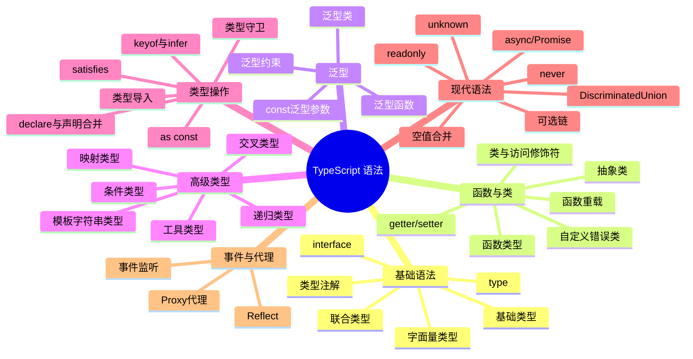

<!-- [AGC:FILE] tool=Cc author=fangkun date=2026-09-03 -->

# TypeScript 基础语法 - 从 Pi 项目中学习

> 📖 **学习背景**
> 本文从 `pi-ai`、`pi-agent`、`pi-coding-agent` 三个真实开源包中提取了所有用到的 TypeScript 语法。
> 每个语法配一个 **Hello World 级别代码块**，5 分钟看懂一个语法点。

---

## 📊 语法全景图



---

## 一、基础语法（入门级）

---

### 1.1 类型注解（Type Annotations）

**一句话说明白**：给变量/参数/返回值"贴标签"，告诉 TypeScript 它是什么类型。

**特点**：
- ✅ 编译时检查，运行时不影响
- ✅ 编辑器有代码提示
- ✅ 相当于给代码加文档

**Pi 项目出处**：所有文件都在用。

```ts-playground
// [AGC:START] tool=Cc author=fangkun
// ===== Hello World：类型注解 =====

// 变量类型注解
let name: string = "fangkun";
let age: number = 18;
let isActive: boolean = true;

// 函数参数和返回值类型注解
function greet(name: string): string {
  return `Hello, ${name}!`;
}

// 数组类型注解
let scores: number[] = [100, 90, 85];
let names: Array<string> = ["Alice", "Bob"]; // 泛型写法，等价
// [AGC:END]
```

---

### 1.2 基础类型（Primitive Types）

**一句话说明白**：TypeScript 内置的基础"积木块"，所有复杂类型都由它们组合。

**特点**：
- ✅ `string` / `number` / `boolean` —— JS 三件套
- ✅ `null` / `undefined` —— 分开是两种类型
- ✅ `void` —— 函数没有返回值
- ✅ `any` —— 放弃类型检查（尽量少用）
- ✅ `unknown` —— 比 `any` 安全，必须先检查再用

**Pi 项目出处**：`coding-agent` 的 `EventBus` 用 `unknown` 替代 `any`。

```ts-playground
// [AGC:START] tool=Cc author=fangkun
// ===== Hello World：基础类型 =====

let text: string = "hello";
let count: number = 42;
let isOk: boolean = false;
let nothing: null = null;
let notDefined: undefined = undefined;

// void：函数不返回值
function log(msg: string): void {
  console.log(msg);
}

// unknown：安全的"任意类型"，使用前必须收窄
function process(value: unknown) {
  if (typeof value === "string") {
    // 这里 TS 知道 value 是 string
    console.log(value.toUpperCase());
  }
}

// any：完全放弃检查（不推荐）
let data: any = "anything";
data = 123; // 不报错，但也不安全
// [AGC:END]
```

---

### 1.3 字面量类型（Literal Types）

**一句话说明白**：把变量的值"锁死"在某几个具体的值上，像红绿灯只有三种状态。

**特点**：
- ✅ 比 `string` 更精确，限定取值范围
- ✅ 替代 `enum`，更轻量、更好 tree-shaking
- ✅ 常和联合类型一起用

**Pi 项目出处**：
- `ai`: `type Transport = "sse" | "websocket" | "auto"`
- `agent`: `type ThinkingLevel = "off" | "minimal" | "low" | "medium" | "high"`
- `coding-agent`: `type Direction = "up" | "down" | "left" | "right"`（snake 示例）

```ts-playground
// [AGC:START] tool=Cc author=fangkun
// ===== Hello World：字面量类型 =====

// 只能是这几个字符串之一
type Direction = "up" | "down" | "left" | "right";
let move: Direction = "up";    // ✅ OK
// let move2: Direction = "diagonal"; // ❌ 编译错误

// 数字字面量
type DiceRoll = 1 | 2 | 3 | 4 | 5 | 6;
let roll: DiceRoll = 6;

// 布尔字面量
type IsDone = true | false;

// 实际应用：函数只接受特定值
function setTransport(t: "sse" | "websocket" | "auto") {
  console.log(`Transport set to: ${t}`);
}
setTransport("sse");    // ✅ OK
// setTransport("http"); // ❌ 编译错误
// [AGC:END]
```

---

### 1.4 联合类型（Union Types）

**一句话说明白**：一个变量可以是"几种类型之一"，像交通卡可以刷公交也可以刷地铁。

**特点**：
- ✅ 用 `|` 连接多个类型
- ✅ 使用前需要"类型收窄"（Type Narrowing）
- ✅ 替代 `enum` 的主流方式

**Pi 项目出处**：
- `ai`: `type Message = UserMessage | AssistantMessage | ToolResultMessage`
- `agent`: `type AgentMessage = Message | CustomAgentMessages[keyof CustomAgentMessages]`

```ts-playground
// [AGC:START] tool=Cc author=fangkun
// ===== Hello World：联合类型 =====

// 可以是 string 或 number
let id: string | number = "abc";
id = 123; // ✅ 也可以

// 函数参数用联合类型
function printId(id: string | number) {
  // console.log(id.toUpperCase()); // ❌ 报错，number 没有 toUpperCase
  if (typeof id === "string") {
    // ✅ 类型收窄：TS 知道这里是 string
    console.log(id.toUpperCase());
  } else {
    console.log(id.toFixed(2));
  }
}

// 实际应用：消息类型联合
type UserMsg = { role: "user"; content: string };
type AssistMsg = { role: "assistant"; content: string };
type Message = UserMsg | AssistMsg;

function handle(msg: Message) {
  console.log(`${msg.role}: ${msg.content}`);
}
// [AGC:END]
```

---

### 1.5 interface（接口）

**一句话说明白**：定义对象的"形状"——有哪些属性、每个属性是什么类型，像填表模板。

**特点**：
- ✅ 可被 `extends` 继承
- ✅ 支持"声明合并"（同名 interface 自动合并）
- ✅ 常用于定义 API 契约、对象结构
- ✅ 属性可以用 `?` 标记可选

**Pi 项目出处**：
- `ai`: `interface TextContent { type: "text"; text: string; textSignature?: string }`
- `agent`: `interface AgentLoopConfig extends SimpleStreamOptions { ... }`
- `coding-agent`: `interface EventBus { emit(...): void; on(...): () => void }`

```ts-playground
// [AGC:START] tool=Cc author=fangkun
// ===== Hello World：interface =====

// 定义对象的"形状"
interface User {
  name: string;           // 必填
  age: number;            // 必填
  email?: string;         // 可选属性（?）
  readonly id: number;    // 只读，不能改
}

let user: User = {
  name: "fangkun",
  age: 18,
  id: 1,
};

// user.id = 2;           // ❌ readonly 不能改

// 接口继承：小接口继承大接口
interface Animal {
  name: string;
}
interface Dog extends Animal {
  breed: string;
}
let dog: Dog = { name: "旺财", breed: "金毛" };

// 声明合并：两个同名 interface 自动合并
interface Config {
  host: string;
}
interface Config {
  port: number;
}
// 合并后相当于：{ host: string; port: number }
let cfg: Config = { host: "localhost", port: 3000 };
// [AGC:END]
```

---

### 1.6 type（类型别名）

**一句话说明白**：给一个复杂类型起个"别名"，像快捷方式一样。

**特点**：
- ✅ 用 `type` 关键字
- ✅ 能表示联合类型、交叉类型、元组等
- ✅ 不支持声明合并（和 `interface` 不同）
- ✅ 实际项目中 `interface` 和 `type` 经常混用

**interface vs type 选择建议**：

| 场景 | 用哪个 |
|------|--------|
| 定义对象结构 | `interface` |
| 需要联合/交叉类型 | `type` |
| 需要声明合并（插件扩展） | `interface` |
| 其他情况 | 都可以,团队统一即可 |

**Pi 项目出处**：几乎所有文件。

```ts-playground
// [AGC:START] tool=Cc author=fangkun
// ===== Hello World：type 类型别名 =====

// 给联合类型起别名
type Status = "pending" | "success" | "error";
let s: Status = "pending";

// 给对象起别名（和 interface 等价）
type Point = { x: number; y: number };
let p: Point = { x: 1, y: 2 };

// 元组类型（固定长度和类型的数组）
type Pair = [string, number];
let pair: Pair = ["age", 18];

// 不能用 interface 写的，type 都能写
type StringOrNumber = string | number;
type Callback = (data: string) => void;
// [AGC:END]
```

---

## 二、函数与类

---

### 2.1 函数类型（Function Types）

**一句话说明白**：给函数本身也定义类型，规定参数和返回值的类型。

**特点**：
- ✅ 参数名只用于可读性，类型必须匹配
- ✅ 可选参数用 `?` 标记
- ✅ 默认值参数自动变可选

**Pi 项目出处**：
- `agent`: `type AgentEventSink = (event: AgentEvent) => Promise<void> | void`

```ts-playground
// [AGC:START] tool=Cc author=fangkun
// ===== Hello World：函数类型 =====

// 定义函数类型别名
type MathOp = (a: number, b: number) => number;

let add: MathOp = (a, b) => a + b;
let multiply: MathOp = (a, b) => a * b;

// 可选参数和默认值
function createUser(name: string, age?: number, role: string = "user") {
  return { name, age, role };
}
createUser("Alice");
createUser("Bob", 25);
createUser("Charlie", 30, "admin");

// 回调函数类型
type EventSink = (event: string) => Promise<void> | void;
async function subscribe(sink: EventSink) {
  await sink("hello");
}
// [AGC:END]
```

---

### 2.2 函数重载（Function Overloads）

**一句话说明白**：同一个函数，根据参数的不同类型，走不同的逻辑，像多功能工具箱。

**特点**：
- ✅ 定义多个签名 + 一个实现
- ✅ 调用时 TS 自动选最匹配的签名
- ✅ 比 `any` 参数安全得多

**Pi 项目出处**：
- `agent/src/agent.ts`: `prompt` 方法支持传字符串或 Message 对象

```ts-playground
// [AGC:START] tool=Cc author=fangkun
// ===== Hello World：函数重载 =====

// 重载签名（告诉 TS 有哪些调用方式）
function format(value: string): string;
function format(value: number): string;
function format(value: boolean): string;
// 实现签名（真正的逻辑，对外不可见）
function format(value: string | number | boolean): string {
  if (typeof value === "string") return `String: ${value}`;
  if (typeof value === "number") return `Number: ${value.toFixed(2)}`;
  return `Boolean: ${value ? "是" : "否"}`;
}

format("hello");  // ✅ 匹配签名 1，返回 string
format(3.1415);   // ✅ 匹配签名 2，返回 "Number: 3.14"
format(true);     // ✅ 匹配签名 3，返回 "Boolean: 是"
// format({});    // ❌ 编译错误，没有匹配的签名
// [AGC:END]
```

---

### 2.3 类与访问修饰符（Class & Access Modifiers）

**一句话说明白**：用 `class` 封装数据和行为，用 `private`/`public`/`protected` 控制谁能访问。

**特点**：
- ✅ `public`（默认）：谁都能访问
- ✅ `private`：只能类内部访问
- ✅ `protected`：自己和子类能访问
- ✅ `readonly`：只能赋值一次

**Pi 项目出处**：
- `agent/src/agent.ts`: `class Agent { private _state: MutableAgentState; ... }`
- `coding-agent` snake 示例: `private state: GameState; private onClose: () => void`

```ts-playground
// [AGC:START] tool=Cc author=fangkun
// ===== Hello World：类与访问修饰符 =====

class BankAccount {
  // public（默认）：外部可以访问
  public owner: string;
  // private：只有类内部能访问
  private _balance: number;
  // protected：自己和子类能访问
  protected bankName: string = "工商银行";

  constructor(owner: string, initialBalance: number) {
    this.owner = owner;
    this._balance = initialBalance;
  }

  // 通过公开方法访问私有数据
  public deposit(amount: number): void {
    if (amount <= 0) throw new Error("金额必须大于 0");
    this._balance += amount;
  }

  public getBalance(): number {
    return this._balance;
  }
}

const acc = new BankAccount("fangkun", 1000);
console.log(acc.owner);         // ✅ "fangkun"
console.log(acc.getBalance());  // ✅ 1000
// console.log(acc._balance);   // ❌ private 不能直接访问
// [AGC:END]
```

---

### 2.4 getter / setter（访问器）

**一句话说明白**：把方法伪装成属性，读和写可以加逻辑，像"智能门"。

**特点**：
- ✅ 用 `get` / `set` 关键字
- ✅ 调用时像属性，不用加 `()`
- ✅ 适合加验证、计算衍生值

**Pi 项目出处**：
- `agent/src/agent.ts`: `get state(): AgentState` 和 `get/set steeringMode()`

```ts-playground
// [AGC:START] tool=Cc author=fangkun
// ===== Hello World：getter / setter =====

class Temperature {
  private _celsius: number = 0;

  // getter：读的时候自动计算
  get fahrenheit(): number {
    return this._celsius * 9 / 5 + 32;
  }

  // setter：写的时候自动反向计算
  set fahrenheit(value: number) {
    this._celsius = (value - 32) * 5 / 9;
  }

  get celsius(): number {
    return this._celsius;
  }
}

const temp = new Temperature();
temp.fahrenheit = 212;    // 调用 setter
console.log(temp.celsius);    // ✅ 100（调用 getter）
console.log(temp.fahrenheit); // ✅ 212
// [AGC:END]
```

---

### 2.5 抽象类（Abstract Class）

**一句话说明白**：一个"半成品"类，定义好骨架，子类必须完成具体实现。

**特点**：
- ✅ 用 `abstract` 关键字
- ✅ 不能直接 `new`，只能被继承
- ✅ 抽象方法没有函数体，子类必须实现

**Pi 项目出处**：
- `coding-agent` 示例: `abstract class BaseOverlay { ... }`

```ts-playground
// [AGC:START] tool=Cc author=fangkun
// ===== Hello World：抽象类 =====

abstract class Shape {
  // 普通方法，子类可以直接用
  describe(): string {
    return `我是${this.name}，面积是 ${this.area()}`;
  }

  // 抽象属性，子类必须提供
  abstract name: string;

  // 抽象方法，子类必须实现
  abstract area(): number;
}

class Circle extends Shape {
  name = "圆形";
  private radius: number;

  constructor(radius: number) {
    super();
    this.radius = radius;
  }

  area(): number {
    return Math.PI * this.radius ** 2;
  }
}

const c = new Circle(5);
console.log(c.describe()); // "我是圆形，面积是 78.54..."
// const s = new Shape(); // ❌ 抽象类不能直接实例化
// [AGC:END]
```

---

### 2.6 自定义错误类（Custom Error Classes）

**一句话说明白**：继承 `Error` 创建自己的错误类型，方便区分不同错误场景。

**特点**：
- ✅ 用 `extends Error`
- ✅ 可以加自定义属性（错误码、路径等）
- ✅ 用 `instanceof` 判断错误类型

**Pi 项目出处**：
- `agent/src/harness/types.ts`: `class FileError extends Error`、`class ExecutionError extends Error`

```ts-playground
// [AGC:START] tool=Cc author=fangkun
// ===== Hello World：自定义错误类 =====

// 定义文件操作错误类型
type FileErrorCode = "not_found" | "permission_denied" | "aborted";

class FileError extends Error {
  public code: FileErrorCode;
  public path?: string;

  constructor(code: FileErrorCode, message: string, path?: string) {
    super(message);
    this.name = "FileError";
    this.code = code;
    this.path = path;
  }
}

// 使用
function readFile(path: string) {
  throw new FileError("not_found", "文件不存在", path);
}

try {
  readFile("/tmp/data.txt");
} catch (e) {
  if (e instanceof FileError) {
    // TS 知道 e 是 FileError，可以访问 .code
    console.log(`错误码: ${e.code}, 路径: ${e.path}`);
  }
}
// [AGC:END]
```

---

## 三、泛型（Generics）

---

### 3.1 泛型函数（Generic Functions）

**一句话说明白**：函数的"参数类型"也是参数，调用时再确定，像万能夹子。

**特点**：
- ✅ 用 `<T>` 定义类型参数
- ✅ 一个函数可以处理多种类型，同时保持类型安全
- ✅ 避免写重复代码

**Pi 项目出处**：
- `ai/src/utils/event-stream.ts`: `class EventStream<T, R = T>`
- `agent/src/harness/result.ts`: `ok<TValue, TError>(value): Result<TValue, TError>`

```ts-playground
// [AGC:START] tool=Cc author=fangkun
// ===== Hello World：泛型函数 =====

// 没有泛型：只能 any，返回类型丢失
function firstItemBad(arr: any[]): any {
  return arr[0];
}
const x = firstItemBad([1, 2, 3]); // x 是 any，没有提示

// 用泛型：保持类型信息
function firstItem<T>(arr: T[]): T | undefined {
  return arr[0];
}
const a = firstItem([1, 2, 3]);       // a: number | undefined ✅
const b = firstItem(["a", "b", "c"]); // b: string | undefined ✅

// 多个类型参数
function makePair<A, B>(first: A, second: B): [A, B] {
  return [first, second];
}
const pair = makePair("age", 18); // pair: [string, number]
// [AGC:END]
```

---

### 3.2 泛型接口与类（Generic Interfaces & Classes）

**一句话说明白**：`interface` 和 `class` 也能带类型参数，像"模板的模板"。

**特点**：
- ✅ 实例化时确定具体类型
- ✅ 类内部所有用到该类型的地方都自动替换

**Pi 项目出处**：
- `ai`: `class EventStream<T, R = T> implements AsyncIterable<T>`
- `agent`: `interface SessionStorage<TMetadata extends SessionMetadata>`

```ts-playground
// [AGC:START] tool=Cc author=fangkun
// ===== Hello World：泛型接口和类 =====

// 泛型接口：Result 模式（Rust 风格）
interface Result<TValue, TError> {
  ok: true; value: TValue;
} | {
  ok: false; error: TError;
}

function divide(a: number, b: number): Result<number, string> {
  if (b === 0) return { ok: false, error: "除数不能为 0" };
  return { ok: true, value: a / b };
}

const r = divide(10, 2);
if (r.ok) {
  console.log(`结果: ${r.value}`); // ✅ TS 知道 value 存在
} else {
  console.log(`错误: ${r.error}`); // ✅ TS 知道 error 存在
}

// 泛型类：容器类
class Box<T> {
  private item: T;
  constructor(item: T) { this.item = item; }
  get(): T { return this.item; }
}

const numBox = new Box(42);       // Box<number>
const strBox = new Box("hello");  // Box<string>
console.log(numBox.get());        // ✅ number
// [AGC:END]
```

---

### 3.3 泛型约束（Generic Constraints）

**一句话说明白**：限制泛型 `T` 必须满足某些条件，像招聘要求"必须有大学学历"。

**特点**：
- ✅ 用 `extends` 关键字
- ✅ 保证 T 上有某些属性/方法
- ✅ 避免"什么都能传，但什么都做不了"

**Pi 项目出处**：
- `ai`: `function wrapStream<TApi extends Api, TOptions extends StreamOptions>(...)`
- `agent`: `interface SessionStorage<TMetadata extends SessionMetadata>`

```ts-playground
// [AGC:START] tool=Cc author=fangkun
// ===== Hello World：泛型约束 =====

// 没有约束：TS 不知道 T 有 .length
// function logLength<T>(arg: T): T {
//   console.log(arg.length); // ❌ 报错
//   return arg;
// }

// 用 extends 约束：T 必须有 length 属性
interface HasLength { length: number }

function logLength<T extends HasLength>(arg: T): T {
  console.log(`长度: ${arg.length}`); // ✅ TS 知道有 length
  return arg;
}

logLength("hello");       // ✅ string 有 length
logLength([1, 2, 3]);     // ✅ 数组有 length
// logLength(123);        // ❌ number 没有 length

// 常见模式：约束为对象必须有某个 key
function getProperty<T, K extends keyof T>(obj: T, key: K): T[K] {
  return obj[key];
}
const user = { name: "fangkun", age: 18 };
getProperty(user, "name");  // ✅ string
// getProperty(user, "xxx"); // ❌ "xxx" 不在 user 的 key 里
// [AGC:END]
```

---

### 3.4 const 泛型参数（TS 5.0+）

**一句话说明白**：让 TypeScript 把传入的值推断为"最窄的字面量类型"，而不是宽泛的类型。

**特点**：
- ✅ 用 `<const T>` 语法
- ✅ 保留数组/对象的字面量类型
- ✅ 高级场景：构建类型安全的目录/注册表

**Pi 项目出处**：
- `ai/src/model-catalog.ts`: `function flattenModelCatalog<const TProvider extends ProviderId, const TGroups extends ModelGroups>(...)`

```ts-playground
// [AGC:START] tool=Cc author=fangkun
// ===== Hello World：const 泛型参数 =====

// 没有 const：T 被推断为 string[]（宽泛）
function makeArray<T>(items: T[]): T[] { return items; }
const arr1 = makeArray(["a", "b", "c"]); // string[]

// 用 const：T 被推断为 readonly ["a", "b", "c"]（精确）
function makeConstArray<const T>(items: T): T { return items; }
const arr2 = makeConstArray(["a", "b", "c"]);
// 类型：readonly ["a", "b", "c"] ✅ 保留了字面量

// 实际应用：类型安全的枚举注册
const COLORS = ["red", "green", "blue"] as const;
type Color = typeof COLORS[number]; // "red" | "green" | "blue"
// [AGC:END]
```

---

## 四、高级类型（Advanced Types）

---

### 4.1 交叉类型（Intersection Types）

**一句话说明白**：把多个类型"合并"成一个，包含所有类型的属性，像把几个拼图拼在一起。

**特点**：
- ✅ 用 `&` 连接
- ✅ 常用于 Mixin 模式
- ✅ 和联合类型相反：联合是"或"，交叉是"且"

**Pi 项目出处**：
- `ai`: `type ProviderStreamOptions = StreamOptions & Record<string, unknown>`

```ts-playground
// [AGC:START] tool=Cc author=fangkun
// ===== Hello World：交叉类型 =====

interface HasName { name: string }
interface HasAge { age: number }

// 交叉：同时有 name 和 age
type Person = HasName & HasAge;
let p: Person = { name: "fangkun", age: 18 }; // ✅ 两个都要有

// 实际应用：给基础类型加额外字段
type StreamOptions = { maxTokens: number };
type ProviderOptions = StreamOptions & { apiKey: string };
let opts: ProviderOptions = {
  maxTokens: 1000,
  apiKey: "sk-xxx",
};
// [AGC:END]
```

---

### 4.2 条件类型（Conditional Types）

**一句话说明白**：类型的"三元运算符"——根据条件选择返回哪种类型。

**特点**：
- ✅ 语法：`T extends U ? TrueType : FalseType`
- ✅ 延迟求值，只有在泛型中才能真正体现威力
- ✅ 常配合 `infer` 提取嵌套类型

**Pi 项目出处**：
- `ai`: `type ApiStreamOptions<TApi> = TApi extends keyof ApiOptionsMap ? ... : ...`
- `agent`: `type ProvisionedEntry<T> = T extends Entry ? Omit<T, "parentId"> : never`
- `coding-agent`: `type WithoutPartial<T> = T extends { partial: unknown } ? Omit<T, "partial"> : T`

```ts-playground
// [AGC:START] tool=Cc author=fangkun
// ===== Hello World：条件类型 =====

// 基础版：判断是否为 string
type IsString<T> = T extends string ? "yes" : "no";
type A = IsString<string>;     // "yes"
type B = IsString<number>;     // "no"

// 实际版：提取 Promise 的内部类型
type UnwrapPromise<T> = T extends Promise<infer U> ? U : T;
type C = UnwrapPromise<Promise<string>>; // string
type D = UnwrapPromise<number>;          // number

// 实际应用：根据 API 类型选择对应的选项
interface ApiOptionsMap {
  openai: { model: string; temperature: number };
  anthropic: { model: string; maxTokens: number };
}
type ApiOptions<TApi extends keyof ApiOptionsMap> = ApiOptionsMap[TApi];
type OpenAIOpts = ApiOptions<"openai";   // { model: string; temperature: number }
// [AGC:END]
```

---

### 4.3 映射类型（Mapped Types）

**一句话说明白**：遍历一个类型的每个属性，生成一个新类型，像"批量改配置"。

**特点**：
- ✅ 语法：`{ [K in keyof T]: SomeType }`
- ✅ 常用于把属性全部变 optional、readonly 等
- ✅ TypeScript 内置的 `Partial`、`Required` 就是这么实现的

**Pi 项目出处**：
- `ai`: `type ModelCatalog<TGroups> = { [TModelId in ModelId<TGroups>]: Model<...> }`
- `agent`: `type ErrorMatchers<TError> = { [Tag in TError["_tag"]]: (error: ...) => TValue }`

```ts-playground
// [AGC:START] tool=Cc author=fangkun
// ===== Hello World：映射类型 =====

interface User {
  name: string;
  age: number;
  email: string;
}

// 把所有属性变可选（Partial 的实现原理）
type MyPartial<T> = { [K in keyof T]?: T[K] };
type PartialUser = MyPartial<User>;
// 等价于 { name?: string; age?: number; email?: string }

// 把所有属性变只读（Readonly 的实现原理）
type MyReadonly<T> = { readonly [K in keyof T]: T[K] };
type ReadonlyUser = MyReadonly<User>;

// 自定义映射：把所有属性变 string
type Stringify<T> = { [K in keyof T]: string };
type StringUser = Stringify<User>;
// { name: string; age: string; email: string }

// 实际应用：类型安全的枚举对象
type ThinkingLevel = "off" | "low" | "medium" | "high";
type LevelDescriptions = { [K in ThinkingLevel]: string };
const descriptions: LevelDescriptions = {
  off: "关闭思考",
  low: "轻度思考",
  medium: "中度思考",
  high: "深度思考",
};
// [AGC:END]
```

---

### 4.4 工具类型（Utility Types）

**一句话说明白**：TypeScript 内置的"类型工具箱"，对现有类型做变换，拿来即用。

**特点**：
- ✅ `Partial<T>` —— 全变可选
- ✅ `Required<T>` —— 全变必填
- ✅ `Readonly<T>` —— 全变只读
- ✅ `Pick<T, K>` —— 挑选几个属性
- ✅ `Omit<T, K>` —— 排除几个属性
- ✅ `Record<K, V>` —— 字典/Map 类型
- ✅ `Extract<T, U>` —— 从联合中提取能赋值给 U 的
- ✅ `Exclude<T, U>` —— 从联合中排除能赋值给 U 的
- ✅ `ReturnType<T>` —— 获取函数返回类型
- ✅ `Parameters<T>` —— 获取函数参数类型（元组）

**Pi 项目出处**：
- `ai`: `Partial<Record<...>>`、`Pick<SimpleStreamOptions, ...>`、`Extract<StopReason, ...>`
- `agent`: `Omit<AgentState, "isStreaming" | ...>`、`Partial<Omit<...>>`

```ts-playground
// [AGC:START] tool=Cc author=fangkun
// ===== Hello World：工具类型 =====

interface User {
  id: number;
  name: string;
  email: string;
  age?: number;
}

// Partial：全部可选（常用于更新操作的参数）
type UpdateUser = Partial<User>;
// { id?: number; name?: string; email?: string; age?: number }

// Required：全部必填
type FullUser = Required<User>;
// { id: number; name: string; email: string; age: number }

// Pick：挑选属性
type UserBasic = Pick<User, "id" | "name">;
// { id: number; name: string }

// Omit：排除属性
type UserWithoutEmail = Omit<User, "email">;
// { id: number; name: string; age?: number }

// Record：字典类型
type UserById = Record<number, User>;
// { [id: number]: User }

// Extract / Exclude：联合类型过滤
type Status = "pending" | "success" | "error" | "aborted";
type DoneStatus = Extract<Status, "success" | "error">; // "success" | "error"
type ActiveStatus = Exclude<Status, "done">; // "pending" | "success" | "error" | "aborted"

// ReturnType：取函数返回值类型
function getUser(): User { return { id: 1, name: "fangkun", email: "" }; }
type UserReturn = ReturnType<typeof getUser>; // User
// [AGC:END]
```

---

### 4.5 递归类型（Recursive Types）

**一句话说明白**：类型可以引用自己，像俄罗斯套娃，适合树形/JSON 这类嵌套结构。

**特点**：
- ✅ 类型定义中引用自己
- ✅ 适合 JSON、AST、树结构
- ⚠️ 过深递归会导致 TS 报错

**Pi 项目出处**：
- `ai/src/types.ts`: `type JsonValue = string | number | ... | JsonValue[] | { [key: string]: JsonValue }`

```ts-playground
// [AGC:START] tool=Cc author=fangkun
// ===== Hello World：递归类型 =====

// JSON 值的递归定义
type JsonValue =
  | string
  | number
  | boolean
  | null
  | JsonValue[]               // 数组里还能是 JsonValue
  | { [key: string]: JsonValue }; // 对象里也是 JsonValue

const data: JsonValue = {
  name: "fangkun",
  age: 18,
  tags: ["typescript", "coding"],
  address: {
    city: "杭州",
    coords: [120.1, 30.2],  // 嵌套也是合法的
  },
};

// 树的递归定义
type TreeNode<T> = {
  value: T;
  children: TreeNode<T>[];
};

const tree: TreeNode<number> = {
  value: 1,
  children: [
    { value: 2, children: [] },
    { value: 3, children: [{ value: 4, children: [] }] },
  ],
};
// [AGC:END]
```

---

### 4.6 模板字符串类型（Template Literal Types）

**一句话说明白**：在类型层面拼接字符串，像 `${变量}` 但是用在类型里。

**特点**：
- ✅ 用反引号 `` ` `` 和 `${}` 语法
- ✅ 可以组合联合类型生成新联合
- ✅ 适合定义路由、事件名等

**注意**：Pi 项目中发现主要是运行时模板字符串，模板字符串**类型**用得较少。

```ts-playground
// [AGC:START] tool=Cc author=fangkun
// ===== Hello World：模板字符串类型 =====

// 基础拼接
type EventName = `on${"Click" | "Hover" | "Focus"}`;
// "onClick" | "onHover" | "onFocus"

// 组合路由路径
type Method = "GET" | "POST" | "DELETE";
type Route = `/api/${Method}/users`;
// "/api/GET/users" | "/api/POST/users" | "/api/DELETE/users"

// 实际应用：类型安全的事件监听
type DOMEvent = "click" | "keydown" | "mouseover";
type EventHandler = `handle${Capitalize<DOMEvent>}`;
// "handleClick" | "handleKeydown" | "handleMouseover"
// [AGC:END]
```

---

## 五、类型操作（Type Operations）

---

### 5.1 类型守卫（Type Guards）

**一句话说明白**：用特殊函数告诉 TypeScript"这个变量就是这个类型"，像安检门。

**特点**：
- ✅ 返回值形如 `param is Type`
- ✅ 调用后 TS 自动在分支内收窄类型
- ✅ 比 `as` 类型断言安全

**Pi 项目出处**：
- `ai`: `function hasExplicitApiKey(apiKey: string | undefined): apiKey is string`
- `agent`: `isOk(result): result is { ok: true; value: TValue }`

```ts-playground
// [AGC:START] tool=Cc author=fangkun
// ===== Hello World：类型守卫 =====

// 自定义类型守卫：判断是不是 Fish
interface Fish { swim(): void }
interface Bird { fly(): void }

function isFish(pet: Fish | Bird): pet is Fish {
  return (pet as Fish).swim !== undefined;
}

let pet: Fish | Bird = /* ... */ {} as any;
if (isFish(pet)) {
  pet.swim(); // ✅ TS 知道 pet 是 Fish
} else {
  pet.fly();  // ✅ TS 知道 pet 是 Bird
}

// 实际应用：Result 模式的类型守卫
type Result<T, E> =
  | { ok: true; value: T }
  | { ok: false; error: E };

function isOk<T, E>(r: Result<T, E>): r is { ok: true; value: T } {
  return r.ok === true;
}

const result: Result<number, string> = { ok: true, value: 42 };
if (isOk(result)) {
  console.log(result.value); // ✅ TS 知道 value 存在
}
// [AGC:END]
```

---

### 5.2 类型导入（Type Imports）

**一句话说明白**：只导入"类型"，不导入"值"，编译后完全消失，零运行时开销。

**特点**：
- ✅ `import type { ... }` 或 `import { type X }`
- ✅ 编译时被擦除，不打包进产物
- ✅ 避免循环依赖

**Pi 项目出处**：三个包的每个文件都在用。

```ts-playground
// [AGC:START] tool=Cc author=fangkun
// ===== Hello World：类型导入 =====

// ❌ 旧写法：类型和值都导入（可能打包多余代码）
import { User, createUser } from "./user";

// ✅ 新写法：分开导入
import type { User } from "./user";   // 只导入类型
import { createUser } from "./user";  // 只导入值

// 混合写法（TS 4.5+）
import { type User, createUser } from "./user";

// 为什么重要？
// - 编译后 import type 会被完全删除
// - 避免循环依赖问题
// - 代码意图更清晰：哪些是类型，哪些是值
// [AGC:END]
```

---

### 5.3 as const（常量断言）

**一句话说明白**：告诉 TypeScript 把这个值当成"永远不变的字面量"，不要扩大类型。

**特点**：
- ✅ 数组变 `readonly`，元素保留字面量类型
- ✅ 对象属性变 `readonly`，值保留字面量类型
- ✅ 常和 `satisfies` 一起用

**Pi 项目出处**：
- `ai`: `return { type: "text" as const, text: ... }`
- `coding-agent`: `const FIELDS = ["reasoning", "reasoning_content"] as const`

```ts-playground
// [AGC:START] tool=Cc author=fangkun
// ===== Hello World：as const =====

// 没有 as const：推断为 string[]
const colors1 = ["red", "green", "blue"];
// type: string[]

// 用 as const：推断为 readonly ["red", "green", "blue"]
const colors2 = ["red", "green", "blue"] as const;
// type: readonly ["red", "green", "blue"] ✅ 保留了字面量

// 从 as const 数组提取联合类型
type Color = typeof colors2[number];
// "red" | "green" | "blue"

// 对象用 as const
const config = {
  api: "openai",
  version: 1,
} as const;
// { readonly api: "openai"; readonly version: 1 } ✅ 字面量类型

// 常见用途：返回的对象字面量
function makeTextContent(text: string) {
  return { type: "text" as const, text };
  // type 字段被锁定为 "text" 字面量，而不是 string
}
// [AGC:END]
```

---

### 5.4 satisfies 操作符（TS 4.9+）

**一句话说明白**：验证一个值符合某个类型，但保留推断出的"更精确"的类型。

**特点**：
- ✅ `value satisfies Type` —— 检查但不影响类型推断
- ✅ 和 `: Type` 的区别：`: Type` 会丢失字面量信息
- ✅ 两全其美：既要类型安全，又要精确推断

**Pi 项目出处**：三个包广泛使用。
- `agent`: `const failureMessage = { ... } satisfies AgentMessage`
- `coding-agent`: `details: { ... } satisfies StructuredOutputDetails`

```ts-playground
// [AGC:START] tool=Cc author=fangkun
// ===== Hello World：satisfies =====

type RGB = { r: number; g: number; b: number };

// 用 : RGB —— 类型被"锁"为 RGB，丢失具体值
const color1: RGB = { r: 255, g: 0, b: 0 };
// color1.r 的类型是 number，不是 255

// 用 satisfies —— 检查符合 RGB，但保留字面量推断
const color2 = { r: 255, g: 0, b: 0 } satisfies RGB;
// color2.r 的类型是 255 ✅ 保留了字面量

// satisfies 还能捕获错误
const color3 = { r: 255, g: 0, x: 0 } satisfies RGB;
// ❌ 报错：x 不在 RGB 中（用 : RGB 不会报错，会忽略 x）

// 实际应用：配置对象既安全又精确
type Config = { host: string; port: number };
const cfg = {
  host: "localhost",
  port: 3000,
} satisfies Config;
// cfg.host: "localhost"（字面量）
// cfg.port: 3000（字面量）
// [AGC:END]
```

---

### 5.5 keyof 与 infer

**一句话说明白**：
- `keyof T` —— 取出 T 所有 key 组成的联合类型
- `infer` —— 在条件类型中"提取"某个位置的类型

**特点**：
- ✅ `keyof` 配合泛型约束很常用
- ✅ `infer` 只能在 `extends` 条件分支里用
- ✅ `infer` 是类型"解构"的利器

**Pi 项目出处**：
- `ai`: `ReturnType<typeof fn>`、`Promise<infer U>`
- `agent`: 在 `TaggedError` 工厂模式中隐式使用

```ts-playground
// [AGC:START] tool=Cc author=fangkun
// ===== Hello World：keyof 和 infer =====

// ===== keyof =====
interface User {
  id: number;
  name: string;
  email: string;
}
type UserKeys = keyof User; // "id" | "name" | "email"

// keyof 的常见用法：类型安全的属性访问
function pick<T, K extends keyof T>(obj: T, keys: K[]): Pick<T, K> {
  const result = {} as Pick<T, K>;
  keys.forEach(key => { result[key] = obj[key]; });
  return result;
}
const u = { id: 1, name: "fangkun", email: "x@y.com" };
pick(u, ["name", "email"]); // { name: string; email: string }

// ===== infer =====
// 提取函数返回值类型（ReturnType 的原理）
type MyReturnType<T> = T extends (...args: any[]) => infer R ? R : never;
type FnRet = MyReturnType<() => number>; // number

// 提取数组元素类型
type ElementType<T> = T extends (infer E)[] ? E : never;
type Elem = ElementType<string[]>; // string

// 提取 Promise 内部类型
type Awaited<T> = T extends Promise<infer U> ? U : T;
type Inner = Awaited<Promise<string>>; // string
// [AGC:END]
```

---

### 5.6 declare 与声明合并（Declaration Merging）

**一句话说明白**：
- `declare` —— 告诉 TS"这个东西存在，但实现在别处"
- 声明合并 —— 多个同名 `interface` 或 `declare module` 自动合并

**特点**：
- ✅ `declare module "xxx"` 给第三方库加类型
- ✅ `interface` 同名会自动合并（插件模式）
- ✅ 编译后所有 `declare` 都消失

**Pi 项目出处**：
- `ai`: `declare module "*.json" { ... }`
- `agent`: `declare module "../types.ts" { interface CustomAgentMessages { ... } }`
- `coding-agent`: `declare module "highlight.js/lib/core.js" { ... }`

```ts-playground
// [AGC:START] tool=Cc author=fangkun
// ===== Hello World：declare 和声明合并 =====

// ===== declare：给现有模块补类型 =====
// 假设 import 了一个没有类型的库
declare module "some-untyped-library" {
  export function doSomething(input: string): Promise<void>;
  export const VERSION: string;
}

// ===== 声明合并：扩展已有接口 =====
// 框架定义
interface AppConfig {
  host: string;
}
// 插件可以追加字段（同名 interface 自动合并）
interface AppConfig {
  port: number;
}
// 合并后：{ host: string; port: number }

// ===== 实际应用：插件化扩展 =====
// 框架定义空接口，让用户扩展
export interface CustomMessages {}
export type AllMessages = BaseMessage | CustomMessages[keyof CustomMessages];

// 用户代码中扩展
declare module "./framework" {
  interface CustomMessages {
    notification: { type: "notification"; text: string };
  }
}
// 现在 AllMessages 自动包含 notification
// [AGC:END]
```

---

## 六、现代语法（Modern Features）

---

### 6.1 可选链（Optional Chaining）

**一句话说明白**：`?.` 安全地访问深层属性，中间任何一层是 `null`/`undefined` 就短路，不报错。

**特点**：
- ✅ `obj?.prop` —— 属性可选链
- ✅ `arr?.[0]` —— 索引可选链
- ✅ `fn?.()` —— 函数可选链
- ✅ 替代一长串 `if (obj && obj.prop && obj.prop.sub)`

**Pi 项目出处**：
- `ai`: `error.headers?.get("retry-after-ms")`、`options.signal?.aborted`
- `agent`: `await config.getSteeringMessages?.()`

```ts-playground
// [AGC:START] tool=Cc author=fangkun
// ===== Hello World：可选链 =====

interface User {
  name: string;
  address?: {
    city: string;
    coords?: { lat: number; lng: number };
  };
}

const user: User = { name: "fangkun" }; // 没有 address

// 没有可选链：要写一堆 &&
const city1 = user.address && user.address.coords && user.address.coords.lat;

// 用可选链：简洁安全
const city2 = user.address?.coords?.lat; // undefined ✅ 不报错

// 函数可选链
interface Config {
  onError?: (err: Error) => void;
}
function call(cfg: Config, err: Error) {
  cfg.onError?.(err); // 如果 onError 存在才调用
}

// 数组可选链
const arr: number[] | undefined = undefined;
const first = arr?.[0]; // undefined
// [AGC:END]
```

---

### 6.2 空值合并（Nullish Coalescing）

**一句话说明白**：`??` 只在左边是 `null` 或 `undefined` 时才取右边的值，比 `||` 更精确。

**特点**：
- ✅ `a ?? b` —— `a` 不是 null/undefined 就返回 `a`
- ✅ 和 `||` 的区别：`0`、`""`、`false` 不会被替换
- ✅ 常和 `?.` 一起用

**Pi 项目出处**：
- `ai`: `options.maxRetries ?? 0`
- `agent`: `runtimeOptions.convertToLlm ?? defaultConvertToLlm`

```ts-playground
// [AGC:START] tool=Cc author=fangkun
// ===== Hello World：空值合并 =====

// || 的问题：0、""、false 都被当作"假"
const port1 = 0 || 3000; // 3000 ❌ 我们希望保留 0
const name1 = "" || "匿名用户"; // "匿名用户" ❌ 我们希望保留 ""

// ?? 解决：只对 null/undefined 生效
const port2 = 0 ?? 3000; // 0 ✅ 保留
const name2 = "" ?? "匿名用户"; // "" ✅ 保留
const port3 = null ?? 3000; // 3000 ✅ null 才替换
const port4 = undefined ?? 3000; // 3000 ✅ undefined 才替换

// 实际应用：默认配置
interface Options {
  maxRetries?: number;
  host?: string;
}
function connect(opts: Options) {
  const retries = opts.maxRetries ?? 3; // 不传就默认 3
  const host = opts.host ?? "localhost";
  console.log(`连接 ${host}，最多重试 ${retries} 次`);
}
connect({}); // "连接 localhost，最多重试 3 次"
// [AGC:END]
```

---

### 6.3 async/await 与 Promise 类型

**一句话说明白**：用同步的写法处理异步操作，Promise 是异步结果的"容器"。

**特点**：
- ✅ `async` 函数自动返回 Promise
- ✅ `await` 暂停等待 Promise resolve
- ✅ `Promise<T>` 的 T 是 resolve 后的值类型

**Pi 项目出处**：
- `ai`: `async function generateImages<TApi>(...): Promise<AssistantImages>`
- `agent`: `export type AgentEventSink = (event: AgentEvent) => Promise<void> | void`
- `coding-agent`: `async function execCommand(...): Promise<ExecResult>`

```ts-playground
// [AGC:START] tool=Cc author=fangkun
// ===== Hello World：async/await 与 Promise 类型 =====

// 基础用法：返回 Promise<string>
async function fetchUserName(id: number): Promise<string> {
  // 模拟异步操作
  return `User_${id}`;
}

// 使用 await
async function main() {
  const name = await fetchUserName(1); // name: string ✅
  console.log(name);
}

// Promise.all 并行执行
async function fetchAll() {
  const [name1, name2] = await Promise.all([
    fetchUserName(1),
    fetchUserName(2),
  ]);
}

// async 函数作为回调类型
type EventSink = (event: string) => Promise<void> | void;
async function subscribe(sink: EventSink) {
  await sink("hello");
}

// 错误处理
async function safeFetch(): Promise<string | null> {
  try {
    return await fetchUserName(1);
  } catch (e) {
    return null;
  }
}
// [AGC:END]
```

---

### 6.4 readonly 与不可变模式

**一句话说明白**：`readonly` 让属性只能赋值一次，配合 `Readonly<T>`、`ReadonlyArray<T>`、`ReadonlySet<T>` 构建不可变数据。

**特点**：
- ✅ 防止意外修改
- ✅ 代码更可预测
- ✅ 常配合"更新时返回新对象"模式

**Pi 项目出处**：
- `agent`: `readonly isStreaming: boolean; readonly pendingToolCalls: ReadonlySet<string>`
- `coding-agent`: `private readonly wadPath: string`

```ts-playground
// [AGC:START] tool=Cc author=fangkun
// ===== Hello World：readonly 与不可变模式 =====

// 基础 readonly
interface Point {
  readonly x: number;
  readonly y: number;
}
const p: Point = { x: 1, y: 2 };
// p.x = 3; // ❌ readonly 不能改

// Readonly<T>：整个对象只读
type ReadonlyUser = Readonly<{ name: string; age: number }>;

// ReadonlyArray<T>：数组只读
let nums: ReadonlyArray<number> = [1, 2, 3];
// nums.push(4); // ❌ 没有 push 方法
// nums[0] = 0;  // ❌ 不能改元素

// ReadonlySet<T>（Pi 项目中使用）
class State {
  readonly pendingToolCalls: ReadonlySet<string> = new Set(["call1"]);
  // 外部只能读取，不能 add/delete
}

// 不可变更新模式：返回新对象
function updateUser(user: User, age: number): User {
  return { ...user, age }; // 新对象，原对象不变
}
// [AGC:END]
```

---

### 6.5 never 类型

**一句话说明白**：表示"永远不会出现的值"，常用于穷举检查和错误抛出。

**特点**：
- ✅ 任何类型都可以赋值给 `never`
- ✅ 没有任何类型可以赋值给 `never`（除了 `never` 自己）
- ✅ 联合类型加 `never` 等于没加
- ✅ 用于穷举检查：switch 的 default 分支

**Pi 项目出处**：
- `agent`: `ok<T>(v): Result<T, never>`、穷举检查 `const _check: never = proxyEvent`

```ts-playground
// [AGC:START] tool=Cc author=fangkun
// ===== Hello World：never 类型 =====

// 1. 永远抛出错误的函数（返回类型是 never）
function throwError(msg: string): never {
  throw new Error(msg);
}

// 2. 穷举检查：确保 switch 处理了所有情况
type Status = "pending" | "success" | "error";
function handle(status: Status) {
  switch (status) {
    case "pending": return "处理中...";
    case "success": return "成功!";
    case "error": return "失败了";
    default:
      // 如果漏了某个 case，这里会报错
      const _exhaustiveCheck: never = status;
      return _exhaustiveCheck;
  }
}
// 如果 Status 加了 "cancelled" 但没处理，default 里会编译错误 ✅

// 3. Result 模式中的 never
type Result<T, E> = { ok: true; value: T } | { ok: false; error: E };
function ok<T>(value: T): Result<T, never> {
  return { ok: true, value };
}
function err<E>(error: E): Result<never, E> {
  return { ok: false, error };
}
// never 在联合类型中自动消失
// Result<number, never> 等价于 { ok: true; value: number }
// [AGC:END]
```

---

### 6.6 unknown 类型

**一句话说明白**：比 `any` 安全的"任意类型"——使用前必须先检查类型，否则 TS 不让你操作。

**特点**：
- ✅ 任何值都能赋给 `unknown`
- ✅ 但 `unknown` 不能直接赋给其他类型（除了 `unknown` 和 `any`）
- ✅ 必须先类型收窄才能操作
- ✅ 替代 `any` 的最佳选择

**Pi 项目出处**：
- `coding-agent`: `emit(channel: string, data: unknown)`
- `agent`: `static is(value: unknown): value is TaggedErrorValue<Tag>`

```ts-playground
// [AGC:START] tool=Cc author=fangkun
// ===== Hello World：unknown 类型 =====

// any vs unknown 的区别
let a: any = "hello";
a.toUpperCase(); // ✅ 不报错，但不安全（如果 a 是数字就崩了）

let u: unknown = "hello";
// u.toUpperCase(); // ❌ 报错！unknown 不能直接操作

// unknown 的正确用法：先检查，再使用
function process(value: unknown) {
  if (typeof value === "string") {
    // ✅ TS 知道这里是 string
    console.log(value.toUpperCase());
  } else if (typeof value === "number") {
    console.log(value.toFixed(2));
  }
}

// 用类型守卫收窄 unknown
function isString(v: unknown): v is string {
  return typeof v === "string";
}

function example(value: unknown) {
  if (isString(value)) {
    console.log(value.toUpperCase()); // ✅ TS 知道是 string
  }
}

// 实际应用：安全的 JSON.parse
function safeParse(str: string): unknown {
  return JSON.parse(str);
}
const data = safeParse('{"name": "fangkun"}');
if (typeof data === "object" && data !== null && "name" in data) {
  // 收窄后才能安全访问
}
// [AGC:END]
```

---

### 6.7 Discriminated Unions（可辨识联合类型）

**一句话说明白**：联合类型中每个成员都有一个"标签字段"，TS 根据标签自动收窄类型，像快递包裹上的标签。

**特点**：
- ✅ 每个成员有共同字段（discriminant），值不同
- ✅ switch/if 根据标签字段自动推断类型
- ✅ 比类继承更轻量，是函数式风格

**Pi 项目出处**：
- `ai`: `type Message = UserMessage | AssistantMessage | ToolResultMessage`（`role` 字段是 discriminant）
- `agent`: `type AgentEvent = { type: "agent_start" } | { type: "turn_end"; ... }`
- `agent`: `type RunOutcome = { kind: "completed" } | { kind: "failed" } | ...`
- `coding-agent`: `type ResourceDiagnostic = { type: "warning" | "error" | "collision" }`

```ts-playground
// [AGC:START] tool=Cc author=fangkun
// ===== Hello World：Discriminated Unions =====

// 每个成员都有 type 字段作为"标签"
type Shape =
  | { type: "circle"; radius: number }
  | { type: "rectangle"; width: number; height: number }
  | { type: "square"; side: number };

function area(shape: Shape): number {
  switch (shape.type) {
    case "circle":
      // TS 知道这里是 { type: "circle"; radius: number }
      return Math.PI * shape.radius ** 2;
    case "rectangle":
      return shape.width * shape.height;
    case "square":
      return shape.side ** 2;
  }
}

const c: Shape = { type: "circle", radius: 5 };
console.log(area(c)); // 78.54...

// 实际应用：异步事件处理
type Event =
  | { type: "click"; x: number; y: number }
  | { type: "keypress"; key: string }
  | { type: "resize"; width: number; height: number };

function handleEvent(e: Event) {
  if (e.type === "click") {
    console.log(`点击坐标: (${e.x}, ${e.y})`);
  } else if (e.type === "keypress") {
    console.log(`按下了: ${e.key}`);
  }
}
// [AGC:END]
```

---

## 七、事件监听（Event Emit/On 模式）

---

### 7.1 基础事件监听（Emit/On）

**一句话说明白**：定义一个"广播站"，发射事件（emit）时所有监听者（on）都收到通知，像微信群里发一条消息，所有人都能看到。

**特点**：
- ✅ **解耦**：发射者和监听者互不感知
- ✅ **一对多**：一个事件可以有多个监听器
- ✅ **返回取消函数**：`on()` 返回 `() => void`，调用即取消订阅
- ✅ **类型安全**：事件名和回调参数类型一一对应

**Pi 项目出处**：
- `coding-agent`: `interface EventBus { emit(channel: string, data: unknown): void; on(...): () => void }`
- `agent`: `subscribe(listener): () => void`（返回取消订阅函数）

```ts-playground
// [AGC:START] tool=Cc author=fangkun
// ===== Hello World：基础事件监听 =====

// 定义事件总线接口
interface EventBus {
  emit(event: string, data?: unknown): void;
  on(event: string, handler: (data: unknown) => void): () => void;
}

// 实现
function createEventBus(): EventBus {
  const listeners = new Map<string, Set<(data: unknown) => void>>();

  return {
    emit(event, data) {
      const handlers = listeners.get(event);
      if (handlers) handlers.forEach(h => h(data));
    },
    on(event, handler) {
      if (!listeners.has(event)) listeners.set(event, new Set());
      listeners.get(event)!.add(handler);
      // 返回取消订阅函数
      return () => listeners.get(event)?.delete(handler);
    },
  };
}

// 使用
const bus = createEventBus();

// 监听
const off = bus.on("user_login", (data) => {
  console.log(`用户登录: ${data}`);
});

// 发射
bus.emit("user_login", "fangkun"); // 输出: 用户登录: fangkun

// 取消监听
off();
bus.emit("user_login", "alice"); // 不再触发
// [AGC:END]
```

---

### 7.2 类型安全的事件系统（Discriminated Union + Extract）

**一句话说明白**：用 Discriminated Union 定义所有事件类型，`on()` 根据事件名自动推断回调参数类型，像点菜时菜单名和菜品一一对应。

**特点**：
- ✅ 事件名（`type` 字段）和数据结构强绑定
- ✅ `on("run_start", cb)` 中 `cb` 的参数自动推断为 `RunStartEvent`
- ✅ 用 `Extract` 工具类型从联合中提取对应变体
- ✅ 编译时就能捕获"事件名和数据结构不匹配"的错误

**Pi 项目出处**：
- `agent/src/harness/events.ts`: `HarnessEventBus` + `Extract<HarnessEvent, { type: TType }>`
- `agent/src/types.ts`: `AgentEvent` 联合类型（10 种变体）

```ts-playground
// [AGC:START] tool=Cc author=fangkun
// ===== Hello World：类型安全的事件系统 =====

// 第一步：用 Discriminated Union 定义所有事件
type AppEvent =
  | { type: "user_login"; userId: string; timestamp: number }
  | { type: "user_logout"; userId: string }
  | { type: "order_created"; orderId: string; amount: number };

// 第二步：从联合类型中提取某个事件名对应的变体
type EventOfType<T extends AppEvent["type"]> =
  Extract<AppEvent, { type: T }>;
// EventOfType<"user_login"> = { type: "user_login"; userId: string; timestamp: number }

// 第三步：回调类型，根据 T 自动收窄
type EventHandler<T extends AppEvent["type"]> =
  (event: EventOfType<T>) => void;

// 第四步：类型安全的事件总线
class TypedEventBus {
  private listeners = new Map<string, Set<(event: any) => void>>();

  on<T extends AppEvent["type"]>(
    type: T,
    handler: EventHandler<T>
  ): () => void {
    if (!this.listeners.has(type)) this.listeners.set(type, new Set());
    this.listeners.get(type)!.add(handler);
    return () => this.listeners.get(type)?.delete(handler);
  }

  emit(event: AppEvent): void {
    const handlers = this.listeners.get(event.type);
    if (handlers) handlers.forEach(h => h(event));
  }
}

// 使用：类型完全自动推断
const bus = new TypedEventBus();

bus.on("user_login", (event) => {
  // ✅ event 自动推断为 { type: "user_login"; userId: string; timestamp: number }
  console.log(`用户 ${event.userId} 在 ${event.timestamp} 登录`);
});

bus.on("order_created", (event) => {
  // ✅ event 自动推断为 { type: "order_created"; orderId: string; amount: number }
  console.log(`订单 ${event.orderId} 金额 ${event.amount}`);
});

bus.emit({ type: "user_login", userId: "u1", timestamp: Date.now() });
// bus.emit({ type: "user_login", userId: "u1" }); // ❌ 缺 timestamp，编译错误
// [AGC:END]
```

---

### 7.3 异步事件流（Async Iterable + EventStream）

**一句话说明白**：把事件流变成 `for await` 可以遍历的异步迭代器，像流水一样一个一个处理事件。

**特点**：
- ✅ 实现 `AsyncIterable<T>` 接口 + `[Symbol.asyncIterator]()`
- ✅ 生产者 push 事件，消费者 `for await` 拉取
- ✅ 内部用 queue（缓冲区）+ waiting（等待队列）协调速度差
- ✅ 适合流式数据处理（SSE、WebSocket、AI 流式响应）

**Pi 项目出处**：
- `ai/src/utils/event-stream.ts`: `class EventStream<T, R = T> implements AsyncIterable<T>`

```ts-playground
// [AGC:START] tool=Cc author=fangkun
// ===== Hello World：异步事件流 =====

// 简化的异步事件流实现
class EventStream<T> implements AsyncIterable<T> {
  private queue: T[] = [];               // 已推送但未被消费的事件
  private waiting: ((v: IteratorResult<T>) => void)[] = []; // 等待中的消费者
  private done = false;

  // 生产者：推送事件
  push(event: T): void {
    if (this.done) return;
    const waiter = this.waiting.shift();
    if (waiter) waiter({ value: event, done: false }); // 有人等，直接给
    else this.queue.push(event);                       // 没人等，放队列
  }

  // 标记流结束
  end(): void {
    this.done = true;
    this.waiting.forEach(w => w({ value: undefined as any, done: true }));
  }

  // 实现 AsyncIterable 接口
  async *[Symbol.asyncIterator](): AsyncIterator<T> {
    while (true) {
      if (this.queue.length > 0) {
        yield this.queue.shift()!; // 队列有数据，直接 yield
      } else if (this.done) {
        return; // 流结束
      } else {
        // 没数据也没结束，等生产者推送
        const result = await new Promise<IteratorResult<T>>(
          resolve => this.waiting.push(resolve)
        );
        if (result.done) return;
        yield result.value;
      }
    }
  }
}

// 使用
async function main() {
  const stream = new EventStream<string>();

  // 生产者：1 秒后推送 3 个事件
  setTimeout(() => {
    stream.push("Hello");
    stream.push("World");
    stream.push("!");
    stream.end();
  }, 1000);

  // 消费者：用 for await 遍历
  for await (const event of stream) {
    console.log(event); // Hello → World → !
  }
  console.log("流结束");
}

main();
// [AGC:END]
```

---

### 7.4 可选回调（Optional Callbacks）

**一句话说明白**：用可选属性定义事件回调，用 `?.()` 调用，没有监听器时零开销。

**特点**：
- ✅ 回调都是可选的（`onXxx?: (...) => void`）
- ✅ 调用时用 `callbacks?.onXxx?.()`
- ✅ 支持同步和异步回调（`void | Promise<void>`）

**Pi 项目出处**：
- `ai/src/utils/retry.ts`: `interface RetryCallbacks { onRetryScheduled?: ...; onRetryAttemptStart?: ... }`

```ts-playground
// [AGC:START] tool=Cc author=fangkun
// ===== Hello World：可选回调 =====

// 定义可选回调接口
interface RetryCallbacks {
  onRetryScheduled?: (attempt: number, delayMs: number) => void | Promise<void>;
  onRetryFinished?: (success: boolean) => void | Promise<void>;
}

// 使用：有回调就调用，没有就跳过
async function retry(fn: () => Promise<void>, callbacks?: RetryCallbacks) {
  for (let attempt = 1; attempt <= 3; attempt++) {
    try {
      await fn();
      await callbacks?.onRetryFinished?.(true);  // 可选调用
      return;
    } catch (e) {
      const delay = attempt * 1000;
      await callbacks?.onRetryScheduled?.(attempt, delay); // 可选调用
      await new Promise(r => setTimeout(r, delay));
    }
  }
  await callbacks?.onRetryFinished?.(false);
}

// 使用：不传 callbacks 也 OK
retry(() => fetch("/api/data").then(() => {}));

// 使用：只关心某些回调
retry(
  () => fetch("/api/data").then(() => {}),
  { onRetryFinished: (ok) => console.log(`结果: ${ok}`) }
);
// [AGC:END]
```

---

## 八、Proxy 与 Reflect（代理与反射）

---

### 8.1 Proxy 基础（对象拦截器）

**一句话说明白**：`new Proxy(target, handler)` 创建一个"拦截层"，所有对目标对象的操作（读、写、删除...）都先经过 handler 的"关卡"，像小区门卫可以检查每个进出的人。

**特点**：
- ✅ **13 种 trap（陷阱）**：`get`/`set`/`has`/`deleteProperty`/`apply`/`construct` 等
- ✅ 可以拦截几乎所有对象操作
- ✅ 配合 `Reflect` 使用，把操作转发给原对象
- ✅ 适合实现：数据校验、日志、缓存、响应式、虚拟属性

**Pi 项目出处**：
- `coding-agent`: TUI 动态代理（全 trap Proxy）、Theme 全局只读代理

```ts-playground
// [AGC:START] tool=Cc author=fangkun
// ===== Hello World：Proxy 基础 =====

// 示例1：给对象加默认值
function withDefaults<T extends object>(obj: T, defaults: Partial<T>): T {
  return new Proxy(obj, {
    get(target, prop: string) {
      // 先查原对象，没有就查 defaults
      const value = (target as any)[prop];
      return value !== undefined ? value : (defaults as any)[prop];
    },
  });
}

const config = withDefaults(
  { host: "localhost" },
  { host: "0.0.0.0", port: 3000, debug: false }
);
console.log(config.host);  // "localhost"（原对象的值优先）
console.log(config.port);  // 3000（来自 defaults）
console.log(config.debug); // false（来自 defaults）

// 示例2：数据校验（set trap）
function createValidatedUser() {
  return new Proxy({} as { name: string; age: number }, {
    set(target, prop: string, value) {
      if (prop === "age" && (typeof value !== "number" || value < 0)) {
        throw new Error("age 必须是非负数");
      }
      if (prop === "name" && typeof value !== "string") {
        throw new Error("name 必须是字符串");
      }
      (target as any)[prop] = value;
      return true; // 表示设置成功
    },
  });
}

const user = createValidatedUser();
user.name = "fangkun"; // ✅
// user.age = -1;      // ❌ 抛出 Error: age 必须是非负数
// [AGC:END]
```

---

### 8.2 Reflect（反射：默认操作）

**一句话说明白**：`Reflect` 是一个工具对象，方法和 Proxy 的 trap 一一对应，用来"执行默认行为"——在 handler 里想放行某个操作时调用它。

**特点**：
- ✅ `Reflect.get(obj, prop)` —— 等价于 `obj[prop]`
- ✅ `Reflect.set(obj, prop, value)` —— 等价于 `obj[prop] = value`
- ✅ `Reflect.has(obj, prop)` —— 等价于 `prop in obj`
- ✅ `Reflect.apply(fn, this, args)` —— 等价于 `fn.apply(this, args)`
- ✅ 第三个参数 `receiver` 保证 `this` 绑定正确

**Pi 项目出处**：
- `coding-agent`: `Reflect.get(tui, property, tui)`、`Reflect.apply(method, methodTui, args)`

```ts-playground
// [AGC:START] tool=Cc author=fangkun
// ===== Hello World：Reflect 基础 =====

const obj = { x: 1, y: 2 };

// Reflect 的每个方法对应一个对象操作
console.log(Reflect.get(obj, "x"));       // 1（等价 obj.x）
console.log(Reflect.has(obj, "y"));       // true（等价 "y" in obj）
console.log(Reflect.ownKeys(obj));        // ["x", "y"]
console.log(Reflect.getOwnPropertyDescriptor(obj, "x"));
// { value: 1, writable: true, enumerable: true, configurable: true }

// Reflect.apply：调用函数并指定 this
function greet(this: { name: string }) {
  return `Hello, ${this.name}`;
}
const ctx = { name: "fangkun" };
console.log(Reflect.apply(greet, ctx, [])); // "Hello, fangkun"

// 在 Proxy 中使用 Reflect 转发操作
const logged = new Proxy({ x: 1, y: 2 }, {
  get(target, prop, receiver) {
    console.log(`读取 ${String(prop)}`);
    return Reflect.get(target, prop, receiver); // 默认行为
  },
  set(target, prop, value, receiver) {
    console.log(`设置 ${String(prop)} = ${value}`);
    return Reflect.set(target, prop, value, receiver); // 默认行为
  },
});

logged.x;          // 日志: 读取 x
logged.y = 100;    // 日志: 设置 y = 100
// [AGC:END]
```

---

### 8.3 全 Trap Proxy（惰性重绑定代理）

**一句话说明白**：实现 Proxy 的所有常用 trap（get/set/has/getPrototypeOf），让代理完全透明地转发到"当前活跃的"目标对象，即使目标对象被替换。

**特点**：
- ✅ `get` + `set` + `has` + `getPrototypeOf` 覆盖所有常用操作
- ✅ 方法调用时"惰性重绑定"——缓存方法引用，目标更换时才重新查找
- ✅ `Reflect` 操作都传 `receiver` 参数，保证 `this` 正确
- ✅ 外部持有一个"稳定引用"，内部指向的目标可以动态切换

**Pi 项目出处**：
- `coding-agent/src/modes/interactive/interactive-mode.ts`:
  `createInteractiveTuiReference(getTui)` —— TUI 实例在 alt screen 切换时被替换

```ts-playground
// [AGC:START] tool=Cc author=fangkun
// ===== Hello World：全 Trap Proxy（惰性重绑定） =====

// 场景：目标对象会被替换，但外部需要持有一个"稳定引用"
interface RealTarget {
  name: string;
  greet(): string;
  count(): number;
}

function createStableRef(getTarget: () => RealTarget): RealTarget {
  return new Proxy({} as RealTarget, {
    // get：属性读取
    get(_target, prop, receiver) {
      const real = getTarget();
      const value = Reflect.get(real, prop, real);

      // 方法要"惰性重绑定"——每次调用都用最新目标
      if (typeof value === "function") {
        let cachedTarget = real;
        let cachedMethod = value;
        return (...args: unknown[]) => {
          const current = getTarget();
          if (current !== cachedTarget) {
            cachedTarget = current;
            cachedMethod = Reflect.get(current, prop, current);
          }
          return Reflect.apply(cachedMethod, cachedTarget, args);
        };
      }
      return value;
    },

    // set：属性写入
    set(_target, prop, value, receiver) {
      return Reflect.set(getTarget(), prop, value, getTarget());
    },

    // has：in 操作
    has(_target, prop) {
      return Reflect.has(getTarget(), prop);
    },

    // getPrototypeOf：Object.getPrototypeOf
    getPrototypeOf() {
      return Reflect.getPrototypeOf(getTarget());
    },
  });
}

// 使用：目标可以被替换，但引用始终稳定
let current: RealTarget = {
  name: "Alice",
  greet() { return `Hi, I'm ${this.name}`; },
  count() { return 1; },
};
const ref = createStableRef(() => current);

console.log(ref.name);      // "Alice"
console.log(ref.greet());   // "Hi, I'm Alice"

// 替换目标对象
current = {
  name: "Bob",
  greet() { return `Hello, I'm ${this.name}`; },
  count() { return 2; },
};
console.log(ref.name);      // "Bob"（自动指向新目标）
console.log(ref.greet());   // "Hello, I'm Bob"
// [AGC:END]
```

---

### 8.4 只读代理（Getter-only Proxy）

**一句话说明白**：只实现 `get` trap，不实现 `set`——所有写入操作静默失败（严格模式抛错），适合实现全局只读配置。

**特点**：
- ✅ 只有 `get`，没有 `set`/`deleteProperty`
- ✅ 真实数据从别处读取（如 `globalThis`），target 是空壳
- ✅ 跨模块共享同一份数据（配合 `Symbol.for`）

**Pi 项目出处**：
- `coding-agent/src/modes/interactive/theme/theme.ts`:
  `export const theme = new Proxy({} as Theme, { get(...) {...} })`

```ts-playground
// [AGC:START] tool=Cc author=fangkun
// ===== Hello World：只读代理 =====

// 场景：跨模块共享的全局只读配置
interface AppConfig {
  primaryColor: string;
  fontSize: number;
  debug: boolean;
}

// 用 Symbol.for 注册全局 key（跨模块/跨 realm 共享）
const CONFIG_KEY = Symbol.for("my-app:config");

// 只读 Proxy：只实现 get，真实数据从 globalThis 读
const config: AppConfig = new Proxy({} as AppConfig, {
  get(_target, prop) {
    const real = (globalThis as Record<symbol, AppConfig>)[CONFIG_KEY];
    if (!real) throw new Error("配置未初始化，请先调用 initConfig()");
    return (real as Record<string | symbol, unknown>)[prop];
  },
  // 没有 set trap → 写入操作静默失败
  // 严格模式下会抛 TypeError
});

// 初始化函数
function initConfig(cfg: AppConfig): void {
  (globalThis as Record<symbol, AppConfig>)[CONFIG_KEY] = cfg;
}

// 使用
initConfig({ primaryColor: "#ff0000", fontSize: 14, debug: true });
console.log(config.primaryColor); // "#ff0000"
console.log(config.fontSize);     // 14
// config.primaryColor = "#00ff00"; // ❌ 静默失败（非严格模式）或抛错（严格模式）
// [AGC:END]
```

---

### 8.5 Proxy 应用模式速查

**一句话说明白**：Proxy 是"元编程"利器，下面是常见应用模式。

```
┌────────────────────────────────────────────────────────────────────┐
│  🔧 Proxy 应用模式速查                                              │
├─────────────────────┬──────────────────────────────────────────────┤
│  模式               │  典型用途                                    │
├─────────────────────┼──────────────────────────────────────────────┤
│  数据校验           │  set trap 拦截写入，验证类型/范围             │
│  默认值             │  get trap 查不到时返回默认值                  │
│  日志/调试          │  每个 trap 加 console.log                    │
│  缓存/Memoize       │  get trap 查缓存，miss 时计算并存入          │
│  响应式（Vue3）     │  set trap 触发依赖更新                       │
│  虚拟属性           │  get trap 动态计算不存在的属性               │
│  稳定引用           │  target 可动态切换（Pi 项目 TUI 代理）        │
│  全局只读配置       │  getter-only Proxy + globalThis               │
│  函数拦截           │  apply trap 拦截函数调用                     │
│  构造函数拦截       │  construct trap 拦截 new                     │
└─────────────────────┴──────────────────────────────────────────────┘
```

```ts-playground
// [AGC:START] tool=Cc author=fangkun
// ===== Hello World：Proxy 应用模式（缓存/Memoize）=====

// 用 Proxy 实现自动缓存的函数
function memoize<F extends (...args: any[]) => any>(fn: F): F {
  const cache = new Map<string, any>();

  return new Proxy(fn, {
    apply(target, thisArg, args) {
      const key = JSON.stringify(args);
      if (cache.has(key)) {
        console.log(`[cache hit] ${key}`);
        return cache.get(key);
      }
      const result = Reflect.apply(target, thisArg, args);
      cache.set(key, result);
      return result;
    },
  }) as F;
}

// 使用
const expensiveCalc = memoize((n: number) => {
  console.log(`[computing] ${n}`);
  return n * n;
});

console.log(expensiveCalc(5)); // [computing] 5 → 25
console.log(expensiveCalc(5)); // [cache hit] 5 → 25（不重复计算）
console.log(expensiveCalc(3)); // [computing] 3 → 9
// [AGC:END]
```

---

## 九、Pi 项目中的高级用法（Bonus）

---

### 9.1 Tagged Error 模式

**大白话**：用工厂函数 + 泛型类创建"带标签的错误"，每个错误都有自己的名字（tag），方便匹配。

**Pi 项目出处**：
- `agent/src/harness/result.ts`: `function TaggedError<Tag>(tag: Tag): TaggedErrorFactory<Tag>`

```ts-playground
// [AGC:START] tool=Cc author=fangkun
// ===== Hello World：Tagged Error 模式 =====

// 工厂函数：创建一个带 tag 的错误基类
function TaggedError<Tag extends string>(tag: Tag) {
  return class TaggedErrorClass extends Error {
    readonly _tag = tag;
  };
}

// 具体错误类型：继承工厂产出的基类
class LaneBusy extends TaggedError("LaneBusy") {
  constructor(public laneId: string) {
    super(`Lane ${laneId} is busy`);
  }
}

class LaneNotFound extends TaggedError("LaneNotFound") {
  constructor(public laneId: string) {
    super(`Lane ${laneId} not found`);
  }
}

// 使用：根据 tag 匹配不同错误
function handleLaneError(err: LaneBusy | LaneNotFound) {
  if (err._tag === "LaneBusy") {
    console.log(`车道 ${err.laneId} 忙`); // ✅ TS 知道是 LaneBusy
  } else {
    console.log(`车道 ${err.laneId} 不存在`); // ✅ TS 知道是 LaneNotFound
  }
}
// [AGC:END]
```

---

### 9.2 多层泛型推导（映射类型 + 条件类型）

**大白话**：用多层泛型约束 + 映射类型，让 TypeScript 自动推断"模型 ID → API 类型"的对应关系。

**Pi 项目出处**：
- `ai/src/model-catalog.ts`: `type ModelId<TGroups>` 和 `type ModelApi<TGroups, TModelId>`

```ts-playground
// [AGC:START] tool=Cc author=fangkun
// ===== Hello World：多层泛型推导 =====

// 模型分组：API -> { modelId -> config }
type ModelGroups = Record<string, Record<string, object>>;

// 第一层：从分组中取出所有 modelId
type ModelId<TGroups extends ModelGroups> = {
  [TApi in keyof TGroups]: keyof TGroups[TApi];
}[keyof TGroups] & string;

// 第二层：给定 modelId，反查它属于哪个 API
type ModelApi<TGroups extends ModelGroups, TModelId extends ModelId<TGroups>> = {
  [TApi in keyof TGroups]: TModelId extends keyof TGroups[TApi]
    ? TApi
    : never;
}[keyof TGroups] & string;

// 示例
type Groups = {
  openai: { "gpt-4": { ctx: number }; "gpt-3.5": { ctx: number } };
  anthropic: { "claude-3": { ctx: number } };
};
type AllModels = ModelId<Groups>; // "gpt-4" | "gpt-3.5" | "claude-3"
type Gpt4Api = ModelApi<Groups, "gpt-4">; // "openai"
type ClaudeApi = ModelApi<Groups, "claude-3">; // "anthropic"
// [AGC:END]
```

---

### 9.3 分布式条件类型（Distributive Conditional Types）

**大白话**：当条件类型的输入是联合类型时，TS 会自动"分布"——对联合中的每个成员分别应用条件。

**Pi 项目出处**：
- `coding-agent`: `type DistributiveOmit<T, K extends keyof T> = T extends unknown ? Omit<T, K> : never`

```ts-playground
// [AGC:START] tool=Cc author=fangkun
// ===== Hello World：分布式条件类型 =====

// 普通 Omit：输入联合类型时会有问题
type A = { x: number; y: string } | { x: number; z: boolean };
// type B = Omit<A, "x">; // ❌ Omit 对联合类型效果不理想

// 分布式 Omit：对联合中的每个成员分别操作
type DistributiveOmit<T, K extends keyof any> =
  T extends unknown ? Omit<T, K> : never;

type C = DistributiveOmit<A, "x">;
// ✅ 等于 { y: string } | { z: boolean }

// 为什么需要 T extends unknown ？
// 这个写法是为了触发"分布式"行为
// TS 看到 T extends XXX，会把联合类型的每个成员单独代入
// [AGC:END]
```

---

## 十、语法速查表

```
┌────────────────────────────────────────────────────────────────┐
│  📊 语法特性 × 使用频率（在 Pi 三个包中）                        │
├────────────────────────────────────────────────────────────────┤
│  █████████████████████  类型注解 / interface / type / 联合类型 │
│  ██████████████████     泛型 / 工具类型 / 字面量类型            │
│  ████████████████       可选链 / 空值合并 / async-await         │
│  ███████████████        as const / satisfies / readonly        │
│  ██████████████         类型导入 / 条件类型 / DiscriminatedUnion│
│  ████████████           类型守卫 / declare 声明合并             │
│  ██████████             函数重载 / getter-setter               │
│  ████████               映射类型 / 递归类型 / never-unknown     │
│  ██████                 事件监听 emit/on / 异步事件流           │
│  ████                   const泛型参数 / 分布式条件类型          │
│  ███                    Proxy / Reflect                        │
│  ██                     infer / 抽象类 / 模板字符串类型         │
│  （空）                 enum / 装饰器 / namespace              │
└────────────────────────────────────────────────────────────────┘
```

**Pi 项目的 TypeScript 风格总结**：

1. ✅ **偏好字符串字面量联合**，不用 `enum`
2. ✅ **`interface` + `type` 组合**：interface 定义对象形状，type 做联合/交叉/条件
3. ✅ **深度泛型**：映射类型、条件类型、const 泛型
4. ✅ **`satisfies` 大量使用**：既验证类型，又保留字面量
5. ✅ **`declare module` 实现插件化扩展**
6. ✅ **全面的 `import type`**：编译时完全擦除类型导入
7. ✅ **类型安全的事件系统**：`Extract<Union, { type: T }>` + 泛型 `on<T>()` 自动推断
8. ✅ **Proxy 用于"稳定引用"**：目标对象可替换，外部引用始终不变（TUI 切换场景）

---

## 十一、学习建议


**建议学习路径**：

| 阶段 | 内容 | 用时 |
|------|------|------|
| **入门** | 1.1-1.6 基础语法 | 1 小时 |
| **进阶** | 2.1-3.4 函数、类、泛型 | 2 小时 |
| **高级** | 4.1-6.7 高级类型 + 现代语法 | 3 小时 |
| **应用** | 7.1-8.5 事件监听 + Proxy | 2 小时 |
| **实战** | 9.1-9.3 Pi 项目高级用法 | 1 小时 |

> 💡 **费曼技巧提示**：每学一个语法，合上文档，试着用自己的话讲一遍，
> 讲不出来的地方就是你的知识盲区，回去重看！

---

> 📝 **学习笔记**
> - 学习日期：2026-09-03
> - 数据来源：`pi-ai` / `pi-agent` / `pi-coding-agent` 三个包
> - 学习方式：费曼学习法（大白话版）
> - 下一步：选一个语法点，给同事讲一遍（Step 3）
